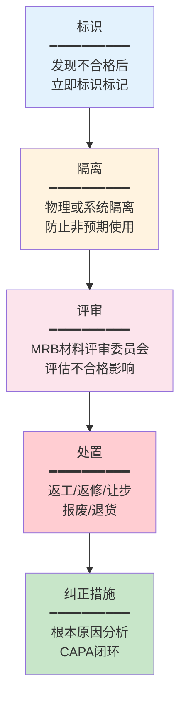
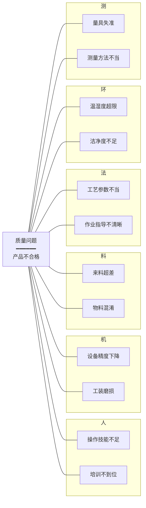
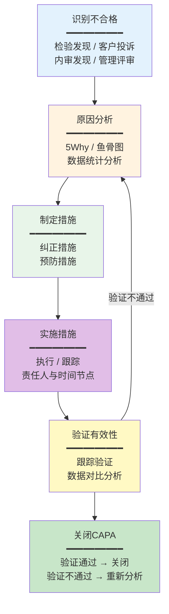

# 不合格品与CAPA管理

## 不合格品管理流程

不合格品（Nonconforming Product）是指未满足要求的产品或过程输出。不合格品管理是QMS的核心控制流程，确保不合格品不被非预期使用或交付。标准化的不合格品管理流程包括以下环节：



### 标识

发现不合格品后，第一件事是标识。标识的目的是让任何人都能立即识别该物料/产品处于不合格状态，防止被误用：

- **物理标识**：红色标签、红色容器、不合格品区域标识
- **系统标识**：QMS系统中将物料状态标记为"不合格/待检/隔离"
- **信息记录**：记录发现时间、发现人、不合格现象描述、涉及数量

### 隔离

隔离确保不合格品与合格品物理或逻辑上分离：

- **物理隔离**：放置在指定的不合格品区域（红区），上锁管理
- **系统隔离**：ERP/WMS系统中锁定库存，禁止发料和出货
- **标识保持**：隔离期间保持不合格标识不被移除

### 评审

不合格品评审通常由MRB（Material Review Board，材料评审委员会）执行，评审内容包括：

- 不合格对产品功能和安全的影响程度
- 不合格的性质和范围（偶发还是系统性）
- 处置方案的技术可行性和经济性
- 是否需要通知客户或法规机构

### 处置

根据评审结论，不合格品有以下几种处置方式：

## 不合格品处置方式

| 处置方式 | 定义 | 适用条件 | 注意事项 |
|---------|------|---------|---------|
| 返工 | 消除不合格，使产品符合要求 | 可通过重新加工恢复合格 | 返工后必须重新检验 |
| 返修 | 虽不完全符合要求，但可满足使用 | 不影响安全和使用功能 | 需客户批准，必须记录 |
| 让步接收 | 不完全符合要求但被特许使用 | 偏差在可接受范围内 | 需客户书面批准 |
| 报废 | 不合格品无法修复或修复不经济 | 修复成本超过产品价值 | 需评估报废成本归集 |
| 退货 | 将不合格来料退回供应商 | 供应商来料不合格 | 需评估供应商纠正措施 |

### 返工与返修的区别

这是一个经常被混淆的概念：

| 对比项 | 返工 | 返修 |
|--------|------|------|
| 结果 | 产品重新符合原要求 | 产品可用但不完全符合原要求 |
| 后续处理 | 重新检验合格后正常流转 | 需让步审批，记录为返修品 |
| 客户通知 | 一般不需要 | 通常需要通知客户 |
| 系统标记 | 可恢复为合格品 | 标记为返修品，全程可追溯 |

## CAPA纠正与预防措施

CAPA（Corrective and Preventive Action）是QMS持续改进的核心机制，通过系统化的方法消除不合格的根本原因，防止问题再次发生。

### 8D报告

8D（Eight Disciplines）是汽车行业广泛使用的结构化问题解决方法，也是CAPA最常用的报告格式：

| 步骤 | 名称 | 核心内容 | QMS系统支撑 |
|------|------|---------|------------|
| D0 | 准备 | 识别问题、组建团队、紧急措施 | 问题登记、团队指派 |
| D1 | 组建团队 | 跨职能团队成员确定 | 人员分配、权限设置 |
| D2 | 问题描述 | 5W2H方法精确描述问题 | 问题描述模板 |
| D3 | 临时遏制措施 | 保护客户，防止问题扩大 | 遏制措施记录与跟踪 |
| D4 | 根本原因分析 | 找到问题的真正原因 | 5Why/鱼骨图工具 |
| D5 | 永久纠正措施 | 选择和验证永久纠正措施 | 措施方案评审 |
| D6 | 实施和验证 | 执行纠正措施并验证有效性 | 措施执行与验证记录 |
| D7 | 预防再发生 | 修改系统防止类似问题再发生 | 体系变更、标准更新 |
| D8 | 祝贺团队 | 总结经验、表彰团队 | 案例归档、知识库 |

### 根本原因分析

根本原因分析是CAPA的核心环节，常用方法包括：

#### 5Why分析法

通过连续追问"为什么"逐步深入，直到找到根本原因：

```
现象：产品装配间隙超差
├── Why 1：零件A尺寸偏大 → 因为注塑工艺参数偏移
│   ├── Why 2：注塑参数偏移 → 因为模温控制系统故障
│   │   ├── Why 3：温控系统故障 → 因为热电偶老化未更换
│   │   │   ├── Why 4：未按期更换 → 因为预防性维护计划缺失
│   │   │   │   └── Why 5：PM计划缺失 → 因为设备管理体系不完善
│   │   │   │       → 根本原因：设备维护管理体系需完善
```

#### 鱼骨图（因果图）

鱼骨图从人、机、料、法、环、测六个维度分析问题的可能原因：



## CAPA闭环管理

CAPA的关键在于闭环——从措施制定到验证关闭的全流程必须可追溯：



### CAPA管理的关键控制点

| 控制点 | 要求 | 常见问题 |
|--------|------|---------|
| 时效性 | 严重不合格24h内启动CAPA | 启动滞后，问题扩大 |
| 根因深度 | 必须找到根本原因而非表象 | 只解决表面问题，治标不治本 |
| 措施可执行 | 措施必须具体、可操作、可验证 | 措施笼统，无法执行和验证 |
| 验证有效性 | 验证必须有数据支撑 | 仅凭主观判断，无客观数据 |
| 闭环率 | CAPA按期关闭率≥95% | 措施拖延，CAPA长期未关闭 |
| 预防扩展 | 将纠正措施推广到类似过程 | 同类问题在其他产线重复发生 |

### CAPA超期预警

QMS系统应设置CAPA超期预警机制：

| 预警级别 | 触发条件 | 通知对象 |
|---------|---------|---------|
| 黄色预警 | 措施到期前3天未完成 | 措施责任人 |
| 橙色预警 | 措施逾期3天未完成 | 责任人 + 部门主管 |
| 红色预警 | 措施逾期7天未完成 | 责任人 + 部门主管 + 质量经理 |

## 真实案例：汽车行业客户投诉8D报告流程

某汽车零部件企业收到OEM客户投诉：量产零件在装配线上发现尺寸超差。以下是完整的8D处理流程：

### D0-D2：问题识别与描述

- **客户**：某国内头部OEM
- **产品**：发动机支架（零件号ENG-BKT-001）
- **问题**：装配孔位偏移0.3mm，超出规格±0.15mm
- **影响范围**：涉及3个生产批次，约5000件

### D3：临时遏制措施

- 立即暂停该产品出货，库存品100%全检筛选
- 通知客户对在途品进行隔离检查
- 产线切换为全检模式（100%全检孔位尺寸）

### D4：根本原因分析

通过5Why分析追溯根本原因：

1. **Why**：孔位偏移0.3mm → 钻模定位销磨损
2. **Why**：定位销磨损 → 使用寿命超期未更换（设计寿命5万次，实际使用8万次）
3. **Why**：超期未更换 → 预防性维护计划中未包含定位销更换周期
4. **Why**：PM计划缺失 → 新产品导入时未将工装纳入PM体系
5. **Why**：未纳入PM体系 → NPI流程中工装管理环节缺失

**根本原因**：NPI（新产品导入）流程中工装预防性维护管理环节缺失。

### D5-D6：永久纠正措施

- 立即更换磨损定位销，恢复生产
- 修订NPI流程，增加"工装PM计划制定"为必要检查点
- 将所有在用工装纳入PM体系，设定更换周期

### D7：预防再发生

- 建立工装寿命管理系统，自动预警更换
- 修订FMEA，增加"定位销磨损"失效模式
- 将本案例纳入培训教材，组织全员培训

### D8：关闭与总结

- 跟踪3个月，问题未再发生，CAPA关闭
- 经验教训归入知识库，供其他产线参考

## 总结

不合格品管理和CAPA是QMS"闭环"的核心机制。不合格品管理确保不合格品被及时识别、隔离和妥善处置；CAPA通过8D等结构化方法找到根本原因并实施纠正预防措施，实现持续改进。两者的有效运行是质量管理体系从"发现问题"到"预防问题"的关键转变。下一章将介绍支撑这些流程的质量工具与方法。
