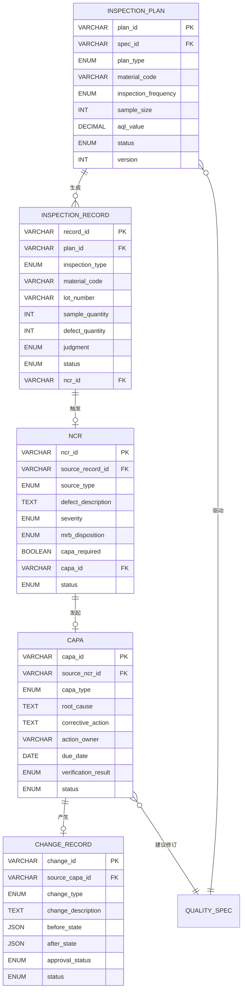
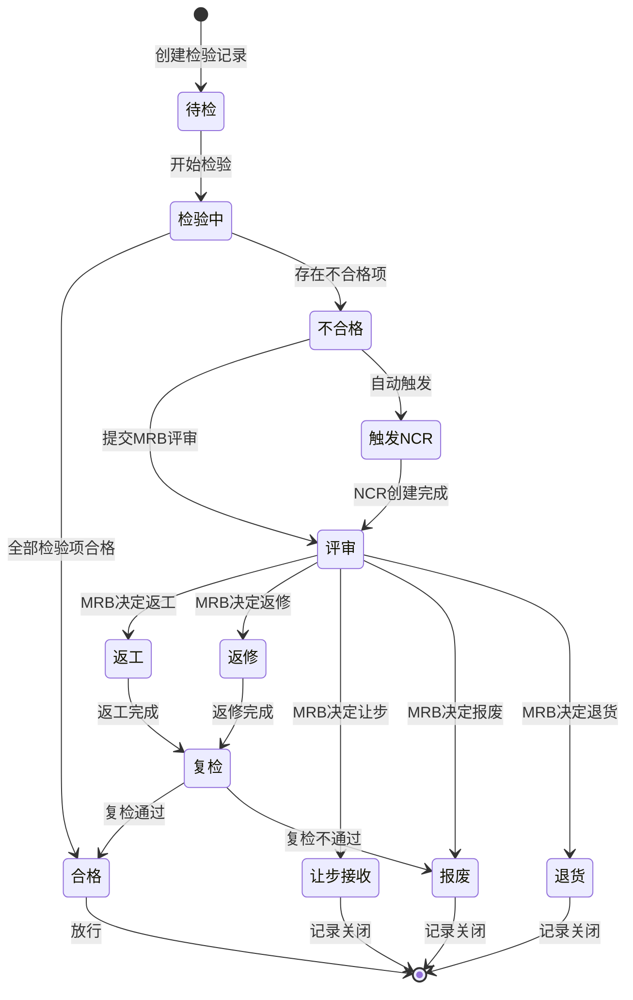
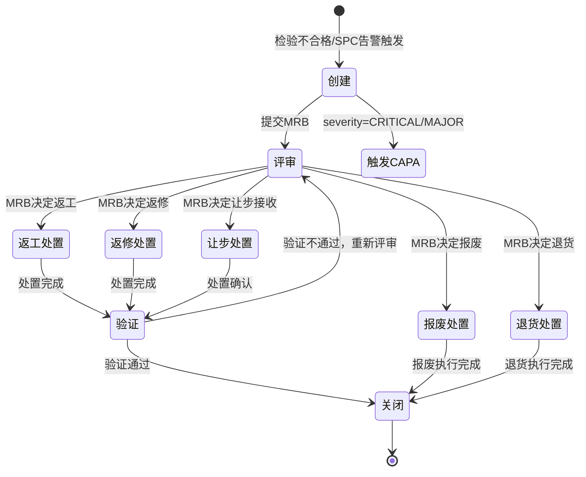
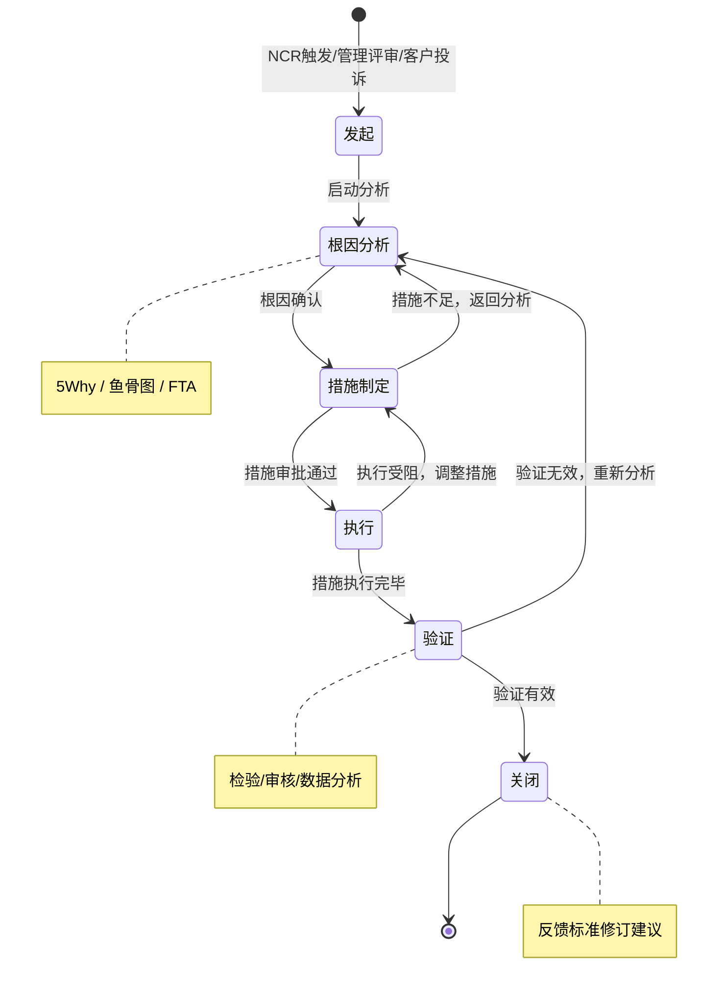

# QMS数据库设计与状态机

## 核心表设计

QMS系统的数据模型围绕"标准→计划→执行→处置→纠正→验证"的质量闭环设计，以下是五张核心表的定义。

### 检验计划表（INSPECTION_PLAN）

| 字段名 | 类型 | 说明 |
|--------|------|------|
| plan_id | VARCHAR(32) | 检验计划编号，主键 |
| spec_id | VARCHAR(32) | 关联质量标准ID |
| plan_type | ENUM | 计划类型：IQC/IPQC/OQC/FQC |
| material_code | VARCHAR(50) | 物料编码 |
| material_name | VARCHAR(200) | 物料名称 |
| supplier_code | VARCHAR(32) | 供应商编码（IQC适用） |
| work_center | VARCHAR(32) | 工作中心（IPQC适用） |
| inspection_frequency | ENUM | 检验频次：EVERY_LOT/PERIODIC/SAMPLING |
| sample_size | INT | 样本量 |
| aql_value | DECIMAL(5,3) | 接收质量限 |
| inspection_level | ENUM | 检验水平：I/II/III/S1-S4 |
| status | ENUM | 状态：DRAFT/ACTIVE/SUSPENDED/OBSOLETE |
| effective_date | DATE | 生效日期 |
| expiry_date | DATE | 失效日期 |
| version | INT | 版本号 |
| created_by | VARCHAR(32) | 创建人 |
| created_at | DATETIME | 创建时间 |
| updated_at | DATETIME | 更新时间 |

### 检验记录表（INSPECTION_RECORD）

| 字段名 | 类型 | 说明 |
|--------|------|------|
| record_id | VARCHAR(32) | 检验记录编号，主键 |
| plan_id | VARCHAR(32) | 关联检验计划ID |
| inspection_type | ENUM | 检验类型：IQC/IPQC/OQC/FQC |
| material_code | VARCHAR(50) | 物料编码 |
| lot_number | VARCHAR(50) | 批次号 |
| supplier_code | VARCHAR(32) | 供应商编码 |
| sample_quantity | INT | 抽样数量 |
| defect_quantity | INT | 缺陷数量 |
| judgment | ENUM | 判定结果：PASS/FAIL/CONDITIONAL |
| inspector | VARCHAR(32) | 检验员 |
| inspect_start_time | DATETIME | 检验开始时间 |
| inspect_end_time | DATETIME | 检验结束时间 |
| status | ENUM | 状态：PENDING/INSPECTING/PASSED/FAILED/REVIEWING/DISPOSED |
| ncr_id | VARCHAR(32) | 关联NCR编号（不合格时） |
| remark | TEXT | 备注 |
| created_at | DATETIME | 创建时间 |

### 不合格品报告表（NCR）

| 字段名 | 类型 | 说明 |
|--------|------|------|
| ncr_id | VARCHAR(32) | NCR编号，主键 |
| source_record_id | VARCHAR(32) | 来源检验记录ID |
| source_type | ENUM | 来源类型：INSPECTION/SPC_ALERT/CUSTOMER_COMPLAINT/AUDIT |
| material_code | VARCHAR(50) | 物料编码 |
| lot_number | VARCHAR(50) | 批次号 |
| defect_description | TEXT | 缺陷描述 |
| defect_category | VARCHAR(50) | 缺陷分类 |
| defect_quantity | INT | 不合格数量 |
| severity | ENUM | 严重度：CRITICAL/MAJOR/MINOR |
| mrb_disposition | ENUM | MRB处置：REWORK/REPAIR/SCRAP/RETURN/CONCESSION |
| disposition_by | VARCHAR(32) | 处置人 |
| disposition_date | DATETIME | 处置日期 |
| capa_required | BOOLEAN | 是否需要CAPA |
| capa_id | VARCHAR(32) | 关联CAPA编号 |
| status | ENUM | 状态：CREATED/REVIEWING/DISPOSED/VERIFYING/CLOSED |
| created_by | VARCHAR(32) | 创建人 |
| created_at | DATETIME | 创建时间 |
| closed_at | DATETIME | 关闭时间 |

### CAPA表（CAPA）

| 字段名 | 类型 | 说明 |
|--------|------|------|
| capa_id | VARCHAR(32) | CAPA编号，主键 |
| source_ncr_id | VARCHAR(32) | 来源NCR编号 |
| capa_type | ENUM | 类型：CORRECTIVE/PREVENTIVE |
| title | VARCHAR(200) | 标题 |
| problem_description | TEXT | 问题描述 |
| root_cause | TEXT | 根本原因（5Why/鱼骨图） |
| root_cause_method | ENUM | 根因方法：FIVE_WHY/FISHBONE/FAULT_TREE |
| corrective_action | TEXT | 纠正措施描述 |
| preventive_action | TEXT | 预防措施描述 |
| action_owner | VARCHAR(32) | 措施负责人 |
| due_date | DATE | 截止日期 |
| effective_date | DATE | 措施生效日期 |
| verification_method | ENUM | 验证方式：INSPECTION/AUDIT/DATA_ANALYSIS |
| verification_result | ENUM | 验证结果：EFFECTIVE/INEFFECTIVE |
| target_improvement | DECIMAL(5,2) | 目标改善率(%) |
| actual_improvement | DECIMAL(5,2) | 实际改善率(%) |
| standard_revision | BOOLEAN | 是否建议修订标准 |
| status | ENUM | 状态：INITIATED/ROOT_CAUSE/ACTION_PLAN/EXECUTING/VERIFYING/CLOSED |
| created_by | VARCHAR(32) | 创建人 |
| created_at | DATETIME | 创建时间 |
| closed_at | DATETIME | 关闭时间 |

### 变更记录表（CHANGE_RECORD）

| 字段名 | 类型 | 说明 |
|--------|------|------|
| change_id | VARCHAR(32) | 变更编号，主键 |
| change_type | ENUM | 变更类型：STANDARD/PROCESS/MATERIAL/EQUIPMENT |
| source_capa_id | VARCHAR(32) | 来源CAPA编号 |
| title | VARCHAR(200) | 变更标题 |
| change_description | TEXT | 变更描述 |
| before_state | JSON | 变更前状态 |
| after_state | JSON | 变更后状态 |
| impact_assessment | TEXT | 影响评估 |
| approval_status | ENUM | 审批状态：PENDING/APPROVED/REJECTED |
| approved_by | VARCHAR(32) | 审批人 |
| effective_date | DATE | 生效日期 |
| status | ENUM | 状态：DRAFT/REVIEW/APPROVED/IMPLEMENTING/CLOSED |
| created_at | DATETIME | 创建时间 |

## ER图



## 检验记录状态机

检验记录的生命周期从"待检"开始，经历检验执行、结果判定、不合格评审、处置等阶段：



**状态转换规则：**

```python
class InspectionRecordStateMachine:
    """检验记录状态机"""

    TRANSITIONS = {
        "PENDING": ["INSPECTING"],
        "INSPECTING": ["PASSED", "FAILED"],
        "PASSED": [],  # 终态
        "FAILED": ["REVIEWING"],
        "REVIEWING": ["REWORK", "REPAIR", "CONCESSION", "SCRAP", "RETURN"],
        "REWORK": ["REINSPECT"],
        "REPAIR": ["REINSPECT"],
        "REINSPECT": ["PASSED", "SCRAP"],
        "CONCESSION": [],  # 终态
        "SCRAP": [],       # 终态
        "RETURN": [],      # 终态
    }

    def transition(self, record: InspectionRecord, target_status: str, operator: str):
        allowed = self.TRANSITIONS.get(record.status, [])
        if target_status not in allowed:
            raise InvalidTransitionError(
                f"不允许从{record.status}转换到{target_status}，"
                f"允许的目标状态：{allowed}"
            )

        # 不合格时自动触发NCR
        if target_status == "FAILED":
            self._auto_create_ncr(record)

        record.status = target_status
        record.status_changed_by = operator
        record.status_changed_at = datetime.now()
        record.save()

        # 发布状态变更事件
        event_bus.publish("inspection.status_changed", {
            "record_id": record.record_id,
            "from_status": record.status,
            "to_status": target_status,
            "operator": operator
        })
```

## NCR状态机

不合格品报告的状态流转遵循MRB评审和处置流程：



## CAPA状态机

CAPA是最复杂的状态机，涉及根因分析、措施制定、执行和验证多个阶段：



**CAPA状态机实现：**

```python
class CAPAStateMachine:
    """CAPA状态机 - 含超时告警和升级机制"""

    TRANSITIONS = {
        "INITIATED": ["ROOT_CAUSE"],
        "ROOT_CAUSE": ["ACTION_PLAN", "INITIATED"],
        "ACTION_PLAN": ["EXECUTING", "ROOT_CAUSE"],
        "EXECUTING": ["VERIFYING", "ACTION_PLAN"],
        "VERIFYING": ["CLOSED", "ROOT_CAUSE"],
        "CLOSED": [],
    }

    # 各阶段SLA（天数）
    SLA_DAYS = {
        "INITIATED": 3,
        "ROOT_CAUSE": 14,
        "ACTION_PLAN": 7,
        "EXECUTING": 30,
        "VERIFYING": 14,
    }

    def transition(self, capa: CAPA, target: str, operator: str, data: dict = None):
        allowed = self.TRANSITIONS.get(capa.status, [])
        if target not in allowed:
            raise InvalidTransitionError(
                f"CAPA {capa.capa_id}: 不允许 {capa.status} → {target}"
            )

        # 状态转换的前置校验
        if target == "ACTION_PLAN":
            if not capa.root_cause:
                raise ValidationError("根因分析未完成，无法制定措施")
        elif target == "EXECUTING":
            if not capa.corrective_action:
                raise ValidationError("纠正措施未定义，无法执行")
        elif target == "VERIFYING":
            if not capa.all_actions_completed():
                raise ValidationError("尚有未完成的措施项")
        elif target == "CLOSED":
            if capa.verification_result != "EFFECTIVE":
                raise ValidationError("验证结果非有效，无法关闭")

        capa.status = target
        capa.save()

        # 关闭时反馈标准修订
        if target == "CLOSED" and capa.standard_revision:
            self._suggest_standard_revision(capa)
```

## API设计

### 创建检验记录

```
POST /api/v1/qms/inspection-records
```

请求体：

```json
{
  "plan_id": "IP-2024-00156",
  "inspection_type": "IQC",
  "material_code": "MAT-RAW-00342",
  "lot_number": "LOT-20240315-001",
  "supplier_code": "SUP-0089",
  "sample_quantity": 50,
  "inspector": "inspector_zhang"
}
```

响应体：

```json
{
  "code": 200,
  "data": {
    "record_id": "IR-2024-0315-0089",
    "plan_id": "IP-2024-00156",
    "status": "PENDING",
    "inspection_items": [
      {
        "item_id": "II-001",
        "characteristic": "外观检查",
        "method": "目视检查",
        "standard_value": "无划痕、无变色",
        "sample_size": 50
      },
      {
        "item_id": "II-002",
        "characteristic": "尺寸-长度",
        "method": "游标卡尺",
        "standard_value": "100.0±0.5mm",
        "upper_limit": 100.5,
        "lower_limit": 99.5,
        "sample_size": 8
      }
    ],
    "created_at": "2024-03-15T09:30:00Z"
  }
}
```

### 提交检验结果

```
PUT /api/v1/qms/inspection-records/{record_id}/result
```

请求体：

```json
{
  "items": [
    {
      "item_id": "II-001",
      "result": "PASS",
      "measured_values": [],
      "defect_quantity": 0,
      "remark": ""
    },
    {
      "item_id": "II-002",
      "result": "FAIL",
      "measured_values": [100.8, 100.3, 100.9, 100.1, 100.7, 99.8, 100.6, 100.2],
      "defect_quantity": 4,
      "defect_description": "4件超上限(>100.5mm)",
      "remark": "偏上限趋势"
    }
  ],
  "overall_judgment": "FAIL",
  "inspector": "inspector_zhang",
  "inspect_end_time": "2024-03-15T10:15:00Z"
}
```

响应体：

```json
{
  "code": 200,
  "data": {
    "record_id": "IR-2024-0315-0089",
    "status": "FAILED",
    "judgment": "FAIL",
    "ncr_auto_created": true,
    "ncr_id": "NCR-2024-00342",
    "message": "检验不合格，已自动创建NCR"
  }
}
```

### 发起NCR

```
POST /api/v1/qms/ncr
```

请求体：

```json
{
  "source_record_id": "IR-2024-0315-0089",
  "source_type": "INSPECTION",
  "defect_description": "来料尺寸超差，8件样本中4件长度超过上限100.5mm",
  "defect_category": "DIMENSIONAL",
  "defect_quantity": 4,
  "severity": "MAJOR",
  "mrb_disposition": "REWORK",
  "disposition_by": "mrb_chair_wang",
  "capa_required": true
}
```

### 创建CAPA

```
POST /api/v1/qms/capa
```

请求体：

```json
{
  "source_ncr_id": "NCR-2024-00342",
  "capa_type": "CORRECTIVE",
  "title": "来料尺寸超差纠正措施",
  "problem_description": "供应商SUP-0089批次LOT-20240315-001长度尺寸超上限",
  "root_cause": "供应商冲压模具磨损导致尺寸偏移，未及时更换模具",
  "root_cause_method": "FIVE_WHY",
  "corrective_action": "1. 要求供应商更换冲压模具\n2. 增加来料全检频次\n3. 建立模具寿命预警机制",
  "action_owner": "sqe_li",
  "due_date": "2024-04-15",
  "target_improvement": 95.0,
  "verification_method": "INSPECTION"
}
```

## 开发者实战Tips

1. **状态机与业务逻辑分离**：将状态转换规则抽取为独立的StateMachine类，与业务Service层解耦。状态机只负责转换合法性校验，业务逻辑在Service层处理。

2. **审计追踪**：所有核心表的状态变更必须记录审计日志，包括变更前状态、变更后状态、操作人、操作时间、变更原因。建议使用数据库触发器或应用层AOP实现。

3. **并发控制**：检验记录和NCR可能被多人同时操作，使用乐观锁(version字段)控制并发冲突。状态转换时检查版本号，不一致时抛出OptimisticLockException。

4. **批量检验优化**：IQC来料检验经常涉及大批量抽样，检验项可能有几十个。API设计时支持按检验项分批提交结果，避免单个请求过大。

5. **CAPA超时升级**：实现定时任务扫描即将超时的CAPA，按SLA配置自动升级通知。CRITICAL级别CAPA超时1天即升级至质量总监，MAJOR级别超时3天升级至质量经理。
