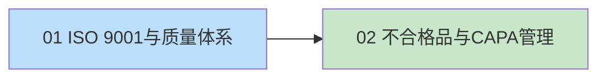

# 质量体系与流程

本章节深入解析ISO 9001质量管理体系的核心条款与实践，以及不合格品管理与CAPA纠正预防措施的闭环流程。这两部分是QMS运行的"骨架"和"闭环机制"。

```mermaid
graph LR
    A[01 ISO 9001与质量体系] --> B[02 不合格品与CAPA管理]
    style A fill:#bbdefb
    style B fill:#c8e6c9
```
