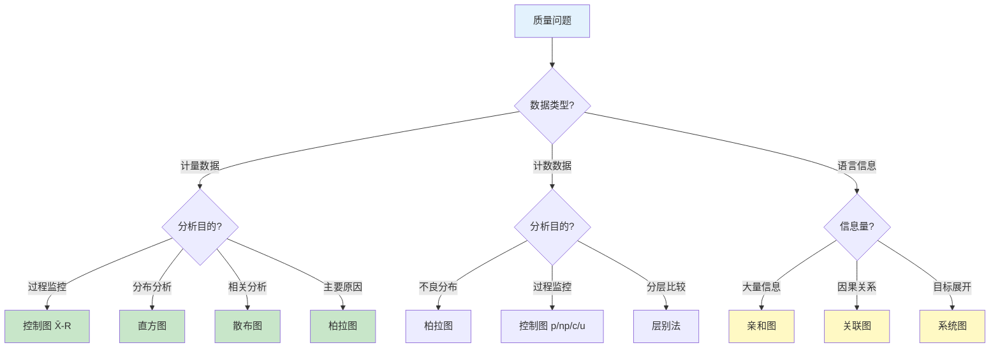

# 七大质量工具

## QC七大手法

QC七大手法（7 QC Tools）是由日本质量管理大师石川馨总结的七种基础质量分析工具，被称为"质量管理90%的问题都可以用这七种工具解决"：

### 1. 检查表（Check Sheet）

检查表是系统收集和整理数据的表格工具，用于将数据收集过程标准化：

| 检查表类型 | 用途 | 示例 |
|-----------|------|------|
| 不良项目检查表 | 记录各类不良的发生频次 | 各类外观缺陷统计 |
| 工序分布检查表 | 记录质量特性值的分布 | 尺寸测量值分布 |
| 不良位置检查表 | 记录缺陷发生的位置 | 铸件缺陷位置图 |
| 不良原因检查表 | 记录可能的原因 | 按设备/人员/班次统计 |

**设计要点**：检查项分类要MECE（互斥且完备），数据记录要简便易行，避免记录人员的主观判断。

### 2. 层别法（Stratification）

层别法是按某因素将数据分组，找出组间差异的方法。单独看整体数据可能看不出问题，分层后问题可能一目了然：

- **按时间层别**：早班/中班/晚班，周一至周五
- **按设备层别**：A线/B线，1号机/2号机
- **按人员层别**：操作员A/B/C
- **按材料层别**：供应商X/Y/Z
- **按环境层别**：温湿度区间

**典型应用**：某产品不良率5%，看似不高；按设备层别后发现，A线不良率8%，B线不良率2%，问题锁定在A线。

### 3. 柏拉图（Pareto Chart）

柏拉图基于"80/20原则"（帕累托原则），按不良项目发生频次从高到低排列，识别"关键的少数"：

| 排名 | 不良项目 | 发生数 | 累计占比 |
|------|---------|-------|---------|
| 1 | 划伤 | 45 | 37.5% |
| 2 | 毛刺 | 32 | 64.2% |
| 3 | 尺寸超差 | 20 | 80.8% |
| 4 | 色差 | 12 | 90.8% |
| 5 | 异物 | 8 | 97.5% |
| 6 | 其他 | 3 | 100% |

**解读**：划伤+毛刺+尺寸超差三项占80.8%的不良，集中资源解决这三个问题就能大幅降低不良率。

### 4. 因果图（鱼骨图）

因果图（Cause-and-Effect Diagram）也叫鱼骨图或石川图，用于系统分析问题的可能原因，已在CAPA章节详细介绍。其核心价值在于：

- 团队头脑风暴的结构化框架
- 避免遗漏可能的原因维度
- 将分析结果可视化，便于沟通

### 5. 散布图（Scatter Diagram）

散布图用于分析两个变量之间的相关关系：

| 相关类型 | 图形特征 | 相关系数范围 |
|---------|---------|------------|
| 强正相关 | 点密集在上升线附近 | 0.8 ~ 1.0 |
| 弱正相关 | 点松散在上升线附近 | 0.3 ~ 0.8 |
| 不相关 | 点随机分布 | -0.3 ~ 0.3 |
| 弱负相关 | 点松散在下降线附近 | -0.8 ~ -0.3 |
| 强负相关 | 点密集在下降线附近 | -1.0 ~ -0.8 |

**典型应用**：分析注塑温度与产品尺寸的相关性，确定最佳工艺参数范围。

### 6. 直方图（Histogram）

直方图用于展示质量特性值的分布形态，判断过程是否稳定和满足规格要求：

- **正常型**：对称钟形分布，过程正常
- **偏态型**：分布偏左或偏右，可能存在系统性偏差
- **双峰型**：两个峰，可能是两个不同来源的数据混合
- **平顶型**：分布过于平坦，可能过程参数缓慢漂移
- **孤岛型**：主体外有孤立小峰，可能是混入异常数据

**直方图与规格对比**：将直方图与规格上限（USL）和规格下限（LSL）对比，可以直观判断过程能力是否充足。

### 7. 控制图（Control Chart）

控制图是SPC（统计过程控制）的核心工具，用于监控过程是否处于统计控制状态。

#### 常用控制图类型

| 数据类型 | 分布 | 控制图 | 适用场景 |
|---------|------|--------|---------|
| 计量值 | 正态 | X̄-R图 | 均值-极差，样本量2-9 |
| 计量值 | 正态 | X̄-S图 | 均值-标准差，样本量≥10 |
| 计量值 | 正态 | X-MR图 | 单值-移动极差，样本量=1 |
| 计数值 | 二项 | p图 | 不良率 |
| 计数值 | 二项 | np图 | 不良数（样本量固定） |
| 计数值 | 泊松 | c图 | 缺陷数（样本量固定） |
| 计数值 | 泊松 | u图 | 单位缺陷数 |

#### 控制图判异规则（Western Electric规则）

控制图不仅看是否超出控制限，还需要识别非随机模式。以下是常用的判异规则：

| 规则 | 描述 | 可能原因 |
|------|------|---------|
| 规则1 | 1个点超出3σ控制限 | 过程突然偏移 |
| 规则2 | 连续9个点在中心线同一侧 | 过程均值偏移 |
| 规则3 | 连续6个点递增或递减 | 过程趋势漂移 |
| 规则4 | 连续14个点交替上下 | 系统性周期波动 |
| 规则5 | 连续3个点中2个点在2σ-3σ区域 | 过程变异增大 |
| 规则6 | 连续5个点中4个点在1σ-3σ区域 | 过程变异增大 |
| 规则7 | 连续15个点在1σ区域内 | 分层不当或数据造假 |
| 规则8 | 连续8个点在1σ区域外 | 分层问题 |

```mermaid
graph TB
    subgraph X̄控制图
        UCL["UCL 上控制限<br/>μ+3σ"]
        CL["CL 中心线<br/>μ"]
        LCL["LCL 下控制限<br/>μ-3σ"]
    end
    UCL -.->|"规则1: 超出控制限"| ALARM1["异常报警"]
    CL -->|"规则2: 连续9点同侧"| ALARM2["异常报警"]
    CL -->|"规则3: 连续6点趋势"| ALARM3["异常报警"]
    style UCL fill:#ffcdd2
    style LCL fill:#ffcdd2
    style CL fill:#c8e6c9
    style ALARM1 fill:#f44336,color:#fff
    style ALARM2 fill:#ff9800,color:#fff
    style ALARM3 fill:#ff9800,color:#fff
```

## 新QC七大手法

新QC七大手法（7 New QC Tools）主要面向管理层面和计划层面的质量问题，侧重于语言信息和逻辑整理：

### 1. 亲和图（Affinity Diagram）

将大量语言信息按亲和性分组归纳，适用于：
- 收集和整理散乱的意见和想法
- 从大量定性信息中提炼结构
- 团队共创时整理头脑风暴结果

### 2. 关联图（Interrelationship Diagram）

分析多个问题之间的因果关联关系，找出核心问题：
- 用箭头连接有因果关系的问题
- 箭头指出多的是核心问题（被很多因素影响）
- 箭头指入多的是结果问题

### 3. 系统图（Tree Diagram）

将目标逐层展开为具体措施，确保目标可落地：
- 第1层：目标
- 第2层：实现目标的手段
- 第3层：实现手段的具体方法
- 逐层展开直到可以执行

### 4. 矩阵图（Matrix Diagram）

用矩阵形式展示两组因素之间的关系强弱：

| | 因素A | 因素B | 因素C |
|---|---|---|---|
| 因素X | ● | ○ | ▲ |
| 因素Y | ▲ | ● | ○ |
| 因素Z | ○ | ▲ | ● |

● = 强关系，▲ = 中等关系，○ = 弱关系

### 5. 箭条图（Arrow Diagram）

即项目计划网络图（PERT/CPM），用于计划和管理项目进度：
- 识别关键路径
- 优化资源分配
- 监控项目进度

### 6. PDPC法（Process Decision Program Chart）

预测事态发展并制定对策，是风险管理的工具：
- 识别可能的不良事态
- 针对每种事态制定对策
- 事态发生时快速响应

### 7. 矩阵数据分析法

对矩阵图中的关系进行定量分析，是唯一使用数值数据的新QC工具，本质是主成分分析法。

## 工具选择决策树

面对不同的质量问题，如何选择合适的质量工具？以下决策树提供指导：



### 工具组合应用

实际工作中，多种工具往往组合使用：

| 问题场景 | 推荐工具组合 |
|---------|------------|
| 不良率居高不下 | 检查表 → 层别法 → 柏拉图 → 鱼骨图 |
| 过程不稳定 | 检查表 → 控制图 → 鱼骨图 → 散布图 |
| 新产品质量策划 | 系统图 → 矩阵图 → 箭条图 → PDPC |
| 复杂质量问题 | 亲和图 → 关联图 → 系统图 → 矩阵图 |

## 总结

QC七大手法是质量管理的基础工具，适用于数据收集、分析和过程监控；新QC七大手法面向管理层面，适用于语言信息的整理和逻辑分析。控制图和Western Electric判异规则是SPC的核心，支撑过程稳定性监控。选择工具时，应根据数据类型和分析目的进行匹配，实际工作中多种工具组合使用效果更佳。下一章将深入FMEA与APQP的实战应用。
