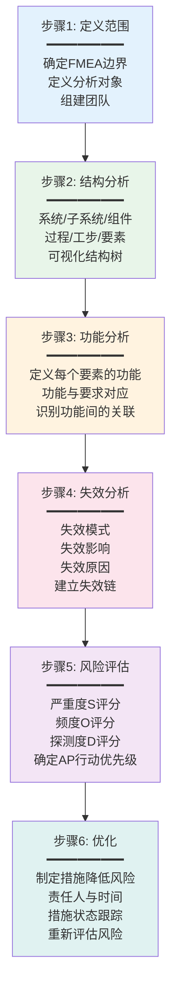
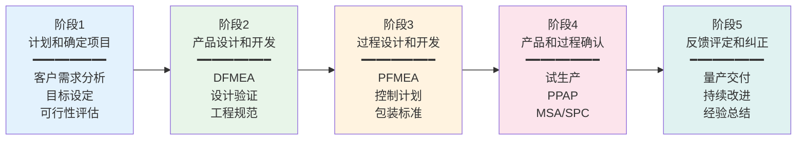
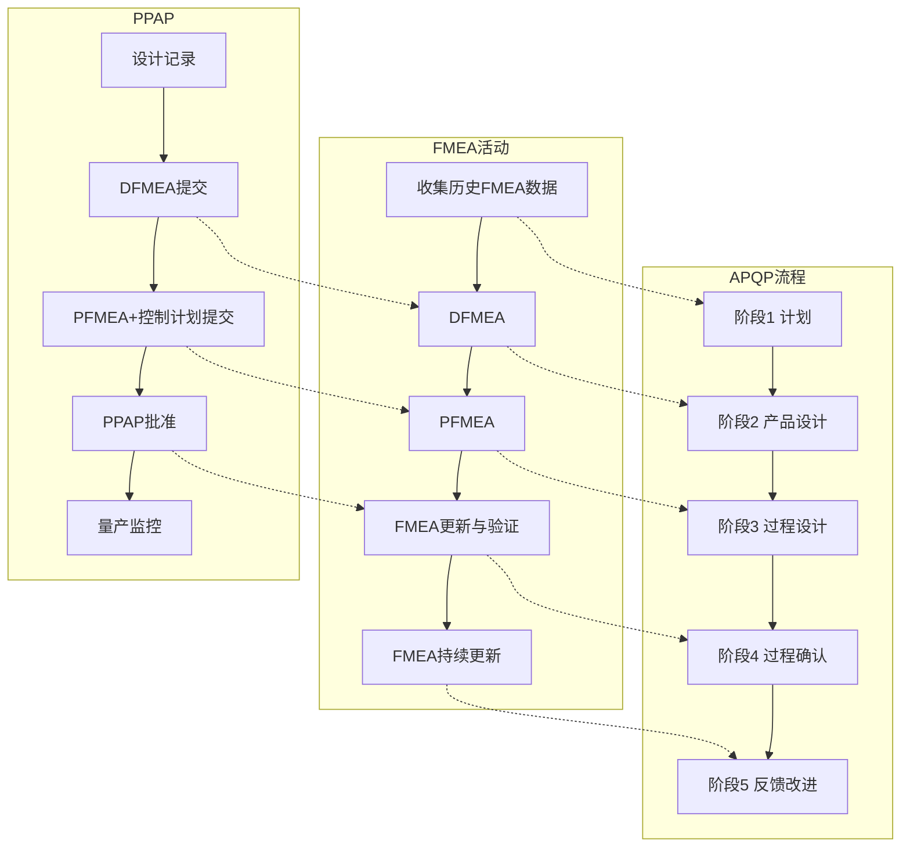

# FMEA与APQP实战

## FMEA失效模式与影响分析

FMEA（Failure Mode and Effects Analysis，失效模式与影响分析）是在产品设计或过程设计阶段，系统分析可能的失效模式、评估其影响和风险、并制定预防措施的方法。FMEA是"预防胜于治疗"理念的最佳实践。

### DFMEA与PFMEA

FMEA按应用阶段分为两种类型：

| 对比维度 | DFMEA（设计FMEA） | PFMEA（过程FMEA） |
|---------|-------------------|-------------------|
| 应用阶段 | 产品设计阶段 | 过程/工艺设计阶段 |
| 分析对象 | 产品设计可能的失效 | 制造过程可能的失效 |
| 关注重点 | 产品功能、安全性、可靠性 | 工序能力、操作误差、设备故障 |
| 典型失效 | 材料选型错误、结构设计不合理 | 工艺参数不当、装配顺序错误 |
| 输入 | 产品规范、以往设计问题 | 工艺流程图、以往过程问题 |
| 输出 | 设计改进措施 | 过程控制措施 |

### FMEA步骤（AIAG-VDA 2019版）

2019年发布的AIAG-VDA FMEA手册对FMEA方法进行了重大修订，采用新的六步法：



### 严重度/频度/探测度评分

FMEA通过三个维度评估风险：

#### 严重度S（Severity）

评估失效影响的严重程度，1-10分：

| 评分 | 等级 | 描述 |
|------|------|------|
| 10 | 极高 | 影响车辆安全/违反法规 |
| 9 | 很高 | 影响车辆安全，有预警 |
| 8 | 高 | 基本功能丧失，无法驾驶 |
| 7 | 较高 | 主要功能降级，客户高度不满 |
| 6 | 中等 | 舒适/便利功能丧失 |
| 5 | 低 | 舒适/便利功能降级 |
| 4 | 较低 | 外观/噪音问题，多数客户能发现 |
| 3 | 很低 | 外观/噪音问题，部分客户能发现 |
| 2 | 极低 | 外观问题，极少数客户发现 |
| 1 | 无 | 无可辨别的影响 |

#### 频度O（Occurrence）

评估失效原因发生的可能性，1-10分：

| 评分 | 等级 | 可能的失效概率 |
|------|------|-------------|
| 10 | 极高 | ≥1/2 |
| 9 | 很高 | 1/3 |
| 8 | 高 | 1/8 |
| 7 | 较高 | 1/20 |
| 6 | 中等 | 1/80 |
| 5 | 低 | 1/400 |
| 4 | 较低 | 1/2000 |
| 3 | 很低 | 1/15000 |
| 2 | 极低 | 1/150000 |
| 1 | 几乎不可能 | ≤1/1500000 |

#### 探测度D（Detection）

评估现有控制措施探测失效的能力，1-10分（分数越低探测能力越强）：

| 评分 | 等级 | 探测方法 |
|------|------|---------|
| 10 | 几乎不可能 | 无现有控制 |
| 9 | 很低 | 偶然性检查 |
| 8 | 低 | 事后目视检查 |
| 7 | 较低 | 事后手动检验 |
| 6 | 中等 | 过程中手动检验 |
| 5 | 中等偏高 | 统计过程控制SPC |
| 4 | 高 | 过程中自动检验 |
| 3 | 很高 | 自动检验+报警 |
| 2 | 极高 | 机器自动100%检验 |
| 1 | 几乎肯定 | 设计上已消除失效可能 |

### RPN与AP行动优先级

#### 传统RPN方法

RPN（Risk Priority Number）= S × O × D，值越大风险越高。但RPN存在缺陷：S=10,O=1,D=1的RPN=10，与S=1,O=10,D=1的RPN=10相同，但前者涉及安全问题，显然应优先处理。

#### AIAG-VDA 2019 AP方法

新版FMEA用AP（Action Priority）替代RPN，基于S-O-D组合查表确定优先级：

| AP等级 | 含义 | 行动要求 |
|--------|------|---------|
| H（High） | 高优先级 | 必须采取措施降低风险 |
| M（Medium） | 中优先级 | 应当采取措施降低风险 |
| L（Low） | 低优先级 | 可以采取措施降低风险 |

AP的优势：不是简单乘积，而是综合评估，避免RPN的数值陷阱。例如严重度S≥9的失效，无论O和D如何，AP通常为H。

## FMEA工作表示例

以下是一个PFMEA工作表的示例片段：

| 过程步骤 | 功能 | 失效模式 | 失效影响 | S | 失效原因 | O | 现有控制 | D | AP | 建议措施 |
|---------|------|---------|---------|---|---------|---|---------|---|-----|---------|
| 注塑 | 成型零件 | 尺寸超差 | 装配困难，客户投诉 | 7 | 模温波动 | 5 | SPC监控 | 3 | M | 增加模温闭环控制 |
| 注塑 | 成型零件 | 表面缩痕 | 外观不良，客户退货 | 6 | 保压时间不足 | 4 | 首件检验 | 5 | M | 优化保压参数 |
| 装配 | 安装螺栓 | 扭矩不足 | 连接松动，安全隐患 | 10 | 扭矩枪未校准 | 3 | 扭矩校验 | 2 | H | 增加扭矩在线监测 |

## APQP产品质量先期策划

APQP（Advanced Product Quality Planning，产品质量先期策划）是汽车行业产品开发的标准流程框架，覆盖从概念到量产的全过程。

### APQP五个阶段



| 阶段 | 核心任务 | 关键输出 |
|------|---------|---------|
| 阶段1 | 理解客户需求、设定目标、评估可行性 | 设计目标、可靠性目标、初始材料清单 |
| 阶段2 | 完成产品设计、验证设计可行性 | DFMEA、设计验证计划与报告(DVP&R)、工程图纸 |
| 阶段3 | 设计制造过程、确保过程能力 | PFMEA、控制计划、包装规范、过程流程图 |
| 阶段4 | 试生产验证、确认量产准备 | PPAP、MSA、初始过程能力研究、生产控制计划 |
| 阶段5 | 量产交付、持续改进、经验总结 | 减少变差、提高效率、客户满意度、最佳实践 |

### APQP各阶段的FMEA应用

| 阶段 | FMEA类型 | 作用 |
|------|---------|------|
| 阶段1 | — | 收集以往FMEA经验教训作为输入 |
| 阶段2 | DFMEA | 识别设计风险，在设计阶段消除潜在失效 |
| 阶段3 | PFMEA | 识别过程风险，在工艺设计阶段预防过程失效 |
| 阶段4 | DFMEA/PFMEA更新 | 根据试生产结果更新FMEA |
| 阶段5 | FMEA持续更新 | 量产中的问题反馈到FMEA，持续改进 |

## PPAP生产件批准

PPAP（Production Part Approval Process，生产件批准程序）是APQP阶段4的核心活动，目的是验证供应商是否正确理解了客户要求，并具备持续生产合格产品的能力。

### PPAP提交等级

| 等级 | 提交内容 | 适用场景 |
|------|---------|---------|
| 等级1 | 仅提交保证书（PSW） | 客户指定，低风险产品 |
| 等级2 | 保证书+产品样品+有限支持数据 | 一般情况 |
| 等级3 | 保证书+产品样品+完整支持数据 | 默认等级，新产品 |
| 等级4 | 保证书+其他客户要求 | 客户特殊要求 |
| 等级5 | 保证书+产品样品+完整数据在供应商处备查 | 客户选择 |

### PPAP 18项要求

| 序号 | 要求 | 说明 |
|------|------|------|
| 1 | 设计记录 | 产品图纸、规范、工程变更 |
| 2 | 工程变更文件 | 变更申请和批准记录 |
| 3 | 客户工程批准 | 如客户要求 |
| 4 | 设计FMEA | DFMEA |
| 5 | 过程流程图 | 制造过程流程 |
| 6 | 过程FMEA | PFMEA |
| 7 | 控制计划 | 试生产/生产控制计划 |
| 8 | MSA测量系统分析 | 量具R&R |
| 9 | 尺寸结果 | 全尺寸检验报告 |
| 10 | 材料/性能试验结果 | 材料和性能测试报告 |
| 11 | 初始过程研究 | Cpk/Ppk分析 |
| 12 | 合格实验室文件 | 实验室资质 |
| 13 | 外观批准报告（AAR） | 如适用 |
| 14 | 样品生产件 | 按客户要求数量 |
| 15 | 标准样品 | 保留标准样件 |
| 16 | 检查辅具 | 检具、样板等 |
| 17 | 客户特殊要求 | 满足CSR |
| 18 | 零件提交保证书（PSW） | 汇总声明 |

## FMEA与APQP的关系

FMEA不是孤立使用的工具，而是嵌入在APQP的完整流程中：



## 真实案例：汽车零部件PFMEA实战

### 背景

某汽车零部件企业为OEM供应转向器壳体（铝合金压铸件），在新项目APQP阶段3进行PFMEA分析。

### 结构分析

```
转向器壳体压铸过程
├── 熔化（熔化炉→铝液）
├── 压铸（压铸机→铸件毛坯）
├── 去毛刺（去毛刺机→去毛刺件）
├── 机加工（CNC→加工件）
├── 清洗（清洗机→清洗件）
├── 检验（三坐标→合格品）
└── 包装（包装工位→成品）
```

### 失效分析重点——压铸工序

| 失效模式 | 失效影响 | S | 失效原因 | O | 现有控制 | D | AP |
|---------|---------|---|---------|---|---------|---|-----|
| 气孔 | 强度不足，泄漏 | 8 | 模具排气不畅 | 6 | X射线检测 | 4 | H |
| 缩孔 | 强度不足，泄漏 | 8 | 凝固收缩 | 5 | X射线检测 | 4 | H |
| 尺寸超差 | 装配困难 | 7 | 模具磨损 | 4 | SPC监控 | 3 | M |
| 表面冷隔 | 外观不良，疲劳强度降低 | 6 | 浇注温度低 | 4 | 目视检验 | 5 | M |

### 优化措施

针对AP=H的气孔和缩孔失效：

| 措施 | 类型 | 预期效果 |
|------|------|---------|
| 优化模具排气系统设计 | 设计预防 | O从6降至3 |
| 增加模温闭环控制 | 过程控制 | O从5降至3 |
| 引入在线X射线100%检测 | 探测改进 | D从4降至2 |
| 压铸参数SPC监控 | 过程监控 | O从4降至2 |

措施实施后重新评估：气孔AP从H降为M，缩孔AP从H降为L，风险得到有效控制。

## 总结

FMEA是预防性质量管理的核心工具，通过系统化的六步法识别和降低设计/过程风险。AIAG-VDA 2019版的AP行动优先级替代了传统RPN，更合理地反映风险等级。APQP将FMEA嵌入产品开发全流程，PPAP确保量产前的充分验证。三大工具（APQP+FMEA+PPAP）协同工作，构成了汽车行业新产品质量保证的核心框架。
