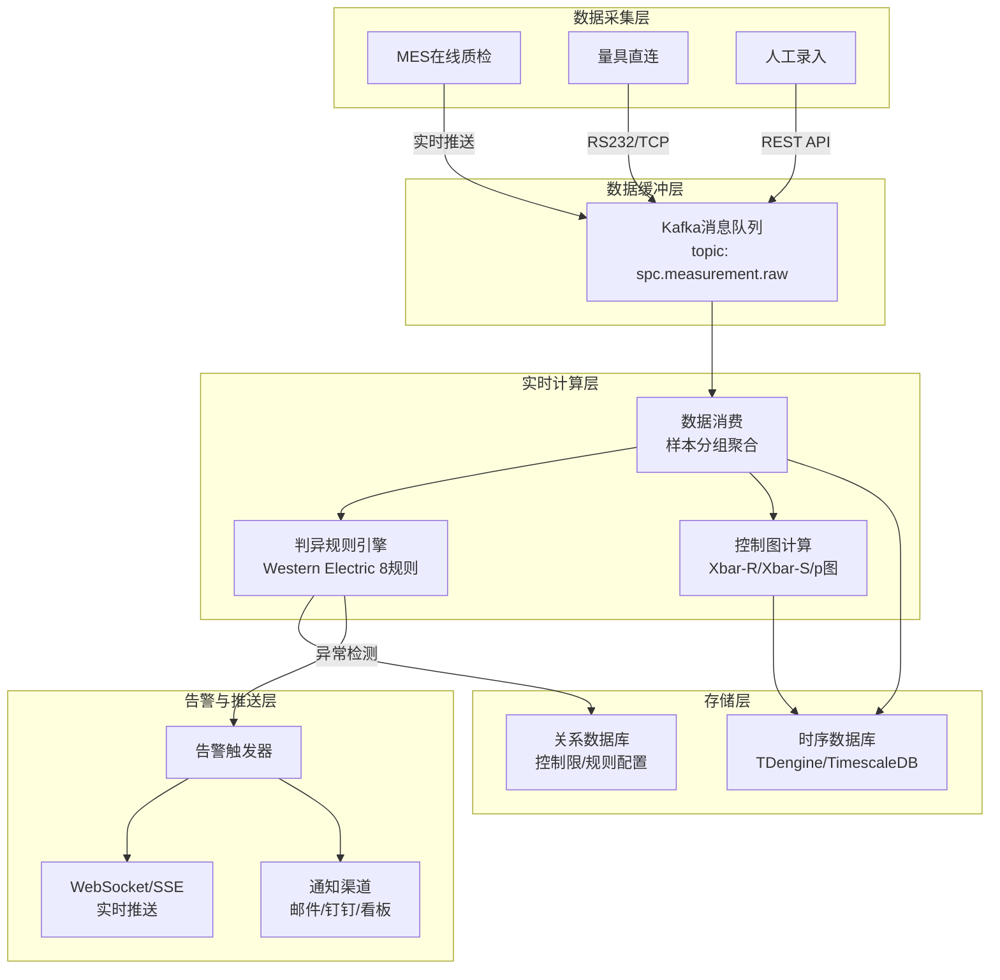

# SPC实时监控与数据采集

## 系统架构全景

SPC(统计过程控制)实时监控系统是QMS中技术复杂度最高的模块，需要实现从数据采集、实时计算、判异检测到告警触发的完整链路。系统采用分层架构设计：



## 数据采集层设计

### 采集模式对比

| 模式 | 实时性 | 适用场景 | 数据源 | 实现复杂度 |
|------|--------|----------|--------|------------|
| MES实时推送 | 毫秒级 | 在线质检、自动化产线 | MES工位机 | 中 |
| 量具直连 | 秒级 | 高精度测量、CMM三坐标 | RS232/TCP/OPC UA | 高 |
| 定时拉取 | 分钟级 | 离线检验、人工抽检 | QMS检验记录表 | 低 |
| 人工录入 | 分钟级 | 小批量、特殊检验 | Web/移动端 | 低 |

### 数据采集接口设计

```python
from pydantic import BaseModel
from typing import List, Optional
from datetime import datetime
from enum import Enum

class MeasurementType(str, Enum):
    VARIABLE = "VARIABLE"    # 计量型
    ATTRIBUTE = "ATTRIBUTE"  # 计数型

class MeasurementMessage(BaseModel):
    """SPC测量数据消息 - Kafka消息体"""
    measurement_id: str          # 测量唯一ID
    characteristic_id: str       # 质量特性ID
    characteristic_name: str     # 质量特性名称
    measurement_type: MeasurementType
    value: float                 # 测量值(计量型)或缺陷数(计数型)
    unit: str                    # 单位
    sample_group_id: str         # 样本组ID
    sample_index: int            # 样本组内序号
    material_code: str           # 物料编码
    lot_number: str              # 批次号
    work_center: str             # 工作中心
    equipment_id: str            # 设备ID
    operator: str                # 操作员
    timestamp: datetime          # 测量时间
    source: str                  # 数据来源：MES/GAGE/MANUAL

class SampleGroup(BaseModel):
    """样本组 - 控制图的基本计算单元"""
    group_id: str
    characteristic_id: str
    sample_size: int             # 样本量(n)
    values: List[float]          # 测量值列表
    mean: float                  # 均值(Xbar)
    range: float                 # 极差(R)
    std_dev: Optional[float]     # 标准差(S)，n>10时使用
    timestamp: datetime
```

### Kafka消费者 - 数据聚合

```python
class SPCDataConsumer:
    """SPC数据消费与聚合服务"""

    def __init__(self):
        self.buffer: Dict[str, List[MeasurementMessage]] = {}
        self.buffer_window = timedelta(minutes=5)  # 5分钟聚合窗口

    async def on_message(self, msg: MeasurementMessage):
        """处理单条测量消息"""
        # 缓冲到样本组
        key = f"{msg.characteristic_id}:{msg.sample_group_id}"
        if key not in self.buffer:
            self.buffer[key] = []
        self.buffer[key].append(msg)

        # 判断样本组是否收齐
        plan = self._get_inspection_plan(msg.characteristic_id)
        if len(self.buffer[key]) >= plan.sample_size:
            await self._process_complete_group(key)

    async def _process_complete_group(self, key: str):
        """处理完整的样本组"""
        measurements = self.buffer.pop(key)
        values = [m.value for m in measurements]

        group = SampleGroup(
            group_id=measurements[0].sample_group_id,
            characteristic_id=measurements[0].characteristic_id,
            sample_size=len(values),
            values=values,
            mean=statistics.mean(values),
            range=max(values) - min(values),
            std_dev=statistics.stdev(values) if len(values) > 1 else 0,
            timestamp=max(m.timestamp for m in measurements),
        )

        # 写入时序数据库
        await self._save_to_tsdb(group)

        # 执行判异规则检测
        alerts = await self.rule_engine.evaluate(group)

        if alerts:
            await self._trigger_alerts(alerts, group)

        # 推送控制图数据
        await self._push_chart_update(group)
```

## 判异规则引擎

### Western Electric 8规则

判异规则引擎是SPC系统的核心，基于Western Electric规则(也称Nelson规则)检测过程异常：

| 规则 | 编号 | 判异条件 | 异常类型 | 严重度 |
|------|------|----------|----------|--------|
| 规则1 | WE-01 | 1个点落在A区以外(超出3σ) | 单点超限 | CRITICAL |
| 规则2 | WE-02 | 连续9个点落在中心线同一侧 | 偏移趋势 | MAJOR |
| 规则3 | WE-03 | 连续6个点递增或递减 | 趋势漂移 | MAJOR |
| 规则4 | WE-04 | 连续14个点上下交替 | 周期波动 | MINOR |
| 规则5 | WE-05 | 连续3个点中有2个落在B区以外(同侧) | 偏移预警 | MAJOR |
| 规则6 | WE-06 | 连续5个点中有4个落在C区以外(同侧) | 偏移预警 | MINOR |
| 规则7 | WE-07 | 连续15个点落在C区内(中心线两侧) | 过程变异过小 | MINOR |
| 规则8 | WE-08 | 连续8个点落在C区以外(中心线两侧) | 双侧偏移 | MAJOR |

**区域定义：**

```
+UCL ────────────  μ + 3σ  ─── A区上界
|                 μ + 2σ  ─── B区上界
|    A区          μ + 1σ  ─── C区上界
|    B区          μ       ─── 中心线(CL)
|    C区          μ - 1σ  ─── C区下界
|    B区          μ - 2σ  ─── B区下界
|    A区          μ - 3σ  ─── A区下界
+LCL ────────────
```

### 规则引擎实现

```python
from dataclasses import dataclass
from typing import List, Optional

@dataclass
class ControlLimit:
    """控制限"""
    cl: float    # 中心线
    ucl: float   # 控制上限
    lcl: float   # 控制下限

    @property
    def sigma(self) -> float:
        return (self.ucl - self.lcl) / 6

    def zone_a_upper(self) -> float: return self.cl + 3 * self.sigma
    def zone_a_lower(self) -> float: return self.cl - 3 * self.sigma
    def zone_b_upper(self) -> float: return self.cl + 2 * self.sigma
    def zone_b_lower(self) -> float: return self.cl - 2 * self.sigma
    def zone_c_upper(self) -> float: return self.cl + 1 * self.sigma
    def zone_c_lower(self) -> float: return self.cl - 1 * self.sigma

@dataclass
class SPCAlert:
    """SPC告警"""
    rule_id: str
    rule_name: str
    characteristic_id: str
    characteristic_name: str
    severity: str
    description: str
    data_points: List[float]
    trigger_time: datetime

class SPCRuleEngine:
    """SPC判异规则引擎"""

    def __init__(self):
        self.rules = self._load_rules()
        self.history_buffer: Dict[str, deque] = {}  # 历史数据缓冲

    async def evaluate(self, group: SampleGroup) -> List[SPCAlert]:
        """对样本组执行全规则检测"""
        limits = await self._get_control_limits(group.characteristic_id)
        alerts = []

        # 维护历史数据缓冲（保留最近25组）
        key = group.characteristic_id
        if key not in self.history_buffer:
            self.history_buffer[key] = deque(maxlen=25)
        self.history_buffer[key].append(group)

        history = list(self.history_buffer[key])

        # 逐规则检测
        for rule in self.rules:
            if rule.enabled:
                alert = rule.check(group, history, limits)
                if alert:
                    alerts.append(alert)

        return alerts

    def _load_rules(self) -> List['SPCRule']:
        """加载规则配置"""
        return [
            WesternElectricRule1(),
            WesternElectricRule2(),
            WesternElectricRule3(),
            WesternElectricRule4(),
            WesternElectricRule5(),
            WesternElectricRule6(),
            WesternElectricRule7(),
            WesternElectricRule8(),
            # 可加载自定义规则
        ]


class WesternElectricRule1(SPCRule):
    """规则1：1个点落在A区以外(超出3σ)"""

    rule_id = "WE-01"
    rule_name = "单点超限"
    severity = "CRITICAL"

    def check(self, group: SampleGroup, history: List[SampleGroup],
              limits: ControlLimit) -> Optional[SPCAlert]:
        if group.mean > limits.ucl or group.mean < limits.lcl:
            return SPCAlert(
                rule_id=self.rule_id,
                rule_name=self.rule_name,
                characteristic_id=group.characteristic_id,
                characteristic_name=group.characteristic_name,
                severity=self.severity,
                description=f"均值{group.mean:.4f}超出控制限[{limits.lcl:.4f}, {limits.ucl:.4f}]",
                data_points=[group.mean],
                trigger_time=group.timestamp,
            )
        return None


class WesternElectricRule2(SPCRule):
    """规则2：连续9个点落在中心线同一侧"""

    rule_id = "WE-02"
    rule_name = "单侧偏移"
    severity = "MAJOR"
    consecutive_count = 9

    def check(self, group: SampleGroup, history: List[SampleGroup],
              limits: ControlLimit) -> Optional[SPCAlert]:
        if len(history) < self.consecutive_count:
            return None

        recent = [h.mean for h in history[-self.consecutive_count:]]
        above = all(v > limits.cl for v in recent)
        below = all(v < limits.cl for v in recent)

        if above or below:
            side = "上侧" if above else "下侧"
            return SPCAlert(
                rule_id=self.rule_id,
                rule_name=self.rule_name,
                characteristic_id=group.characteristic_id,
                characteristic_name=group.characteristic_name,
                severity=self.severity,
                description=f"连续{self.consecutive_count}个点落在中心线{side}，过程均值可能已偏移",
                data_points=recent,
                trigger_time=group.timestamp,
            )
        return None


class WesternElectricRule5(SPCRule):
    """规则5：连续3个点中有2个落在B区以外(同侧)"""

    rule_id = "WE-05"
    rule_name = "B区外聚集"
    severity = "MAJOR"

    def check(self, group: SampleGroup, history: List[SampleGroup],
              limits: ControlLimit) -> Optional[SPCAlert]:
        if len(history) < 3:
            return None

        recent = [h.mean for h in history[-3:]]

        # 上侧B区外：> μ+2σ
        above_b = sum(1 for v in recent if v > limits.zone_b_upper())
        # 下侧B区外：< μ-2σ
        below_b = sum(1 for v in recent if v < limits.zone_b_lower())

        if above_b >= 2 or below_b >= 2:
            side = "上侧" if above_b >= 2 else "下侧"
            return SPCAlert(
                rule_id=self.rule_id,
                rule_name=self.rule_name,
                characteristic_id=group.characteristic_id,
                characteristic_name=group.characteristic_name,
                severity=self.severity,
                description=f"最近3点中有{2}个落在{side}B区以外，过程可能正在偏移",
                data_points=recent,
                trigger_time=group.timestamp,
            )
        return None
```

### 规则配置DSL

支持通过配置化方式定义自定义判异规则，无需修改代码：

```yaml
# spc_rules_config.yaml
rules:
  - rule_id: WE-01
    name: 单点超限
    enabled: true
    severity: CRITICAL
    condition: "value > ucl OR value < lcl"
    description: "1个点落在A区以外"

  - rule_id: CUSTOM-01
    name: 连续超C区预警
    enabled: true
    severity: MINOR
    condition: "count(value > cl + 1*sigma, window=5) >= 3"
    description: "连续5点中有3点超过C区上限"

  - rule_id: CUSTOM-02
    name: 均值偏移检测
    enabled: true
    severity: MAJOR
    condition: "abs(avg(window=10) - cl) > 1.5 * sigma"
    description: "最近10点均值偏离中心线超过1.5σ"
```

```python
class RuleDSLParser:
    """规则配置DSL解析器"""

    def parse(self, config: dict) -> 'CustomSPCRule':
        condition = config['condition']

        # 解析条件表达式
        # 支持的函数: count(), avg(), abs(), max(), min()
        # 支持的变量: value, cl, ucl, lcl, sigma
        # 支持的参数: window=N

        return CustomSPCRule(
            rule_id=config['rule_id'],
            name=config['name'],
            enabled=config['enabled'],
            severity=config['severity'],
            condition_expr=self._compile_condition(condition),
            description=config['description']
        )
```

## 控制图数据结构

### 计量型控制图(Xbar-R)

```python
@dataclass
class XbarRChartData:
    """Xbar-R控制图数据"""
    characteristic_id: str
    characteristic_name: str
    chart_type: str = "XBAR_R"

    # 控制限
    xbar_cl: float    # Xbar中心线
    xbar_ucl: float   # Xbar控制上限
    xbar_lcl: float   # Xbar控制下限
    r_cl: float       # R中心线
    r_ucl: float      # R控制上限
    r_lcl: float      # R控制下限

    # 样本组数据点
    data_points: List[dict]  # [{group_id, xbar, r, timestamp, is_ooc}]

    # 控制限计算系数（与样本量n相关）
    @staticmethod
    def calculate_limits(groups: List[SampleGroup]) -> 'XbarRChartData':
        n = groups[0].sample_size
        xbar_values = [g.mean for g in groups]
        r_values = [g.range for g in groups]

        xbar_bar = statistics.mean(xbar_values)
        r_bar = statistics.mean(r_values)

        # SPC常数表
        A2 = SPC_CONSTANTS[n]['A2']
        D3 = SPC_CONSTANTS[n]['D3']
        D4 = SPC_CONSTANTS[n]['D4']

        return XbarRChartData(
            xbar_cl=xbar_bar,
            xbar_ucl=xbar_bar + A2 * r_bar,
            xbar_lcl=xbar_bar - A2 * r_bar,
            r_cl=r_bar,
            r_ucl=D4 * r_bar,
            r_lcl=D3 * r_bar if D3 > 0 else 0,
        )
```

### 计数型控制图(p图)

```python
@dataclass
class PChartData:
    """p图（不合格品率控制图）数据"""
    characteristic_id: str
    chart_type: str = "P"

    cl: float     # 平均不合格品率 p̄
    ucl: float    # 控制上限
    lcl: float    # 控制下限

    data_points: List[dict]  # [{group_id, p, n, d, timestamp}]

    @staticmethod
    def calculate_limits(inspections: List[dict]) -> 'PChartData':
        """p图控制限计算 - 每组样本量可能不同"""
        total_defects = sum(d['defect_count'] for d in inspections)
        total_inspected = sum(d['sample_size'] for d in inspections)
        p_bar = total_defects / total_inspected

        # 各组控制限不同（因样本量不同）
        for d in inspections:
            n = d['sample_size']
            d['ucl'] = p_bar + 3 * math.sqrt(p_bar * (1 - p_bar) / n)
            d['lcl'] = max(0, p_bar - 3 * math.sqrt(p_bar * (1 - p_bar) / n))
            d['p'] = d['defect_count'] / n

        return PChartData(
            cl=p_bar,
            ucl=p_bar + 3 * math.sqrt(p_bar * (1 - p_bar) / min(d['sample_size'] for d in inspections)),
            lcl=max(0, p_bar - 3 * math.sqrt(p_bar * (1 - p_bar) / min(d['sample_size'] for d in inspections))),
            data_points=inspections,
        )
```

## 实时推送

### WebSocket推送方案

```python
class SPCWebSocketHandler:
    """SPC实时数据WebSocket推送"""

    async def on_sample_group_completed(self, group: SampleGroup):
        """样本组完成时推送更新"""
        # 获取当前控制图数据
        chart_data = await self._get_chart_data(group.characteristic_id)

        # 构建推送消息
        message = {
            "type": "chart_update",
            "characteristic_id": group.characteristic_id,
            "data": {
                "group_id": group.group_id,
                "mean": group.mean,
                "range": group.range,
                "timestamp": group.timestamp.isoformat(),
                "is_ooc": self._check_ooc(group, chart_data),
            },
            "control_limits": {
                "xbar_cl": chart_data.xbar_cl,
                "xbar_ucl": chart_data.xbar_ucl,
                "xbar_lcl": chart_data.xbar_lcl,
            }
        }

        # 推送给订阅该特性的所有客户端
        await self.broadcast(group.characteristic_id, message)

    async def on_alert_triggered(self, alert: SPCAlert):
        """告警触发时推送"""
        message = {
            "type": "spc_alert",
            "alert": {
                "rule_id": alert.rule_id,
                "rule_name": alert.rule_name,
                "severity": alert.severity,
                "description": alert.description,
                "data_points": alert.data_points,
                "trigger_time": alert.trigger_time.isoformat(),
            }
        }
        # 全局广播告警
        await self.broadcast_all(message)
```

## 数据聚合策略

| 聚合粒度 | 时间窗口 | 适用场景 | 保留策略 |
|----------|----------|----------|----------|
| 原始数据 | 单次测量 | 详细分析/追溯 | 30天 |
| 分钟级 | 1分钟 | 实时监控 | 7天 |
| 小时级 | 1小时 | 日常报表 | 90天 |
| 班次级 | 8小时 | 班组对比 | 365天 |
| 日级 | 1天 | 趋势分析 | 永久 |

```sql
-- TimescaleDB连续聚合 - 小时级
CREATE MATERIALIZED VIEW spc_hourly_agg
WITH (timescaledb.continuous) AS
SELECT
    characteristic_id,
    time_bucket('1 hour', timestamp) AS bucket,
    avg(mean) AS avg_mean,
    stddev(mean) AS std_mean,
    avg(range) AS avg_range,
    count(*) AS group_count,
    max(mean) AS max_mean,
    min(mean) AS min_mean
FROM spc_sample_groups
GROUP BY characteristic_id, bucket;
```

## 性能优化

### 时序数据库选型

| 维度 | TDengine | TimescaleDB | InfluxDB |
|------|----------|-------------|----------|
| 写入性能 | 极高(100万点/秒) | 高(10万点/秒) | 高(50万点/秒) |
| 查询性能 | 高(降采样内置) | 高(连续聚合) | 中 |
| 存储压缩 | 极高(1/10) | 中 | 高(1/5) |
| SQL兼容 | 部分SQL | 完全SQL | InfluxQL/Flux |
| 运维复杂度 | 低 | 中 | 中 |

### 降采样策略

```python
class DownsampleStrategy:
    """降采样策略 - 减少长期存储的数据量"""

    def downsample(self, raw_data: List[SampleGroup],
                   target_interval: timedelta) -> List[SampleGroup]:
        """将高频数据降采样为低频聚合数据"""
        result = []
        current_bucket = None
        bucket_values = []

        for group in raw_data:
            bucket = self._get_bucket(group.timestamp, target_interval)
            if bucket != current_bucket:
                if bucket_values:
                    result.append(self._aggregate(bucket_values, current_bucket))
                current_bucket = bucket
                bucket_values = []
            bucket_values.append(group)

        if bucket_values:
            result.append(self._aggregate(bucket_values, current_bucket))

        return result

    def _aggregate(self, groups: List[SampleGroup],
                   bucket: datetime) -> SampleGroup:
        """聚合多个样本组为一个"""
        all_values = [v for g in groups for v in g.values]
        return SampleGroup(
            group_id=f"DS-{bucket.strftime('%Y%m%d%H%M')}",
            characteristic_id=groups[0].characteristic_id,
            sample_size=len(all_values),
            values=all_values,
            mean=statistics.mean(all_values),
            range=max(all_values) - min(all_values),
            std_dev=statistics.stdev(all_values),
            timestamp=bucket,
        )
```

## 开发者实战：从零实现SPC判异引擎

以下是一个可独立运行的SPC判异引擎最小实现：

```python
import statistics
from dataclasses import dataclass, field
from typing import List, Optional, Callable

@dataclass
class ControlLimit:
    cl: float
    ucl: float
    lcl: float

    @property
    def sigma(self): return (self.ucl - self.lcl) / 6

@dataclass
class Alert:
    rule: str
    message: str
    points: List[float]
    severity: str

class SPCEngine:
    """SPC判异引擎最小实现"""

    def __init__(self, limits: ControlLimit):
        self.limits = limits
        self.history: List[float] = []
        self.rules: List[Callable] = [
            self._rule1_point_beyond_3sigma,
            self._rule2_9_same_side,
            self._rule3_6_trending,
            self._rule5_2_of_3_beyond_2sigma,
        ]

    def add_point(self, value: float) -> List[Alert]:
        """添加数据点并检测异常"""
        self.history.append(value)
        alerts = []
        for rule in self.rules:
            alert = rule()
            if alert:
                alerts.append(alert)
        return alerts

    def _rule1_point_beyond_3sigma(self) -> Optional[Alert]:
        """规则1: 1个点超出3σ"""
        v = self.history[-1]
        if v > self.limits.ucl or v < self.limits.lcl:
            return Alert("WE-01", f"点{v:.4f}超出控制限", [v], "CRITICAL")
        return None

    def _rule2_9_same_side(self) -> Optional[Alert]:
        """规则2: 连续9点同侧"""
        if len(self.history) < 9:
            return None
        recent = self.history[-9:]
        if all(v > self.limits.cl for v in recent):
            return Alert("WE-02", "连续9点在中心线上侧", recent, "MAJOR")
        if all(v < self.limits.cl for v in recent):
            return Alert("WE-02", "连续9点在中心线下侧", recent, "MAJOR")
        return None

    def _rule3_6_trending(self) -> Optional[Alert]:
        """规则3: 连续6点递增/递减"""
        if len(self.history) < 6:
            return None
        recent = self.history[-6:]
        if all(recent[i] < recent[i+1] for i in range(5)):
            return Alert("WE-03", "连续6点递增", recent, "MAJOR")
        if all(recent[i] > recent[i+1] for i in range(5)):
            return Alert("WE-03", "连续6点递减", recent, "MAJOR")
        return None

    def _rule5_2_of_3_beyond_2sigma(self) -> Optional[Alert]:
        """规则5: 连续3点中2点超出2σ(同侧)"""
        if len(self.history) < 3:
            return None
        recent = self.history[-3:]
        upper_2sigma = self.limits.cl + 2 * self.limits.sigma
        lower_2sigma = self.limits.cl - 2 * self.limits.sigma
        above = sum(1 for v in recent if v > upper_2sigma)
        below = sum(1 for v in recent if v < lower_2sigma)
        if above >= 2:
            return Alert("WE-05", "3点中2点超出上2σ", recent, "MAJOR")
        if below >= 2:
            return Alert("WE-05", "3点中2点超出下2σ", recent, "MAJOR")
        return None


# 使用示例
if __name__ == "__main__":
    limits = ControlLimit(cl=100.0, ucl=103.0, lcl=97.0)
    engine = SPCEngine(limits)

    # 模拟数据流
    import random
    for i in range(20):
        value = 100.0 + random.gauss(0, 0.5)
        alerts = engine.add_point(value)
        if alerts:
            for a in alerts:
                print(f"[{a.severity}] {a.rule}: {a.message}")
```

## 开发者实战Tips

1. **控制限动态更新**：控制限不应一成不变。建议每25-30个样本组重新计算控制限，或在过程参数变更后重新计算。使用滑动窗口机制避免历史异常数据影响控制限计算。

2. **数据缓冲策略**：Kafka消费端使用手动提交offset，确保数据写入时序数据库和规则引擎检测完成后才commit，避免数据丢失。缓冲窗口大小根据检验频率调整。

3. **告警去重与抑制**：同一条规则在短时间内可能持续触发告警。实现告警聚合——同一特性同一规则5分钟内只发一条告警，避免告警风暴。

4. **量具R&R集成**：SPC数据可信的前提是测量系统稳定。建议在SPC引擎入口增加量具Gage R&R校验——若某量具的GR&R超过30%，自动标记该通道数据为"低可信度"。

5. **离线分析支持**：实时监控与离线分析使用不同的数据存储。实时路径走时序数据库，离线分析走数据仓库(ClickHouse/Greenplum)，通过ETL定时同步。
