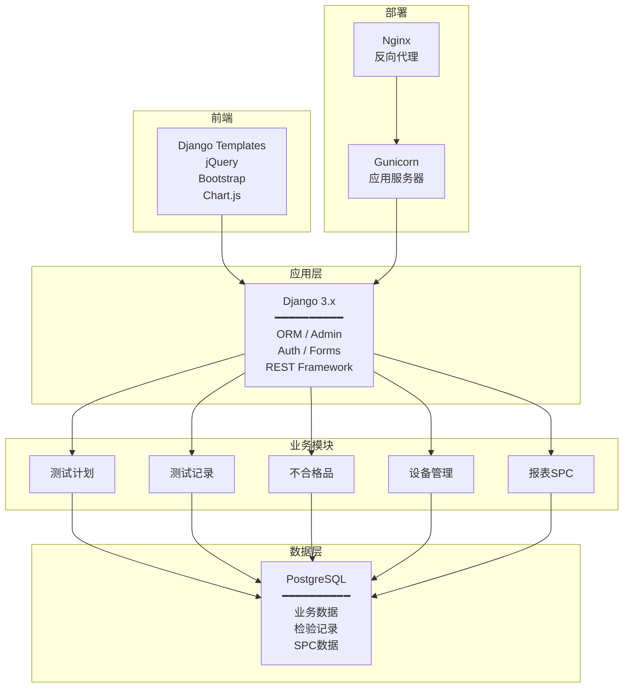

# QATrack深度解析

## 项目介绍

QATrack是一个开源的质量管理系统，专为制造业的检验计划和测试记录管理而设计。项目最初由加拿大安大略省的制造业IT团队开发，已在北美和欧洲的多家制造企业中部署使用。QATrack的核心定位是解决中小制造企业"从纸质检验记录到数字化质量管理"的转型需求。

| 项目信息 | 详情 |
|---------|------|
| 项目名称 | QATrack+ |
| 开源协议 | GNU Affero General Public License v3.0 |
| 主要语言 | Python |
| Web框架 | Django |
| 前端框架 | Django Templates + jQuery |
| 数据库 | PostgreSQL（推荐）/ MySQL / SQLite |
| 项目地址 | GitHub搜索"qatrack" |

## 功能模块

QATrack围绕制造业质量管理的核心需求，提供了以下功能模块：

### 检验计划管理

| 功能 | 说明 |
|------|------|
| 测试列表 | 定义检验项目和判定标准 |
| 检验频率 | 设置检验的时间间隔或触发条件 |
| 规格限 | 定义上下规格限（USL/LSL）和目标值 |
| 测试组 | 将相关测试项组合成检验计划 |
| 版本管理 | 检验计划的版本控制和变更历史 |

### 检验记录管理

| 功能 | 说明 |
|------|------|
| 数据采集 | 支持手动录入和设备数据导入 |
| 自动判定 | 根据规格限自动判定合格/不合格 |
| 数值/枚举/布尔 | 支持多种数据类型的检验项 |
| 附件管理 | 检验记录可附加图片、文档 |
| 签名确认 | 检验员和审核员电子签名 |

### 不合格品管理

| 功能 | 说明 |
|------|------|
| 不合格登记 | 检验不合格自动生成不合格记录 |
| 处置跟踪 | 返工/返修/让步/报废处置记录 |
| 纠正措施 | CAPA措施制定和跟踪 |
| 通知机制 | 不合格发生时邮件通知相关人 |

### 设备管理

| 功能 | 说明 |
|------|------|
| 设备台账 | 检验设备登记和参数管理 |
| 校准管理 | 校准计划和校准记录 |
| 校准到期提醒 | 校准到期自动提醒 |
| 测量设备关联 | 检验记录与测量设备的关联 |

### 报表与SPC

| 功能 | 说明 |
|------|------|
| SPC控制图 | X̄-R图、X̄-S图、单值图 |
| 直方图 | 质量特性值分布分析 |
| Cpk计算 | 过程能力指数自动计算 |
| 趋势分析 | 质量指标趋势图表 |
| 自定义报告 | 按需生成质量报告 |

## 技术栈详解



| 技术层 | 技术 | 版本 | 说明 |
|--------|------|------|------|
| Web框架 | Django | 3.x/4.x | Python最成熟的Web框架 |
| ORM | Django ORM | — | 数据库抽象层，支持多数据库 |
| 前端UI | Bootstrap 3 | 3.x | 响应式CSS框架 |
| JavaScript | jQuery | 3.x | DOM操作和AJAX |
| 图表 | Chart.js / Plotly | — | SPC图表和数据可视化 |
| 数据库 | PostgreSQL | 12+ | 推荐的生产数据库 |
| 应用服务器 | Gunicorn | — | WSGI应用服务器 |
| 反向代理 | Nginx | — | 静态文件服务和反向代理 |
| 缓存 | Redis | — | 可选，提升性能 |

## 部署实践

### Docker部署（推荐）

```yaml
# docker-compose.yml 示例
version: '3'
services:
  db:
    image: postgres:14
    environment:
      POSTGRES_DB: qatrack
      POSTGRES_USER: qatrack
      POSTGRES_PASSWORD: changeme
    volumes:
      - pgdata:/var/lib/postgresql/data

  web:
    image: qatrack/qatrack:latest
    command: >
      bash -c "python manage.py migrate &&
               python manage.py collectstatic --noinput &&
               gunicorn qatrack.wsgi:application --bind 0.0.0.0:8000"
    depends_on:
      - db
    ports:
      - "8000:8000"

  nginx:
    image: nginx:latest
    ports:
      - "80:80"
    volumes:
      - ./nginx.conf:/etc/nginx/conf.d/default.conf
    depends_on:
      - web

volumes:
  pgdata:
```

### 传统部署

1. 安装Python 3.8+和PostgreSQL
2. 创建虚拟环境：`python -m venv venv`
3. 安装依赖：`pip install -r requirements.txt`
4. 配置数据库：修改settings.py中的DATABASES配置
5. 执行迁移：`python manage.py migrate`
6. 创建超级用户：`python manage.py createsuperuser`
7. 收集静态文件：`python manage.py collectstatic`
8. 启动服务：`gunicorn qatrack.wsgi:application`

### 部署注意事项

| 注意事项 | 说明 |
|---------|------|
| 数据库选择 | 生产环境必须使用PostgreSQL，不支持SQLite |
| 备份策略 | 定期备份数据库和上传文件目录 |
| HTTPS配置 | 生产环境必须启用HTTPS |
| 静态文件 | 使用Nginx直接服务静态文件，提升性能 |
| 监控 | 配置Django日志和系统监控 |

## 与商业QMS对比

| 对比维度 | QATrack | 海克斯康QMS | 鼎捷QMS |
|---------|---------|------------|---------|
| 许可成本 | 免费（AGPL） | 高（百万级） | 中高（数十万起） |
| 部署周期 | 1-2周 | 3-6个月 | 2-4个月 |
| 功能完整度 | ★★★ | ★★★★★ | ★★★★ |
| SPC分析 | 基础 | 专业级 | 良好 |
| 三坐标集成 | 不支持 | 深度集成 | 部分支持 |
| ERP集成 | 需自行开发 | 丰富接口 | 与鼎捷ERP原生集成 |
| FMEA/APQP | 不支持 | 专业模块 | 支持 |
| 移动端 | 响应式Web | 原生App | 原生App |
| 技术支持 | 社区 | 专业技术团队 | 专业技术团队 |
| 定制性 | 高（源码可控） | 低 | 中 |
| 多语言 | 英语为主 | 多语言 | 中文优化 |

## 适用场景

### 适合的场景

- 中小制造企业，检验记录管理是核心痛点
- 企业有Python/Django技术团队，可以自行定制
- 不需要深度SPC分析和FMEA等专业模块
- 预算有限，无法承担商业QMS许可费用
- 作为QMS数字化转型的第一步，先解决"从纸质到数字"

### 不适合的场景

- 大型企业，需要完整QMS功能链
- 汽车行业，需要FMEA/APQP/PPAP等专业模块
- 需要三坐标测量机集成的精密制造
- 需要多工厂部署和统一管理
- 合规要求严格的医疗器械/制药行业

## 总结

QATrack是QMS领域少有的开源方案，适合中小制造企业作为质量数字化转型的起点。其基于Django的技术架构简洁可靠，检验计划和检验记录管理功能成熟，但SPC和不合格品管理功能相对基础。对于有Python技术能力的企业，QATrack提供了良好的二次开发基础。但对于需要完整QMS功能链的行业（如汽车、航空），商业QMS仍然是更合理的选择。
