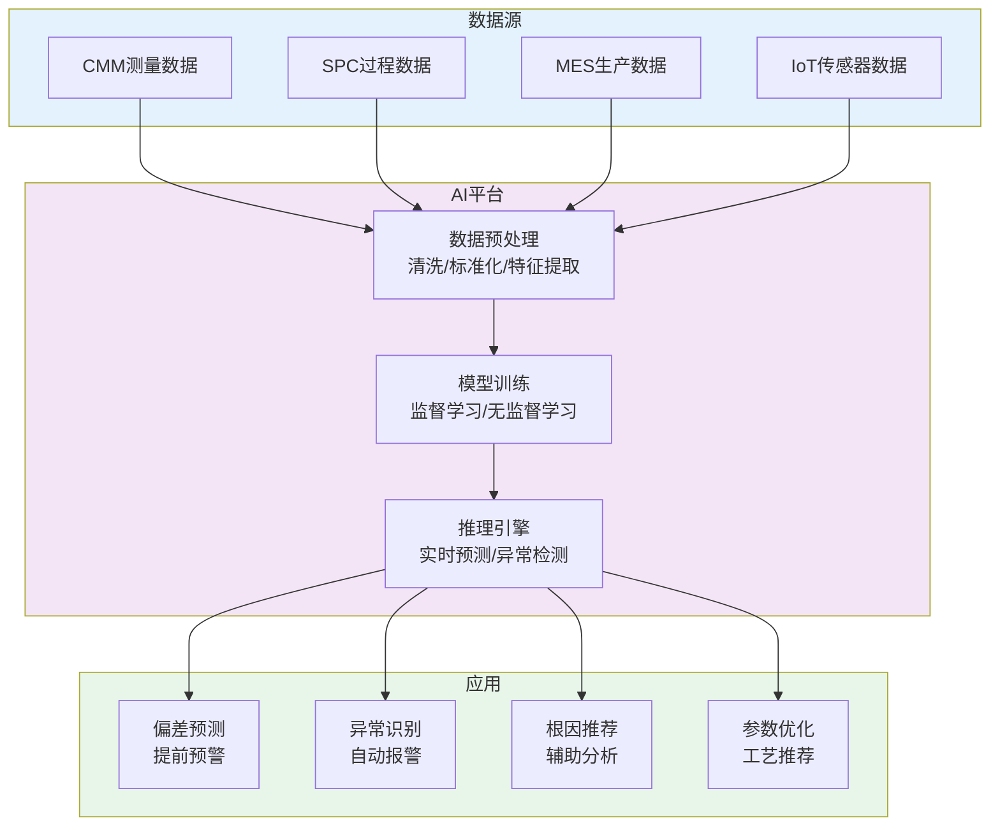

# 海克斯康QMS解析

## 海克斯康质量管理系统产品线

海克斯康（Hexagon）是全球领先的数字现实解决方案提供商，在质量领域拥有超过50年的技术积累。海克斯康的质量管理产品线源自对多家专业质量软件公司的收购与整合，形成了覆盖从计量检测到质量管理的完整解决方案：

| 产品线 | 产品名称 | 核心定位 | 关键能力 |
|--------|---------|---------|---------|
| 计量检测 | PC-DMIS | 三坐标测量机软件 | CMM编程、测量执行、报告生成 |
| 计量检测 | CALIPRI | 非接触式间隙/段差测量 | 曲面测量、在线检测 |
| SPC分析 | SPSS / Q-DAS | 统计过程控制 | SPC图表、过程能力分析、数据管理 |
| 质量管理 | QMS（质量管理系统） | 企业级质量管理 | 检验管理、不合格品、CAPA、追溯 |
| FMEA | FMEA软件 | 失效模式分析 | DFMEA/PFMEA、AP评估 |
| 质量追溯 | MAPPES | 制造过程追溯 | 批次追溯、质量档案 |

## 核心模块

### CMM三坐标测量集成

海克斯康QMS最突出的差异化优势是与三坐标测量机（CMM）的深度集成。PC-DMIS作为全球市场占有率最高的CMM软件，与QMS系统无缝对接：

| 集成场景 | 说明 |
|---------|------|
| 测量程序管理 | QMS中管理PC-DMIS测量程序，按产品/工序关联 |
| 测量任务下发 | QMS自动生成测量任务，CMM操作员一键加载程序 |
| 测量结果回传 | PC-DMIS测量结果自动回传QMS，无需人工录入 |
| 实时SPC | 测量数据实时流入SPC系统，自动更新控制图 |
| 偏差分析 | 测量偏差与CAD模型对比，可视化偏差分布 |
| 报告生成 | 自动生成包含GD&T标注的测量报告 |

**典型工作流**：
1. QMS根据检验计划生成CMM测量任务
2. CMM操作员在PC-DMIS中加载测量程序
3. 自动执行测量，采集数据点
4. 测量结果自动回传QMS
5. QMS根据规格限自动判定合格/不合格
6. 数据实时更新SPC控制图
7. 不合格自动触发不合格品处理流程

### SPC统计过程控制

海克斯康的SPC模块（基于Q-DAS技术）提供专业级的统计分析能力：

| SPC功能 | 说明 |
|---------|------|
| 控制图 | X̄-R, X̄-S, X-MR, p, np, c, u等多种控制图 |
| 判异规则 | Western Electric规则、Nelson规则等8种判异规则集 |
| 过程能力 | Cpk, Ppk, Cpm, Cp, Pp等过程能力指数 |
| 分布分析 | 正态性检验、Weibull分析、非正态分布处理 |
| 多变量分析 | 多变量SPC、主成分分析 |
| 报警管理 | 控制图异常自动报警，报警级别可配置 |
| 数据聚合 | 多设备、多产线、多工厂数据汇总分析 |

### FMEA模块

海克斯康FMEA软件支持AIAG-VDA 2019新版标准：

| 功能 | 说明 |
|------|------|
| 结构分析 | 可视化结构树，支持系统/子系统/组件层级 |
| 功能分析 | 功能网络图，功能与要求映射 |
| 失效分析 | 失效链（失效模式→失效影响→失效原因） |
| 风险评估 | S/O/D评分，AP行动优先级 |
| 措施管理 | 措施制定、分配、跟踪、验证 |
| FMEA复用 | 基础FMEA库，支持跨项目复用 |
| 版本管理 | FMEA版本控制和变更历史 |

### 质量追溯

| 追溯类型 | 说明 |
|---------|------|
| 批次追溯 | 正向追溯（原材料→成品）和反向追溯（成品→原材料） |
| 过程参数追溯 | 关联制造过程中的工艺参数（温度/压力/时间） |
| 测量数据追溯 | 关联CMM和其他测量设备的检测数据 |
| 人员追溯 | 关联操作员、检验员信息 |
| 设备追溯 | 关联使用的设备和工装信息 |

## 智能质量分析（AI辅助）

海克斯康近年来大力推进AI技术在质量管理中的应用：

| AI应用 | 说明 | 技术基础 |
|--------|------|---------|
| 测量偏差预测 | 基于历史数据预测加工偏差趋势 | 机器学习回归模型 |
| 异常模式识别 | 自动识别SPC控制图中的非随机模式 | 深度学习图像识别 |
| 根因辅助分析 | 根据质量数据自动推荐可能的原因 | 关联规则挖掘 |
| 预测性质量 | 预测产品质量趋势，提前预警 | 时序预测模型 |
| 视觉检测 | AI辅助外观缺陷识别 | 计算机视觉/CNN |

### AI辅助质量分析架构



## 多工厂部署

海克斯康QMS支持多工厂、多站点的集中式或分布式部署：

| 部署模式 | 说明 | 适用场景 |
|---------|------|---------|
| 集中式 | 所有工厂数据集中在一个数据中心 | 工厂数量少，网络条件好 |
| 分布式 | 各工厂本地部署，总部汇总 | 工厂数量多，网络条件一般 |
| 混合式 | 核心功能集中，数据采集分布式 | 大型企业，复杂网络环境 |

### 多工厂数据架构

```
总部QMS中心
├── 质量标准管理（统一下发）
├── 供应商质量评价（跨厂汇总）
├── 质量报表仪表板（全局视图）
└── 最佳实践共享（知识库）
    │
    ├── 工厂A（本地QMS节点）
    │   ├── 检验执行
    │   ├── SPC监控
    │   └── 不合格品处理
    │
    ├── 工厂B（本地QMS节点）
    │   ├── 检验执行
    │   ├── SPC监控
    │   └── 不合格品处理
    │
    └── 工厂C（本地QMS节点）
        ├── 检验执行
        ├── SPC监控
        └── 不合格品处理
```

## 汽车行业解决方案

海克斯康QMS在汽车行业具有深厚的实践积累，提供面向IATF 16949的完整解决方案：

| IATF 16949要求 | 海克斯康QMS支撑 |
|---------------|----------------|
| 控制计划 | 与FMEA和检验计划联动，控制计划数字化管理 |
| FMEA | DFMEA/PFMEA软件，支持AIAG-VDA 2019 |
| SPC | 专业级SPC分析，自动控制图和过程能力 |
| MSA | 测量系统分析，Gage R&R和偏倚/线性/稳定性 |
| PPAP | PPAP文档包管理，18项要求的数字化 |
| 客户特定要求CSR | 客户要求管理模块，确保满足各OEM的CSR |
| 防错 | 防错措施管理，与检验计划关联 |
| 供应商质量 | 供应商评价、二方审核管理 |

### 汽车行业典型部署

一家汽车零部件一级供应商（Tier 1）的海克斯康QMS部署方案：

| 部署层级 | 部署内容 | 用户数 |
|---------|---------|-------|
| 总部 | QMS中心 + SPC服务器 + 报表中心 | 50+ |
| 工厂1（压铸） | QMS节点 + CMM集成 + PC-DMIS | 30+ |
| 工厂2（机加工） | QMS节点 + CMM集成 + 在线量仪 | 20+ |
| 工厂3（装配） | QMS节点 + 视觉检测 + 功能测试 | 15+ |

## 总结

海克斯康QMS的核心差异化优势在于三坐标测量机的深度集成和专业级SPC分析能力，这源于海克斯康在计量检测领域数十年的技术积累。近年来AI辅助质量分析的引入，进一步提升了系统的智能化水平。对于汽车、航空等对测量精度和SPC分析要求极高的行业，海克斯康QMS是最具竞争力的选择之一。但其许可成本和部署复杂度也意味着，更适合大中型制造企业选择。
