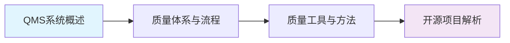

# QMS质量管理体系

QMS（Quality Management System，质量管理体系）是以质量为中心、以全员参与为基础，通过建立和实施质量方针与目标、质量策划、质量控制、质量保证和质量改进等活动，使企业持续满足顾客需求并追求卓越绩效的管理体系。本课程从QMS基础概念出发，系统阐述质量体系与流程、质量工具与方法，并结合开源项目与商业产品进行深度解析。

## 学习路线

## 参考产品

| 产品名称 | 类型 | 特点 | 适用行业 |
|---------|------|------|---------|
| 海克斯康Hexagon QMS | 商业 | 三坐标测量集成、SPC分析、AI辅助质量分析 | 汽车、航空、精密制造 |
| 鼎捷QMS | 商业 | 离散制造深度适配、与ERP/MES一体化 | 离散制造、电子组装 |
| SAP QM | 商业 | 与SAP ERP深度集成、流程行业适配 | 流程行业、化工、食品 |
| QATrack | 开源 | Django框架、检验计划/记录/不合格品管理 | 中小制造企业 |

## 章节目录

| 章节 | 内容概要 |
|------|---------|
| [01_QMS系统概述](./01_QMS系统概述/) | QMS定义、核心概念与数据模型、整体架构 |
| [02_质量体系与流程](./02_质量体系与流程/) | ISO 9001与质量体系、不合格品与CAPA管理 |
| [03_质量工具与方法](./03_质量工具与方法/) | 七大质量工具、FMEA与APQP实战 |
| [04_开源项目解析](./04_开源项目解析/) | QATrack深度解析、海克斯康QMS解析 |
