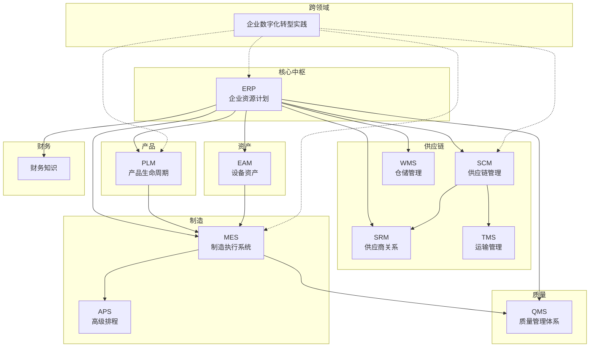
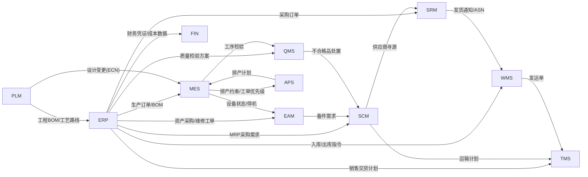

# 业务系统

本章节涵盖企业业务系统的全面文档——从单个系统的深度剖析，到跨领域的实践指导，面向中国制造企业提供从理论到落地的完整参考。

## 系统全景

## 系统分类总览

| 功能域 | 系统 | 核心价值 |
| ------ | ---- | -------- |
| 核心中枢 | ERP | 企业资源计划核心中枢，八大模块全覆盖 |
| 供应链 | SCM | 需求计划、供应计划与协同 |
| 供应链 | SRM | 供应商全生命周期管理 |
| 供应链 | TMS | 运输调度、路线优化与结算 |
| 供应链 | WMS | 仓储全流程管理，含系统集成与开源解析 |
| 制造 | MES | 制造执行核心，含系统集成与开源解析 |
| 制造 | APS | 约束优化与智能排产 |
| 产品 | PLM | 产品数据管理与工程变更 |
| 质量 | QMS | 质量体系、工具与合规管理 |
| 资产 | EAM | 设备维护、TPM与IoT集成 |
| 财务 | 财务知识 | 企业经济业务核算与财务报表 |
| 跨领域 | 企业数字化转型实践 | 桥接理想系统描述与中国企业现实 |

## ::: warning 特别推荐：企业数字化转型实践

理想化的系统蓝图与企业落地的现实之间，往往存在巨大鸿沟。**企业数字化转型实践** 正是为弥合这一断层而生——它不谈"系统应该怎样"，而是直面"国内企业实际怎样"：

- 流程标准化：如何从人治走向制度化
- 业务与系统断层：为什么系统上线后业务还在走线下
- 开发与业务协作：技术团队与业务部门的沟通困局
- 数据治理：从数据混乱到数据资产的真实路径

如果你在企业数字化项目中感到理想与现实脱节，建议从这里开始。

:::

## 全部章节

- [企业数字化转型实践](企业数字化转型实践/) — 国内企业数字化实践：流程标准化、业务与系统断层、开发与业务协作、数据治理
- [ERP业务](ERP业务/) — 企业资源计划核心中枢，八大模块全覆盖
- [WMS仓储管理](WMS仓储管理/) — 仓储全流程管理，含系统集成与开源解析
- [MES制造执行系统](MES制造执行系统/) — 制造执行核心，含系统集成与开源解析
- [财务知识](财务知识/) — 企业经济业务核算与财务报表
- [PLM产品生命周期](PLM产品生命周期/) — 产品数据管理与工程变更
- [QMS质量管理体系](QMS质量管理体系/) — 质量体系、工具与合规管理
- [SCM供应链管理](SCM供应链管理/) — 需求计划、供应计划与协同
- [SRM供应商关系](SRM供应商关系/) — 供应商全生命周期管理
- [EAM设备资产](EAM设备资产/) — 设备维护、TPM与IoT集成
- [APS高级排程](APS高级排程/) — 约束优化与智能排产
- [TMS运输管理](TMS运输管理/) — 运输调度、路线优化与结算

## 系统关联关系

