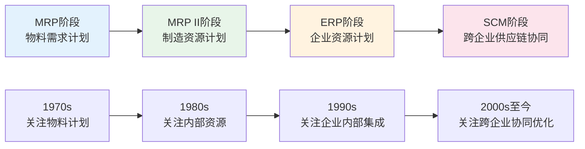
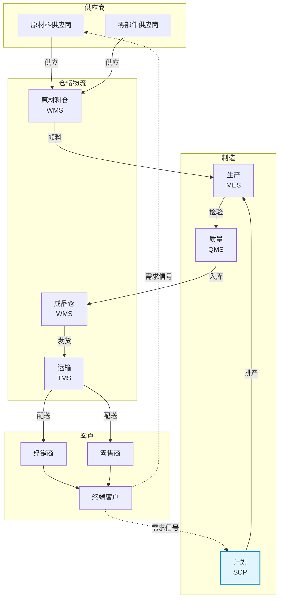

# SCM是什么

## SCM的定义

供应链管理（Supply Chain Management, SCM）是对从原材料供应商到最终客户之间的信息流、物流和资金流进行计划、协调、操作、控制和优化的各种活动和过程。SCM的核心理念是将供应链上的各环节视为一个整体，通过协同和优化实现全局最优，而非局部最优。

SCM系统则是支撑上述管理活动的信息化平台，它通过集成需求预测、供应计划、库存优化、运输调度和供应链协同等核心功能，帮助企业实现供应链的可视化、智能化和敏捷化。

## 从ERP到SCM的演进

供应链管理的发展经历了从ERP内部管理到SCM跨企业协同的演进过程：



**ERP的局限性**在于它主要关注企业内部的资源计划与执行，采用无限产能假设进行MRP运算，无法有效处理跨企业的供应链协同和约束优化。而SCM突破了企业边界，实现了以下关键转变：

| 维度 | ERP | SCM |
|------|-----|-----|
| 范围 | 企业内部 | 跨企业端到端 |
| 产能假设 | 无限产能 | 有限产能约束 |
| 计划方式 | 顺序计划 | 并发协同计划 |
| 需求来源 | 销售订单驱动 | 预测+订单驱动 |
| 响应速度 | 周级/月级 | 实时/近实时 |
| 优化能力 | 规则驱动 | 算法+AI驱动 |

## 供应链三流模型

供应链管理围绕三大核心流展开：

- **物流（Material Flow）**：从原材料到成品的物理流动，包括采购、生产、仓储、运输等环节
- **信息流（Information Flow）**：需求信息、供应信息、库存信息在供应链各节点之间的传递和共享
- **资金流（Financial Flow）**：采购付款、销售回款、库存资金占用等与供应链活动相关的资金流动

三流之间相互依赖、相互制约。信息流的滞后和不准确会导致物流的低效和资金流的浪费，这正是牛鞭效应的根源。

## 牛鞭效应与SCM的缓解作用

牛鞭效应（Bullwhip Effect）是供应链管理中最经典的现象之一，指的是需求信息在沿着供应链向上传递时，波动幅度逐级放大的现象。

```
终端客户需求波动: ±5%
零售商订单波动:   ±15%
经销商订单波动:   ±30%
制造商生产波动:   ±50%
供应商原料波动:   ±70%
```

牛鞭效应的四大成因：

1. **需求预测修正**：各节点基于直接下游订单而非终端需求进行预测，逐级放大
2. **批量订购**：为获得运输折扣或管理便利，下游集中下单导致需求脉冲
3. **价格波动**：促销导致前置购买，人为制造需求波动
4. **短缺博弈**：供应紧张时下游虚增订单，导致需求信号失真

SCM系统通过以下方式缓解牛鞭效应：

- **需求信息共享**：CPFR协同预测，让上游直接获取终端需求
- **VMI供应商管理库存**：供应商基于实际消耗补货，消除订单放大
- **JIT准时制供应**：小批量多频次，减少批量效应
- **稳定定价策略**：EDLP天天低价替代促销定价

## SCM系统分类

SCM系统按功能定位可分为三大类：

| 类别 | 核心功能 | 典型产品 |
|------|----------|----------|
| 供应链计划（SCP） | 需求预测、供应计划、库存优化、S&OP | SAP IBP, Kinaxis |
| 供应链执行（SCE） | 订单管理、仓储管理、运输管理 | Manhattan, Blue Yonder |
| 供应链协同（SCC） | 供应商门户、CPFR、供应链可视化 | SAP Ariba, Oracle SCM Cloud |

按计划层级又可分为：

- **战略层**：供应链网络设计、设施选址、产能规划（年度级别）
- **战术层**：S&OP、需求计划、主生产计划（月度级别）
- **操作层**：排程、补货、运输调度（日/周级别）

## 供应链参考模型SCOR

SCOR（Supply Chain Operations Reference）是国际供应链理事会开发的供应链参考模型，为供应链管理提供了标准化的流程框架和评估体系。

SCOR模型的五个核心流程：

| 流程 | 英文 | 含义 |
|------|------|------|
| 计划 | Plan | 需求/供应计划，资源配置 |
| 采购 | Source | 原材料和服务获取 |
| 制造 | Make | 生产制造和增值活动 |
| 交付 | Deliver | 订单履行、仓储、运输 |
| 回收 | Return | 退货和回收处理 |

SCOR模型的价值在于提供了供应链绩效评估的标准指标体系，包括可靠性、响应性、敏捷性、成本和资产管理效率五个维度。

## 供应链全景图



## 商业产品对比

| 维度 | SAP IBP | Kinaxis RapidResponse | Blue Yonder |
|------|---------|----------------------|-------------|
| 核心定位 | 供应链计划为主 | 并发计划引擎 | AI驱动供应链优化 |
| 技术架构 | SAP HANA内存计算 | 专利并发计算引擎 | 机器学习+优化引擎 |
| 计划能力 | 需求/供应/响应/库存 | 统一并发计划模型 | 需求感知+供应优化 |
| What-If | 场景对比模拟 | 实时并发模拟 | AI推荐场景 |
| 行业优势 | 制造、化工、消费品 | 高科技、汽车、医药 | 零售、制造、物流 |
| 部署模式 | SaaS | SaaS/私有化 | SaaS |
| 集成生态 | SAP S/4HANA深度集成 | SAP/Oracle/自有ERP | 多ERP集成 |
| 定价模式 | 按用户+按量 | 按用户 | 按模块+按量 |
