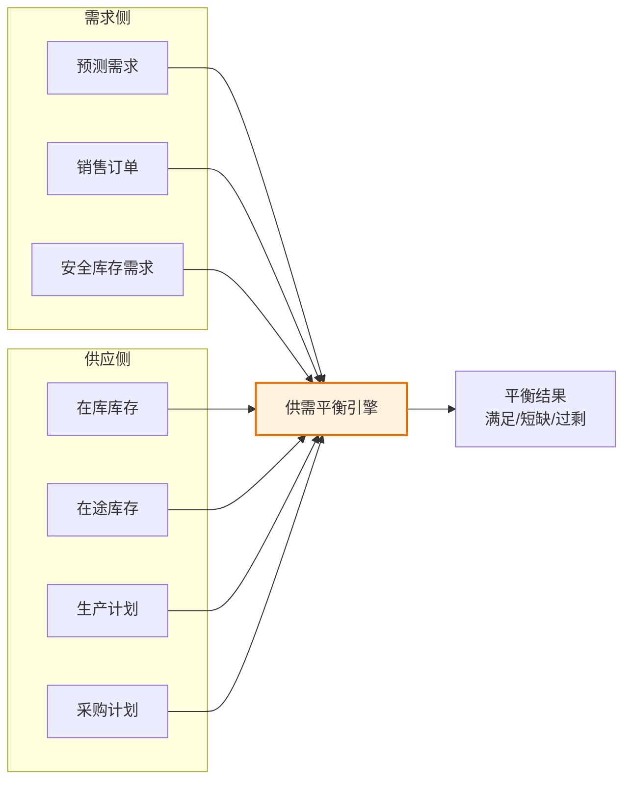
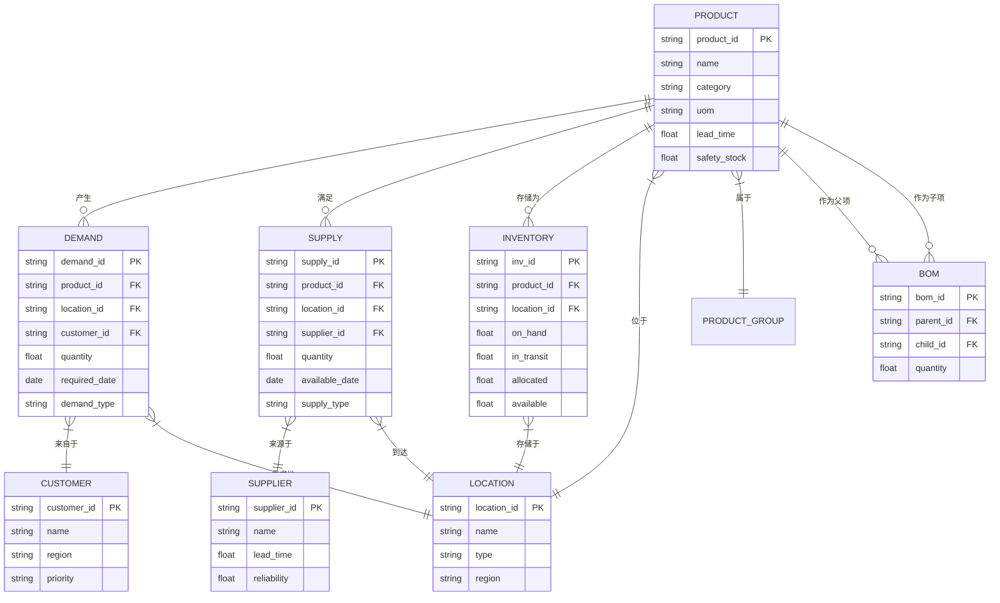

# 核心概念与数据模型

## 核心对象

供应链管理系统涉及的核心业务对象构成了SCM数据模型的基石，理解这些对象及其关系是掌握SCM系统的前提。

| 核心对象 | 说明 | 关键属性 |
|----------|------|----------|
| 需求（Demand） | 客户对产品或服务的需要 | 需求量、需求日期、需求类型（预测/订单）、优先级 |
| 供应（Supply） | 满足需求的物料或产能来源 | 供应量、供应日期、供应类型（采购/生产/调拨） |
| 库存（Inventory） | 物料在各节点的存储状态 | 在库量、在途量、已分配量、可用量 |
| 产能（Capacity） | 生产资源的加工能力 | 额定产能、可用产能、已占用产能 |
| 运输（Transportation） | 物料在节点间的移动 | 运力、运输方式、提前期、成本 |
| 订单（Order） | 供需交易的载体 | 销售订单、采购订单、生产订单、调拨订单 |

## 供应链网络模型

供应链网络是SCM系统的核心数据结构，它描述了供应链中各节点以及节点之间的连接关系和约束条件。

### 节点（Node）

节点是供应链网络中的实体位置，包括：

- **供应商节点**：原材料和零部件的来源
- **工厂节点**：生产制造的发生地
- **仓库节点**：物料的存储和中转地
- **客户节点**：产品的目的地

每个节点具备属性：地理位置、生产能力、存储能力、运营成本、工作时间等。

### 路径（Path）

路径描述了节点之间的连接关系和物料流动方向：

- **采购路径**：供应商→工厂，定义采购提前期、批量、运输方式
- **生产路径**：工厂内部，定义BOM关系、工艺路线、生产提前期
- **分销路径**：工厂→仓库→客户，定义分销提前期、运输约束

### 约束（Constraint）

供应链网络中的约束条件限制了计划方案的可行性：

- **硬约束**：不可违反的物理限制（产能上限、物料可用性、时间窗）
- **软约束**：可以违反但会产生惩罚的目标（安全库存水平、目标服务水平）

## 需求与供应的平衡

供需平衡是供应链管理的永恒主题。SCM系统的核心功能就是通过科学的计划方法，在满足需求的同时优化供应配置。

供需平衡的关键指标：

- **满足率（Fill Rate）**：按时按量满足的需求占总需求的比例
- **缺货率（Stockout Rate）**：无法满足需求的频率
- **库存周转率（Inventory Turnover）**：年销售成本/平均库存价值
- **供需比（Demand-Supply Ratio）**：可用供应/总需求

## ATP/CTP可承诺量

ATP（Available-to-Promise）和CTP（Capable-to-Promise）是供需平衡中的两个关键概念：

| 概念 | 全称 | 含义 | 计算逻辑 |
|------|------|------|----------|
| ATP | Available-to-Promise | 基于现有库存和已确认供应的可承诺量 | 在库量 + 在途量 - 已分配量 |
| CTP | Capable-to-Promise | 基于可用产能和物料可承诺量 | 考虑产能约束后的可生产量 |
| CTP+ | Capable-to-Promise Plus | 扩展到整个供应链网络的可承诺量 | 考虑替代资源、替代物料后的可承诺量 |

ATP查询流程：

1. 客户询问某产品在特定日期的可用量
2. 系统检索该产品的库存状态
3. 计算可用量 = 在库 + 计划入库 - 已分配量
4. 若ATP满足需求，直接承诺交期
5. 若ATP不满足，触发CTP检查，评估产能和物料可用性
6. 综合ATP和CTP结果给出交期承诺

## 安全库存模型

安全库存是为了应对需求和供应的不确定性而设置的缓冲库存，其计算模型是SCM系统库存优化的核心。

### 基础安全库存公式

$$SS = Z \times \sigma_{LT} \times \sqrt{LT}$$

其中：
- SS = 安全库存量
- Z = 服务水平对应的标准正态分布分位数（95%服务水平 → Z=1.65）
- σ_LT = 需求在提前期内的标准差
- LT = 补货提前期

### 考虑供应不确定性的扩展公式

$$SS = Z \times \sqrt{LT \times \sigma_d^2 + d^2 \times \sigma_{LT}^2}$$

其中：
- σ_d = 日需求标准差
- d = 日均需求
- σ_LT = 提前期标准差

### 动态安全库存

现代SCM系统支持动态安全库存，根据以下因素动态调整：

- 需求波动性变化（季节性、促销期）
- 供应可靠性变化（供应商交期波动）
- 服务水平策略调整（ABC分类不同服务水平）
- 提前期变化（运输方式切换）

## 数据模型ER图

## 主数据治理

SCM系统的运行质量高度依赖于主数据的质量。供应链主数据治理涵盖以下关键领域：

### 物料主数据

- **物料编码规范**：统一编码规则，避免一物多码
- **物料属性完整性**：计量单位、提前期、批量规则、安全库存等参数必须准确
- **物料分类体系**：ABC分类（价值）、XYZ分类（需求波动）、FMR分类（流动速度）

### 供应商主数据

- **供应商评估**：交期可靠性、质量水平、价格竞争力、服务响应
- **供应能力维护**：产能、最小批量、提前期、优先级
- **合规信息**：资质认证、合规状态、黑名单管理

### 客户主数据

- **客户分级**：战略客户、重要客户、一般客户
- **需求特征**：需求模式、季节性、增长趋势
- **服务协议**：服务水平承诺、优先级规则

### 地点主数据

- **位置信息**：GPS坐标、时区、地址
- **能力参数**：产能、仓储能力、工作时间
- **成本参数**：运营成本、运输费率、关税

### 数据质量保障

| 数据质量维度 | 说明 | 保障措施 |
|-------------|------|----------|
| 完整性 | 必填字段是否有值 | 入校验规则+定期扫描 |
| 准确性 | 数据是否反映真实情况 | 定期盘点+系统校验 |
| 一致性 | 多系统间数据是否一致 | 主数据管理系统MDM |
| 及时性 | 数据是否及时更新 | 事件驱动更新+定时同步 |
| 唯一性 | 是否存在重复记录 | 去重规则+唯一性约束 |
