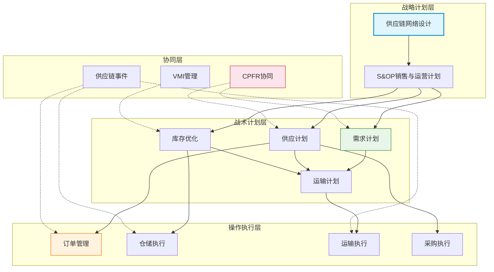
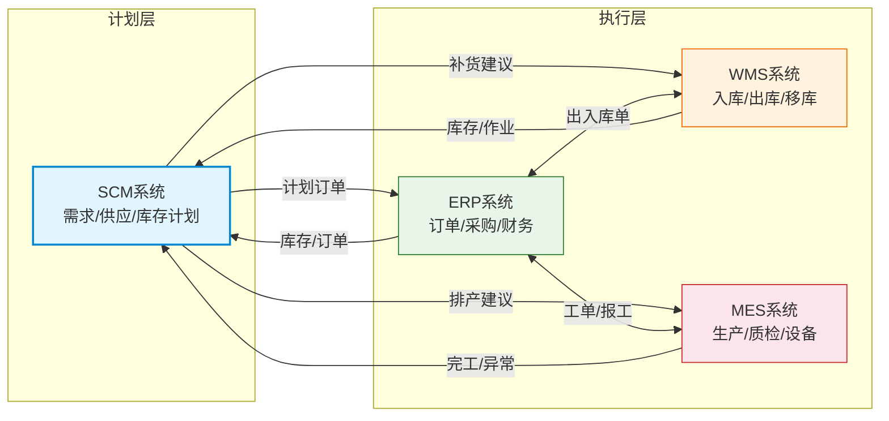
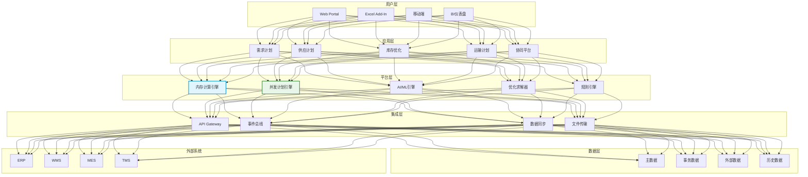

# SCM整体架构

## 功能架构

SCM系统的功能架构覆盖了从需求感知到供应执行的全链路，核心功能模块如下：

| 功能模块 | 核心职责 | 关键能力 |
|----------|----------|----------|
| 需求计划 | 需求预测与需求管理 | 统计预测、ML预测、协同预测、预测融合 |
| 供应计划 | 供应匹配与MRP运算 | MRP/DRP、ATP/CTP、供应分配、替代方案 |
| 库存优化 | 安全库存与库存策略 | 动态安全库存、多级库存优化、库存仿真 |
| 运输计划 | 运输调度与路线优化 | 装载优化、路线规划、承运商选择、运费管理 |
| 供应链协同 | 跨企业信息共享 | 供应商门户、CPFR、VMI、供应链可视化 |

## 技术架构

现代SCM系统的技术架构需要支撑海量数据的实时计算和复杂优化算法的运行。

### 内存计算

供应链计划涉及大量的数据计算，传统基于磁盘的计算方式无法满足实时性要求。内存计算技术将数据加载到内存中，计算速度可提升数百倍：

- **SAP HANA**：内存数据库，支持列式存储和并行计算，SAP IBP的底层引擎
- **Kinaxis并发引擎**：专利的内存计算架构，支持数千并发用户的实时what-if模拟
- **内存数据网格**：如Redis、Hazelcast，用于缓存和实时数据共享

### 并发计划引擎

传统SCM系统采用顺序计算模式（先算需求→再算供应→再算运输），导致计划结果相互矛盾。并发计划引擎在内存中同时计算所有约束条件，确保计划方案的全局一致性：

- **数据变更即时传播**：任何一个输入数据变化，立即传播到所有相关的计算节点
- **约束同时满足**：所有约束条件在同一个计算周期内同时检查和满足
- **实时What-If**：用户修改任何一个参数，系统实时计算出全局影响

### AI与机器学习

AI在SCM系统中的应用日益深入：

| 应用领域 | AI技术 | 价值 |
|----------|--------|------|
| 需求预测 | LSTM、Prophet、随机森林 | 提高预测准确率10-30% |
| 异常检测 | 自编码器、孤立森林 | 识别需求异常和供应风险 |
| 优化决策 | 强化学习、遗传算法 | 供应链网络优化、运输路线优化 |
| 自然语言处理 | NLP | 合同解析、舆情监测、供应商评估 |

## 与ERP集成

SCM与ERP的集成是系统架构设计的关键环节。SCM负责计划和优化，ERP负责执行和记录，两者形成计划-执行闭环。

### 集成数据流

| 集成方向 | 数据内容 | 频率 |
|----------|----------|------|
| ERP→SCM | 销售订单、库存快照、BOM、工艺路线、采购信息 | 实时/近实时 |
| SCM→ERP | 计划生产订单、计划采购订单、调拨建议 | 日/周批 |
| ERP→SCM | 实际执行反馈（完工、入库、出库） | 实时 |
| SCM→ERP | 交期承诺（ATP/CTP结果） | 实时查询 |

### 集成方式

- **API集成**：RESTful API或OData服务，适用于实时数据交换
- **中间件集成**：通过SAP PI/PO、MuleSoft等中间件，适用于复杂映射和路由
- **文件集成**：IDoc、CSV文件传输，适用于批量数据交换
- **事件驱动集成**：基于Kafka/RabbitMQ的事件驱动架构，适用于实时场景

## 与WMS/MES集成

### SCM与WMS的集成点

- **库存快照**：WMS提供实时库存数据给SCM用于计划计算
- **补货执行**：SCM生成补货建议，WMS执行补货作业
- **库存优化**：SCM根据需求预测动态调整仓库安全库存参数

### SCM与MES的集成点

- **产能反馈**：MES提供实际产能数据（设备状态、人员出勤）给SCM
- **生产计划**：SCM生成生产计划建议，通过ERP转化为MES可执行的工单
- **异常响应**：MES上报生产异常，触发SCM重排计划

## 部署模式

| 部署模式 | 特点 | 适用场景 |
|----------|------|----------|
| SaaS | 多租户、按需付费、快速上线 | 中型企业、无定制需求 |
| 混合部署 | 计划模块SaaS+执行模块本地 | 大型企业、数据安全要求高 |
| 私有化部署 | 完全自主控制、深度定制 | 超大型企业、特殊合规要求 |

SaaS部署已成为主流趋势，SAP IBP、Kinaxis等主流产品均已转向SaaS模式。混合部署适合对数据敏感度高但又需要利用云算力的企业。

## 架构图

## 数字化供应链平台演进趋势

供应链技术正在经历从传统SCM向数字化供应链平台的演进：

| 阶段 | 特征 | 代表技术 |
|------|------|----------|
| 信息化 | 单点系统、电子表格替代 | ERP、WMS、TMS |
| 集成化 | 系统互联、流程集成 | SCM、B2B集成 |
| 智能化 | AI驱动、自动决策 | ML预测、智能优化 |
| 平台化 | 生态协同、网络效应 | 供应链控制塔、数字孪生 |

**供应链控制塔**（Supply Chain Control Tower）是未来的核心形态，它整合了实时可视化、异常预警、智能决策和自动化执行四大能力，实现供应链的端到端管控。关键趋势包括：

- **数字孪生**：构建供应链的虚拟镜像，支持模拟和优化
- **区块链溯源**：实现供应链全程可追溯
- **IoT+5G**：实时感知物流状态和环境条件
- **低代码平台**：业务人员自主配置供应链规则和流程
