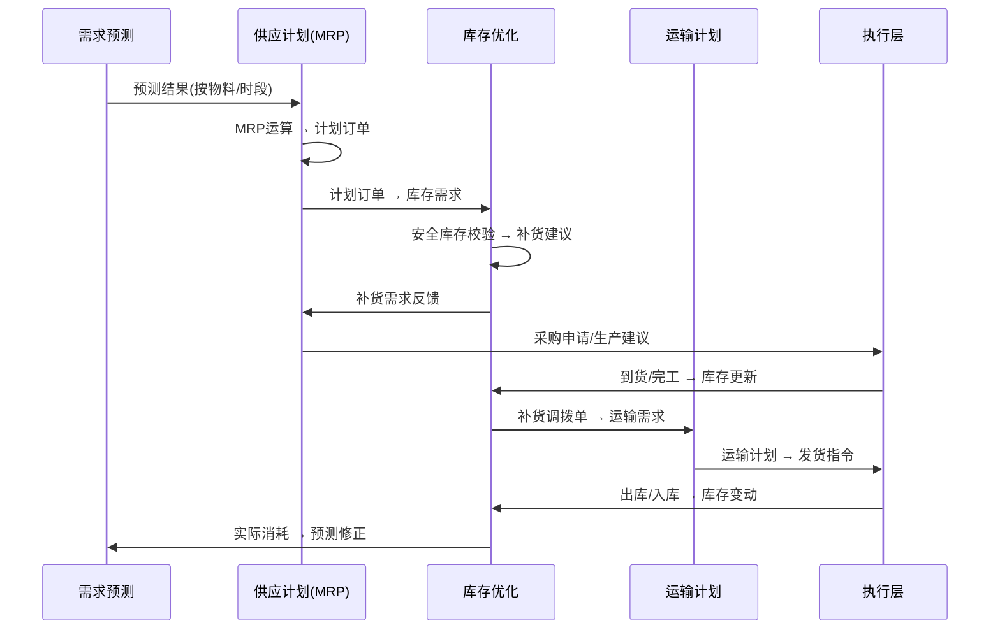
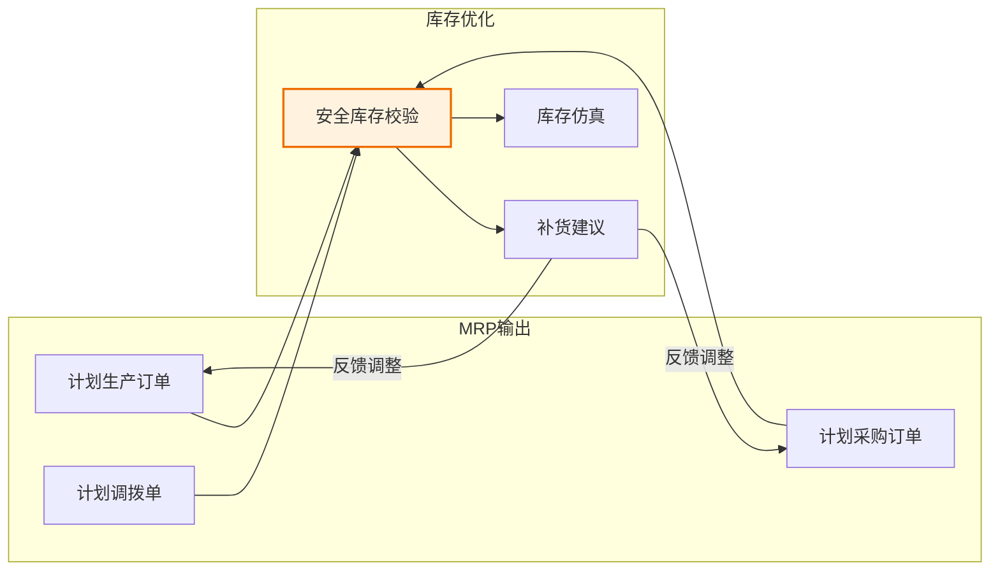
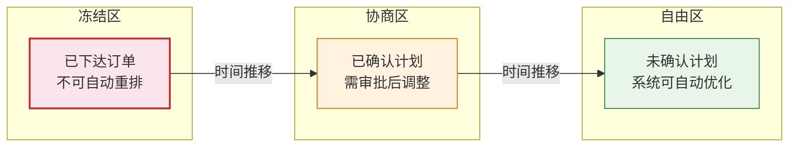
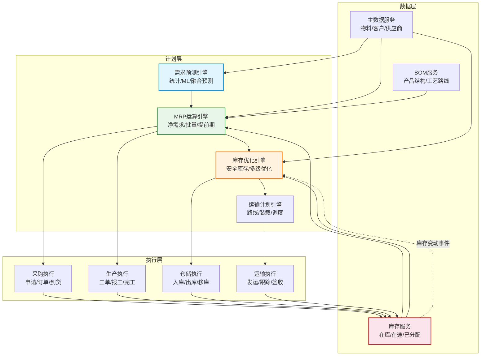

# SCM模块联动与数据流

## 模块联动全景

SCM系统的核心价值在于各模块之间的联动与数据贯通。从需求预测到供应计划、从库存优化到运输计划，每个模块的输出都是下游模块的输入，形成级联的数据流驱动整个供应链的运转。



## 级联数据流详解

### 需求预测 → 供应计划

需求预测是整个SCM数据流的起点。预测结果按物料+时段维度输出，驱动MRP运算：

| 数据项 | 来源 | 目标 | 格式 |
|--------|------|------|------|
| 预测量 | 需求预测 | MRP输入 | item_id + period + qty |
| 预测置信度 | 需求预测 | 供应策略选择 | item_id + period + confidence |
| 预测版本号 | 需求预测 | 版本追踪 | version + timestamp |

预测结果驱动MRP的关键逻辑：

```python
# 预测结果如何驱动MRP
def forecast_to_mrp_input(forecast_result):
    mrp_demand = []
    for item in forecast_result.items:
        for period in forecast_result.periods:
            demand = {
                'item_id': item.id,
                'period': period.date,
                'gross_qty': forecast_result.get_qty(item, period),
                'demand_type': 'FORECAST',
                'confidence': forecast_result.get_confidence(item, period),
                'version': forecast_result.version
            }
            # 低置信度需求标记为可选供应
            if demand['confidence'] < 0.6:
                demand['demand_type'] = 'FORECAST_OPTIONAL'
            mrp_demand.append(demand)
    return mrp_demand
```

### 供应计划 → 库存优化

MRP运算生成的计划订单是库存优化的核心输入：



计划订单如何驱动库存更新（核心数据流）：

1. MRP生成计划采购订单 → 采购执行 → 采购到货 → WMS入库 → 库存增加
2. MRP生成计划生产订单 → 生产执行 → 完工入库 → WMS入库 → 库存增加
3. 销售出库 → WMS出库 → 库存减少 → 库存水位变动 → 触发补货检查

### 库存水位 → 补货建议

库存水位的实时监控是触发补货的核心机制：

```python
# 库存水位触发补货逻辑
class InventoryMonitor:
    def check_replenishment(self, item_id, warehouse_id):
        current_stock = self.get_available_stock(item_id, warehouse_id)
        safety_stock = self.get_safety_stock(item_id, warehouse_id)
        pending_receipt = self.get_pending_receipt(item_id, warehouse_id)
        pending_demand = self.get_pending_demand(item_id, warehouse_id)

        # 预计可用库存 = 当前库存 + 在途 - 已分配需求
        projected_stock = current_stock + pending_receipt - pending_demand

        if projected_stock < safety_stock:
            shortage = safety_stock - projected_stock
            return ReplenishmentSuggestion(
                item_id=item_id,
                warehouse_id=warehouse_id,
                suggested_qty=self.apply_lot_rule(item_id, shortage),
                trigger_type='SAFETY_STOCK_BREACH',
                current_stock=current_stock,
                projected_stock=projected_stock,
                safety_stock=safety_stock
            )
        return None
```

## 模块接口矩阵

| 源模块 | 目标模块 | 接口 | 传输数据 | 触发条件 |
|--------|----------|------|----------|----------|
| 需求预测 | 供应计划 | POST /mrp/demand | 预测量+时段+物料 | 预测版本发布 |
| 供应计划 | 采购执行 | POST /purchase/requisition | 采购申请单 | MRP运算完成 |
| 供应计划 | 生产执行 | POST /production/plan | 计划生产订单 | MRP运算完成 |
| 采购执行 | 库存优化 | EVENT:goods_receipt | 到货数量+批次 | 采购到货入库 |
| 生产执行 | 库存优化 | EVENT:production_completion | 完工数量+批次 | 生产完工入库 |
| 库存优化 | 供应计划 | POST /mrp/replenish | 补货建议 | 库存低于安全库存 |
| 库存优化 | 运输计划 | POST /transport/demand | 调拨运输需求 | 补货建议生成 |
| 运输计划 | 仓储执行 | POST /wms/shipment | 发货指令 | 运输计划确认 |

## 计划冻结与滚动机制

### 计划时界（Planning Time Fence）

计划时界将计划周期划分为冻结区、协商区和自由区，确保近期的执行计划不会被随意打乱：



| 区域 | 时间范围 | 变更策略 | 系统行为 |
|------|----------|----------|----------|
| 冻结区 | 当前~1周 | 仅人工可改 | 不参与MRP重算 |
| 协商区 | 1周~4周 | 需审批流程 | 系统提示冲突 |
| 自由区 | 4周以后 | 自由调整 | 系统自动优化 |

### 滚动计划机制

```python
# 滚动计划核心逻辑
class RollingPlan:
    def run_weekly_cycle(self):
        # 1. 关闭当前周期，将确认的计划订单转为执行订单
        self.finalize_current_period()

        # 2. 将协商区计划推进为冻结区
        self.advance_negotiated_to_frozen()

        # 3. 将自由区计划推进为协商区
        self.advance_open_to_negotiated()

        # 4. 重新运行MRP，生成新的自由区计划
        mrp_result = self.mrp_engine.run(
            start_date=self.next_period_start,
            horizon=self.planning_horizon,
            frozen_orders=self.get_frozen_orders()
        )

        # 5. 版本管理
        self.create_plan_version(mrp_result)

        return mrp_result
```

## 开发者视角的模块依赖图



### 关键依赖关系说明

| 依赖 | 说明 | 失败影响 |
|------|------|----------|
| 需求预测 → MRP | MRP依赖预测结果作为独立需求输入 | MRP无法生成完整的计划订单 |
| BOM → MRP | MRP需要BOM进行需求展开 | 无法计算子件需求 |
| 库存 → MRP | MRP需要库存数据计算净需求 | 净需求计算偏差 |
| 库存 → 库存优化 | 库存优化依赖实时库存水位 | 补货建议不准确 |
| MRP → 采购/生产 | 执行层依赖MRP的计划订单 | 无计划驱动执行 |

## 开发者实战Tips

1. **事件驱动优于轮询**：库存变动通过事件通知库存优化模块，而非定时轮询数据库，减少延迟和数据库压力
2. **版本控制**：每次MRP运算生成版本号，支持计划回溯和A/B对比
3. **幂等设计**：模块间接口必须幂等，网络重试不应产生重复计划订单
4. **数据一致性**：使用分布式事务（Saga模式）确保跨模块数据一致性，如MRP生成计划订单 + 库存预留需原子操作
5. **缓存策略**：BOM和物料主数据变化频率低，可缓存到内存（TTL 5分钟），库存数据实时性要求高，不缓存或极短TTL
6. **解耦原则**：计划层与执行层通过消息队列解耦，计划层不依赖执行层的同步响应
