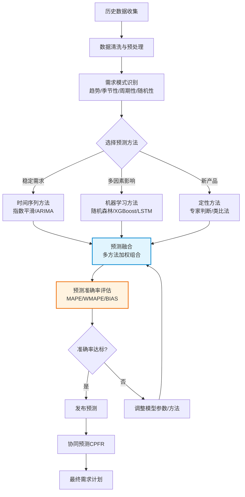

# 需求预测与计划

## 需求预测方法概述

需求预测是供应链管理的起点，预测的准确性直接影响后续所有计划的品质。需求预测方法可分为三大类：

| 类别 | 方法 | 优势 | 局限 |
|------|------|------|------|
| 定性方法 | 德尔菲法、市场调研、专家判断 | 适用于新产品、无历史数据 | 主观性强、难以量化 |
| 定量方法 | 时间序列、回归分析、因果模型 | 基于数据、可复现 | 依赖历史数据、假设趋势延续 |
| 机器学习 | 随机森林、LSTM、XGBoost | 自动捕捉复杂模式、非线性关系 | 需要大量数据、黑盒解释性差 |

现代SCM系统通常采用**预测融合**（Forecast Ensembling）策略，将多种预测方法的结果进行加权组合，取长补短，提升整体预测准确率。

## 时间序列分析

时间序列分析是最经典的定量预测方法，假设需求的未来模式是历史模式的延续。

### 移动平均法

将最近N期的实际需求取平均值作为下期预测值：

$$F_{t+1} = \frac{1}{N} \sum_{i=0}^{N-1} D_{t-i}$$

- 简单移动平均（SMA）：等权平均
- 加权移动平均（WMA）：近期数据赋予更高权重
- N值选择：N越大越平滑但滞后越严重，N越小越敏感但噪声越多

### 指数平滑法

指数平滑法赋予近期数据更高权重，远期数据权重呈指数衰减：

**简单指数平滑（SES）**——适用于无趋势无季节性的平稳序列：

$$F_{t+1} = \alpha D_t + (1-\alpha) F_t$$

**Holt双参数法**——适用于有趋势的序列：

$$L_t = \alpha D_t + (1-\alpha)(L_{t-1} + T_{t-1})$$
$$T_t = \beta(L_t - L_{t-1}) + (1-\beta)T_{t-1}$$
$$F_{t+m} = L_t + m \times T_t$$

**Holt-Winters三参数法**——适用于有趋势和季节性的序列：

$$L_t = \alpha \frac{D_t}{S_{t-p}} + (1-\alpha)(L_{t-1} + T_{t-1})$$
$$T_t = \beta(L_t - L_{t-1}) + (1-\beta)T_{t-1}$$
$$S_t = \gamma \frac{D_t}{L_t} + (1-\gamma)S_{t-p}$$

其中p为季节周期长度。

### ARIMA模型

ARIMA（AutoRegressive Integrated Moving Average）是时间序列预测的经典模型：

- **AR（自回归）**：当前值与历史值的线性关系
- **I（差分）**：使非平稳序列变为平稳
- **MA（移动平均）**：当前值与历史误差的关系

ARIMA(p,d,q)的参数选择：

| 参数 | 含义 | 选择方法 |
|------|------|----------|
| p | 自回归阶数 | PACF截尾 |
| d | 差分阶数 | ADF检验确定平稳性 |
| q | 移动平均阶数 | ACF截尾 |

SARIMA（季节性ARIMA）在ARIMA基础上增加了季节性参数(P,D,Q)s，能够处理季节性时间序列。

## 机器学习预测

### 随机森林

随机森林通过集成多棵决策树的预测结果，具有较强的泛化能力和抗过拟合能力：

- 优势：可处理高维特征、自动捕捉非线性关系、对异常值鲁棒
- 特征工程：时间特征（月份、周几、节假日）、滞后特征（前1/7/28天需求）、滚动统计特征
- 适用于：多SKU、多地点的批量预测

### LSTM长短期记忆网络

LSTM是专门处理序列数据的深度学习模型，通过门控机制记忆长期依赖关系：

- 遗忘门：决定遗忘多少历史信息
- 输入门：决定保留多少新信息
- 输出门：决定输出多少信息
- 优势：自动学习时序模式、捕捉长期依赖
- 适用于：复杂季节性、多因素影响的预测场景

### XGBoost/LightGBM

梯度提升树模型在需求预测竞赛中表现优异：

- XGBoost：正则化梯度提升，适合中小规模数据
- LightGBM：直方图加速，适合大规模高维数据
- 特征重要性分析可解释各因素对需求的贡献度

### 方法对比

| 方法 | 预测精度 | 训练速度 | 可解释性 | 数据量要求 | 适用场景 |
|------|----------|----------|----------|-----------|----------|
| 移动平均 | 低 | 极快 | 高 | 少 | 稳定需求 |
| 指数平滑 | 中 | 极快 | 高 | 少 | 趋势/季节性 |
| ARIMA | 中高 | 快 | 中 | 中 | 平稳/可差分 |
| 随机森林 | 高 | 中 | 中 | 中 | 多特征 |
| LSTM | 高 | 慢 | 低 | 大 | 复杂模式 |
| XGBoost | 高 | 快 | 中 | 中 | 竞赛/批量 |

## 协同预测CPFR

CPFR（Collaborative Planning, Forecasting and Replenishment）是一种跨企业协同预测方法，强调供应链上下游之间的信息共享和联合计划。

CPFR的四个核心步骤：

1. **战略与计划**：双方达成协作协议，确定协同目标、指标和规则
2. **需求与供应管理**：联合进行需求预测和供应计划，识别差异并协商
3. **执行**：根据协同计划生成订单、生产、发货
4. **分析**：评估协同效果，识别改善机会，优化协作流程

CPFR的关键成功因素：

- **信任与透明**：双方需愿意共享真实的需求和供应信息
- **技术支撑**：需要统一的协同平台实现数据共享和流程集成
- **高层支持**：组织变革需要高层管理者的承诺和推动
- **异常管理**：建立高效的异常识别和升级机制

## 预测准确率评估

### 评估指标

| 指标 | 公式 | 特点 |
|------|------|------|
| MAPE | $\frac{1}{n}\sum\frac{|D_t - F_t|}{D_t} \times 100\%$ | 百分比误差，直观但低需求时失真 |
| WMAPE | $\frac{\sum|D_t - F_t|}{\sum D_t} \times 100\%$ | 加权百分比，不受低需求影响 |
| BIAS | $\frac{1}{n}\sum(D_t - F_t)$ | 衡量系统性高估或低估 |
| RMSE | $\sqrt{\frac{1}{n}\sum(D_t - F_t)^2}$ | 对大误差敏感 |

### 预测颗粒度

预测的颗粒度决定了预测的难度和实用性：

| 维度 | 粗颗粒度 | 细颗粒度 |
|------|----------|----------|
| 时间 | 月度 | 周度→日度 |
| 产品 | 产品族→产品组 | SKU |
| 地点 | 区域→国家 | 仓库→门店 |

**颗粒度越细，预测越困难**，因为细颗粒度的数据噪声更大、随机性更强。实际应用中常采用"自上而下"或"自下而上"的预测策略：

- **自上而下（Top-Down）**：先预测总量，再按比例拆分到SKU/地点
- **自下而上（Bottom-Up）**：先预测各SKU/地点，再汇总为总量
- **中间向外（Middle-Out）**：先预测产品组，再上下拆分和汇总

## 预测流程图

## 真实案例：SAP IBP需求预测功能

SAP IBP（Integrated Business Planning）的需求计划模块提供了完整的需求预测能力：

### 核心功能

- **统计预测引擎**：内置多种时间序列算法（Holt-Winters、ARIMA、Croston等），自动选择最优算法
- **机器学习预测**：集成SAP Predictive Analytics，支持随机森林、LSTM等ML模型
- **预测融合**：支持将统计预测、ML预测和专家调整进行加权融合
- **协同预测**：通过IBP Excel Add-In实现多方协同编辑预测数据
- **what-if模拟**：模拟促销、新品上市等场景对需求的影响

### 实施要点

1. **数据准备**：清洗历史需求数据，处理异常值和缺失值
2. **预测层次设计**：根据业务需求确定预测的时间、产品、地点颗粒度
3. **算法配置**：为不同需求模式（稳定、趋势、季节性、间歇性）配置合适的算法
4. **异常管理**：设置偏差阈值，自动识别异常预测并触发人工审核
5. **持续优化**：定期评估预测准确率，调整算法参数和权重
