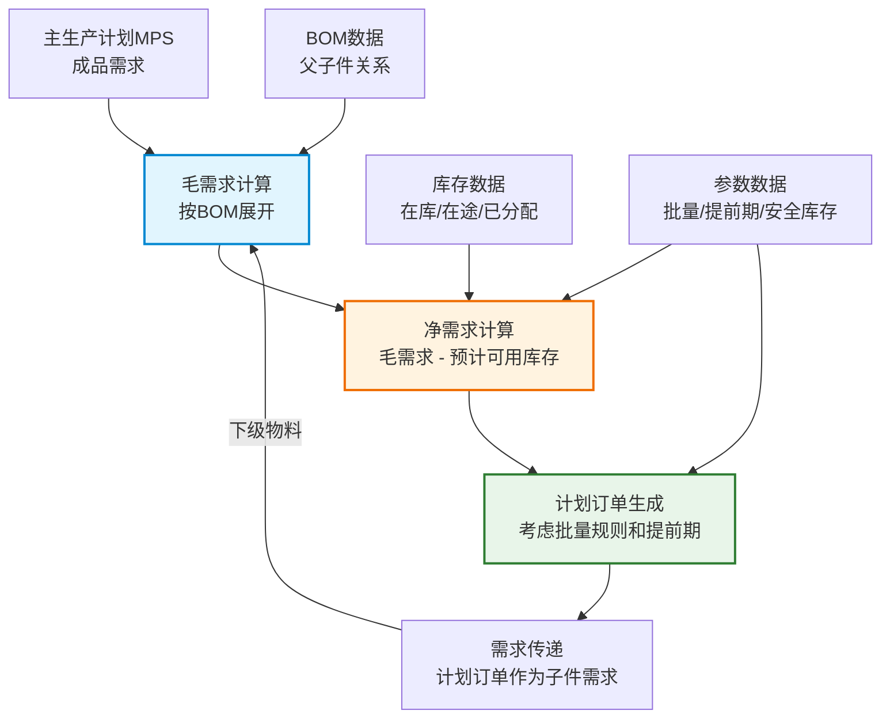
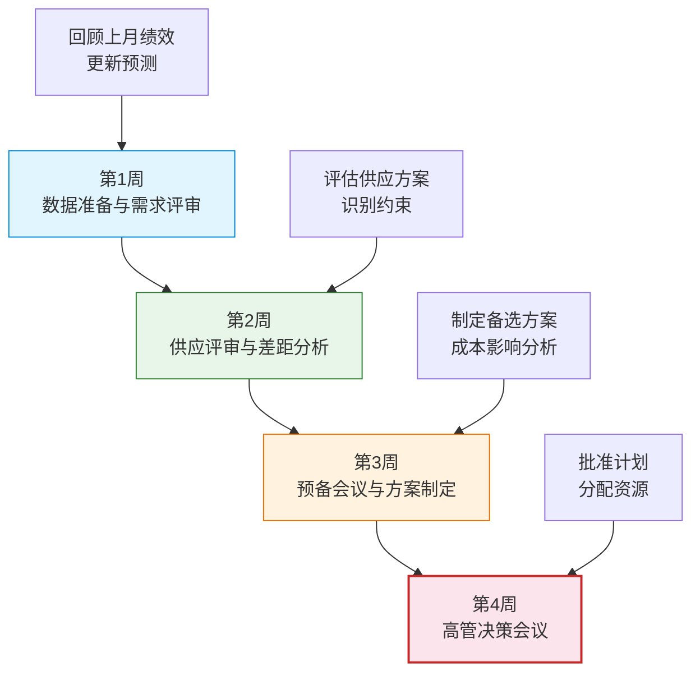
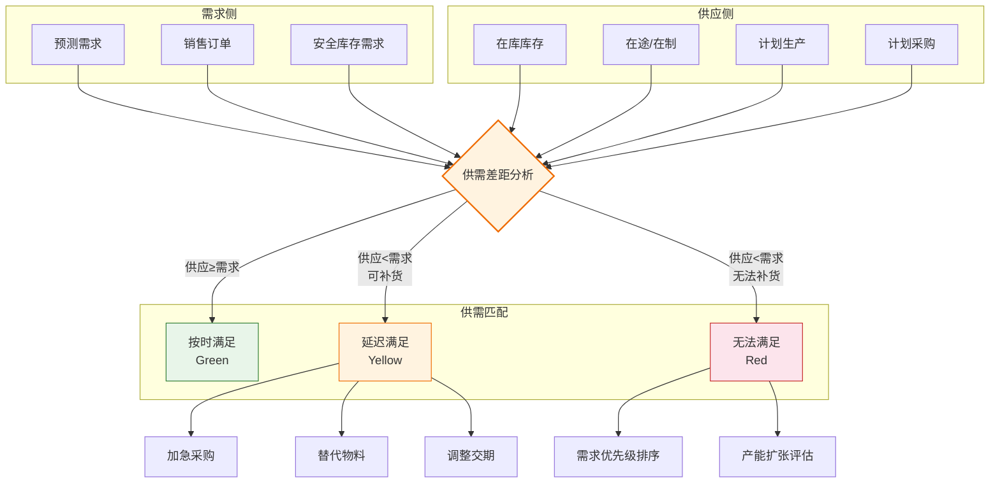

# 供应计划与MRP

## MRP运算逻辑

MRP（Material Requirements Planning，物料需求计划）是供应计划的核心算法，它根据需求、BOM和库存数据，计算出各层级物料的计划订单。

### MRP运算流程

MRP的核心逻辑可以概括为三步：**毛需求→净需求→计划订单**



### 毛需求计算

毛需求（Gross Requirement）是在不考虑库存的情况下，某物料在各时段的总需求量：

$$GR_{t} = SR_{t} + \sum_{i} Q_{parent,i,t} \times BOM_{i}$$

其中：
- GR_t = t时段的毛需求
- SR_t = t时段的独立需求（销售订单、预测等）
- Q_parent,i,t = i父件在t时段的计划订单量
- BOM_i = i父件对该子件的单位用量

### 净需求计算

净需求（Net Requirement）是在考虑现有库存和预期入库后的实际需求量：

$$NR_{t} = GR_{t} - PAB_{t-1} - SCH_{t} + SS$$

其中：
- NR_t = t时段的净需求
- PAB_{t-1} = 上一时段末的预计可用库存
- SCH_t = t时段的预期入库（在途订单、已下达生产订单）
- SS = 安全库存

### 计划订单生成

计划订单（Planned Order）由净需求根据批量规则和提前期生成：

| 批量规则 | 说明 | 计算方式 |
|----------|------|----------|
| 直接批量（Lot-for-Lot） | 按净需求量直接下单 | 订单量 = 净需求量 |
| 固定批量（Fixed Lot Size） | 每次下单固定数量 | 订单量 = ceil(NR/FLS) × FLS |
| 最小批量（Minimum Lot Size） | 订单量不低于最小值 | 订单量 = max(NR, MLS) |
| 周期批量（Period Order Quantity） | 汇总N个时段需求一起下单 | 订单量 = ΣNR(t~t+N) |
| 经济批量（EOQ） | 使总成本最小的批量 | 订单量 = √(2DS/H) |

计划订单的下达日期 = 需求日期 - 提前期

## BOM展开与需求传递

BOM（Bill of Materials）展开是MRP运算的关键步骤，它将成品的需求逐层分解为原材料和零部件的需求。

### BOM展开示例

假设产品A的BOM结构如下：

```
产品A
├── 部件B × 2
│   ├── 零件D × 1
│   └── 零件E × 3
└── 部件C × 1
    ├── 零件D × 2
    └── 零件F × 1
```

如果产品A在第8周需求100个，则：

| 物料 | 需求量计算 | 净需求 |
|------|-----------|--------|
| 部件B | 100 × 2 = 200 | 200 - 现有库存 |
| 部件C | 100 × 1 = 100 | 100 - 现有库存 |
| 零件D | 200 × 1 + 100 × 2 = 400 | 400 - 现有库存 |
| 零件E | 200 × 3 = 600 | 600 - 现有库存 |
| 零件F | 100 × 1 = 100 | 100 - 现有库存 |

### 低层码（Low-Level Code）

BOM展开必须遵循低层码优先原则。低层码表示某物料在所有BOM中出现的最低层级，确保需求不会遗漏或重复计算。MRP按低层码从小到大逐层计算，每一层计算完成后再进入下一层。

## MRP参数

MRP运算的准确性高度依赖于参数设置的合理性：

| 参数 | 说明 | 设置原则 |
|------|------|----------|
| 安全库存 | 为应对不确定性保留的缓冲库存 | 基于服务水平目标和服务需求波动性计算 |
| 批量规则 | 决定每次订货的数量 | 平衡库存持有成本和订货成本 |
| 提前期 | 从下单到到货的时间 | 区分采购提前期、生产提前期、运输提前期 |
| 损耗率 | 生产过程中的物料损耗 | 考虑废品率后增加需求量 |
| 计划时界 | MRP计划的时间范围 | 至少覆盖最长累计提前期 |
| 计划频次 | MRP运算的频率 | 日运行（推荐）到周运行 |

## DRP分销需求计划

DRP（Distribution Requirements Planning）是MRP在分销领域的扩展，它计算各分销节点的补货需求。

### DRP与MRP的区别

| 维度 | MRP | DRP |
|------|-----|-----|
| 关注点 | 制造端的物料需求 | 分销端的补货需求 |
| 需求来源 | MPS/销售订单 | 各节点库存+预测需求 |
| BOM | 制造BOM | 分销网络结构 |
| 提前期 | 生产/采购提前期 | 运输/补货提前期 |
| 批量规则 | 制造批量 | 运输批量/整托/整车 |

### DRP运算逻辑

1. 从终端节点（零售/门店）开始，计算各节点的净需求
2. 根据补货策略（Min-Max、ROP、周期补货）生成补货建议
3. 汇总各节点的补货需求，形成上级供应节点的需求
4. 逐级向上汇总，直到最高供应节点

## 供应计划约束

实际供应计划必须考虑多种约束条件：

### 产能约束

- **机器产能**：可用机器工时、设备维护计划
- **人员产能**：可用人员工时、技能矩阵
- **模具约束**：模具数量限制、模具共享
- **产能与MRP的矛盾**：传统MRP假设无限产能，SCM引入有限产能约束

### 物料约束

- **长周期物料**：电子元器件、定制件等提前期超长的物料
- **短缺物料**：供应不足的物料，需进行分配
- **替代物料**：主物料不可用时的替代方案

### 运输约束

- **运输能力**：整车/零担限制
- **运输窗口**：发货时间、到货时间约束
- **混装规则**：不同产品是否可以混装

## S&OP销售与运营计划流程

S&OP（Sales and Operations Planning）是连接需求计划和供应计划的桥梁，它通过跨部门协同达成供需平衡的共识计划。

### S&OP月度循环



### S&OP的关键产出

| 产出 | 说明 | 时间范围 |
|------|------|----------|
| 一致的需求计划 | 销售和市场认可的需求预测 | 12-18个月 |
| 一致的供应计划 | 供应和运营认可的供应方案 | 12-18个月 |
| 产品族汇总计划 | 按产品族汇总的产销计划 | 12-18个月 |
| 财务一致性 | 计划与财务预算的一致性 | 年度/季度 |

## 供需平衡分析



## 真实案例：Kinaxis并发计划引擎Quick Response

Kinaxis RapidResponse的核心技术是其专利的并发计划引擎，它彻底改变了传统SCM系统顺序计算的模式。

### 并发计划的核心原理

传统MRP采用顺序计算：先算需求→再算供应→再检查约束，每一步基于上一步的结果。如果中间任一条件变化，整个计算链需要重新运行。

Kinaxis的并发计划引擎采用内存中的数据网格架构：

- **单一数据源**：所有计划数据存储在内存中的统一数据模型
- **即时传播**：任何数据变更（需求变化、供应中断、产能调整）立即传播到所有相关计算节点
- **并发计算**：所有约束条件在同一个计算周期内同时检查和满足
- **实时响应**：用户修改参数后，毫秒级返回全局影响分析

### Quick Response场景

一家电子制造企业收到客户的急单请求，需要评估是否可以接受：

1. 销售在系统中输入急单需求
2. 系统立即计算：该需求对现有订单的影响、所需物料的可用性、产能是否足够
3. 系统生成多个方案：正常排产+延迟部分订单、加班生产、替代物料
4. 销售选择方案后，系统自动调整所有受影响的计划
5. 整个过程从传统的小时级缩短到秒级

### 实施效果

| 指标 | 传统方式 | Kinaxis方式 |
|------|----------|-------------|
| 计划重算时间 | 4-8小时 | 实时（秒级） |
| What-If模拟 | 隔夜批处理 | 即时响应 |
| 供需匹配可见性 | 月度报表 | 实时仪表盘 |
| 急单响应速度 | 1-2天 | 分钟级 |
| 库存周转率 | 基线 | 提升15-25% |
