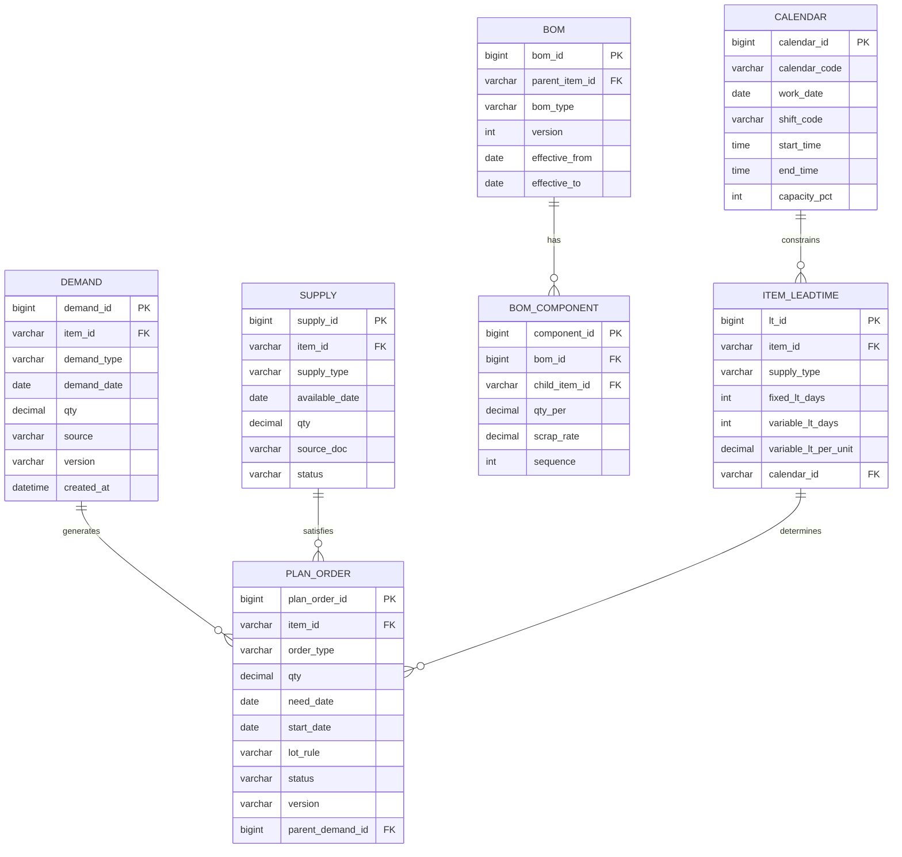

# MRP运算引擎与数据库设计

## 核心表设计

MRP运算引擎依赖六张核心表，覆盖需求、供应、计划订单、BOM、提前期和日历数据。

### ER图



### 表字段详细说明

#### DEMAND 需求表

| 字段 | 类型 | 说明 | 示例 |
|------|------|------|------|
| demand_id | BIGINT PK | 需求ID，自增 | 100001 |
| item_id | VARCHAR(32) | 物料编码 | ITEM-A001 |
| demand_type | VARCHAR(20) | 需求类型：FORECAST/SALES_ORDER/SAFETY_STOCK | FORECAST |
| demand_date | DATE | 需求日期 | 2026-07-15 |
| qty | DECIMAL(18,4) | 需求数量 | 1000.0000 |
| source | VARCHAR(64) | 来源单据号 | FC-2026-007 |
| version | VARCHAR(16) | 计划版本号 | V2026W27 |
| created_at | DATETIME | 创建时间 | 2026-06-06 08:00:00 |

#### PLAN_ORDER 计划订单表

| 字段 | 类型 | 说明 | 示例 |
|------|------|------|------|
| plan_order_id | BIGINT PK | 计划订单ID | 200001 |
| item_id | VARCHAR(32) | 物料编码 | ITEM-B002 |
| order_type | VARCHAR(20) | 类型：PURCHASE/PRODUCTION/TRANSFER | PURCHASE |
| qty | DECIMAL(18,4) | 计划数量 | 500.0000 |
| need_date | DATE | 需求日期（交付日期） | 2026-07-10 |
| start_date | DATE | 开始日期（下单/开工日期） | 2026-07-01 |
| lot_rule | VARCHAR(20) | 批量规则 | FIXED_LOT |
| status | VARCHAR(16) | 状态：PLANNED/CONFIRMED/FIRMED/CANCELLED | PLANNED |
| version | VARCHAR(16) | 计划版本号 | V2026W27 |
| parent_demand_id | BIGINT FK | 父需求ID（追溯需求来源） | 100001 |

## MRP运算引擎设计

### BOM递归展开算法

BOM展开使用CTE递归SQL实现多级BOM的逐层展开：

```sql
-- BOM递归展开CTE
WITH RECURSIVE bom_tree AS (
    -- 基础层：顶层成品需求
    SELECT
        d.item_id AS top_item_id,
        d.item_id AS parent_item_id,
        b.child_item_id,
        bc.qty_per,
        bc.scrap_rate,
        1 AS bom_level,
        CAST(d.item_id AS VARCHAR(1000)) AS path
    FROM demand d
    JOIN bom b ON b.parent_item_id = d.item_id
    JOIN bom_component bc ON bc.bom_id = b.bom_id
    WHERE b.effective_from <= CURRENT_DATE
      AND b.effective_to >= CURRENT_DATE

    UNION ALL

    -- 递归层：逐层展开子件
    SELECT
        bt.top_item_id,
        bt.child_item_id AS parent_item_id,
        b.child_item_id,
        bc.qty_per,
        bc.scrap_rate,
        bt.bom_level + 1,
        CAST(bt.path || '->' || bt.child_item_id AS VARCHAR(1000))
    FROM bom_tree bt
    JOIN bom b ON b.parent_item_id = bt.child_item_id
    JOIN bom_component bc ON bc.bom_id = b.bom_id
    WHERE b.effective_from <= CURRENT_DATE
      AND b.effective_to >= CURRENT_DATE
      AND bt.bom_level < 20  -- 防止无限递归
)
SELECT
    top_item_id,
    child_item_id AS item_id,
    bom_level,
    -- 累计用量 = 各层级用量连乘
    -- 需要在应用层计算，SQL递归中聚合较复杂
    path
FROM bom_tree
ORDER BY bom_level, top_item_id, child_item_id;
```

应用层计算累计用量：

```python
def compute_cumulative_qty(bom_tree, top_demand_qty):
    """计算BOM展开后各物料的累计需求量"""
    cumulative = {}

    for node in bom_tree:
        path = node['path']
        item_id = node['child_item_id']
        qty_per = node['qty_per']
        scrap_rate = node['scrap_rate']

        # 考虑损耗率: 实际需求 = 用量 / (1 - 损耗率)
        effective_qty = qty_per / (1 - scrap_rate) if scrap_rate > 0 else qty_per

        # 按路径计算累计用量
        path_parts = path.split('->')
        cumulative_factor = top_demand_qty
        for i in range(len(path_parts) - 1):
            parent = path_parts[i]
            parent_node = find_node(bom_tree, parent, path_parts[:i+1])
            cumulative_factor *= parent_node['qty_per'] / (1 - parent_node.get('scrap_rate', 0))

        cumulative_factor *= effective_qty

        if item_id not in cumulative:
            cumulative[item_id] = 0
        cumulative[item_id] += cumulative_factor

    return cumulative
```

### 需求净计算逻辑

核心公式：**净需求 = 毛需求 - 在库 - 在途 + 安全库存**

```python
class MRPEngine:
    def calculate_net_requirement(self, item_id, period, gross_qty):
        """计算某物料在某时段的净需求"""
        # 获取当前库存
        on_hand = self.inventory_service.get_on_hand(item_id)
        # 获取在途数量（已下达的采购订单/生产订单）
        in_transit = self.supply_service.get_in_transit(item_id, period)
        # 获取已分配数量（已承诺给其他需求的）
        allocated = self.inventory_service.get_allocated(item_id, period)
        # 安全库存
        safety_stock = self.param_service.get_safety_stock(item_id)

        # 预计可用库存 = 在库 - 已分配 + 在途
        projected_available = on_hand - allocated + in_transit

        # 净需求 = 毛需求 - 预计可用库存 + 安全库存
        net_requirement = gross_qty - projected_available + safety_stock

        # 净需求为负表示有盈余，不生成计划订单
        return max(0, net_requirement)
```

### 批量规则实现

```python
class LotRuleEngine:
    def apply_lot_rule(self, item_id, net_requirement):
        """根据批量规则计算计划订单量"""
        rule = self.get_lot_rule(item_id)

        if rule.type == 'LOT_FOR_LOT':
            # 直接批量：按需下单
            return net_requirement

        elif rule.type == 'FIXED_LOT':
            # 固定批量：向上取整到批量的整数倍
            lot_size = rule.fixed_qty
            return math.ceil(net_requirement / lot_size) * lot_size

        elif rule.type == 'MIN_LOT':
            # 最小批量：不低于最小值
            return max(net_requirement, rule.min_qty)

        elif rule.type == 'PERIOD_ORDER':
            # 周期批量：汇总N个时段的需求
            period_qty = rule.period_count
            future_demand = self.get_future_demand(item_id, period_qty)
            total = net_requirement + sum(d.qty for d in future_demand)
            return total

        elif rule.type == 'EOQ':
            # 经济批量
            annual_demand = self.get_annual_demand(item_id)
            order_cost = rule.order_cost
            holding_cost = rule.holding_cost_per_unit
            eoq = math.sqrt(2 * annual_demand * order_cost / holding_cost)
            return max(net_requirement, round(eoq))

        return net_requirement
```

### 时间偏移（提前期倒推）

```python
def calculate_start_date(self, item_id, need_date, qty, supply_type):
    """根据提前期倒推计划订单的开始日期"""
    leadtime = self.leadtime_repo.get(item_id, supply_type)

    # 提前期 = 固定提前期 + 变动提前期
    total_lt_days = leadtime.fixed_lt_days
    if leadtime.variable_lt_per_unit > 0:
        total_lt_days += math.ceil(qty * leadtime.variable_lt_per_unit)

    # 从需求日期往前推，跳过非工作日
    start_date = need_date
    working_days_counted = 0

    while working_days_counted < total_lt_days:
        start_date -= timedelta(days=1)
        if self.calendar.is_working_day(start_date, leadtime.calendar_id):
            working_days_counted += 1

    return start_date
```

## 核心API设计

### 运行MRP

```
POST /api/v1/mrp/run
```

请求体：

```json
{
  "plan_version": "V2026W27",
  "horizon": {
    "start_date": "2026-07-01",
    "end_date": "2026-12-31"
  },
  "scope": {
    "item_ids": ["ITEM-A001", "ITEM-B002"],
    "warehouse_ids": ["WH-SH01"]
  },
  "parameters": {
    "respect_frozen_zone": true,
    "frozen_days": 7,
    "include_forecast": true,
    "forecast_confidence_min": 0.5
  },
  "options": {
    "async": true,
    "callback_url": "https://erp.example.com/mrp/callback"
  }
}
```

响应体：

```json
{
  "task_id": "MRP-20260701-001",
  "status": "RUNNING",
  "estimated_duration_sec": 120,
  "plan_version": "V2026W27"
}
```

### 查看计划订单

```
GET /api/v1/mrp/plan-orders?version=V2026W27&item_id=ITEM-A001&status=PLANNED
```

响应体：

```json
{
  "total": 45,
  "items": [
    {
      "plan_order_id": 200001,
      "item_id": "ITEM-A001",
      "item_name": "轴承组件A",
      "order_type": "PURCHASE",
      "qty": 500.0,
      "need_date": "2026-07-10",
      "start_date": "2026-07-01",
      "lot_rule": "FIXED_LOT",
      "status": "PLANNED",
      "parent_demand_id": 100001,
      "parent_demand_source": "FC-2026-007"
    }
  ]
}
```

### 确认/取消计划订单

```
PUT /api/v1/mrp/plan-orders/{id}/confirm
```

请求体：

```json
{
  "confirmed_qty": 500.0,
  "action": "CONVERT_TO_PURCHASE_REQUISITION",
  "notes": "确认采购，供应商已确认交期"
}
```

响应体：

```json
{
  "plan_order_id": 200001,
  "status": "FIRMED",
  "converted_doc": {
    "doc_type": "PURCHASE_REQUISITION",
    "doc_id": "PR-2026-00892"
  }
}
```

## 性能优化

### 内存计算 vs 数据库运算

| 维度 | 数据库运算 | 内存计算 |
|------|-----------|----------|
| 数据规模<1万物料 | 可接受 | 无显著优势 |
| 数据规模1~10万 | 数小时 | 秒级 |
| 数据规模>10万 | 不可行 | 分钟级 |
| 实现复杂度 | 低（SQL为主） | 高（需内存数据结构） |
| 基础设施 | 数据库服务器 | 内存数据网格/缓存集群 |

**推荐策略**：中小规模用SQL CTE递归+批量运算；大规模场景将数据加载到内存（Redis/Hazelcast），在应用层完成MRP计算后批量写回。

### 关键SQL优化

```sql
-- 为MRP查询创建覆盖索引
CREATE INDEX idx_demand_item_date ON demand(item_id, demand_date) INCLUDE (demand_type, qty, version);
CREATE INDEX idx_supply_item_date ON supply(item_id, available_date) INCLUDE (supply_type, qty, status);
CREATE INDEX idx_bom_parent ON bom(parent_item_id) WHERE effective_from <= CURRENT_DATE AND effective_to >= CURRENT_DATE;
CREATE INDEX idx_plan_order_version ON plan_order(version, item_id, status);
```

## 并发控制（计划版本锁）

MRP运算期间必须锁定计划版本，防止并发修改导致数据不一致：

```python
class PlanVersionLock:
    def acquire_lock(self, version, operator):
        """获取计划版本锁"""
        lock_key = f"mrp:lock:{version}"
        acquired = redis.set(
            lock_key,
            json.dumps({"operator": operator, "acquired_at": datetime.now().isoformat()}),
            nx=True,  # 仅在key不存在时设置
            ex=3600   # 1小时自动过期
        )
        if not acquired:
            holder = json.loads(redis.get(lock_key))
            raise ConcurrentMRPError(
                f"计划版本 {version} 正在被 {holder['operator']} 运算，"
                f"开始于 {holder['acquired_at']}"
            )
        return True

    def release_lock(self, version):
        """释放计划版本锁"""
        redis.delete(f"mrp:lock:{version}")
```

## 开发者实战Tips

1. **低层码预计算**：在MRP运行前预计算所有物料的低层码（Low-Level Code），存储在`item`表的`llc`字段，避免运行时递归计算
2. **增量MRP**：只重算发生变化的需求和BOM，而非全量重算。通过变更标记（dirty flag）追踪受影响的物料
3. **分片并行**：按低层码分层并行计算，同一层级的物料之间无依赖关系，可并行处理
4. **BOM版本管理**：BOM变更时保留历史版本，MRP运行时基于快照版本计算，避免计算过程中BOM变更导致结果不一致
5. **大批量拆分**：单个MRP任务处理超过5万物料时，按物料组拆分为子任务并行执行，最后合并结果
6. **监控告警**：监控MRP运行时长、计划订单数量异常（如单次生成>10万订单需告警）、净需求为负但仍有库存的异常场景
