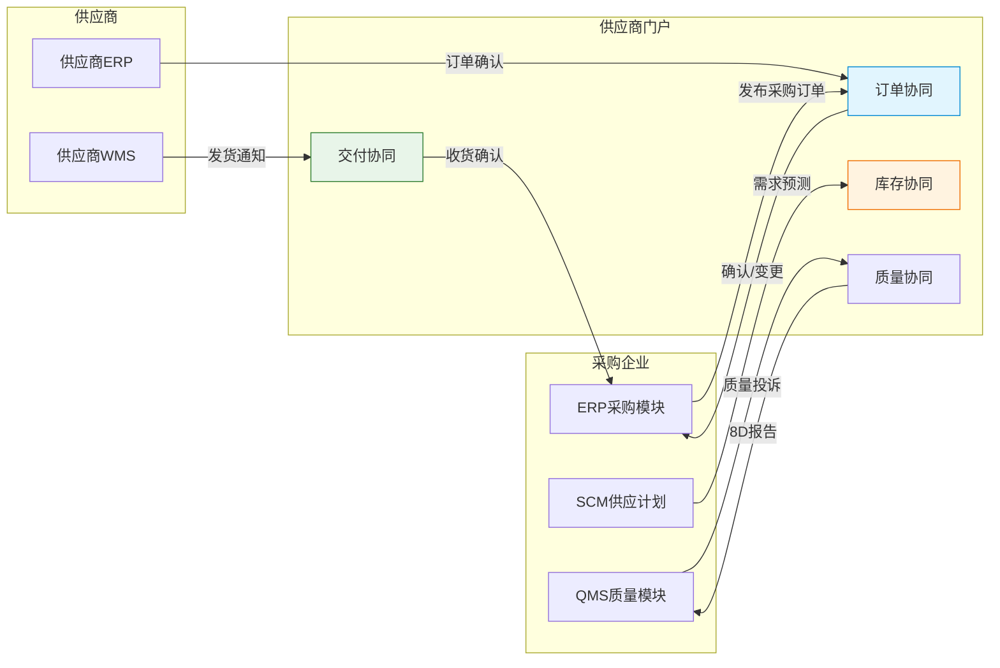
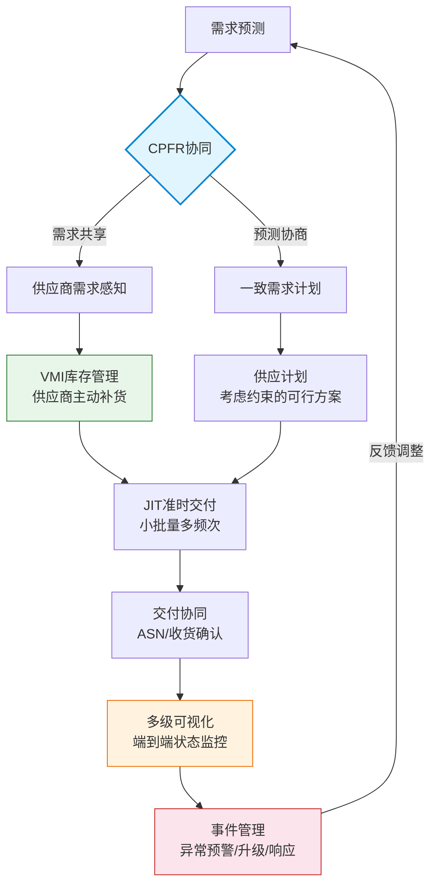

# 供应链协同平台

## CPFR协同预测与补货

CPFR（Collaborative Planning, Forecasting and Replenishment）是供应链协同的核心方法论，它强调供需双方从各自为政转向联合计划。

### CPFR业务流程

CPFR模型将协同过程分为三个层次、九个步骤：

| 层次 | 步骤 | 内容 |
|------|------|------|
| 战略层 | 1.建立协作协议 | 确定协作目标、范围、指标和规则 |
| 战略层 | 2.制定联合业务计划 | 共享战略方向、促销日历、新品计划 |
| 战术层 | 3.生成销售预测 | 基于历史数据和市场信息的初始预测 |
| 战术层 | 4.识别预测异常 | 自动标记超出阈值的预测偏差 |
| 战术层 | 5.协同解决异常 | 双方协商调整异常预测项 |
| 战术层 | 6.生成订单预测 | 基于调整后的预测生成补货建议 |
| 战术层 | 7.识别订单异常 | 标记超出约束条件的订单项 |
| 战术层 | 8.协同解决异常 | 双方协商调整异常订单项 |
| 操作层 | 9.生成补货订单 | 将确认的订单预测转化为正式订单 |

### CPFR系统的技术支撑

- **共享数据平台**：双方在同一平台上维护预测数据，消除信息传递延迟
- **异常检测引擎**：基于规则和阈值自动识别预测和订单中的异常项
- **协作工作流**：定义异常处理的流程、角色和时效
- **权限管控**：区分查看、编辑、审批等不同权限级别

## 供应商协同门户

供应商协同门户是实现供应链上下游信息共享的关键工具，它将传统的邮件、电话、传真沟通转变为系统化的协同流程。

### 核心功能模块

| 模块 | 功能 | 价值 |
|------|------|------|
| 订单协同 | 采购订单发布、确认、变更、取消 | 缩短订单处理周期，减少沟通错误 |
| 交付协同 | 发货通知ASN、收货确认、差异处理 | 提高交付可视化，减少收货纠纷 |
| 库存协同 | 供应商库存查询、VMI库存共享 | 供应商主动备货，降低缺货风险 |
| 质量协同 | 质量投诉、8D报告、纠正措施 | 加速质量问题闭环 |
| 对账协同 | 对账单、发票匹配、付款通知 | 缩短对账周期，减少差异 |

### 门户与ERP的集成

## VMI供应商管理库存

VMI（Vendor Managed Inventory）是一种由供应商管理客户库存的协同模式。供应商根据共享的库存数据和消耗信息，自主决定补货时间和数量。

### VMI运作模型

| 角色 | 职责 | 权限 |
|------|------|------|
| 采购方 | 提供实时库存和消耗数据、定义服务水平目标 | 监控库存水平、评估供应商绩效 |
| 供应商 | 根据协议自主补货、维持目标库存水平 | 决定补货时间和数量、优化运输路线 |

### VMI的关键参数

- **Min/Max库存**：库存下限触发补货，上限控制过度补货
- **补货周期**：固定周期补货或触发式补货
- **服务水平目标**：定义目标满足率
- **结算规则**：基于消耗结算还是基于入库结算

### VMI vs 传统模式对比

| 维度 | 传统模式 | VMI模式 |
|------|----------|---------|
| 库存决策方 | 采购方 | 供应商 |
| 信息共享 | 订单信息 | 实时库存和消耗 |
| 订单频率 | 低（批量订购） | 高（小批量多频次） |
| 牛鞭效应 | 严重 | 显著缓解 |
| 库存所有权 | 入库即转移 | 消耗后转移（寄售） |
| 供应商积极性 | 被动响应 | 主动优化 |

## JIT准时制供应

JIT（Just-In-Time）追求在正确的时间、将正确的物料、以正确的数量送到正确的地点，实现零库存的极致目标。

### JIT的核心理念

- **拉动式生产**：由后工序向前工序拉动，按需供应
- **看板管理**：用看板（Kanban）传递生产/搬运指令
- **均衡化生产**：平抑需求波动，实现稳定节拍
- **持续改善**：不断暴露和消除浪费

### JIT供应的实施条件

| 条件 | 说明 | 缺失的影响 |
|------|------|-----------|
| 稳定的需求 | 需求波动小、可预测 | 频繁调整导致混乱 |
| 可靠的供应商 | 交期准确、质量稳定 | 供应中断停产 |
| 短提前期 | 供应商地理位置近 | 运输延迟风险 |
| 高质量 | 来料合格率接近100% | 停线等待换料 |
| 灵活运输 | 小批量多频次运输能力 | 运输成本过高 |

## 多级供应链可视化

端到端供应链可视化是供应链协同的基础能力，它使企业能够实时掌握从原材料到最终交付的全过程状态。

### 可视化层次

| 层次 | 可视内容 | 价值 |
|------|----------|------|
| 一级可视化 | 直接供应商的订单、库存、交付状态 | 基础供应透明度 |
| 二级可视化 | 供应商的供应商（Tier-2）的生产和供应状态 | 早期风险预警 |
| 多级可视化 | 全链路节点状态，从原材料到终端客户 | 端到端风险识别和响应 |

### 技术实现

- **数据采集**：IoT传感器、API集成、EDI数据交换
- **数据整合**：统一数据模型、事件时间线、关联分析
- **可视化呈现**：地图视图、时间线视图、网络拓扑视图
- **异常预警**：基于规则的阈值告警、AI异常检测

## 供应链事件管理

供应链事件管理（Supply Chain Event Management, SCEM）专注于识别、评估和响应供应链中的异常事件。

### 事件管理流程

1. **事件检测**：监控各节点数据，自动识别偏离预期的事件
2. **影响评估**：评估事件对上下游的影响范围和严重程度
3. **预警通知**：向相关方发送预警通知，提供事件详情和影响分析
4. **响应方案**：推荐或自动执行应对方案
5. **升级机制**：超出处理时效的事件自动升级到更高层级

### 常见异常事件

| 事件类型 | 触发条件 | 响应措施 |
|----------|----------|----------|
| 供应延迟 | 供应商交期超出阈值 | 触发替代供应商、调整生产计划 |
| 需求突增 | 实际需求超出预测阈值 | 评估产能和库存、触发加急供应 |
| 质量异常 | 来料不良率超出阈值 | 暂停该批物料、启动替代方案 |
| 物流中断 | 运输异常或港口拥堵 | 调整运输路线、切换运输方式 |
| 合规风险 | 法规变更或供应商合规异常 | 评估替代供应商、调整采购策略 |

## 协同流程图

## 真实案例：汽车行业JIS顺序供应模式

JIS（Just-In-Sequence，顺序供应）是JIT的进一步升级，供应商不仅按时、按量交付，还要按照客户产线的装配顺序排好物料的交付顺序。

### JIS的应用场景

汽车制造中，每辆车的配置不同（颜色、座椅、发动机等），供应商需要按照主机厂的装配顺序将对应规格的零部件按序送达产线旁。例如：

- 主机厂装配序列：红车→蓝车→白车→黑车
- 座椅供应商的交付序列：红座椅→蓝座椅→白座椅→黑座椅

### JIS的运作流程

1. 主机厂发布滚动的装配序列（通常提前2-4小时）
2. 供应商接收序列，按序拣配或按序生产
3. 供应商按序装载到专用工位器具上
4. 运输到主机厂后直接上线，无需再分拣

### JIS的挑战与应对

| 挑战 | 说明 | 应对措施 |
|------|------|----------|
| 序列变更 | 主机厂临时调整装配顺序 | 实时数据对接，支持序列更新 |
| 质量问题 | 不合格件打乱序列 | 快速替换机制、缓冲位设计 |
| 交付窗口 | 精确到分钟的交付时间窗 | GPS追踪、提前预警 |
| 信息系统 | 实时数据交互需求高 | EDI/API直连，秒级数据同步 |
| 距离约束 | 必须在近距离范围内 | 工厂周边布局、循环取货 |

### 实施效果

某德系豪华车品牌实施JIS供应后：
- 线边库存降低80%（从2天用量降至0.4天）
- 仓库面积节省60%（无需存储和分拣空间）
- 装配错误率降低95%（物料与车型自动匹配）
- 但对供应链的可靠性和信息化水平要求极高
