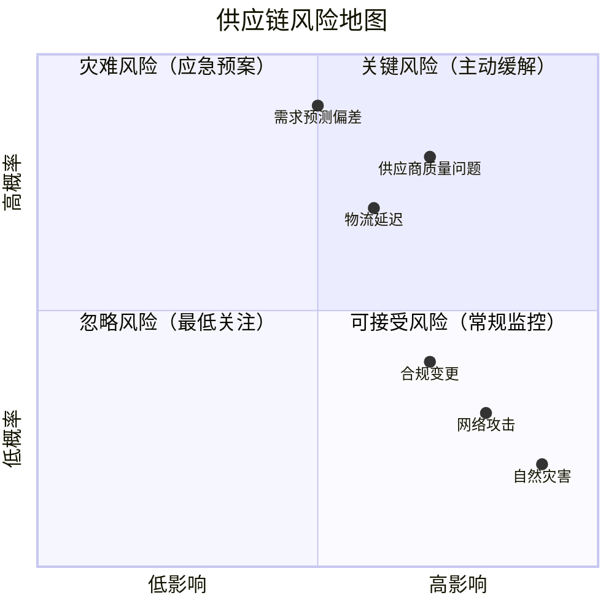
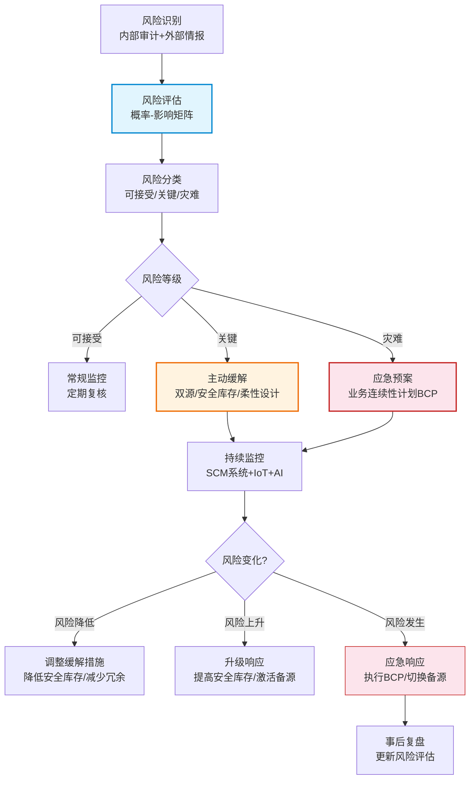

# 供应链风险与韧性

## 供应链风险类型

全球化的供应链面临着日益复杂和多样化的风险，近年来的一系列黑天鹅事件（新冠疫情、苏伊士运河堵塞、芯片短缺）让供应链风险管理成为企业CEO级别的议题。

| 风险类型 | 典型场景 | 影响范围 | 发生频率 |
|----------|----------|----------|----------|
| 供应中断 | 供应商停产、原材料短缺、地缘冲突 | 上游传导，影响全链 | 中 |
| 需求波动 | 突发需求激增或骤减、季节性波动 | 下游传导，影响库存和产能 | 高 |
| 物流延迟 | 港口拥堵、运输中断、天气灾害 | 中间环节，影响交付 | 中高 |
| 合规风险 | 法规变更、贸易壁垒、ESG要求 | 全链，影响准入和成本 | 中 |
| 质量风险 | 批量质量事故、假冒伪劣 | 上游传导，影响品牌和交付 | 低 |
| 网络安全 | 系统攻击、数据泄露 | 全链，影响运营和信任 | 中 |
| 自然灾害 | 地震、洪水、疫情 | 区域性，影响多个节点 | 低 |

## 风险识别与评估

### 概率-影响矩阵

风险评估通常采用概率-影响矩阵，将风险按发生概率和影响程度分为四个象限：

| | 低影响 | 高影响 |
|---|---|---|
| **高概率** | 可接受风险 常规监控 | 关键风险 主动缓解 |
| **低概率** | 忽略风险 最低关注 | 灾难风险 应急预案 |

### 风险评估量化方法

- **风险值（Risk Score）**= 发生概率 × 影响程度
- **在险价值（VaR）**：在给定置信水平下的最大可能损失
- **情景分析**：模拟不同风险情景下的供应链表现
- **蒙特卡洛仿真**：通过大量随机模拟评估风险分布

### 供应链风险地图

## 供应链韧性设计

供应链韧性（Resilience）是指供应链在遭受干扰后能够快速恢复甚至超越原有水平的能力。韧性与效率之间存在天然张力——韧性需要冗余和柔性，而效率追求精益和最优。

### 韧性的四大支柱

| 支柱 | 含义 | 实现手段 |
|------|------|----------|
| 冗余（Redundancy） | 在关键节点预留额外的产能、库存或供应商 | 安全库存、备用供应商、备用产能 |
| 柔性（Flexibility） | 供应链能够适应变化和调整的能力 | 替代物料、替代工艺、模块化设计 |
| 敏捷（Agility） | 供应链快速感知和响应变化的能力 | 实时监控、快速决策、短提前期 |
| 可视化（Visibility） | 对供应链全链路状态的实时感知 | 端到端追踪、事件管理、数据共享 |

### 韧性与效率的平衡

| 维度 | 追求效率 | 追求韧性 |
|------|----------|----------|
| 库存策略 | 精益零库存 | 战略安全库存 |
| 供应商策略 | 单源集中 | 双源/多源分散 |
| 产能策略 | 满负荷运转 | 预留缓冲产能 |
| 生产策略 | 大批量低成本 | 小批量柔性线 |
| 物流策略 | 最优路线最低成本 | 多路线备选方案 |

## 双源/多源策略

双源或多源策略是提升供应韧性最直接的方法，通过为关键物料建立多个供应来源，降低单一供应商中断的风险。

### 双源策略的实施

| 方面 | 主供应商 | 备用供应商 |
|------|----------|-----------|
| 分配比例 | 70-80% | 20-30% |
| 评估标准 | 成本、质量、交期 | 响应速度、灵活性 |
| 关系类型 | 长期战略合作 | 中短期合作 |
| 技术共享 | 深度技术协作 | 标准化接口 |
| 切换成本 | - | 需要定期验证和切换演练 |

### 双源策略的注意事项

- **合格供应商认证**：备用供应商需通过完整的质量认证，否则切换后质量风险大
- **经济批量挑战**：备用供应商的分配量较少，单价通常更高
- **知识产权风险**：技术共享给备用供应商存在IP泄露风险
- **定期切换演练**：确保备用供应商能快速承接，避免"备而不用"

## 安全库存动态调整

在风险环境下，静态的安全库存策略无法应对需求和供应的波动，需要动态调整安全库存水平。

### 动态调整触发条件

| 触发条件 | 调整方向 | 调整幅度 |
|----------|----------|----------|
| 供应商交期波动增大 | 提高安全库存 | 与交期标准差成正比 |
| 需求不确定性增大 | 提高安全库存 | 与需求标准差成正比 |
| 供应中断风险上升 | 提高安全库存 | 按风险等级分级 |
| 供应商可靠性提升 | 降低安全库存 | 按可靠性改善幅度 |
| 需求进入淡季 | 降低安全库存 | 按季节性系数调整 |

### 多级库存优化

传统方法各节点独立设置安全库存，导致安全库存逐级累加，总库存远超必要水平。多级库存优化从全局角度优化安全库存配置：

- **风险池效应**：高层级节点汇总多个低层级节点的需求，需求波动相互抵消
- **全局最优**：在满足终端服务水平的前提下，最小化全链总库存
- **服务差异化**：不同产品/不同客户设置不同服务水平目标

## 供应链数字孪生

数字孪生（Digital Twin）是构建物理供应链的虚拟镜像，通过实时数据和仿真模型，支持供应链的监控、分析和优化。

### 数字孪生的应用场景

| 应用 | 说明 | 价值 |
|------|------|------|
| 风险模拟 | 模拟供应商中断、运输延误等风险事件 | 提前制定应急预案 |
| 网络优化 | 评估仓库选址、运输路线优化方案 | 降低物流成本10-20% |
| 产能规划 | 模拟产能扩张或缩减的影响 | 支持投资决策 |
| what-if分析 | 评估策略变更（双源、安全库存调整） | 降低决策风险 |

### 技术架构

- **数据层**：实时IoT数据、ERP事务数据、外部数据（天气、交通、新闻）
- **模型层**：供应链网络模型、库存模型、运输模型、需求模型
- **仿真层**：离散事件仿真、Agent仿真、蒙特卡洛仿真
- **展示层**：3D可视化、仪表盘、报告

## 风险管理流程图

## 真实案例：芯片短缺下的供应链韧性实践

2020-2022年的全球芯片短缺是近年来最严重的供应链危机之一，对汽车、消费电子等行业造成了巨大冲击。

### 短缺的成因分析

1. **需求端突变**：疫情初期汽车厂商大规模取消订单，消费电子需求激增
2. **产能结构性短缺**：成熟制程（28nm以上）产能不足，但新投资集中在先进制程
3. **供应链集中**：台积电一家占据全球晶圆代工超50%份额
4. **前置时间长**：芯片制造周期长达3-6个月，无法快速响应
5. **自然事件叠加**：德州暴风雪、日本地震、台湾旱情进一步影响产能

### 企业的韧性应对

| 应对措施 | 具体做法 | 效果 |
|----------|----------|------|
| 双源/多源 | 将单一Foundry策略改为TSMC+三星/格罗方德 | 降低单点风险 |
| 战略库存 | 将芯片安全库存从2周提升至8-12周 | 缓冲短期波动 |
| 产品重新设计 | 重新设计电路板以使用替代芯片 | 摆脱特定芯片依赖 |
| 供应商深度协同 | 与芯片厂商签订长期供货协议（LTA） | 保障供应优先级 |
| 需求管理 | 优先生产高毛利车型，低配版替代高配版 | 最大化有限芯片价值 |
| 产业链投资 | 直接投资芯片产能（如丰田、大众） | 长期保障供应 |

### 经验教训

- **不能只追求效率**：零库存策略在风险面前不堪一击
- **供应链可视化是前提**：很多企业甚至不知道自己的Tier-2/Tier-3供应商是谁
- **韧性需要投资**：安全库存、备用供应商都需要成本，但在危机中价值巨大
- **数字化是基础**：实时感知、快速决策、精准优化都依赖数字化能力
- **长协与灵活并重**：长期协议保障基本盘，灵活产能应对波动
