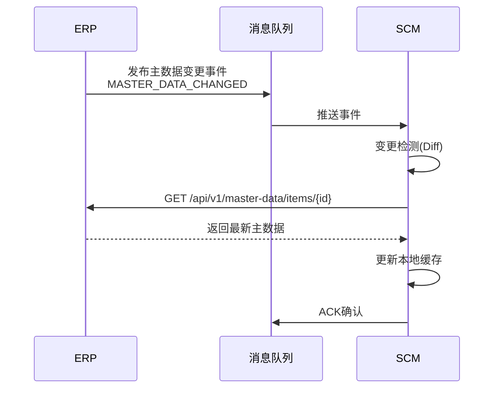
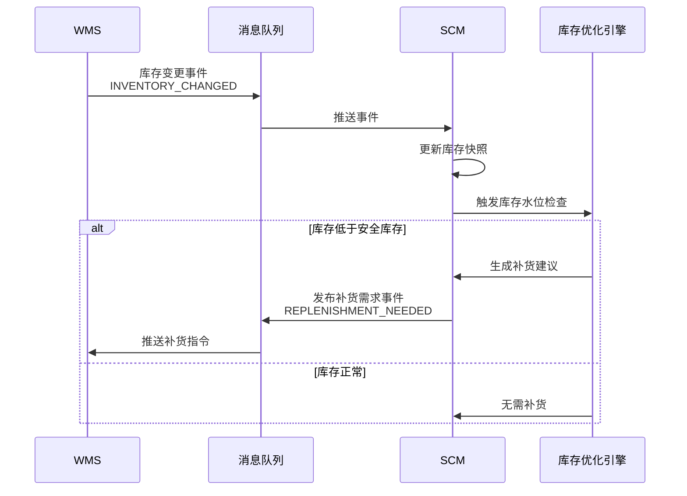
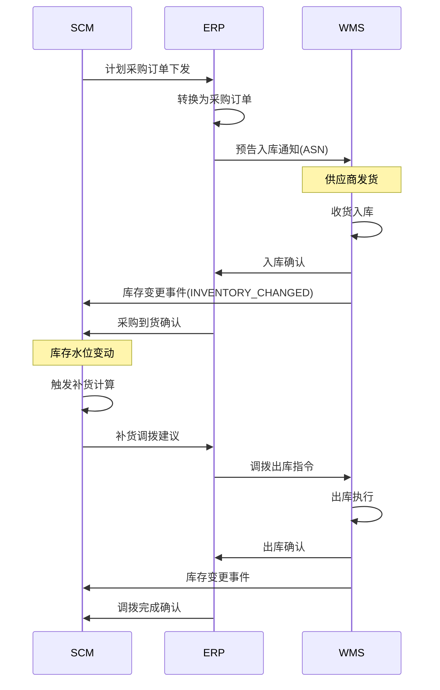

# 供应链集成接口设计

## 集成接口矩阵

SCM系统作为供应链的中枢，需要与ERP、WMS、SRM、TMS等系统进行紧密集成。以下是核心集成接口的全景矩阵：

| 集成方向 | 接口类别 | 核心数据 | 协议 | 频率 |
|----------|----------|----------|------|------|
| SCM → ERP | 主数据同步 | 物料/客户/供应商/BOM | REST | 实时 |
| SCM → ERP | 计划结果下发 | 计划生产订单/计划采购订单 | REST/MQ | 日批 |
| SCM → ERP | 订单反馈 | 交期承诺(ATP/CTP) | REST | 实时查询 |
| ERP → SCM | 业务数据上送 | 销售订单/采购订单/库存快照 | MQ | 实时 |
| SCM → WMS | 库存查询 | 实时库存/在途/已分配 | REST | 实时查询 |
| SCM → WMS | 入库/出库指令 | 补货调拨单/发货通知 | MQ | 事件驱动 |
| WMS → SCM | 库存变更事件 | 入库/出库/移库事件 | MQ | 实时 |
| SCM → SRM | 采购需求 | 采购申请/预测共享 | REST | 日批 |
| SRM → SCM | 供应商交付 | 交付确认/产能承诺 | REST/MQ | 实时 |
| SCM → TMS | 运输需求 | 调拨运输需求/装运计划 | REST | 事件驱动 |
| TMS → SCM | 运输结果 | 路线建议/在途状态 | MQ | 实时 |

## 接口协议与数据格式

### 协议选择策略

| 场景 | 推荐协议 | 原因 |
|------|----------|------|
| 实时查询（ATP/库存） | REST + JSON | 低延迟、同步响应 |
| 批量数据同步（计划结果） | REST + JSON | 大数据量、需确认 |
| 事件通知（库存变更/完工） | MQ (Kafka/RabbitMQ) | 解耦、可靠投递 |
| 跨企业数据交换 | EDI (AS2/SFTP) | 合规、标准格式 |
| 高频小消息（IoT传感器） | MQTT | 轻量、低带宽 |

### 数据格式规范

```json
// 接口通用Envelope格式
{
  "header": {
    "message_id": "MSG-20260701-00001",
    "message_type": "INVENTORY_CHANGE",
    "source_system": "WMS",
    "target_system": "SCM",
    "timestamp": "2026-07-01T10:30:00+08:00",
    "correlation_id": "REQ-20260701-00123",
    "idempotency_key": "WMS-EVT-WH01-ITEM-A001-20260701103000"
  },
  "body": {
    // 业务数据，按message_type不同而不同
  },
  "metadata": {
    "version": "2.0",
    "retry_count": 0,
    "priority": "NORMAL"
  }
}
```

## SCM ↔ ERP 集成

### 主数据同步

ERP作为主数据的权威来源（Master Data Owner），SCM订阅主数据变更事件：



主数据变更事件定义：

```json
{
  "header": {
    "message_type": "MASTER_DATA_CHANGED",
    "source_system": "ERP"
  },
  "body": {
    "data_type": "ITEM",
    "change_type": "UPDATE",
    "keys": {"item_id": "ITEM-A001"},
    "changed_fields": ["lead_time", "lot_size", "safety_stock"],
    "effective_date": "2026-07-01"
  }
}
```

### 计划结果下发

MRP运算完成后，计划订单需下发到ERP执行：

```python
class PlanResultDispatcher:
    def dispatch_to_erp(self, plan_version):
        """将计划结果分发到ERP"""
        plan_orders = self.get_confirmed_orders(plan_version)

        # 按类型分组
        purchase_orders = [o for o in plan_orders if o.order_type == 'PURCHASE']
        production_orders = [o for o in plan_orders if o.order_type == 'PRODUCTION']

        # 批量下发采购申请
        if purchase_orders:
            response = self.erp_client.post(
                '/api/v1/purchase/requisitions/batch',
                json=self.build_pr_payload(purchase_orders),
                headers={'X-Idempotency-Key': f'SCM-PR-{plan_version}'}
            )
            self.handle_dispatch_result('PURCHASE', response)

        # 批量下发计划生产订单
        if production_orders:
            response = self.erp_client.post(
                '/api/v1/production/planned-orders/batch',
                json=self.build_ppo_payload(production_orders),
                headers={'X-Idempotency-Key': f'SCM-PPO-{plan_version}'}
            )
            self.handle_dispatch_result('PRODUCTION', response)
```

## SCM ↔ WMS 集成

### 库存变更事件驱动

WMS的库存变更通过事件驱动SCM的补货计算：



库存变更事件负载：

```json
{
  "header": {
    "message_type": "INVENTORY_CHANGED",
    "source_system": "WMS"
  },
  "body": {
    "warehouse_id": "WH-SH01",
    "item_id": "ITEM-A001",
    "change_type": "OUTBOUND",
    "qty_changed": -50.0,
    "qty_after": 150.0,
    "qty_allocated": 80.0,
    "qty_available": 70.0,
    "reference_doc": "SO-2026-00123",
    "batch_no": "B20260601"
  }
}
```

## SCM ↔ SRM 集成

SCM向SRM推送采购需求，SRM反馈供应商交付承诺：

| 接口 | 方向 | 数据 | 调用方式 |
|------|------|------|----------|
| 采购需求推送 | SCM→SRM | 采购申请+需求日期+预测量 | REST POST |
| 供应商产能查询 | SCM→SRM | 物料+时间段 | REST GET |
| 交付承诺反馈 | SRM→SCM | 可供量+承诺日期 | REST POST |
| 预测共享 | SCM→SRM | 物料预测+时段 | REST POST |

供应商交付承诺接口：

```
POST /api/v1/srm/delivery-commitment
```

```json
{
  "supplier_id": "SUP-V001",
  "commitments": [
    {
      "item_id": "ITEM-R001",
      "period": "2026-W28",
      "committed_qty": 500.0,
      "committed_date": "2026-07-10",
      "confidence": "FIRM",
      "notes": "已确认排产"
    }
  ]
}
```

## SCM ↔ TMS 集成

SCM生成的调拨和补货需求需由TMS安排运输：

```python
class TransportDemandClient:
    def submit_transport_demand(self, replenishment_suggestions):
        """向TMS提交运输需求"""
        demands = []
        for suggestion in replenishment_suggestions:
            demands.append({
                'demand_id': suggestion.id,
                'item_id': suggestion.item_id,
                'qty': suggestion.suggested_qty,
                'ship_from': suggestion.source_warehouse,
                'ship_to': suggestion.target_warehouse,
                'required_arrival_date': suggestion.need_date,
                'priority': suggestion.priority,
                'special_requirements': self.get_transport_requirements(suggestion.item_id)
            })

        response = self.tms_client.post('/api/v1/transport/demands/batch', json={
            'demands': demands,
            'callback_url': 'https://scm.example.com/api/v1/transport/callback'
        })
        return response
```

## SCM ↔ ERP ↔ WMS 三方协同



## 接口幂等与重试机制

### 幂等设计

所有写操作接口必须支持幂等，通过`X-Idempotency-Key`请求头实现：

```python
class IdempotencyMiddleware:
    def process_request(self, request):
        idempotency_key = request.headers.get('X-Idempotency-Key')
        if not idempotency_key:
            raise BadRequestError("X-Idempotency-Key is required")

        # 检查是否已处理过
        cached = redis.get(f"idempotency:{idempotency_key}")
        if cached:
            return JsonResponse(json.loads(cached), status=200)

        # 执行业务逻辑
        response = self.next_handler(request)

        # 缓存响应（24小时过期）
        redis.setex(
            f"idempotency:{idempotency_key}",
            86400,
            json.dumps(response.data)
        )

        return response
```

### 重试策略

```python
class RetryPolicy:
    """指数退避重试策略"""
    MAX_RETRIES = 5
    BASE_DELAY_SEC = 1
    MAX_DELAY_SEC = 300

    def execute_with_retry(self, func, *args, **kwargs):
        for attempt in range(self.MAX_RETRIES + 1):
            try:
                return func(*args, **kwargs)
            except (ConnectionError, TimeoutError) as e:
                if attempt == self.MAX_RETRIES:
                    raise
                delay = min(
                    self.BASE_DELAY_SEC * (2 ** attempt) + random.uniform(0, 1),
                    self.MAX_DELAY_SEC
                )
                logger.warning(f"Retry {attempt+1}/{self.MAX_RETRIES} after {delay:.1f}s: {e}")
                time.sleep(delay)
            except ValidationError as e:
                # 业务校验失败不重试
                raise
```

## 事件驱动架构

### 事件定义

```python
# SCM核心领域事件
class SCMEvents:
    # 库存事件
    INVENTORY_CHANGED = "scm.inventory.changed"
    SAFETY_STOCK_BREACHED = "scm.inventory.safety-stock-breached"

    # 计划事件
    MRP_RUN_STARTED = "scm.plan.mrp-started"
    MRP_RUN_COMPLETED = "scm.plan.mrp-completed"
    PLAN_ORDER_CREATED = "scm.plan.order-created"
    PLAN_ORDER_CONFIRMED = "scm.plan.order-confirmed"

    # 补货事件
    REPLENISHMENT_SUGGESTED = "scm.replenishment.suggested"
    REPLENISHMENT_EXECUTED = "scm.replenishment.executed"
```

### 事件订阅与处理

```python
class InventoryChangeHandler:
    """库存变更事件处理器"""

    @subscribe(topic=SCMEvents.INVENTORY_CHANGED)
    def on_inventory_changed(self, event):
        item_id = event['body']['item_id']
        warehouse_id = event['body']['warehouse_id']

        # 检查库存水位
        check_result = self.inventory_optimization.check_stock_level(
            item_id, warehouse_id
        )

        if check_result.below_safety_stock:
            # 发布补货需求事件
            self.event_bus.publish(
                topic=SCMEvents.SAFETY_STOCK_BREACHED,
                body={
                    'item_id': item_id,
                    'warehouse_id': warehouse_id,
                    'current_stock': check_result.current_stock,
                    'safety_stock': check_result.safety_stock,
                    'shortage_qty': check_result.shortage_qty
                }
            )
```

## 接口监控与告警

| 监控指标 | 告警阈值 | 说明 |
|----------|----------|------|
| 接口响应时间(P99) | > 3秒 | 影响用户体验 |
| 接口错误率 | > 1% | 可能是下游系统异常 |
| 消息积压 | > 1000条 | 消费者处理不过来 |
| 消息处理延迟 | > 5分钟 | 数据时效性受影响 |
| 幂等键冲突 | > 0 | 重复请求，需排查 |
| 日同步量偏差 | 偏离基线±30% | 数据异常或丢失 |

## 开发者实战：集成契约设计模式

采用**消费者驱动契约**（Consumer-Driven Contract）模式，确保接口变更不破坏下游消费者：

```python
# 使用Pact框架定义消费者契约
class SCM_ERP_Contract:
    """SCM作为ERP的消费者"""

    def test_get_item_master(self):
        # 期望ERP返回的物料主数据格式
        (
            self.pact
            .upon_receiving('a request for item master')
            .with_request('GET', '/api/v1/items/ITEM-A001')
            .will_respond_with(200, body={
                'item_id': Like('ITEM-A001'),
                'item_name': Like('轴承组件A'),
                'uom': Like('EA'),
                'lead_time_days': Like(7),
                'lot_size': Like(100),
                'safety_stock': Like(50.0)
            })
        )
```

契约测试在CI/CD流水线中自动运行，当ERP接口变更破坏契约时，立即发现并阻止发布。
