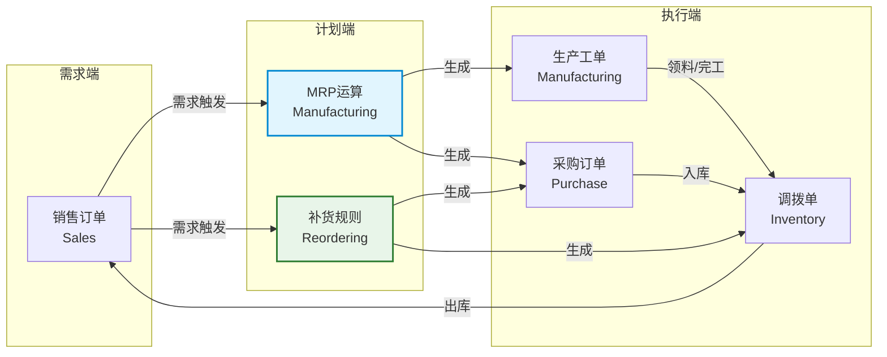
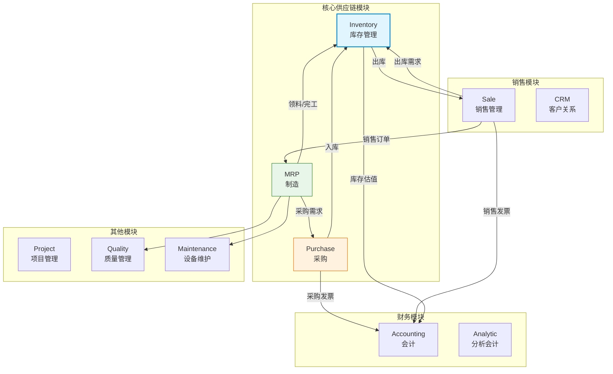

# Odoo供应链模块解析

## Odoo供应链模块概览

Odoo是一套开源ERP系统，其供应链相关功能分布在多个模块中，形成了一个从采购到交付的完整链条。

| 模块 | 核心功能 | 关键特性 |
|------|----------|----------|
| MRP（制造） | BOM管理、生产工单、MRP运算 | 支持多级BOM、副产品、拆解订单 |
| Purchase（采购） | 采购订单、供应商管理、询价 | 采购审批流、供应商评分 |
| Inventory（库存） | 仓库管理、库存移动、盘点 | 路线管理、批次追踪、策略规则 |
| Delivery（交付） | 出库配送、运输管理 | 包裹追踪、承运商集成 |

### 模块间协作关系

## 核心功能详解

### MRP模块

Odoo的MRP模块提供基础的物料需求计划功能：

- **BOM管理**：支持多级BOM、可选BOM（替代物料）、BOM版本管理
- **MRP运算**：根据销售订单和库存数据运行MRP，生成采购建议和生产建议
- **生产工单**：工单创建、领料、报工、完工全流程
- **副产品管理**：生产过程中产生的副产品或联产品
- **拆解订单**：将成品拆解为原材料，适用于返工或回收场景

### Purchase模块

- **询价与比价**：向多个供应商发送询价请求，对比报价
- **采购订单管理**：创建、审批、发送、跟踪采购订单
- **供应商管理**：供应商信息维护、评估和分类
- **采购协议**：框架协议和批量采购协议
- **入库控制**：三向匹配（订单-收货-发票）

### Inventory模块

- **仓库结构**：支持多仓库、多库位（库位类型：内部、供应商、客户、盘点、生产）
- **库存移动**：入库、出库、内部调拨、虚拟移动
- **路线管理**：Push/Pull路线，定义物料流动规则
- **批次追踪**：按批次号或序列号追踪物料
- **盘点管理**：周期盘点、全盘、差异处理

## Reordering规则

Odoo的补货规则（Reordering Rules）是最简单的库存补货机制，类似于传统的Min-Max补货策略。

### 配置参数

| 参数 | 说明 | 使用场景 |
|------|------|----------|
| 最小数量（Min） | 触发补货的库存下限 | 再订货点 |
| 最大数量（Max） | 补货后的库存目标 | 目标库存水平 |
| 数量多（Qty Multiple） | 补货的批量倍数 | 按整托/整箱补货 |
| 提前期 | 从下单到到货的天数 | 采购提前期 |

### 补货逻辑

当虚拟可用库存（在手+在途-已分配）低于最小数量时，系统自动生成补货建议，补货数量 = 最大数量 - 虚拟可用库存，并向上取整到批量倍数。

### 与MRP的关系

- **Reordering规则**：适用于简单的Min-Max补货场景，不考虑BOM展开
- **MRP运算**：适用于制造场景，根据BOM展开计算各层级物料需求
- **两者可以并存**：成品和半成品使用MRP，原材料使用Reordering规则

## 路线管理（Push/Pull）

路线（Route）是Odoo库存管理的核心概念，它定义了物料在仓库和节点之间的流动规则。

### Pull规则

Pull规则由需求驱动，当某处需要物料时，系统根据Pull规则找到物料的来源：

- **销售→出库**：销售订单触发出库操作
- **出库→拣货**：出库操作触发拣货操作
- **生产→领料**：生产工单触发原料领料

### Push规则

Push规则由供应驱动，当物料到达某处时，系统根据Push规则将物料移动到下一站：

- **收货→质检**：入库后自动推送到质检区
- **质检→存储**：质检合格后推送到存储位
- **存储→拣货**：低库存时自动从存储位推送到拣货位

### 路线配置示例

| 路线名称 | 规则链 | 适用场景 |
|----------|--------|----------|
| 买→收→存 | 采购入库→入库区→存储区 | 标准采购入库 |
| 卖→拣→发 | 销售出库→拣货区→发货区 | 标准销售出库 |
| 制→领→产→入 | 生产→领料→生产→入库 | 标准生产流程 |
| MTO按单生产 | 销售→生产→采购 | 定制化生产 |

## 与Odoo其他模块集成

## 部署实践

### 部署方式

| 方式 | 说明 | 适用场景 |
|------|------|----------|
| Odoo.sh | 官方云平台 | 快速上线、免运维 |
| Docker自建 | Docker Compose部署 | 定制需求、成本控制 |
| 源码部署 | 手动安装配置 | 深度定制、性能调优 |

### 最小化供应链部署

一个基本的Odoo供应链部署需要安装以下模块：

1. **库存（stock）**：核心模块，必须
2. **采购（purchase）**：采购管理
3. **销售（sale）**：销售管理
4. **MRP（mrp）**：制造管理（按需）
5. **会计（account）**：财务集成

### 数据初始化顺序

1. 公司信息和货币设置
2. 仓库和库位配置
3. 产品分类和属性定义
4. 产品主数据创建（含BOM）
5. 供应商和客户主数据
6. Reordering规则配置
7. 路线配置
8. 期初库存导入

## 与商业SCM对比

| 维度 | Odoo供应链 | SAP IBP / Kinaxis |
|------|-----------|-------------------|
| 计划能力 | 基础MRP+Min-Max | 高级优化+ML预测 |
| 需求预测 | 无内置预测引擎 | 统计预测+ML+协同预测 |
| 优化算法 | 规则驱动 | 数学优化+启发式+AI |
| What-If模拟 | 不支持 | 实时并发模拟 |
| 多级库存优化 | 不支持 | 全局多级库存优化 |
| 供应链协同 | 基础供应商门户 | CPFR+VMI+端到端可视化 |
| 部署成本 | 低（开源/低许可费） | 高（百万级许可费） |
| 实施周期 | 1-3个月 | 6-18个月 |
| 适用规模 | 中小企业 | 大型企业 |
| 定制灵活性 | 高（开源可修改） | 低（SaaS标准产品） |

Odoo适合供应链模式相对简单、需要快速部署和低成本的中小企业。但对于需要高级计划优化、需求预测和供应链协同的大型企业，商业SCM产品仍然是不可替代的选择。
