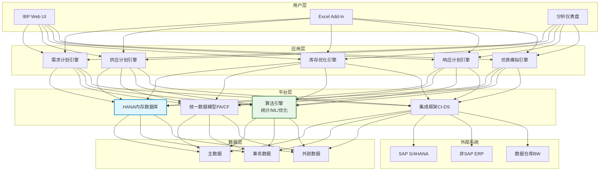

# SAP IBP架构解析

## SAP IBP产品线

SAP IBP（Integrated Business Planning，集成业务计划）是SAP的云端供应链计划产品，替代了传统的SAP APO。IBP按照计划领域划分为多个模块：

| 模块 | 英文全称 | 核心能力 | 计划层级 |
|------|----------|----------|----------|
| IBP for Demand | 需求计划 | 统计预测、ML预测、协同预测、预测融合 | 月度→周度 |
| IBP for Response | 响应计划 | 有限产能计划、ATP/CTP、供应分配 | 周度→日度 |
| IBP for Supply | 供应计划 | 供应计划、MRP运算、S&OP | 月度→周度 |
| IBP for Inventory | 库存优化 | 安全库存计算、多级库存优化、库存策略 | 月度→周度 |

各模块可以独立部署，也可以组合使用，形成完整的供应链计划解决方案。

## 技术架构

### SAP HANA内存计算

SAP IBP运行在SAP HANA内存数据库之上，HANA是IBP高性能计算的基石：

- **列式存储**：数据按列存储，适合聚合查询和分析计算
- **内存计算**：数据常驻内存，计算速度比传统磁盘数据库快100-1000倍
- **并行处理**：支持多核并行计算，充分利用硬件资源
- **实时聚合**：预计算和实时计算结合，实现秒级响应

### 架构分层

## IBP Excel Add-In

IBP Excel Add-In是IBP最具特色的功能之一，它允许计划员在熟悉的Excel环境中进行计划操作：

### 核心功能

- **数据读取**：从IBP后端读取计划数据到Excel工作表
- **数据编辑**：在Excel中直接编辑计划数据（调整预测、修改约束等）
- **数据保存**：将修改后的数据一键保存回IBP后端
- **版本管理**：支持多个计划版本的对比和切换
- **权限控制**：基于角色的数据访问和编辑权限

### 适用场景

- 需求计划的统计预测调整
- S&OP会议中的协同计划编辑
- 管理层的计划审核和批复
- 高级分析（Excel公式、图表、透视表）

### 优势与局限

| 维度 | 优势 | 局限 |
|------|------|------|
| 用户体验 | Excel熟悉度高、学习成本低 | 不适合复杂工作流 |
| 数据量 | 适合中小数据集的交互 | 大数据量时性能下降 |
| 协作 | 多人可同时编辑不同版本 | 实时协作能力有限 |
| 分析 | 充分利用Excel分析能力 | 不支持高级可视化 |

## IBP集成规划（统一数据模型）

IBP的核心设计理念是"统一数据模型"——所有计划模块共享同一个数据模型，确保各模块的计划结果一致。

### Planning Area（计划区域）

Planning Area是IBP数据模型的核心容器，包含以下要素：

| 要素 | 说明 | 示例 |
|------|------|------|
| Key Figure（关键指标） | 可度量的计划数据 | 需求量、供应量、库存量 |
| Attribute（属性） | 维度描述字段 | 产品组、区域、客户组 |
| Time Profile（时间剖面） | 时间维度定义 | 周度/月度/季度 |
| Master Data Type（主数据类型） | 主数据定义 | 产品、地点、资源 |
| Version（版本） | 计划版本 | 基线版本、模拟版本 |

### Calculation Function（计算函数）

IBP通过计算函数定义关键指标之间的逻辑关系：

- **离散计算**：直接赋值、比例分配、汇总
- **时序计算**：滞后、移动平均、累积
- **条件计算**：基于条件的分支逻辑
- **优化计算**：调用优化求解器

### 关键指标体系

| 类别 | 关键指标 | 说明 |
|------|----------|------|
| 需求指标 | 统计预测、调整预测、共识预测 | 预测值在不同阶段的变化 |
| 供应指标 | 计划生产、计划采购、计划调拨 | 供应方案 |
| 库存指标 | 预计可用库存、安全库存、目标库存 | 库存状态 |
| 产能指标 | 可用产能、已占产能、产能利用率 | 产能状态 |
| 绩效指标 | 预测准确率、满足率、库存周转率 | 计划质量评估 |

## What-If模拟

What-If模拟是IBP的核心能力，允许计划员在不影响运营计划的前提下，评估各种假设场景的影响。

### 模拟场景

| 场景 | 问题描述 | 模拟内容 |
|------|----------|----------|
| 需求变化 | 如果需求增加20%会怎样？ | 供应缺口、产能瓶颈、库存影响 |
| 供应中断 | 如果某供应商停产2周会怎样？ | 缺料清单、延迟订单、替代方案 |
| 产能变化 | 如果增加一条产线会怎样？ | 产能满足率、投资回报分析 |
| 策略调整 | 如果提高安全库存10%会怎样？ | 库存成本、满足率改善 |

### 模拟流程

1. 创建模拟版本（基于运营计划的副本）
2. 在模拟版本中修改假设参数
3. 运行计划运算，生成模拟结果
4. 对比模拟版本与运营版本的差异
5. 评估模拟结果的可行性和影响
6. 决定是否将模拟结果合并到运营计划

## 与S/4HANA集成

SAP IBP与S/4HANA的深度集成是其核心竞争力之一：

### 集成数据流

| 方向 | 数据 | 方式 |
|------|------|------|
| S/4→IBP | 销售订单、库存快照、BOM、工艺路线 | CI-DS实时复制 |
| S/4→IBP | 采购信息记录、供应商数据 | CI-DS批量加载 |
| IBP→S/4 | 计划生产订单、计划采购申请 | CI-DS写入 |
| IBP→S/4 | 库存补货建议、调拨建议 | CI-DS写入 |

### SAP CI-DS（Cloud Integration - Data Services）

CI-DS是IBP与外部系统的集成工具：

- **预置集成模板**：S/4HANA与IBP的标准集成模板，开箱即用
- **数据映射**：源系统和目标系统的字段映射
- **数据转换**：单位转换、日历对齐、聚合/拆分
- **调度管理**：定时加载和事件驱动加载
- **监控告警**：集成任务的监控和异常告警

## 部署模式

| 模式 | 说明 | 适用场景 |
|------|------|----------|
| 全SaaS | 所有IBP模块在SAP Cloud上运行 | 标准场景、快速上线 |
| 混合 | IBP SaaS + S/4HANA本地部署 | 数据安全要求高的企业 |
| IBP on HEC | IBP部署在HANA Enterprise Cloud | 性能和安全性要求高 |

### 部署周期参考

| 阶段 | 内容 | 周期 |
|------|------|------|
| 准备阶段 | 项目规划、需求调研、架构设计 | 4-6周 |
| 设计阶段 | 数据模型设计、集成方案设计、权限设计 | 6-8周 |
| 构建阶段 | 系统配置、数据迁移、报表开发 | 8-12周 |
| 测试阶段 | 集成测试、用户验收测试、性能测试 | 4-6周 |
| 上线阶段 | 切换上线、用户培训、运维交接 | 2-4周 |
| **总计** | | **6-9个月** |

## 行业最佳实践

### 消费品行业

- **需求感知**：利用POS数据和外部信号（天气、节假日）进行短期需求调整
- **贸易促销管理**：在IBP中管理促销对需求的影响
- **多级库存优化**：从工厂到分销中心到零售门店的全链库存优化

### 汽车行业

- **S&OP协同**：主机厂和零部件供应商的联合S&OP
- **产能约束计划**：考虑模具和产线切换的有限产能计划
- **长周期物料管理**：芯片等长周期物料的战略备库

### 化工行业

- **配方管理**：基于配方的BOM和批量管理
- **罐区库存**：连续生产下的罐区库存跟踪
- **有效期管理**：化学品有效期的库存优化
