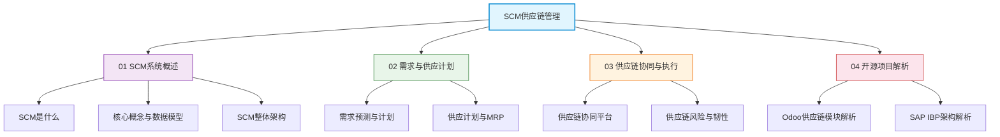

# SCM供应链管理

供应链管理（Supply Chain Management, SCM）是现代企业运营的核心竞争力之一。在全球化和数字化的背景下，供应链不再仅仅是物流和采购的代名词，而是涵盖了从需求预测到最终交付的全流程协同与优化。SCM系统作为企业数字化供应链的神经中枢，承担着需求计划、供应计划、库存优化、运输调度和跨企业协同等关键职能。

## 学习路线

## 参考产品

| 产品 | 厂商 | 核心能力 | 适用场景 |
|------|------|----------|----------|
| SAP IBP | SAP | 需求计划、供应计划、库存优化、响应管理 | 大型制造企业，SAP生态 |
| Kinaxis RapidResponse | Kinaxis | 并发计划引擎、实时what-if模拟 | 高科技、汽车、生命科学 |
| Blue Yonder (JDA) | Blue Yonder | AI驱动需求预测、端到端供应链优化 | 零售、制造、物流 |
| 开源Odoo MRP | Odoo | MRP/Purchase/Inventory一体化 | 中小企业，快速部署 |

## 章节目录

- **01 SCM系统概述**：SCM定义、演进历程、核心概念、整体架构
- **02 需求与供应计划**：需求预测方法、MRP运算逻辑、供需平衡
- **03 供应链协同与执行**：CPFR协同、供应商门户、风险与韧性
- **04 开源项目解析**：Odoo供应链模块、SAP IBP架构深度剖析
