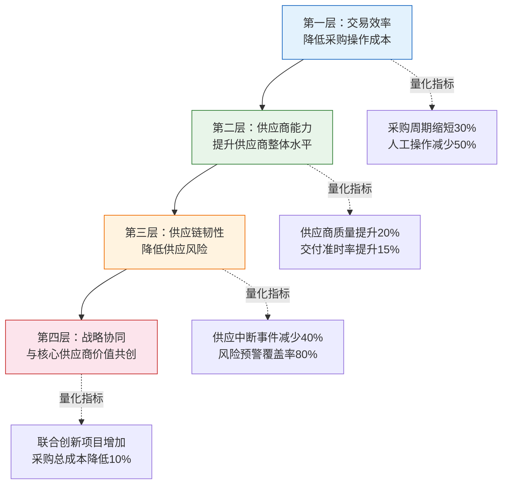
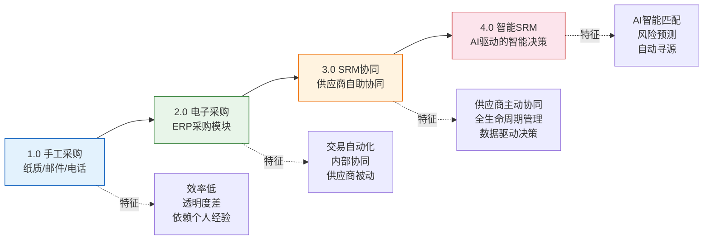
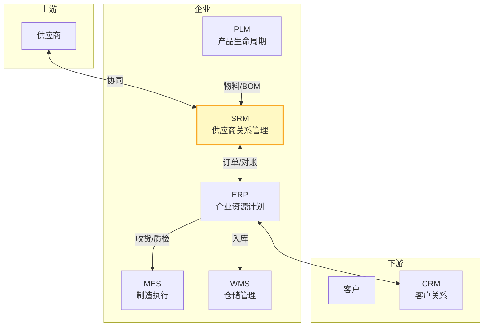

# SRM是什么

SRM（Supplier Relationship Management，供应商关系管理）是企业与供应商之间建立、维护和优化合作关系的数字化平台。它超越了传统采购的"下单-收货-付款"交易模式，将供应商管理提升到战略协同的高度。本文从定义、价值、演进和产品对比四个维度全面解析SRM。

## 1. SRM定义

**Supplier Relationship Management** 是一种系统化的方法，用于规划和管理与供应商的互动与合作关系，以最大化供应商价值、降低供应风险并提升供应链竞争力。

SRM的三个关键特征：

| 特征 | 说明 |
|------|------|
| **全生命周期** | 覆盖供应商从准入、合格、战略到淘汰的完整周期 |
| **协同共赢** | 从压价博弈转向价值共创，与核心供应商深度协同 |
| **数据驱动** | 基于客观数据评估供应商能力，而非主观印象 |

## 2. SRM与ERP采购模块的区别

很多企业混淆了SRM与ERP中的采购模块，两者有本质区别：

| 维度 | ERP采购模块 | SRM系统 |
|------|------------|---------|
| **定位** | 交易执行 | 关系管理 |
| **关注点** | 订单处理、收货、发票 | 供应商能力、寻源、协同 |
| **用户** | 内部采购员 | 采购员+供应商 |
| **供应商参与** | 被动（被动接受订单） | 主动（自助协同） |
| **寻源能力** | 基础（简单比价） | 强大（招投标、竞标、智能匹配） |
| **绩效管理** | 基础（交期统计） | 全面（QDCST多维度） |
| **合同管理** | 简单（框架协议） | 完整（全生命周期管理） |
| **集成** | 内部集成 | 内外协同 |

### 典型分工

```
SRM负责：供应商准入 → 寻源定价 → 合同签署 → 订单协同 → 绩效评估
ERP负责：采购申请 → 采购订单 → 收货入库 → 发票校验 → 付款清账

两者在"采购订单"环节衔接：
SRM生成采购需求 → ERP创建采购订单 → SRM协同供应商确认
```

## 3. SRM的四层价值

SRM的价值可以从交易效率到战略协同四个层次递进理解：



### 第一层：交易效率

- **流程自动化**：从手工比价到电子招投标，减少人工操作
- **自助协同**：供应商自助确认订单、维护信息、提交对账单
- **数据透明**：采购全流程数据可追溯，减少沟通成本

### 第二层：供应商能力

- **准入管控**：标准化准入流程，确保供应商质量
- **绩效驱动**：客观数据评估供应商能力，推动持续改进
- **能力培养**：识别供应商短板，提供改善建议与支持

### 第三层：供应链韧性

- **风险预警**：实时监控供应商经营风险、地缘风险
- **替代方案**：关键物料有备选供应商，降低单点依赖
- **应急响应**：突发事件时快速切换供应商

### 第四层：战略协同

- **联合创新**：与核心供应商早期介入产品开发（ESI）
- **成本共优**：联合VA/VE活动，共同降低总拥有成本
- **数据共享**：共享预测数据，帮助供应商优化产能规划

## 4. 从传统采购到数字化SRM的演进



## 5. SRM在供应链中的定位



| 交互关系 | 数据流向 | 说明 |
|---------|---------|------|
| SRM↔供应商 | 双向协同 | 订单确认、交付协同、质量反馈 |
| SRM→ERP | 采购需求、合同 | SRM确定供应商和价格，ERP执行采购 |
| ERP→SRM | 收货信息、质检结果 | ERP反馈执行结果，SRM更新绩效数据 |
| PLM→SRM | 物料主数据、BOM | 新物料信息同步到SRM寻源 |

## 6. 商业产品对比

| 维度 | SAP Ariba | 甄云SRM | 企源SRM |
|------|-----------|---------|---------|
| **核心定位** | 全球化SRM云平台 | 本土化SRM平台 | 中型企业SRM |
| **部署模式** | SaaS（公有云） | SaaS/私有化 | SaaS/私有化 |
| **供应商网络** | 500万+全球供应商 | 10万+中国供应商 | 数千家 |
| **寻源能力** | AI智能匹配、全球寻源 | 本土化招投标、竞价 | 基础招投标 |
| **行业适配** | 全球化、跨国企业 | 中国本土大型企业 | 中型制造企业 |
| **ERP集成** | SAP S4/HANA原生集成 | 主流ERP均可集成 | 主流ERP集成 |
| **合同管理** | Ariba Contract全生命周期 | 完整合同管理 | 基础合同管理 |
| **价格区间** | 百万级/年 | 数十万级/年 | 十万级/年 |
| **实施周期** | 6-12月 | 3-6月 | 1-3月 |
| **特色** | 全球最大供应商网络 | 本土化深度适配 | 轻量快速上线 |

## 小结

- SRM是供应商关系管理平台，超越ERP采购模块的交易执行，聚焦关系管理
- SRM的四层价值从交易效率递进到战略协同，企业应根据成熟度逐步推进
- SRM在供应链中是连接企业与上游供应商的数字化桥梁
- SAP Ariba、甄云SRM、企源SRM各有定位，选型需结合企业规模和采购场景
