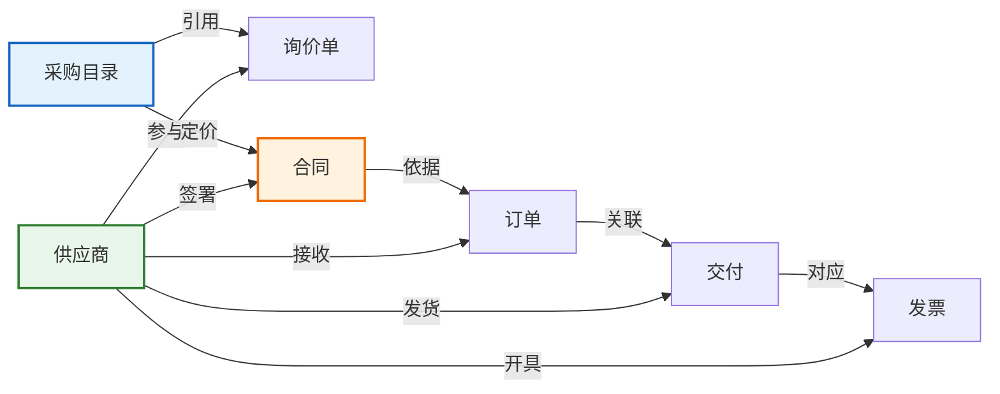
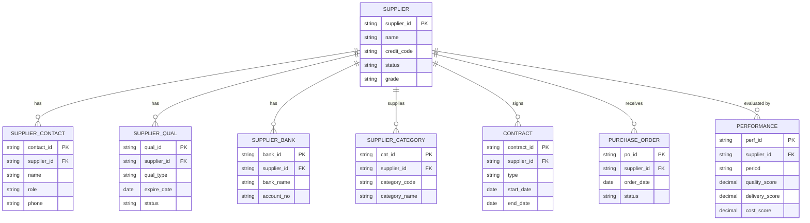
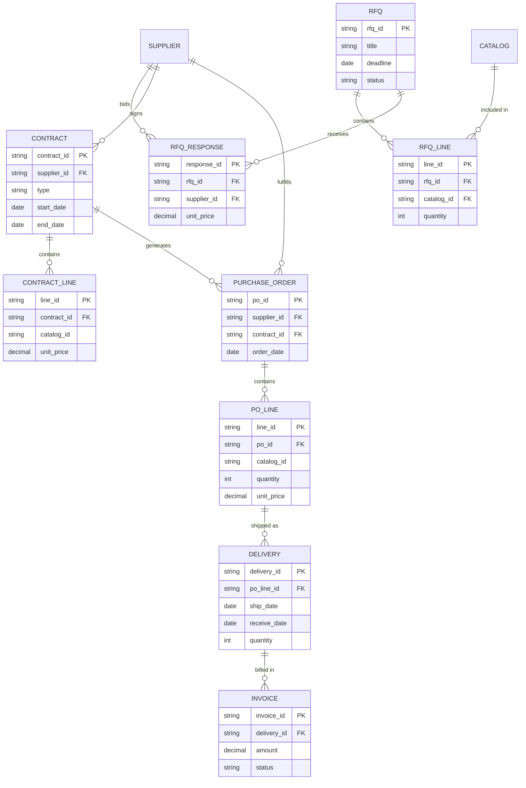
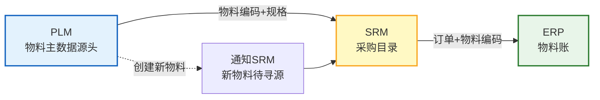
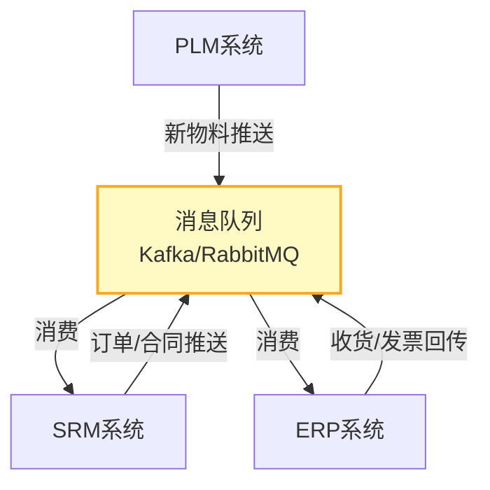

# 核心概念与数据模型

SRM系统的核心是围绕"供应商"与"采购"建立的一套数据模型和业务对象。理解供应商、采购目录、询价单、合同、订单、交付、发票等核心对象及其关系，是掌握SRM系统的基础。

## 1. 核心对象

SRM系统围绕以下七大核心对象构建数据模型：

| 对象 | 说明 | 示例 |
|------|------|------|
| **供应商** | 企业的外部供应方，SRM的核心主体 | 博世、电装、大陆 |
| **采购目录** | 可采购物料/服务的分类与价格目录 | M8螺栓 目录价¥0.5/个 |
| **询价单** | 向供应商发出的询价请求 | RFQ-2024-001 |
| **合同** | 与供应商签署的采购协议 | 框架协议FA-2024-015 |
| **订单** | 向供应商下达的采购订单 | PO-2024-0892 |
| **交付** | 供应商的发货与收货记录 | ASN-2024-0156 |
| **发票** | 供应商开具的发票与对账 | INV-2024-0345 |

### 对象关系图



## 2. 供应商主数据模型

供应商是SRM最核心的数据对象，其主数据模型涵盖多个维度：

### 供应商基本信息

| 属性组 | 属性项 | 说明 | 是否必填 |
|--------|--------|------|---------|
| 基本信息 | 供应商编码 | 唯一标识 | 是 |
| 基本信息 | 供应商名称 | 法人主体名称 | 是 |
| 基本信息 | 统一社会信用代码 | 中国企业唯一标识 | 是 |
| 基本信息 | 注册地址 | 法人注册地址 | 是 |
| 联系信息 | 主要联系人 | 对接窗口 | 是 |
| 联系信息 | 联系电话 | 业务联系 | 是 |
| 联系信息 | 电子邮箱 | 电子沟通 | 是 |
| 银行信息 | 开户行 | 付款银行 | 是 |
| 银行信息 | 银行账号 | 付款账号 | 是 |
| 资质信息 | 营业执照 | 经营许可 | 是 |
| 资质信息 | 行业资质 | ISO/行业认证 | 视行业 |
| 分类信息 | 供应类别 | 可供应物料类别 | 是 |
| 分类信息 | 供应商等级 | A/B/C/D | 自动计算 |

### 供应商数据模型ER图



## 3. 物料目录管理

物料目录是SRM中连接需求与供应的桥梁，它定义了"可以买什么、从谁买、多少钱"：

### UNSPSC分类体系

UNSPSC（United Nations Standard Products and Services Code）是国际通用的物料分类标准：

| 层级 | 说明 | 示例 |
|------|------|------|
| 段（Segment） | 大类 | 31 制造业产品 |
| 族（Family） | 中类 | 3117 工业紧固件 |
| 类（Class） | 小类 | 311715 螺栓 |
| 细类（Commodity） | 细分 | 31171501 六角头螺栓 |

### 目录模板

| 目录要素 | 说明 | 示例 |
|---------|------|------|
| 物料编码 | 唯一标识 | MAT-BOLT-M8-30 |
| 物料名称 | 描述性名称 | 六角头螺栓 M8x30 |
| 分类编码 | UNSPSC分类 | 31171501 |
| 规格参数 | 技术参数 | M8、长度30mm、8.8级 |
| 计量单位 | 采购单位 | 个 |
| 目录价 | 供应商目录报价 | ¥0.50 |
| 协议价 | 合同约定价格 | ¥0.42 |
| 最小起订量 | MOQ | 100个 |
| 交货周期 | 标准交期 | 7个工作日 |

### 价格管理

| 价格类型 | 说明 | 确定方式 |
|---------|------|---------|
| **目录价** | 供应商公开报价 | 供应商自主维护 |
| **协议价** | 合同约定的优惠价格 | 谈判确定 |
| **阶梯价** | 按采购量阶梯定价 | 合同约定各阶梯价格 |
| **竞标价** | 招投标确定的价格 | 评标确定 |
| **临时价** | 临时采购的价格 | 紧急采购时确定 |

```
阶梯价示例：
├── 1-999个:   ¥0.50/个
├── 1000-4999个: ¥0.45/个
├── 5000-9999个: ¥0.40/个
└── 10000+个:   ¥0.35/个
```

## 4. 数据模型全景ER图



## 5. 主数据治理

### 供应商编码规范

| 编码规则 | 说明 | 示例 |
|---------|------|------|
| 前缀+流水号 | SUP+6位流水号 | SUP000156 |
| 分类+流水号 | 按供应商类型前缀 | V01-00234（V01=原材料） |
| 统一信用代码 | 直接使用统一社会信用代码 | 91310000... |

### 物料编码统一

PLM与SRM的物料编码必须统一，否则会导致数据断链：



### 主数据治理原则

| 原则 | 说明 | 实施方式 |
|------|------|---------|
| **唯一性** | 同一供应商在系统中只有一个编码 | 建立查重机制 |
| **完整性** | 关键属性不允许为空 | 前端强制校验 |
| **一致性** | SRM/ERP/PLM的物料编码一致 | 统一编码主数据管理 |
| **及时性** | 供应商信息变更及时同步 | 自动同步+人工确认 |
| **可追溯** | 所有主数据变更可追溯 | 审计日志 |

## 6. 与ERP数据同步机制

| 同步方向 | 同步数据 | 同步方式 | 触发条件 |
|---------|---------|---------|---------|
| PLM→SRM | 新物料主数据 | 接口推送 | 新物料创建时 |
| SRM→ERP | 供应商主数据 | 接口同步 | 供应商准入时 |
| SRM→ERP | 合同信息 | 接口同步 | 合同签署时 |
| SRM→ERP | 采购订单 | 接口创建 | 订单确认时 |
| ERP→SRM | 收货信息 | 接口回传 | 收货入库时 |
| ERP→SRM | 质检结果 | 接口回传 | 质检完成时 |
| ERP→SRM | 发票信息 | 接口回传 | 发票校验时 |

### 同步架构



## 小结

- SRM七大核心对象：供应商、采购目录、询价单、合同、订单、交付、发票构成完整的采购数据链
- 供应商主数据模型涵盖基本信息、联系信息、银行信息、资质信息、分类信息
- 物料目录管理以UNSPSC为分类基础，支持目录价/协议价/阶梯价多种定价模式
- 主数据治理的核心原则：唯一性、完整性、一致性、及时性、可追溯
- SRM与ERP/PLM的数据同步通过消息队列实现松耦合集成
