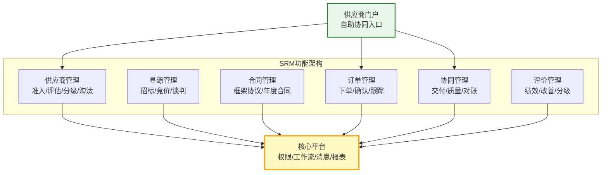
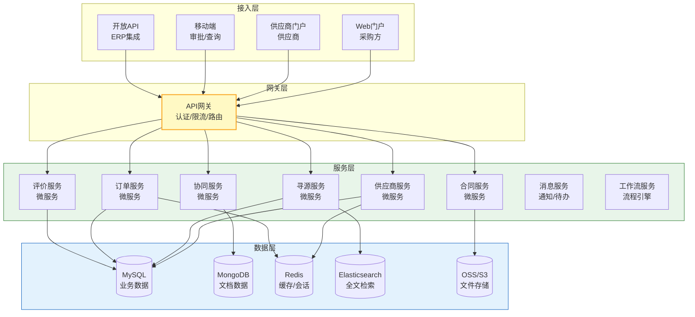
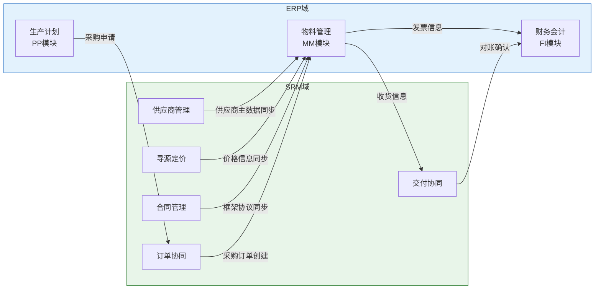
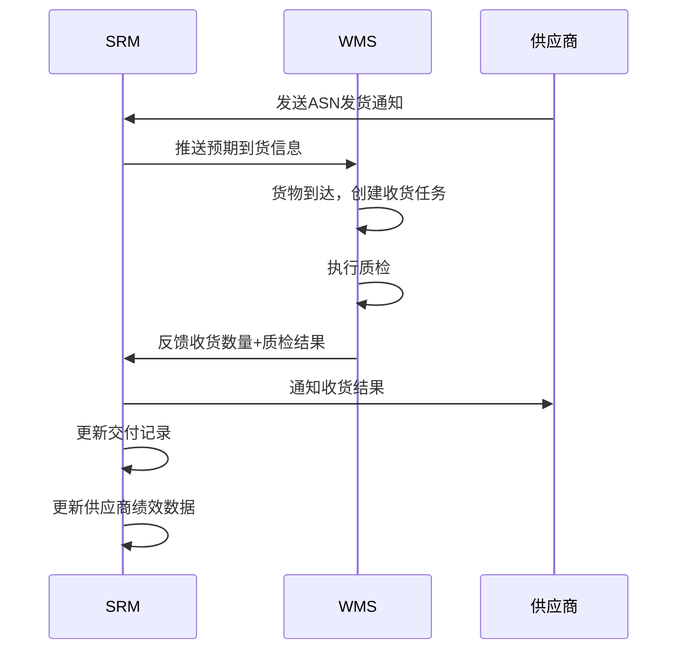
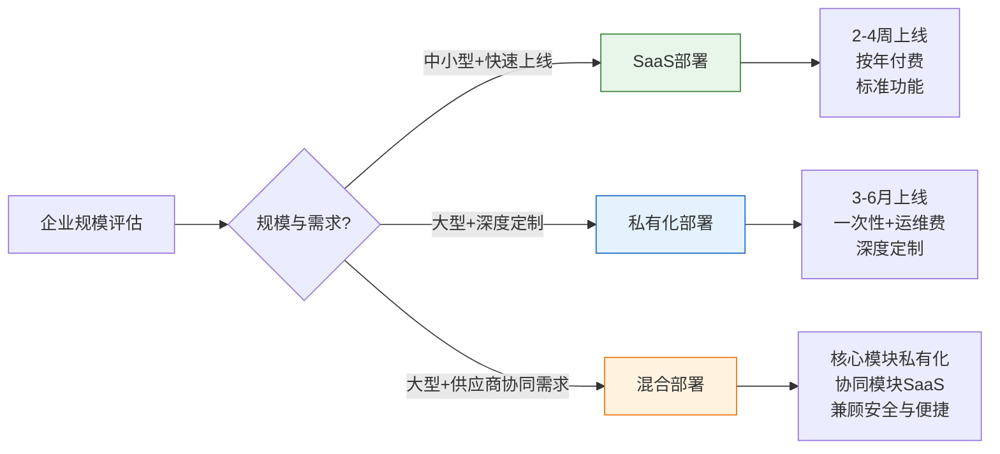

# SRM整体架构

SRM系统作为连接企业与供应商的数字化平台，其架构设计需要兼顾内部管理效率和外部协同体验。本文从功能架构、技术架构、集成架构和部署模式四个维度全面解析SRM系统架构。

## 1. 功能架构

SRM的功能架构可以划分为六大核心模块：

### 功能模块详解

| 功能模块 | 核心能力 | 关键特性 |
|---------|----------|---------|
| **供应商管理** | 准入/评估/分级/淘汰 | 全生命周期管理、资质到期预警 |
| **寻源管理** | 招标/竞价/谈判/单一来源 | 电子招投标、反向拍卖、智能匹配 |
| **合同管理** | 框架协议/年度合同/一揽子订单 | 合同全生命周期、审批流程、到期预警 |
| **订单管理** | 下单/确认/跟踪/变更 | 供应商自助确认、实时跟踪 |
| **协同管理** | 交付协同/质量协同/财务协同 | ASN通知、质检反馈、三单匹配 |
| **评价管理** | 绩效评估/改善计划/分级管理 | QDCST多维度、自动采集、改善闭环 |

## 2. 技术架构

现代SRM系统普遍采用微服务架构，支持SaaS多租户部署：

### SaaS多租户架构

| 多租户策略 | 说明 | 优势 | 劣势 |
|-----------|------|------|------|
| **独立数据库** | 每个租户独立数据库 | 数据隔离性最好 | 成本最高 |
| **共享数据库独立Schema** | 同一数据库不同Schema | 隔离性较好 | 管理复杂 |
| **共享数据库共享Schema** | 同一数据库同一Schema，tenant_id区分 | 成本最低 | 隔离性最弱 |

主流SRM产品通常采用"共享数据库+租户ID"的策略，通过行级安全（Row-Level Security）保证数据隔离。

## 3. 与ERP集成

SRM与ERP的集成是采购数字化最关键的集成链路：

### 关键集成接口

| 接口 | 方向 | 数据 | 方式 | 频率 |
|------|------|------|------|------|
| 供应商同步 | SRM→ERP | 供应商主数据 | API | 实时 |
| 采购申请 | ERP→SRM | 需求数据 | API | 实时 |
| 采购订单 | SRM→ERP | 订单数据 | API | 实时 |
| 收货反馈 | ERP→SRM | 收货数量/质检 | API/MQ | 实时/定时 |
| 发票同步 | ERP→SRM | 发票信息 | API/MQ | 定时 |
| 价格同步 | SRM→ERP | 合同价格 | API | 合同签署时 |
| 对账数据 | SRM→ERP | 对账结果 | API | 月结 |

## 4. 与WMS集成

SRM与WMS的集成主要围绕入库协同和质检反馈：

### SRM-WMS集成数据

| 数据 | 方向 | 说明 |
|------|------|------|
| ASN到货通知 | SRM→WMS | 预告到货物料/数量/时间 |
| 收货确认 | WMS→SRM | 实际收货数量和状态 |
| 质检结果 | WMS→SRM | 合格/不合格/让步接收 |
| 退货通知 | SRM→WMS | 不合格品退货 |
| 库存查询 | SRM→WMS | 供应商委外库存查询 |

## 5. 部署模式

| 部署模式 | 说明 | 优势 | 劣势 | 适用场景 |
|---------|------|------|------|---------|
| **SaaS** | 供应商托管的多租户云服务 | 零运维、快速上线、自动升级 | 定制性有限、数据在云端 | 中小企业、快速上线需求 |
| **私有化** | 企业自建机房部署 | 数据完全可控、深度定制 | 运维成本高、升级复杂 | 大型企业、数据敏感行业 |
| **混合** | 核心模块私有化+协同模块SaaS | 兼顾安全与便捷 | 架构复杂 | 大型企业 |

### 部署架构选择

## 小结

- SRM功能架构涵盖供应商管理、寻源、合同、订单、协同、评价六大核心模块
- 技术架构采用微服务+API网关，支持SaaS多租户部署
- 与ERP的集成是SRM最关键的集成链路，涉及供应商、订单、收货、发票等核心数据同步
- 与WMS的集成围绕入库协同和质检反馈，实现从发货到入库的闭环
- SaaS/私有化/混合三种部署模式各有适用场景
