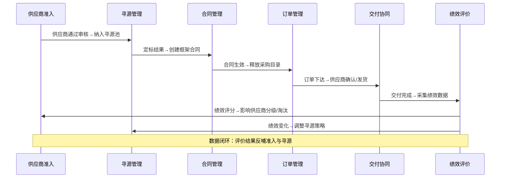
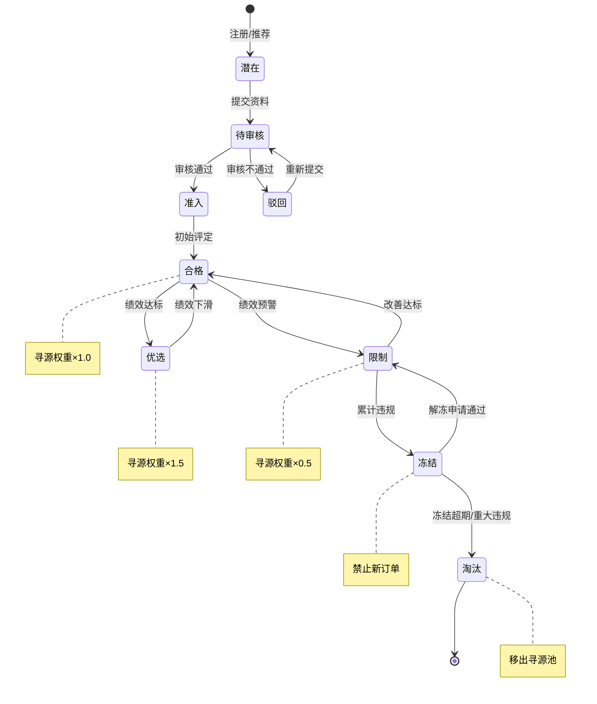
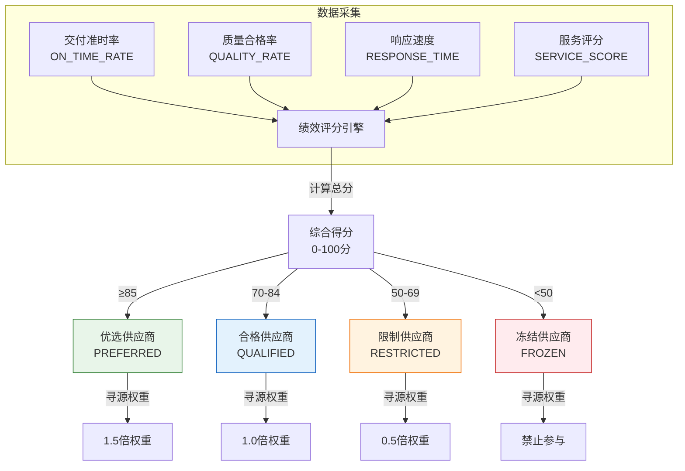
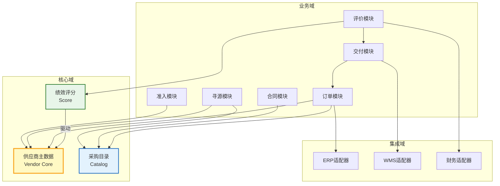

# SRM模块联动与数据流

SRM系统的核心价值在于将供应商管理从"被动采购"升级为"主动协同"，而这一升级的实现依赖于各模块之间的紧密联动。从供应商准入到寻源、合同、订单、交付、评价，数据在各模块间流转驱动业务闭环。本文从开发者视角深入剖析SRM各模块的联动机制与端到端数据流。

## 1. 闭环数据流全景

SRM的六大模块构成一个完整的供应商管理闭环，数据在其中持续流动、增值、反馈：



### 闭环核心逻辑

1. **准入→寻源**：供应商通过审核后自动纳入可寻源池，状态标记为`QUALIFIED`
2. **寻源→合同**：定标后自动生成框架合同草案，关联报价明细
3. **合同→订单**：合同生效后自动释放采购目录项，订单只能从目录中下单
4. **订单→交付**：订单下达触发供应商确认流程，交付节点实时同步
5. **交付→评价**：每次交付自动采集质量、时效、服务数据
6. **评价→准入/寻源**：绩效评分影响供应商分级，分级变化影响寻源权重和准入状态

## 2. 模块间接口矩阵

| 源模块 | 目标模块 | 接口名称 | 传输数据 | 同步方式 | 触发时机 |
|--------|---------|---------|---------|---------|---------|
| 供应商准入 | 寻源管理 | `vendor.qualified.add` | 供应商ID、分类、资质 | 异步MQ | 准入审核通过 |
| 寻源管理 | 合同管理 | `sourcing.awarded` | 定标结果、报价明细 | 同步API | 定标确认 |
| 合同管理 | 订单管理 | `contract.catalog.release` | 合同ID、目录项、价格 | 异步MQ | 合同生效 |
| 订单管理 | 交付协同 | `order.placed` | 订单号、物料、数量、交期 | 异步MQ | 订单下达 |
| 交付协同 | 绩效评价 | `delivery.completed` | 订单号、交期偏差、质检结果 | 异步MQ | 交付确认 |
| 绩效评价 | 供应商准入 | `vendor.score.updated` | 供应商ID、新评分、分级 | 异步MQ | 评分周期结算 |
| 绩效评价 | 寻源管理 | `vendor.class.changed` | 供应商ID、新分级、权重 | 异步MQ | 分级变更 |
| 订单管理 | ERP | `order.erp.sync` | 采购订单明细 | 异步MQ | 订单创建/变更 |
| 交付协同 | WMS | `delivery.wms.notify` | 入库通知、质检要求 | 同步API | 发货确认 |
| 绩效评价 | 财务 | `settlement.invoice.match` | 三单匹配结果 | 异步MQ | 对账完成 |

## 3. 供应商状态变更的联动设计

供应商状态是SRM系统中最关键的状态机，状态变更会触发多个下游模块的联动。

### 3.1 供应商状态机



### 3.2 状态变更联动逻辑

```java
@Service
public class VendorStatusService {

    @Autowired
    private ApplicationEventPublisher eventPublisher;

    @Autowired
    private SourcingPoolRepository sourcingPoolRepo;

    @Autowired
    private PurchaseCatalogRepository catalogRepo;

    @Transactional
    public void updateVendorStatus(Long vendorId, VendorStatus newStatus, String reason) {
        Vendor vendor = vendorRepo.findById(vendorId)
            .orElseThrow(() -> new NotFoundException("供应商不存在"));

        VendorStatus oldStatus = vendor.getStatus();

        // 状态机校验：只允许合法的状态流转
        if (!isTransitionAllowed(oldStatus, newStatus)) {
            throw new BusinessException("非法状态流转: " + oldStatus + " -> " + newStatus);
        }

        vendor.setStatus(newStatus);
        vendor.setStatusChangedAt(LocalDateTime.now());
        vendorRepo.save(vendor);

        // 联动1：更新寻源池
        handleSourcingPoolChange(vendorId, oldStatus, newStatus);

        // 联动2：更新采购目录
        handleCatalogChange(vendorId, oldStatus, newStatus);

        // 联动3：发布状态变更事件
        eventPublisher.publishEvent(
            new VendorStatusChangedEvent(this, vendorId, oldStatus, newStatus, reason)
        );
    }

    private void handleSourcingPoolChange(Long vendorId, VendorStatus old, VendorStatus new_) {
        if (new_ == VendorStatus.ELIMINATED || new_ == VendorStatus.FROZEN) {
            // 从寻源池移除
            sourcingPoolRepo.deactivateByVendorId(vendorId);
        } else if (new_ == VendorStatus.QUALIFIED || new_ == VendorStatus.PREFERRED) {
            // 加入/保持寻源池
            sourcingPoolRepo.activateByVendorId(vendorId);
        }
    }

    private void handleCatalogChange(Long vendorId, VendorStatus old, VendorStatus new_) {
        if (new_ == VendorStatus.FROZEN || new_ == VendorStatus.ELIMINATED) {
            // 冻结/淘汰供应商的目录项不可下单
            catalogRepo.disableByVendorId(vendorId);
        } else if (old == VendorStatus.FROZEN && new_ == VendorStatus.RESTRICTED) {
            // 解冻后恢复目录
            catalogRepo.enableByVendorId(vendorId);
        }
    }
}
```

## 4. 订单执行→绩效评分→分级联动

这是SRM闭环中最核心的联动链，绩效评分直接决定供应商分级，分级直接影响寻源策略。

### 4.1 绩效评分驱动分级变更



### 4.2 评分引擎实现

```java
@Service
public class VendorScoringService {

    // 评分维度权重
    private static final double W_ON_TIME = 0.30;
    private static final double W_QUALITY = 0.35;
    private static final double W_RESPONSE = 0.15;
    private static final double W_SERVICE = 0.20;

    @Scheduled(cron = "0 0 2 1 * ?") // 每月1日凌晨2点
    public void monthlyScoring() {
        List<Long> activeVendors = vendorRepo.findActiveVendorIds();
        for (Long vendorId : activeVendors) {
            calculateAndApplyScore(vendorId);
        }
    }

    public ScoreResult calculateAndApplyScore(Long vendorId) {
        // 1. 计算各维度得分
        double onTimeRate = deliveryRepo.calcOnTimeRate(vendorId, lastMonth());
        double qualityRate = qualityRepo.calcPassRate(vendorId, lastMonth());
        double responseScore = communicationRepo.calcResponseScore(vendorId, lastMonth());
        double serviceScore = surveyRepo.calcServiceScore(vendorId, lastQuarter());

        // 2. 加权计算综合得分
        double totalScore = onTimeRate * W_ON_TIME
            + qualityRate * W_QUALITY
            + responseScore * W_RESPONSE
            + serviceScore * W_SERVICE;

        // 3. 保存评分记录
        VendorScore score = new VendorScore();
        score.setVendorId(vendorId);
        score.setOnTimeRate(onTimeRate);
        score.setQualityRate(qualityRate);
        score.setResponseScore(responseScore);
        score.setServiceScore(serviceScore);
        score.setTotalScore(totalScore);
        score.setPeriod(LocalDate.now().minusMonths(1).format(DateTimeFormatter.ofPattern("yyyy-MM")));
        scoreRepo.save(score);

        // 4. 根据得分更新供应商分级
        VendorClassification newClass = classifyByScore(totalScore);
        vendorService.updateClassification(vendorId, newClass);

        return ScoreResult.of(score, newClass);
    }

    private VendorClassification classifyByScore(double score) {
        if (score >= 85) return VendorClassification.PREFERRED;
        if (score >= 70) return VendorClassification.QUALIFIED;
        if (score >= 50) return VendorClassification.RESTRICTED;
        return VendorClassification.FROZEN;
    }
}
```

## 5. 分级变化影响寻源策略

供应商分级变化后，寻源模块会自动调整该供应商在寻源中的权重和可见性：

| 分级 | 寻源池可见 | 报价权重 | 邀请招标 | 自动比价 | 说明 |
|------|-----------|---------|---------|---------|------|
| 优选 | 是 | ×1.5 | 优先邀请 | 自动纳入 | 核心供应商，优先合作 |
| 合格 | 是 | ×1.0 | 正常邀请 | 自动纳入 | 标准供应商，正常合作 |
| 限制 | 是 | ×0.5 | 降级邀请 | 手动纳入 | 观察期供应商，谨慎合作 |
| 冻结 | 否 | - | 不邀请 | 不纳入 | 禁止新业务，仅完成存量 |
| 淘汰 | 否 | - | 不邀请 | 不纳入 | 完全移出合作体系 |

### 权重影响报价排名的实现

```java
@Service
public class BidEvaluationService {

    public BidEvaluationResult evaluate(Long sourcingId) {
        List<Bid> bids = bidRepo.findBySourcingId(sourcingId);

        List<ScoredBid> scoredBids = bids.stream().map(bid -> {
            Vendor vendor = vendorRepo.findById(bid.getVendorId());
            double weightFactor = getWeightFactor(vendor.getClassification());
            double adjustedPrice = bid.getUnitPrice() / weightFactor;
            return new ScoredBid(bid, adjustedPrice, weightFactor);
        }).sorted(Comparator.comparingDouble(ScoredBid::getAdjustedPrice))
          .collect(toList());

        return BidEvaluationResult.of(scoredBids);
    }

    private double getWeightFactor(VendorClassification classification) {
        switch (classification) {
            case PREFERRED:  return 1.5;
            case QUALIFIED:  return 1.0;
            case RESTRICTED: return 0.5;
            default:         return 0.0; // 冻结/淘汰不应出现在报价中
        }
    }
}
```

## 6. 开发者视角的模块依赖关系



### 依赖关系关键原则

1. **供应商主数据是核心**：VENDOR表是所有模块的基础依赖，变更必须通过事件通知
2. **采购目录是桥梁**：合同→订单的桥梁，只有目录内的物料才能下单
3. **评分是反馈环**：绩效评分反向影响供应商状态，形成闭环
4. **集成域隔离**：外部系统交互通过适配器层，不污染业务逻辑

## 7. 开发者实战Tips

1. **状态机框架选型**：推荐Spring Statemachine或Squirrel-foundation，避免if-else维护状态流转
2. **评分计算性能**：大量供应商的月度评分可用批处理（Spring Batch），并行计算，单次耗时控制在30分钟内
3. **采购目录缓存**：订单模块高频查询采购目录，必须加Redis缓存，合同变更时主动失效
4. **寻源权重热更新**：分级权重配置不要硬编码，使用配置中心（Nacos/Apollo）支持热更新
5. **事件幂等保障**：供应商状态变更事件必须幂等，使用`vendorId + status + changedAt`作为去重键
6. **审计追踪**：供应商状态变更、分级变化必须记录完整审计日志（谁、何时、从什么状态、到什么状态、原因）
7. **冻结期间订单处理**：供应商冻结时已有订单不自动取消，但禁止新建订单；需设计"存量订单处置策略"
8. **分级变更通知**：分级变化（尤其降级）必须实时通知采购员和供应商，推荐站内信+邮件双通道
