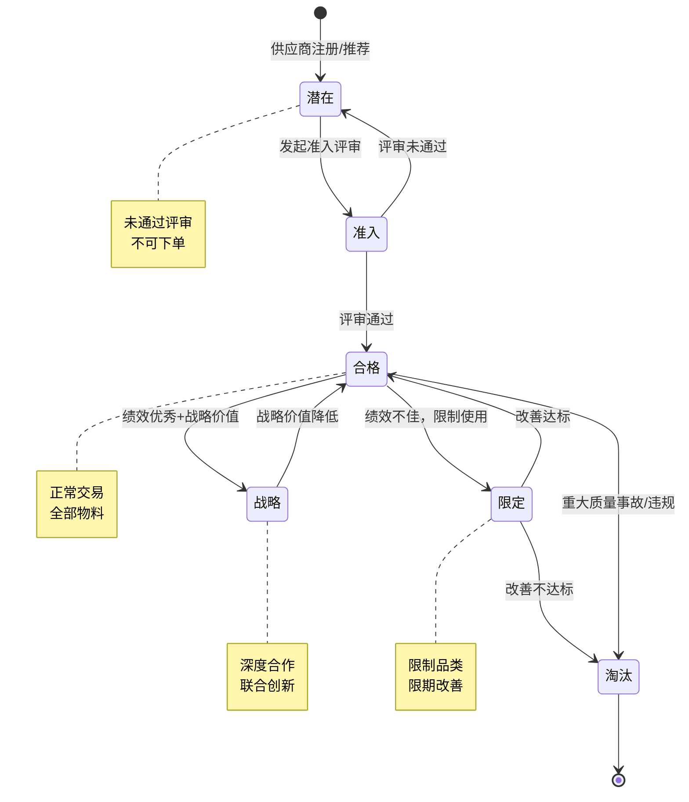
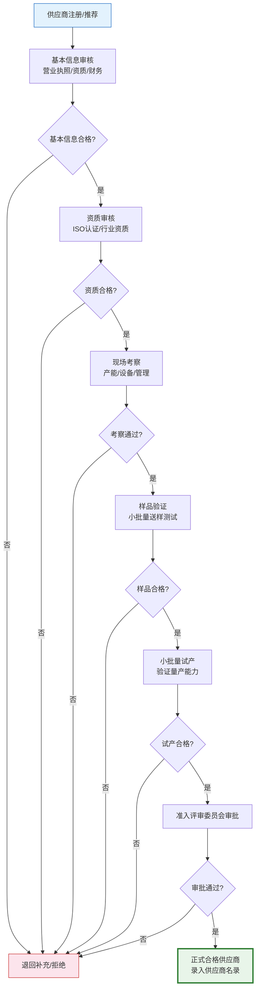
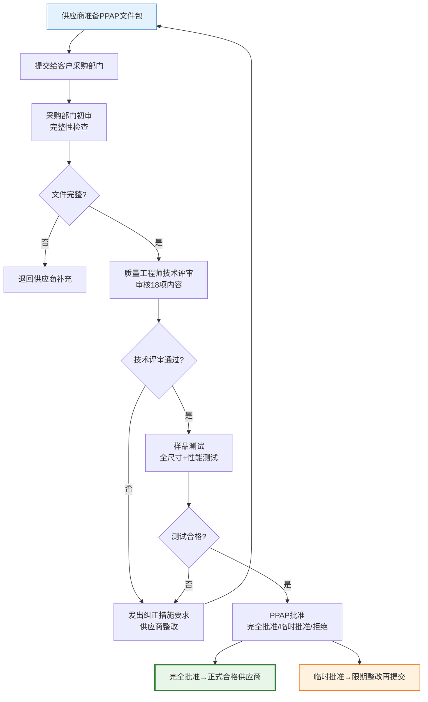

# 供应商准入与评估

供应商准入是供应链质量的第一道关口。选择合适的供应商不仅决定了物料质量，更直接影响企业的生产效率和产品竞争力。本文深入解析供应商全生命周期、准入流程、评估维度及分类策略。

## 1. 供应商生命周期

供应商从接触到淘汰经历完整的生命周期管理：



### 生命周期各阶段说明

| 阶段 | 说明 | 交易权限 | 管理策略 |
|------|------|---------|---------|
| **潜在** | 已注册但未通过评审 | 不可下单 | 定期评估是否启动准入 |
| **准入** | 正在走准入流程 | 限样品采购 | 跟踪准入进度 |
| **合格** | 通过评审，正常交易 | 全品类采购 | 定期绩效评估 |
| **战略** | 核心供应商，深度合作 | 优先分配份额 | 战略协同、联合创新 |
| **限定** | 质量或交付问题，限制使用 | 限定品类/金额 | SIP改善计划 |
| **淘汰** | 不再合作 | 不可下单 | 处理善后、数据归档 |

## 2. 准入流程

供应商准入是一个多步骤的严格评审过程：



### 各步骤详解

| 步骤 | 负责人 | 评审内容 | 通过标准 | 周期 |
|------|--------|---------|---------|------|
| 基本信息审核 | 采购专员 | 营业执照、注册资本、经营年限 | 证照齐全、注册资本达标 | 3-5工作日 |
| 资质审核 | 质量工程师 | ISO9001、行业认证、专利 | 持有必要的认证证书 | 5-10工作日 |
| 现场考察 | 跨部门团队 | 产线设备、质量体系、产能 | 评分≥70分 | 1-2周 |
| 样品验证 | 研发/质量 | 尺寸、性能、可靠性 | 全部检测项合格 | 2-4周 |
| 小批量试产 | 生产/质量 | 量产一致性、交付能力 | 合格率≥98% | 4-8周 |
| 准入审批 | 评审委员会 | 综合评审所有信息 | 委员会一致通过 | 1-2周 |

## 3. 准入评审维度

供应商准入评审需要从多个维度综合评估：

| 维度 | 权重 | 评审内容 | 评分方法 |
|------|------|---------|---------|
| **资质** | 20% | 营业执照、行业认证、专利、信用评级 | 证照齐全+加分项 |
| **质量** | 30% | 质量体系、检测设备、历史质量数据 | 体系评分+现场审核 |
| **交付** | 15% | 产能、交期、地理位置、物流能力 | 产能匹配度+交期承诺 |
| **价格** | 20% | 价格水平、降本意愿、价格透明度 | 比价+TCO分析 |
| **财务** | 10% | 营收、利润率、资产负债率、现金流 | 财务健康度评分 |
| **技术** | 5% | 研发投入、创新能力、技术领先性 | 研发占比+专利数 |

### 评审打分表示例

| 评审项 | 满分 | 供应商A得分 | 供应商B得分 |
|--------|------|-----------|-----------|
| 营业执照齐全 | 5 | 5 | 5 |
| ISO9001认证 | 10 | 10 | 8 |
| IATF16949认证 | 10 | 10 | 0 |
| 质量体系运行 | 15 | 12 | 10 |
| 检测设备完备 | 10 | 8 | 9 |
| 产能满足需求 | 10 | 9 | 7 |
| 交期承诺合理 | 10 | 8 | 8 |
| 价格有竞争力 | 15 | 12 | 14 |
| 财务状况良好 | 10 | 8 | 6 |
| 研发投入充足 | 5 | 4 | 3 |
| **合计** | **100** | **86** | **70** |

## 4. 供应商分类——卡拉杰克矩阵

卡拉杰克矩阵（Kraljic Matrix）是供应商分类的经典模型，从采购金额和供应风险两个维度将采购品类分为四类：

```mermaid
graph TB
    subgraph 卡拉杰克矩阵
        direction TB
        A[战略型<br/>高金额+高风险<br/>深度合作] B[杠杆型<br/>高金额+低风险<br/>竞争压价]
        C[瓶颈型<br/>低金额+高风险<br/>保障供应] D[常规型<br/>低金额+低风险<br/>简化管理]
    end

    A -.->|示例| A1[发动机ECU<br/>芯片<br/>关键原材料]
    B -.->|示例| B1[标准件<br/>包装材料<br/>通用耗材]
    C -.->|示例| C1[专用检具<br/>稀缺原材料<br/>专利部件]
    D -.->|示例| D1[办公用品<br/>MRO物料<br/>清洁用品]

    style A fill:#fce4ec,stroke:#c62828,stroke-width:3px
    style B fill:#fff3e0,stroke:#ef6c00,stroke-width:3px
    style C fill:#e3f2fd,stroke:#1565c0,stroke-width:3px
    style D fill:#e8f5e9,stroke:#2e7d32,stroke-width:3px
```

### 各类供应商的管理策略

| 供应商类型 | 金额 | 风险 | 管理策略 | 供应商数量 | 关系定位 |
|-----------|------|------|---------|-----------|---------|
| **战略型** | 高 | 高 | 深度合作、联合创新、长期锁定 | 1-2家 | 战略伙伴 |
| **杠杆型** | 高 | 低 | 竞争招标、压低价格、定期切换 | 3-5家 | 竞争对手 |
| **瓶颈型** | 低 | 高 | 保障供应、签订长期合同、开发替代 | 1-2家+1家备选 | 受限依赖 |
| **常规型** | 低 | 低 | 简化流程、目录采购、自动化 | 不限 | 交易关系 |

## 5. 真实案例：汽车行业供应商PPAP审核流程

PPAP（Production Part Approval Process，生产件批准程序）是汽车行业供应商准入的核心标准（IATF 16949要求）：

### PPAP提交等级

| 等级 | 提交内容 | 适用场景 |
|------|---------|---------|
| **等级1** | 仅提交保证书（PSW） | 低风险、经验证的供应商 |
| **等级2** | PSW + 产品样品 + 有限数据 | 一般变更 |
| **等级3** | PSW + 产品样品 + 完整数据 | 新产品/新供应商 |
| **等级4** | PSW + 完整数据（无样品） | 供应商有其他客户已批准 |
| **等级5** | PSW + 产品样品 + 完整数据（现场评审） | 高风险产品 |

### PPAP 18项提交要求

| 序号 | 提交项 | 说明 | 是否必须 |
|------|--------|------|---------|
| 1 | 设计记录 | 产品图纸、CAD模型 | 是 |
| 2 | 工程变更文件 | 变更申请与批准 | 视情况 |
| 3 | 客户工程批准 | 客户对设计的批准 | 视情况 |
| 4 | 设计FMEA | 设计失效模式分析 | 视情况 |
| 5 | 过程流程图 | 制造过程流程 | 是 |
| 6 | 过程FMEA | 过程失效模式分析 | 是 |
| 7 | 控制计划 | 质量控制计划 | 是 |
| 8 | MSA测量系统分析 | 测量系统误差分析 | 是 |
| 9 | 尺寸结果 | 全尺寸测量报告 | 是 |
| 10 | 材料/性能试验结果 | 材料和性能测试 | 是 |
| 11 | 初始过程研究 | SPC过程能力研究 | 是 |
| 12 | 合格实验室文件 | 实验室资质 | 是 |
| 13 | 外观批准报告（AAR） | 外观件批准 | 外观件必须 |
| 14 | 样品生产件 | 代表性样品 | 是 |
| 15 | 标准样品 | 保留的参考样品 | 是 |
| 16 | 检具记录 | 检测工具记录 | 视情况 |
| 17 | 客户特殊要求 | 客户特定要求 | 视情况 |
| 18 | 零件提交保证书（PSW） | 综合保证声明 | 是 |

### PPAP审核流程



## 小结

- 供应商生命周期包含潜在→准入→合格→战略→淘汰五个核心阶段
- 准入流程包括基本信息审核→资质审核→现场考察→样品验证→小批量试产→准入审批
- 准入评审需从资质、质量、交付、价格、财务、技术多维度综合评估
- 卡拉杰克矩阵从金额和风险两个维度将供应商分为战略/杠杆/瓶颈/常规四类
- 汽车行业PPAP审核是供应商准入的标杆实践，18项提交要求确保供应商的量产能力
