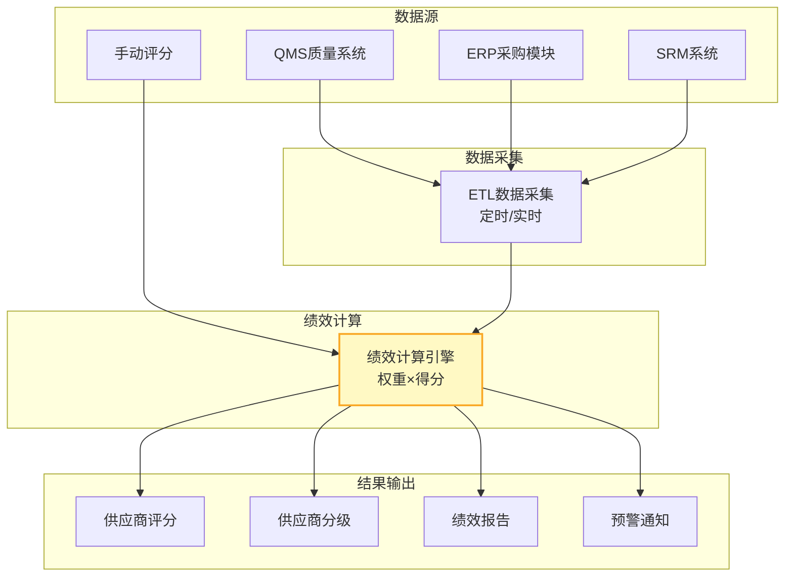
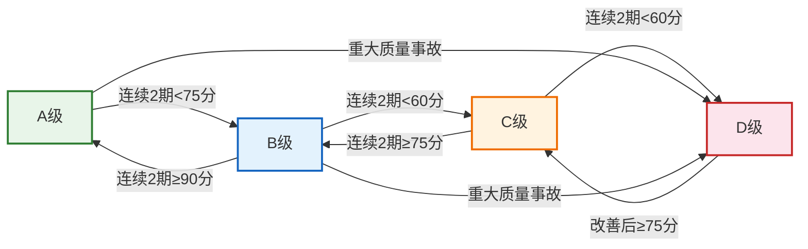
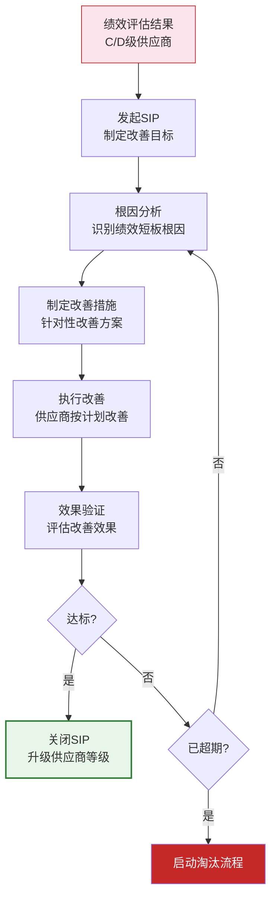
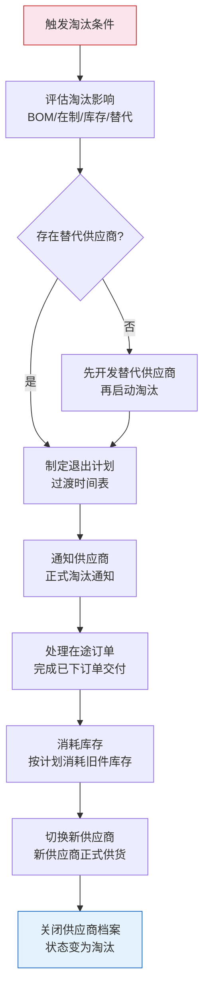
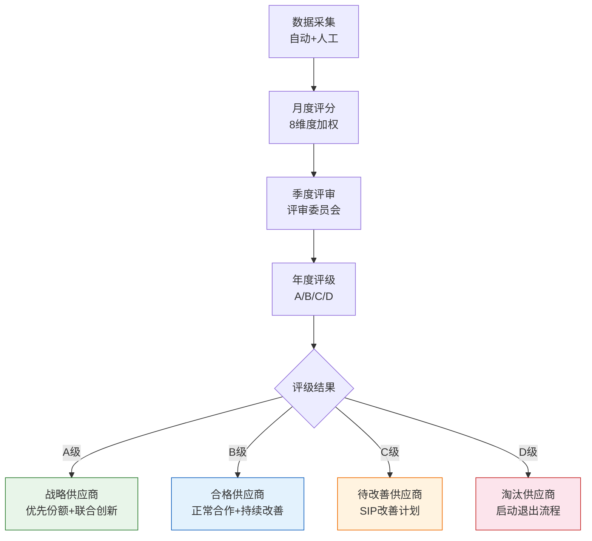

# 供应商绩效与分级

供应商绩效管理是SRM系统中持续优化供应链质量的核心机制。通过建立客观、量化的绩效评估体系，企业可以识别优秀供应商、推动一般供应商改善、淘汰不合格供应商，从而持续提升供应链竞争力。

## 1. 绩效评估体系QDCST

QDCST是业界最广泛使用的供应商绩效评估框架：

| 维度 | 英文 | 含义 | 核心指标 |
|------|------|------|---------|
| **Q** | Quality | 质量表现 | 批次合格率、PPM、质量事故次数 |
| **D** | Delivery | 交付表现 | 准时交付率、交期达成率 |
| **C** | Cost | 成本表现 | 价格竞争力、降本贡献 |
| **S** | Service | 服务表现 | 响应速度、问题解决效率 |
| **T** | Technology | 技术能力 | 研发投入、创新能力、技术领先性 |

### 各维度指标详解

#### 质量维度（Q）

| 指标 | 计算公式 | 目标值 | 数据来源 |
|------|---------|--------|---------|
| 来料批次合格率 | 合格批次/总检验批次×100% | ≥98% | 质检系统 |
| PPM缺陷率 | 不良品数/总检验数×100万 | ≤500 | 质检系统 |
| 质量事故次数 | 重大质量事故数 | 0 | 质量系统 |
| 8D响应及时率 | 按时回复8D/总8D数×100% | 100% | 质量系统 |

#### 交付维度（D）

| 指标 | 计算公式 | 目标值 | 数据来源 |
|------|---------|--------|---------|
| 准时交付率 | 准时交付订单/总订单×100% | ≥95% | 采购系统 |
| 交期达成率 | 实际交期≤承诺交期的比例 | ≥90% | 采购系统 |
| 订单完成率 | 完整交付订单/总订单×100% | ≥98% | 采购系统 |
| 紧急订单响应率 | 72h内响应/紧急订单数×100% | ≥90% | 采购系统 |

#### 成本维度（C）

| 指标 | 计算公式 | 目标值 | 数据来源 |
|------|---------|--------|---------|
| 价格竞争力 | 供应商价格/市场均价×100% | ≤100% | 采购系统 |
| 年度降本率 | (去年价格-今年价格)/去年价格×100% | ≥3% | 合同系统 |
| 付款条件 | 账期天数 | ≥60天 | 合同系统 |
| 隐性成本 | 急单加价、运费、返工等 | 低 | 采购系统 |

#### 服务维度（S）

| 指标 | 计算公式 | 目标值 | 数据来源 |
|------|---------|--------|---------|
| 投诉响应时间 | 从投诉到首次回复的时间 | ≤24h | SRM系统 |
| 问题解决周期 | 从投诉到关闭的时间 | ≤7天 | SRM系统 |
| 退货处理时效 | 从退货到补货的时间 | ≤5天 | 采购系统 |
| 供应商配合度 | 主观评分 | ≥80分 | 采购员评分 |

#### 技术维度（T）

| 指标 | 计算公式 | 目标值 | 数据来源 |
|------|---------|--------|---------|
| 研发投入比 | 研发费用/营收×100% | ≥5% | 供应商自报 |
| 专利数量 | 年度新增专利数 | 持续增长 | 专利库 |
| 技术方案质量 | 技术评审通过率 | ≥90% | 研发系统 |
| 新产品开发周期 | 从需求到样品的时间 | 按行业标杆 | 项目系统 |

## 2. 评分模型与权重设计

### 权重设计原则

不同类型的供应商，各维度的权重应有所差异：

| 供应商类型 | Q权重 | D权重 | C权重 | S权重 | T权重 | 说明 |
|-----------|-------|-------|-------|-------|-------|------|
| 战略型 | 30% | 15% | 10% | 15% | 30% | 技术创新是核心价值 |
| 杠杆型 | 20% | 20% | 40% | 15% | 5% | 成本竞争力是关键 |
| 瓶颈型 | 30% | 30% | 10% | 25% | 5% | 质量和交付是生命线 |
| 常规型 | 25% | 25% | 30% | 15% | 5% | 平衡质量与成本 |

### 评分计算方法

```
供应商总分 = Q得分×Q权重 + D得分×D权重 + C得分×C权重 + S得分×S权重 + T得分×T权重

示例（战略型供应商）：
Q得分: 92 × 30% = 27.6
D得分: 88 × 15% = 13.2
C得分: 80 × 10% = 8.0
S得分: 85 × 15% = 12.75
T得分: 95 × 30% = 28.5
───────────────────────
总分: 90.05
```

## 3. 绩效数据采集

### 自动采集 vs 手动采集

| 数据类型 | 采集方式 | 数据源 | 采集频率 |
|---------|---------|--------|---------|
| 来料批次合格率 | 自动 | 质检系统/QMS | 每批次 |
| 准时交付率 | 自动 | 采购系统/ERP | 每订单 |
| 价格竞争力 | 自动 | 采购系统 | 每季度 |
| 投诉响应时间 | 自动 | SRM系统 | 每次投诉 |
| 供应商配合度 | 手动 | 采购员评分 | 每季度 |
| 技术方案质量 | 手动 | 研发评审 | 每次评审 |



## 4. 供应商分级

基于绩效评分，将供应商分为A/B/C/D四个等级：

| 等级 | 评分范围 | 含义 | 采购份额 | 管理策略 |
|------|---------|------|---------|---------|
| **A级** | 90-100 | 优秀供应商 | 优先分配≥60% | 战略合作、联合创新 |
| **B级** | 75-89 | 良好供应商 | 正常分配30-60% | 维持合作、持续改善 |
| **C级** | 60-74 | 一般供应商 | 限制≤30% | SIP改善计划、限期提升 |
| **D级** | <60 | 不合格供应商 | 停止新订单 | 启动淘汰流程 |

### 分级调整规则



## 5. 绩效改善计划（SIP）

SIP（Supplier Improvement Plan）是帮助C/D级供应商改善绩效的系统性计划：

### SIP流程



### SIP改善计划模板

| 要素 | 说明 | 示例 |
|------|------|------|
| 供应商 | 目标供应商 | 供应商X |
| 绩效短板 | 需要改善的维度 | 交付维度得分62分 |
| 根因分析 | 短板的根本原因 | 产能不足+排产不合理 |
| 改善目标 | 期望达成的目标 | 3个月内交付率提升至90% |
| 改善措施 | 具体的改善行动 | 增加产线+优化排产算法 |
| 责任人 | 企业端跟踪人 | 采购经理张三 |
| 时间节点 | 改善里程碑 | 1月底完成产线扩展 |
| 验证方式 | 如何验证改善效果 | 每周统计交付率 |

## 6. 战略供应商管理

战略供应商是企业的核心合作伙伴，需要特殊的管理策略：

| 管理维度 | 普通供应商 | 战略供应商 |
|---------|-----------|-----------|
| 采购份额 | 按需分配 | 优先保障≥60% |
| 价格管理 | 竞争性比价 | 长期协议价+联合降本 |
| 信息共享 | 订单级信息 | 预测/产能/技术路线共享 |
| 联合创新 | 无 | ESI早期介入、联合研发 |
| 产能保障 | 按订单排产 | 签署产能保障协议 |
| 风险管理 | 供应商自行承担 | 联合风险预警与应对 |
| 人员对接 | 采购员对接 | 高管定期会晤 |

## 7. 供应商淘汰流程

供应商淘汰是供应链管理的最后手段，需要规范流程：



### 淘汰触发条件

| 触发条件 | 说明 | 紧急程度 |
|---------|------|---------|
| 连续3期D级 | 绩效持续不达标 | 常规 |
| 重大质量事故 | 造成产线停线或召回 | 紧急 |
| 安全合规违规 | 违反法律法规 | 紧急 |
| 经营异常 | 破产/停产/被收购 | 紧急 |
| 商业欺诈 | 虚假资质/行贿 | 立即 |

## 8. 真实案例：华为供应商绩效管理8大维度

华为的供应商绩效管理以全面和严格著称，评估维度覆盖8个方面：

| 维度 | 权重 | 核心指标 | 评估方式 |
|------|------|---------|---------|
| **质量** | 25% | 来料合格率、质量事故、8D关闭率 | 自动+人工 |
| **成本** | 20% | 价格竞争力、降本贡献、TCO | 自动+人工 |
| **交付** | 20% | 准时交付率、订单完成率、急单响应 | 自动 |
| **服务** | 10% | 响应速度、问题解决、客户满意度 | 人工 |
| **技术** | 10% | 技术领先性、方案质量、创新能力 | 人工 |
| **社会责任** | 5% | 环保合规、劳工权益、社区贡献 | 审核 |
| **信息安全** | 5% | 数据保护、网络安全、知识产权 | 审核 |
| **供应韧性** | 5% | 风险预警、BCP能力、替代方案 | 审核 |

### 华为供应商绩效评估流程



华为绩效管理的特色：
- **社会责任和信息安全**作为独立评估维度，体现企业的价值观
- **供应韧性**维度在疫情后得到高度重视
- 绩效数据自动采集率超过80%，减少人为干预
- 评级结果直接影响采购份额分配

## 小结

- QDCST五维度是供应商绩效评估的标准框架，各维度权重需按供应商类型差异化设计
- 绩效数据应尽量自动采集，减少人为干预，提升评估的客观性
- 供应商A/B/C/D分级决定采购份额和管理策略，分级调整需有明确规则
- SIP改善计划是帮助C/D级供应商提升的系统性方法
- 战略供应商需要特殊管理策略，包括联合创新、信息共享、产能保障
- 华为8维度绩效管理体系是业界标杆，值得借鉴
