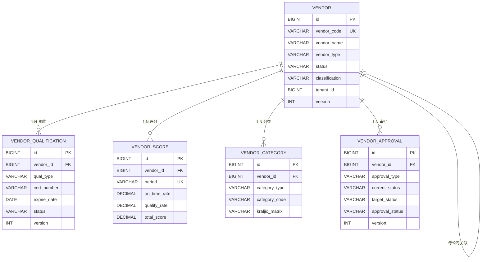
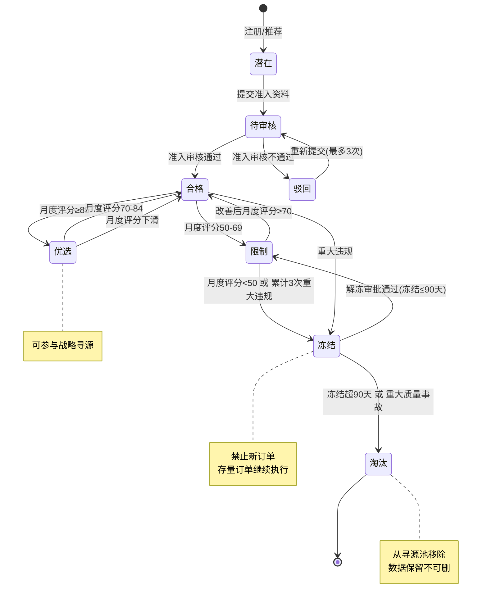

# 供应商主数据与数据库设计

供应商主数据是SRM系统的数据基石，它贯穿准入、寻源、合同、订单、评价全流程。高质量的供应商主数据设计直接影响系统的扩展性、查询性能和多租户隔离能力。本文从数据库表结构、ER关系、状态机、API接口到实战索引优化，为开发者提供完整的供应商数据层设计参考。

## 1. 核心表结构设计

### 1.1 VENDOR - 供应商主表

```sql
CREATE TABLE vendor (
    id                  BIGINT PRIMARY KEY AUTO_INCREMENT COMMENT '主键ID',
    vendor_code         VARCHAR(64) NOT NULL COMMENT '供应商编码（业务主键）',
    vendor_name         VARCHAR(256) NOT NULL COMMENT '供应商名称',
    short_name          VARCHAR(64) COMMENT '供应商简称',
    vendor_type         VARCHAR(32) NOT NULL COMMENT '类型(MANUFACTURER/DISTRIBUTOR/SERVICE)',
    status              VARCHAR(32) NOT NULL DEFAULT 'POTENTIAL' COMMENT '状态(POTENTIAL/PENDING_REVIEW/QUALIFIED/PREFERRED/RESTRICTED/FROZEN/ELIMINATED)',
    classification      VARCHAR(16) COMMENT '分级(STRATEGIC/KEY/ROUTINE/BOTTLENECK)',
    registration_date   DATE COMMENT '注册日期',
    qualified_date      DATE COMMENT '准入日期',
    country             VARCHAR(64) COMMENT '国家',
    province            VARCHAR(64) COMMENT '省份',
    city                VARCHAR(64) COMMENT '城市',
    address             VARCHAR(512) COMMENT '详细地址',
    postal_code         VARCHAR(16) COMMENT '邮编',
    legal_representative VARCHAR(64) COMMENT '法人代表',
    registered_capital  DECIMAL(18,2) COMMENT '注册资本',
    currency            VARCHAR(8) DEFAULT 'CNY' COMMENT '默认币种',
    payment_term        VARCHAR(32) COMMENT '付款条件(NET30/NET60/NET90)',
    tax_id              VARCHAR(64) COMMENT '税号',
    website             VARCHAR(256) COMMENT '公司网站',
    contact_name        VARCHAR(64) COMMENT '主联系人',
    contact_phone       VARCHAR(32) COMMENT '联系电话',
    contact_email       VARCHAR(128) COMMENT '联系邮箱',
    parent_vendor_id    BIGINT COMMENT '母公司ID（集团供应商关联）',
    is_active           TINYINT(1) DEFAULT 1 COMMENT '是否有效(0否/1是)',
    tenant_id           BIGINT NOT NULL COMMENT '租户ID',
    create_time         DATETIME NOT NULL DEFAULT CURRENT_TIMESTAMP COMMENT '创建时间',
    update_time         DATETIME NOT NULL DEFAULT CURRENT_TIMESTAMP ON UPDATE CURRENT_TIMESTAMP COMMENT '更新时间',
    version             INT NOT NULL DEFAULT 0 COMMENT '乐观锁版本号',
    UNIQUE KEY uk_vendor_code_tenant (vendor_code, tenant_id),
    INDEX idx_status (status),
    INDEX idx_classification (classification),
    INDEX idx_tenant (tenant_id),
    INDEX idx_name (vendor_name)
) COMMENT='供应商主表';
```

### 1.2 VENDOR_QUALIFICATION - 供应商资质表

```sql
CREATE TABLE vendor_qualification (
    id                  BIGINT PRIMARY KEY AUTO_INCREMENT COMMENT '主键ID',
    vendor_id           BIGINT NOT NULL COMMENT '供应商ID，关联vendor.id',
    qual_type           VARCHAR(64) NOT NULL COMMENT '资质类型(ISO9001/ISO14001/IATF16949/3C/CE/UL/其他)',
    cert_number         VARCHAR(128) COMMENT '证书编号',
    cert_scope          VARCHAR(512) COMMENT '认证范围',
    issuing_body        VARCHAR(256) COMMENT '发证机构',
    issue_date          DATE COMMENT '发证日期',
    expire_date         DATE COMMENT '到期日期',
    cert_file_key       VARCHAR(256) COMMENT '证书文件Key（OSS）',
    status              VARCHAR(16) NOT NULL DEFAULT 'PENDING' COMMENT '状态(PENDING/APPROVED/REJECTED/EXPIRED)',
    reviewed_by         VARCHAR(64) COMMENT '审核人',
    reviewed_at         DATETIME COMMENT '审核时间',
    review_comment      VARCHAR(512) COMMENT '审核意见',
    create_time         DATETIME NOT NULL DEFAULT CURRENT_TIMESTAMP COMMENT '创建时间',
    version             INT NOT NULL DEFAULT 0 COMMENT '乐观锁版本号',
    INDEX idx_vendor (vendor_id),
    INDEX idx_expire (expire_date),
    INDEX idx_status (status)
) COMMENT='供应商资质表';
```

### 1.3 VENDOR_SCORE - 供应商评分表

```sql
CREATE TABLE vendor_score (
    id                  BIGINT PRIMARY KEY AUTO_INCREMENT COMMENT '主键ID',
    vendor_id           BIGINT NOT NULL COMMENT '供应商ID，关联vendor.id',
    period              VARCHAR(7) NOT NULL COMMENT '评分周期(yyyy-MM)',
    on_time_rate        DECIMAL(5,2) COMMENT '准时交付率(%)',
    quality_rate        DECIMAL(5,2) COMMENT '质量合格率(%)',
    response_score      DECIMAL(5,2) COMMENT '响应评分(0-100)',
    service_score       DECIMAL(5,2) COMMENT '服务评分(0-100)',
    price_score         DECIMAL(5,2) COMMENT '价格竞争力(0-100)',
    total_score         DECIMAL(5,2) NOT NULL COMMENT '综合得分(0-100)',
    order_count         INT COMMENT '期间订单数',
    delivery_count      INT COMMENT '期间交付次数',
    quality_issue_count INT COMMENT '期间质量问题数',
    classification_after VARCHAR(16) COMMENT '评分后分级',
    create_time         DATETIME NOT NULL DEFAULT CURRENT_TIMESTAMP COMMENT '创建时间',
    UNIQUE KEY uk_vendor_period (vendor_id, period),
    INDEX idx_total_score (total_score),
    INDEX idx_period (period)
) COMMENT='供应商评分表';
```

### 1.4 VENDOR_CATEGORY - 供应商分类表

```sql
CREATE TABLE vendor_category (
    id                  BIGINT PRIMARY KEY AUTO_INCREMENT COMMENT '主键ID',
    vendor_id           BIGINT NOT NULL COMMENT '供应商ID，关联vendor.id',
    category_type       VARCHAR(32) NOT NULL COMMENT '分类类型(COMMODITY/INDUSTRY/KRALJIC)',
    category_code       VARCHAR(64) NOT NULL COMMENT '分类编码',
    category_name       VARCHAR(128) NOT NULL COMMENT '分类名称',
    is_primary          TINYINT(1) DEFAULT 0 COMMENT '是否主分类(0否/1是)',
    kraljic_matrix      VARCHAR(16) COMMENT '卡拉杰克矩阵位置(LEVERAGE/STRATEGIC/BOTTLENECK/NON_CRITICAL)',
    create_time         DATETIME NOT NULL DEFAULT CURRENT_TIMESTAMP COMMENT '创建时间',
    UNIQUE KEY uk_vendor_cat (vendor_id, category_type, category_code),
    INDEX idx_category_code (category_code),
    INDEX idx_kraljic (kraljic_matrix)
) COMMENT='供应商分类表';
```

### 1.5 VENDOR_APPROVAL - 供应商审批表

```sql
CREATE TABLE vendor_approval (
    id                  BIGINT PRIMARY KEY AUTO_INCREMENT COMMENT '主键ID',
    vendor_id           BIGINT NOT NULL COMMENT '供应商ID，关联vendor.id',
    approval_type       VARCHAR(32) NOT NULL COMMENT '审批类型(ADMISSION/RENEWAL/STATUS_CHANGE/ELIMINATION)',
    current_status      VARCHAR(32) COMMENT '当前状态',
    target_status       VARCHAR(32) COMMENT '目标状态',
    submitter           VARCHAR(64) NOT NULL COMMENT '提交人',
    submit_time         DATETIME NOT NULL COMMENT '提交时间',
    approval_node       INT NOT NULL DEFAULT 1 COMMENT '当前审批节点',
    total_nodes         INT NOT NULL DEFAULT 1 COMMENT '总审批节点数',
    approver            VARCHAR(64) COMMENT '当前审批人',
    approval_status     VARCHAR(16) NOT NULL DEFAULT 'PENDING' COMMENT '审批状态(PENDING/APPROVED/REJECTED/CANCELLED)',
    approval_comment    VARCHAR(512) COMMENT '审批意见',
    approved_at         DATETIME COMMENT '审批时间',
    create_time         DATETIME NOT NULL DEFAULT CURRENT_TIMESTAMP COMMENT '创建时间',
    version             INT NOT NULL DEFAULT 0 COMMENT '乐观锁版本号',
    INDEX idx_vendor (vendor_id),
    INDEX idx_approval_type (approval_type),
    INDEX idx_approver (approver),
    INDEX idx_status (approval_status)
) COMMENT='供应商审批表';
```

## 2. 表关系ER图



## 3. 供应商状态机

供应商状态机是SRM系统中最复杂的状态流转逻辑，必须严格定义合法流转路径：



### 状态机代码实现

```java
public enum VendorStatus {
    POTENTIAL, PENDING_REVIEW, QUALIFIED, PREFERRED,
    RESTRICTED, FROZEN, ELIMINATED, REJECTED
}

// 合法状态流转定义
private static final Map<VendorStatus, Set<VendorStatus>> TRANSITIONS = Map.of(
    POTENTIAL, Set.of(PENDING_REVIEW),
    PENDING_REVIEW, Set.of(QUALIFIED, REJECTED),
    REJECTED, Set.of(PENDING_REVIEW),
    QUALIFIED, Set.of(PREFERRED, RESTRICTED, FROZEN),
    PREFERRED, Set.of(QUALIFIED),
    RESTRICTED, Set.of(QUALIFIED, FROZEN),
    FROZEN, Set.of(RESTRICTED, ELIMINATED)
);

public boolean isTransitionAllowed(VendorStatus from, VendorStatus to) {
    return TRANSITIONS.getOrDefault(from, Set.of()).contains(to);
}
```

## 4. API设计

### 4.1 供应商CRUD

**创建供应商**：`POST /api/v1/vendors`

```json
// Request
{
    "vendorCode": "SUP-2024-001",
    "vendorName": "深圳市精密模具有限公司",
    "shortName": "精密模具",
    "vendorType": "MANUFACTURER",
    "country": "CN",
    "province": "广东省",
    "city": "深圳市",
    "address": "宝安区XX街道XX路XX号",
    "contactName": "李明",
    "contactPhone": "0755-12345678",
    "contactEmail": "liming@jingmi.com"
}

// Response 201
{
    "id": 10001,
    "vendorCode": "SUP-2024-001",
    "vendorName": "深圳市精密模具有限公司",
    "status": "POTENTIAL",
    "createTime": "2024-01-15T10:30:00Z",
    "version": 0
}
```

**查询供应商列表**：`GET /api/v1/vendors?status=QUALIFIED&page=0&size=20`

```json
// Response 200
{
    "content": [
        {
            "id": 10001,
            "vendorCode": "SUP-2024-001",
            "vendorName": "深圳市精密模具有限公司",
            "status": "QUALIFIED",
            "classification": "KEY",
            "categories": ["模具加工", "注塑件"],
            "latestScore": 82.5,
            "orderCount": 45
        }
    ],
    "totalElements": 128,
    "totalPages": 7,
    "number": 0,
    "size": 20
}
```

### 4.2 资质审核流程

**提交资质**：`POST /api/v1/vendors/{vendorId}/qualifications`

```json
// Request
{
    "qualType": "ISO9001",
    "certNumber": "CN-2024-Q-001234",
    "certScope": "金属精密模具的设计与制造",
    "issuingBody": "中国质量认证中心",
    "issueDate": "2023-06-01",
    "expireDate": "2026-05-31",
    "certFileKey": "srm/qual/SUP-2024-001_ISO9001.pdf"
}

// Response 201
{
    "id": 20001,
    "vendorId": 10001,
    "qualType": "ISO9001",
    "status": "PENDING",
    "createTime": "2024-02-20T14:00:00Z"
}
```

**审核资质**：`PUT /api/v1/vendors/{vendorId}/qualifications/{qualId}/review`

```json
// Request
{
    "action": "APPROVE",
    "comment": "证书有效，范围匹配"
}

// Response 200
{
    "id": 20001,
    "status": "APPROVED",
    "reviewedBy": "zhang.procurement",
    "reviewedAt": "2024-02-21T09:30:00Z"
}
```

### 4.3 绩效评分接口

**获取供应商评分**：`GET /api/v1/vendors/{vendorId}/scores?period=2024-01`

```json
// Response 200
{
    "vendorId": 10001,
    "period": "2024-01",
    "onTimeRate": 92.5,
    "qualityRate": 98.3,
    "responseScore": 85.0,
    "serviceScore": 80.0,
    "totalScore": 89.8,
    "orderCount": 12,
    "deliveryCount": 15,
    "qualityIssueCount": 0,
    "classificationAfter": "PREFERRED",
    "trend": "UP"
}
```

**手动触发评分**：`POST /api/v1/vendors/{vendorId}/scores/calculate`

```json
// Request
{
    "period": "2024-01"
}

// Response 200
{
    "vendorId": 10001,
    "period": "2024-01",
    "totalScore": 89.8,
    "classificationBefore": "QUALIFIED",
    "classificationAfter": "PREFERRED",
    "statusChanged": true
}
```

## 5. 多租户隔离设计

SRM系统通常以SaaS模式部署，多租户数据隔离是必须考虑的设计。

### 5.1 隔离策略对比

| 策略 | 数据安全 | 成本 | 运维复杂度 | 扩展性 | 适用场景 |
|------|---------|------|-----------|-------|---------|
| **独立数据库** | 最高 | 高 | 高 | 差 | 大客户、金融级 |
| **共享库独立Schema** | 高 | 中 | 中 | 中 | 中型租户 |
| **共享表tenant_id** | 中 | 低 | 低 | 好 | 中小租户、SaaS |

**推荐方案**：共享表+tenant_id字段（性价比最优），配合行级安全策略（RLS）。

### 5.2 MyBatis-Plus多租户实现

```java
@Component
public class TenantInterceptor implements InnerInterceptor {

    @Override
    public void beforeQuery(Executor executor, MappedStatement ms,
                            Object parameter, RowBounds rowBounds, ResultHandler resultHandler) {
        // 自动拼接 tenant_id 条件
        Long tenantId = TenantContext.getCurrentTenantId();
        if (tenantId != null) {
            // 通过SQL改写自动添加 WHERE tenant_id = ?
            PluginUtils.MPBoundSql mpBs = PluginUtils.mpBoundSql(ms);
            String originalSql = mpBs.sql();
            mpBs.sql(addTenantCondition(originalSql, tenantId));
        }
    }
}

// 配置拦截器
@Configuration
public class MybatisPlusConfig {

    @Bean
    public MybatisPlusInterceptor mybatisPlusInterceptor(TenantInterceptor tenantInterceptor) {
        MybatisPlusInterceptor interceptor = new MybatisPlusInterceptor();
        interceptor.addInnerInterceptor(tenantInterceptor);
        return interceptor;
    }
}
```

### 5.3 PostgreSQL RLS（行级安全）

```sql
-- 启用RLS
ALTER TABLE vendor ENABLE ROW LEVEL SECURITY;

-- 创建策略：每个租户只能看到自己的数据
CREATE POLICY tenant_isolation ON vendor
    USING (tenant_id = current_setting('app.current_tenant')::BIGINT);

-- 设置租户上下文（应用层每次请求设置）
SET app.current_tenant = '1001';
```

## 6. 卡拉杰克矩阵SQL查询

卡拉杰克矩阵是供应商分类的经典工具，按"供应风险"和"采购影响"两个维度将供应商分为四类：

```sql
-- 卡拉杰克矩阵分类查询
SELECT
    v.id AS vendor_id,
    v.vendor_code,
    v.vendor_name,
    vc.category_name,
    vc.kraljic_matrix,
    vs.total_score,
    CASE
        WHEN vc.kraljic_matrix = 'STRATEGIC' THEN '战略型：高影响高风险，深度合作'
        WHEN vc.kraljic_matrix = 'LEVERAGE' THEN '杠杆型：高影响低风险，竞价采购'
        WHEN vc.kraljic_matrix = 'BOTTLENECK' THEN '瓶颈型：低影响高风险，保障供应'
        WHEN vc.kraljic_matrix = 'NON_CRITICAL' THEN '非关键型：低影响低风险，简化管理'
        ELSE '未分类'
    END AS strategy
FROM vendor v
LEFT JOIN vendor_category vc ON v.id = vc.vendor_id AND vc.category_type = 'KRALJIC'
LEFT JOIN vendor_score vs ON v.id = vs.vendor_id
    AND vs.period = DATE_FORMAT(DATE_SUB(CURRENT_DATE, INTERVAL 1 MONTH), '%Y-%m')
WHERE v.tenant_id = :tenantId
  AND v.is_active = 1
  AND v.status IN ('QUALIFIED', 'PREFERRED')
ORDER BY
    FIELD(vc.kraljic_matrix, 'STRATEGIC', 'BOTTLENECK', 'LEVERAGE', 'NON_CRITICAL'),
    vs.total_score DESC;
```

## 7. 索引设计

### 7.1 核心索引清单

| 表 | 索引 | 类型 | 场景 |
|----|------|------|------|
| vendor | `(vendor_code, tenant_id)` | UNIQUE | 按编码查询 |
| vendor | `(status)` | NORMAL | 按状态筛选 |
| vendor | `(classification)` | NORMAL | 按分级筛选 |
| vendor | `(tenant_id)` | NORMAL | 多租户隔离 |
| vendor | `(vendor_name)` | NORMAL | 名称搜索 |
| vendor_qualification | `(vendor_id)` | NORMAL | 查供应商资质 |
| vendor_qualification | `(expire_date)` | NORMAL | 资质到期预警 |
| vendor_score | `(vendor_id, period)` | UNIQUE | 查评分历史 |
| vendor_score | `(total_score)` | NORMAL | 排名查询 |
| vendor_category | `(category_code)` | NORMAL | 按品类查供应商 |
| vendor_category | `(kraljic_matrix)` | NORMAL | 矩阵分析 |
| vendor_approval | `(approver, approval_status)` | NORMAL | 待办查询 |

### 7.2 复合索引优化建议

```sql
-- 供应商列表页高频查询（状态+租户+分类筛选）
CREATE INDEX idx_vendor_list ON vendor(status, tenant_id, classification);

-- 待审核查询（审批人+状态）
CREATE INDEX idx_approval_todo ON vendor_approval(approver, approval_status, submit_time);

-- 资质到期预警（状态+到期日）
CREATE INDEX idx_qual_expiry ON vendor_qualification(status, expire_date);
```

## 8. 开发者实战Tips

1. **供应商编码规则**：建议格式`SUP-{年份}-{序号}`，序号可配置流水长度，预留编码缺口
2. **资质到期预警**：定时任务每天检查30/60/90天内即将到期的资质，自动发送提醒
3. **评分历史不可修改**：VENDOR_SCORE记录一旦生成不可修改，只能追加新周期记录
4. **淘汰供应商数据保留**：淘汰不等于删除，历史订单、评分、资质数据必须完整保留用于审计
5. **多租户查询必须带tenant_id**：所有查询必须带tenant_id条件，建议通过拦截器自动注入，避免遗漏
6. **供应商名称模糊搜索**：大数据量时LIKE '%keyword%'走全表扫描，建议接入ES做全文检索
7. **审批流可配置化**：不同类型的审批（准入/变更/淘汰）流程不同，建议使用流程引擎（Flowable/Camunda）而非硬编码
8. **母公司关联**：集团供应商可能多个子公司共用，parent_vendor_id实现树形关联，查询时注意递归
