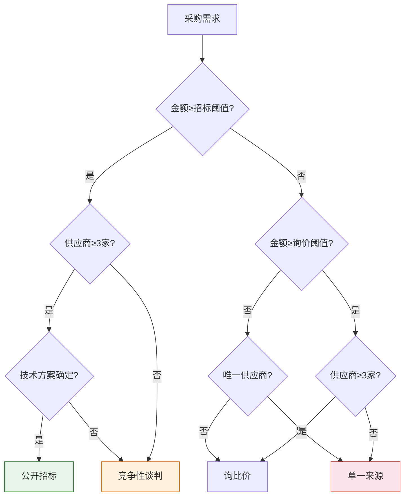
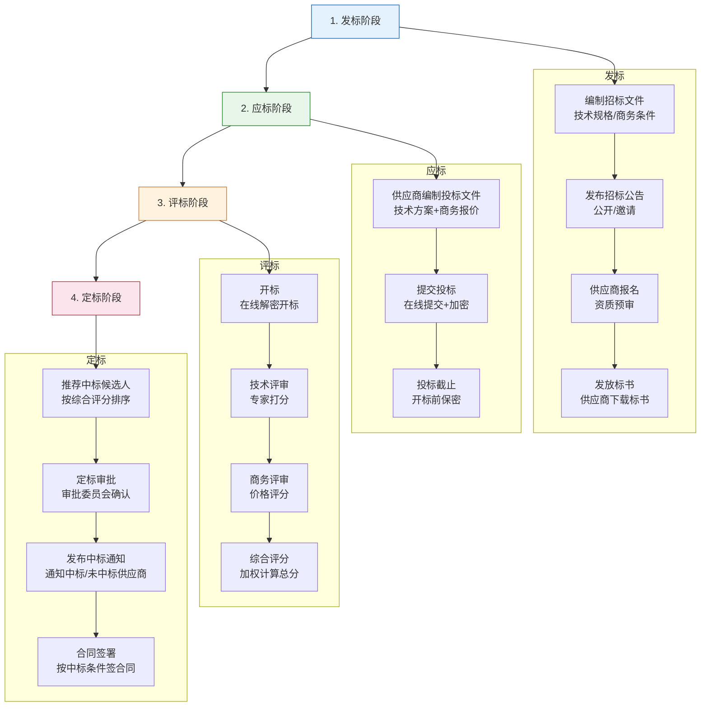
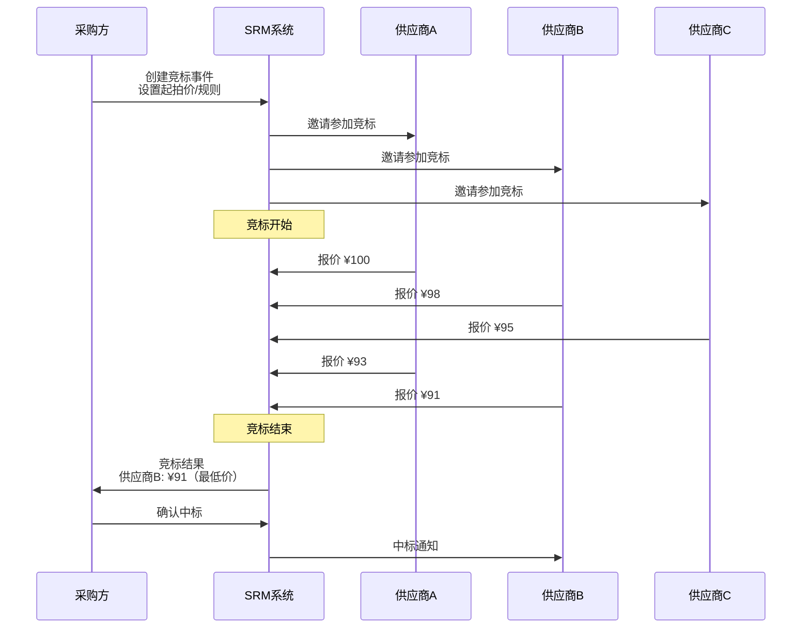
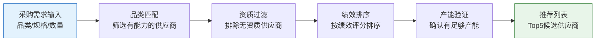
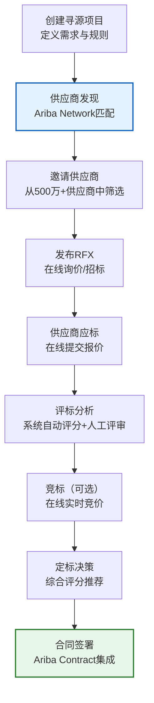

# 寻源与招投标

寻源（Sourcing）是采购活动的前端环节，决定了"从谁买、多少钱买"。通过规范的寻源流程和科学的评标模型，企业可以在保证质量的前提下实现最优采购成本。本文深入解析寻源模式、招投标流程、评标模型及智能寻源技术。

## 1. 寻源模式

不同的采购场景适用不同的寻源模式：

| 寻源模式 | 适用场景 | 竞争程度 | 透明度 | 采购方控制力 |
|---------|---------|---------|--------|------------|
| **公开招标** | 大额标准化采购 | 最高 | 最高 | 中等 |
| **邀请招标** | 技术复杂/专业性强的采购 | 高 | 高 | 较高 |
| **竞争性谈判** | 技术方案不确定 | 中 | 中 | 高 |
| **单一来源** | 专利/紧急/唯一供应商 | 最低 | 低 | 最高 |
| **询比价** | 小额标准品采购 | 中 | 中 | 中等 |

### 寻源模式选择决策



## 2. 招投标流程

标准的电子招投标流程包含四个阶段：



### 招标文件关键内容

| 文档部分 | 内容 | 编制要求 |
|---------|------|---------|
| **招标公告** | 项目名称、预算、资格要求、时间安排 | 信息完整、要求明确 |
| **技术规格** | 物料规格、技术标准、质量要求、检验方法 | 参数准确、无歧义 |
| **商务条件** | 付款方式、交货期、质保期、违约责任 | 条款清晰、风险可控 |
| **评标办法** | 评分标准、权重、中标规则 | 科学合理、公平公正 |
| **合同模板** | 采购合同的格式文本 | 法务审核、条款完备 |

## 3. 电子竞标与反向拍卖

电子竞标（e-Auction/反向拍卖）是一种高效的在线竞价模式：

### 竞标流程



### 竞标类型

| 类型 | 说明 | 适用场景 |
|------|------|---------|
| **英式拍卖（反向）** | 价格递减，最低价中标 | 标准化产品采购 |
| **日式拍卖** | 每轮淘汰最高价供应商 | 多供应商竞价 |
| **荷兰式拍卖** | 价格递增，第一个接受者中标 | 紧急采购 |

### 竞标规则

| 规则 | 说明 |
|------|------|
| 最低降价幅度 | 每次报价必须低于当前最低价一定比例（如1%） |
| 竞标时长 | 通常30-60分钟 |
| 自动延时 | 最后5分钟内有新报价则自动延时5分钟 |
| 匿名竞价 | 供应商看不到其他供应商的身份和报价 |
| 排名可见 | 供应商可以看到自己的排名 |

## 4. 评标模型

科学的评标模型是公正定标的基础：

### 综合评分法

| 评分维度 | 权重 | 评分项 | 评分方法 |
|---------|------|--------|---------|
| **技术评分** | 40% | 技术方案可行性 | 专家打分 |
| **技术评分** | | 业绩与资质 | 资质清单评分 |
| **技术评分** | | 售后服务方案 | 方案评审 |
| **商务评分** | 20% | 企业实力 | 财务/规模评分 |
| **商务评分** | | 履约能力 | 历史业绩评分 |
| **价格评分** | 40% | 报价竞争力 | 公式计算 |

### 价格评分公式

```
价格得分 = (最低有效报价 / 该供应商报价) × 价格满分

示例：
价格满分 = 40分
供应商A报价: ¥100万
供应商B报价: ¥95万（最低）
供应商C报价: ¥110万

供应商A价格得分 = (95/100) × 40 = 38分
供应商B价格得分 = (95/95) × 40 = 40分
供应商C价格得分 = (95/110) × 40 = 34.5分
```

### 综合评分示例

| 评分项 | 权重 | 供应商A | 供应商B | 供应商C |
|--------|------|---------|---------|---------|
| 技术评分 | 40% | 85 | 90 | 78 |
| 商务评分 | 20% | 88 | 82 | 90 |
| 价格评分 | 40% | 38 | 40 | 34.5 |
| **加权总分** | **100%** | **82.2** | **84.4** | **75.0** |

排名：供应商B > 供应商A > 供应商C → 推荐供应商B中标

## 5. 供应商推荐与智能匹配

现代SRM系统引入AI技术实现智能寻源：

### 智能匹配维度

| 匹配维度 | 说明 | 匹配方式 |
|---------|------|---------|
| **品类匹配** | 供应商是否具备该品类的供应能力 | 供应类别标签匹配 |
| **资质匹配** | 供应商是否具备必要的资质认证 | 资质库自动比对 |
| **绩效匹配** | 供应商历史绩效是否达标 | 绩效评分筛选 |
| **产能匹配** | 供应商是否有足够产能 | 产能数据匹配 |
| **区域匹配** | 供应商地理位置是否合适 | 地理围栏匹配 |
| **价格匹配** | 供应商价格是否有竞争力 | 历史价格参考 |

### 智能推荐流程



## 6. 真实案例：SAP Ariba寻源功能解析

SAP Ariba是全球领先的寻源管理平台，其寻源功能覆盖从需求到签约的全流程：

### Ariba Sourcing核心功能

| 功能模块 | 说明 | 核心价值 |
|---------|------|---------|
| **Sourcing Project** | 寻源项目管理 | 全流程管理寻源活动 |
| **RFX管理** | RFQ/RFP/RFI管理 | 标准化询价流程 |
| **Auction** | 在线竞标 | 实时竞价、降本增效 |
| **Supplier Discovery** | 供应商发现 | 从Ariba Network发现新供应商 |
| **Sourcing Library** | 寻源知识库 | 模板复用、最佳实践 |
| **Analytics** | 寻源分析 | 节约分析、供应商对比 |

### Ariba寻源典型流程



### Ariba供应商发现（Supplier Discovery）

Ariba Network拥有500万+供应商，提供智能发现功能：

| 发现方式 | 说明 | 匹配精度 |
|---------|------|---------|
| **品类搜索** | 按UNSPSC品类搜索供应商 | 高 |
| **地理位置** | 按地理位置筛选附近供应商 | 中 |
| **认证筛选** | 按认证资质筛选 | 高 |
| **推荐算法** | 基于历史采购数据推荐 | 高 |
| **同行参考** | 同行业企业采购的供应商 | 中 |

## 小结

- 寻源模式包括公开招标、邀请招标、竞争性谈判、单一来源、询比价，按场景选择
- 招投标流程包含发标、应标、评标、定标四个阶段
- 电子竞标通过实时竞价大幅降低采购成本，适用于标准化产品
- 综合评分法（技术+商务+价格加权）是最常用的评标模型
- AI智能寻源通过品类、资质、绩效、产能等多维度匹配推荐最优供应商
- SAP Ariba依托500万+供应商网络实现全球寻源，是业界标杆
