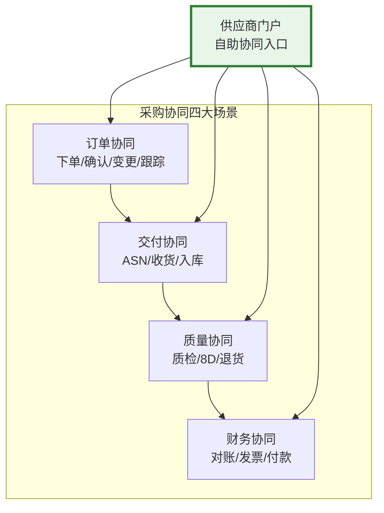
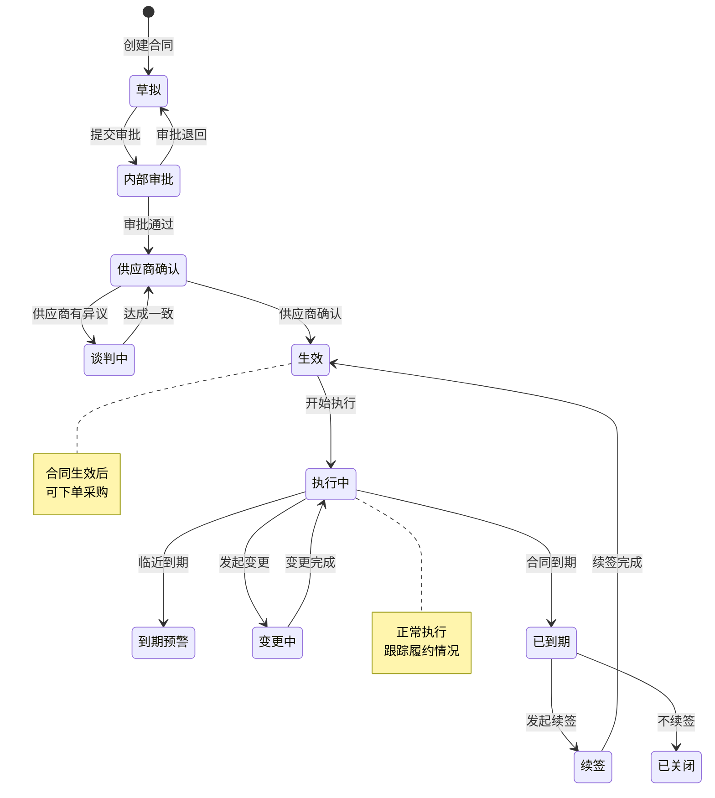
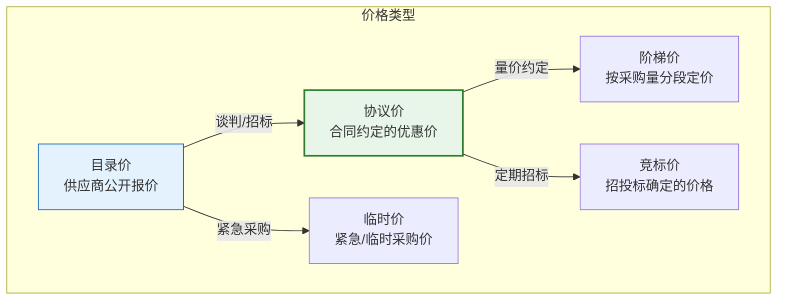
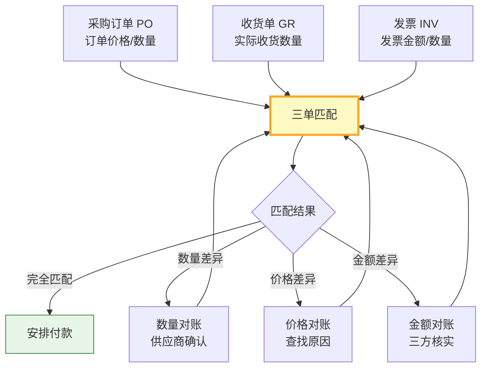
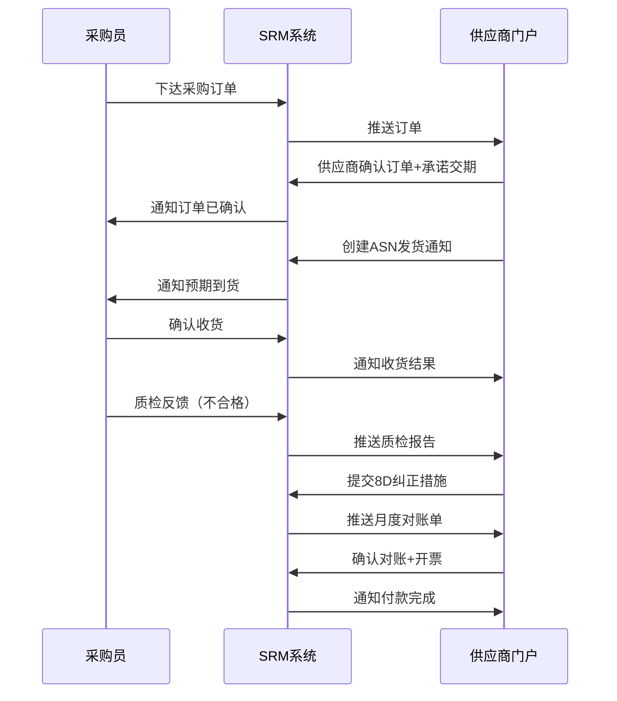

# 采购协同与合同管理

采购协同是SRM区别于传统采购系统的核心价值——让供应商从"被动接受订单"变为"主动参与协同"。合同管理则保障了采购交易的规范性和法律效力。本文深入解析采购协同场景、合同全生命周期管理、价格管理机制及对账结算流程。

## 1. 采购协同场景

SRM的采购协同覆盖订单、交付、质量、财务四大场景：

### 订单协同

| 协同环节 | 传统方式 | SRM协同方式 | 效率提升 |
|---------|---------|-----------|---------|
| 下达订单 | 邮件/传真 | 系统自动推送 | 50%+ |
| 确认订单 | 电话/邮件 | 供应商在线确认 | 70%+ |
| 订单变更 | 电话通知 | 系统自动通知+确认 | 60%+ |
| 订单跟踪 | 定期电话询问 | 实时查看状态 | 80%+ |

### 交付协同

| 协同环节 | 说明 | SRM功能 |
|---------|------|---------|
| ASN发货通知 | 供应商发货前通知 | 在线创建ASN，自动推送采购方 |
| 收货确认 | 采购方确认收货 | 扫码收货，系统自动更新 |
| 交期预警 | 临近交期提醒 | 自动预警，供应商更新预计交期 |
| 多次交付 | 分批交付管理 | 按行项跟踪交付进度 |

### 质量协同

| 协同环节 | 说明 | SRM功能 |
|---------|------|---------|
| 质检反馈 | 将质检结果反馈给供应商 | 系统自动推送质检报告 |
| 8D报告 | 供应商提交8D纠正措施 | 在线提交+审批8D |
| 退货管理 | 不合格品退货 | 在线退货申请+物流跟踪 |
| 质量会议 | 线上质量评审会议 | 在线会议+问题跟踪 |

### 财务协同

| 协同环节 | 说明 | SRM功能 |
|---------|------|---------|
| 对账 | 采购方与供应商对账 | 在线对账+差异标注 |
| 发票 | 供应商提交发票 | 在线开票+自动校验 |
| 付款 | 通知供应商付款 | 付款状态查询+提醒 |

## 2. 合同管理

### 合同类型

| 合同类型 | 说明 | 适用场景 | 期限 |
|---------|------|---------|------|
| **框架协议** | 约定合作框架和基本条款，不涉及具体数量 | 建立长期合作基础 | 1-3年 |
| **年度合同** | 约定年度采购量、价格和交付条件 | 年度采购计划明确 | 1年 |
| **一揽子订单（BLANKET）** | 约定总数量和价格，分批下单分批交付 | 需求稳定、长期采购 | 按需 |
| **单次合同** | 针对单次采购的合同 | 一次性采购 | 按订单 |

### 合同全生命周期管理

### 合同关键条款

| 条款类别 | 包含内容 | 风险关注 |
|---------|---------|---------|
| 价格条款 | 单价、币种、税率、调价机制 | 涨价风险、汇率风险 |
| 交付条款 | 交期、交货方式、包装要求 | 延期风险、运输风险 |
| 质量条款 | 质量标准、验收方式、质保期 | 质量风险 |
| 付款条款 | 付款方式、账期、发票要求 | 资金风险 |
| 违约条款 | 违约金、赔偿责任、解除条件 | 法律风险 |
| 保密条款 | 保密范围、保密期限、违约责任 | 信息泄露风险 |

## 3. 价格管理

### 价格类型体系

### 阶梯价管理

| 数量区间 | 单价 | 折扣率 | 适用条件 |
|---------|------|--------|---------|
| 1-99 | ¥100 | 无折扣 | 零星采购 |
| 100-499 | ¥95 | 5% | 小批量 |
| 500-999 | ¥90 | 10% | 常规采购 |
| 1000-4999 | ¥85 | 15% | 大批量 |
| 5000+ | ¥80 | 20% | 集中采购 |

### 价格调整机制

| 调整类型 | 触发条件 | 调整方式 | 审批要求 |
|---------|---------|---------|---------|
| **年度调价** | 合同约定年度调价窗口 | 按原材料指数调整 | 采购经理审批 |
| **原材料联动** | 原材料价格波动超阈值 | 按约定公式自动调整 | 系统自动 |
| **临时涨价** | 不可抗力导致成本上升 | 供应商申请+采购方审批 | 采购总监审批 |
| **降本协议** | VA/VE活动导致成本下降 | 按约定比例共享降本 | 采购经理审批 |

## 4. 对账与结算

### 三单匹配

三单匹配是采购财务控制的核心机制，确保只有匹配的采购才予付款：

### 对账流程

| 步骤 | 说明 | SRM功能 | 周期 |
|------|------|---------|------|
| 数据准备 | 汇总本期采购/收货/退货数据 | 系统自动汇总 | 每月初 |
| 供应商确认 | 供应商确认对账单数据 | 在线确认/标注差异 | 3工作日 |
| 差异处理 | 协商处理对账差异 | 在线沟通+差异调整 | 5工作日 |
| 对账确认 | 双方确认最终对账金额 | 电子签章确认 | 1工作日 |
| 开票 | 供应商按确认金额开票 | 在线开票 | 3工作日 |
| 付款 | 按合同账期安排付款 | 付款状态通知 | 按账期 |

### 结算方式

| 结算方式 | 说明 | 适用场景 | 优劣势 |
|---------|------|---------|--------|
| **月结** | 每月固定日期结算上月交易 | 常规采购 | 供应商资金压力大 |
| **票控** | 按发票金额控制付款 | 需要发票校验 | 规范但流程长 |
| **预付款** | 付款后供应商发货 | 定制件/长周期采购 | 采购方资金风险 |
| **货到付款** | 收货后付款 | 标准品采购 | 供应商资金压力大 |
| **承兑汇票** | 开具银行承兑汇票 | 大额采购 | 供应商有贴现成本 |

## 5. 协同看板（供应商门户）

供应商门户是SRM协同的核心界面，让供应商自助完成大部分协同工作：

### 门户功能模块

| 模块 | 功能 | 供应商操作 |
|------|------|-----------|
| **首页看板** | 待办事项、关键指标、预警通知 | 查看并处理待办 |
| **订单管理** | 查看订单、确认订单、更新交期 | 确认/拒绝订单 |
| **交付管理** | 创建ASN、跟踪物流、确认收货 | 发货通知 |
| **质量协同** | 查看质检结果、提交8D、退货处理 | 8D回复 |
| **对账管理** | 查看对账单、确认/标注差异 | 在线对账 |
| **发票管理** | 提交发票、查看付款状态 | 在线开票 |
| **绩效查询** | 查看自身绩效评分 | 自助查询 |
| **信息维护** | 更新公司信息、联系人、银行账户 | 自助维护 |

### 协同流程图

## 6. 真实案例：甄云SRM协同平台功能解析

甄云科技是国内领先的SRM平台提供商，其协同平台具有以下特色：

### 核心能力

| 功能模块 | 核心能力 | 差异化优势 |
|---------|---------|-----------|
| **供应商管理** | 全生命周期管理 | 深度适配中国供应商资质体系 |
| **寻源管理** | 招投标+竞价+谈判 | 支持多轮报价、在线述标 |
| **合同管理** | 全生命周期+电子签章 | 集成国内电子签章平台 |
| **订单协同** | 自助确认+交期管理 | 微信/钉钉消息推送 |
| **质量协同** | 8D+质量问题跟踪 | 支持图片/视频质检反馈 |
| **财务协同** | 三单匹配+对账+发票 | 集成金税系统自动开票 |

### 甄云SRM协同看板

| 看板类型 | 展示内容 | 受众 |
|---------|---------|------|
| **采购概览** | 采购总额/节约额/供应商数/待办数 | 采购管理 |
| **供应商分布** | A/B/C/D级供应商分布、区域分布 | 采购管理 |
| **订单执行** | 待确认/已确认/在途/逾期订单 | 采购执行 |
| **质量看板** | 来料合格率趋势、8D关闭率 | 质量管理 |
| **成本节约** | 节约金额、节约率、降本趋势 | 财务管理 |
| **风险预警** | 供应商资质到期、合同到期、交期风险 | 风险管理 |

### 甄云SRM与国内生态集成

| 集成对象 | 集成方式 | 集成内容 |
|---------|---------|---------|
| **SAP S4/HANA** | 标准接口 | 供应商/订单/收货/发票 |
| **用友NC/U8** | 标准接口 | 同上 |
| **金蝶EAS/云星空** | 标准接口 | 同上 |
| **企业微信/钉钉** | 消息推送 | 审批/提醒/待办 |
| **电子签章平台** | API集成 | 合同/对账单电子签章 |
| **金税系统** | API集成 | 发票开具/校验 |

## 小结

- 采购协同覆盖订单、交付、质量、财务四大场景，供应商门户是协同的核心入口
- 合同管理支持框架协议/年度合同/一揽子订单/单次合同四种类型，全生命周期管理
- 价格管理涵盖目录价/协议价/阶梯价/临时价/竞标价，需建立完整的调价机制
- 三单匹配（PO+GR+INV）是采购财务控制的核心机制
- 甄云SRM深度适配中国采购场景，在电子签章、金税集成等方面具有本土化优势
