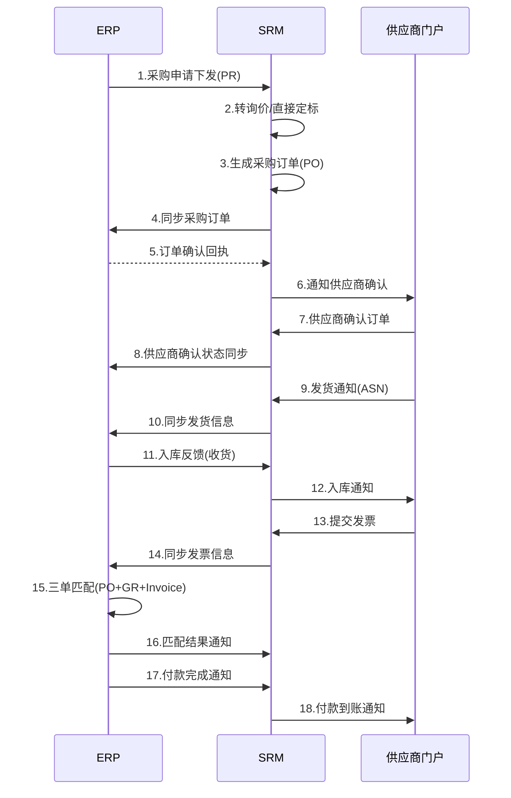
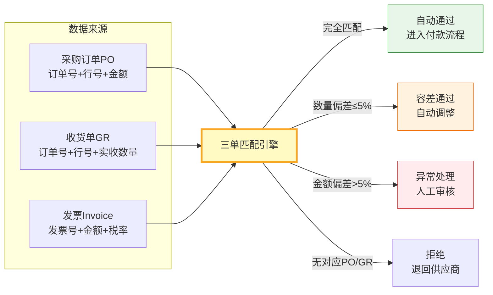
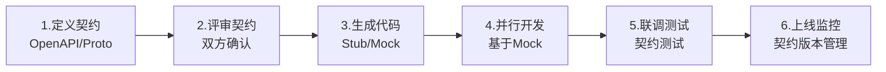

# 采购全流程接口设计

SRM系统不是孤岛，它与ERP、WMS、财务等系统深度集成，形成采购业务的完整数字化链路。接口设计的好坏直接决定了数据一致性、系统稳定性和运维效率。本文从接口矩阵、协议选型、幂等设计、异常处理到监控告警，为开发者提供完整的采购全流程接口设计参考。

## 1. SRM↔ERP接口矩阵

SRM与ERP的接口是采购集成的核心，覆盖从主数据同步到财务结算的完整链路：

| 接口编号 | 方向 | 接口名称 | 业务场景 | 数据内容 | 同步方式 | 频率 |
|---------|------|---------|---------|---------|---------|------|
| IF-001 | ERP→SRM | 物料主数据同步 | ERP新建物料同步至SRM | 物料编码、名称、规格、单位 | MQ | 实时 |
| IF-002 | ERP→SRM | 供应商主数据同步 | ERP供应商同步至SRM | 供应商编码、名称、银行信息 | MQ | 实时 |
| IF-003 | ERP→SRM | 采购申请下发 | ERP创建采购申请推至SRM | 申请号、物料、数量、需求日期 | MQ | 实时 |
| IF-004 | SRM→ERP | 采购订单下达 | SRM订单确认后同步ERP | 订单号、供应商、行项明细 | MQ | 实时 |
| IF-005 | ERP→SRM | 采购订单变更 | ERP修改订单推至SRM | 订单号、变更字段、新值 | MQ | 实时 |
| IF-006 | SRM→ERP | 交付确认反馈 | SRM确认收货同步ERP | 订单号、实收数量、批次号 | MQ | 实时 |
| IF-007 | SRM→ERP | 发票信息推送 | 供应商开票后同步ERP | 发票号、金额、关联订单 | MQ | 实时 |
| IF-008 | ERP→SRM | 付款状态回传 | ERP付款后通知SRM | 付款单号、金额、付款日期 | MQ | 实时 |
| IF-009 | ERP→SRM | 库存快照同步 | ERP库存数据推送SRM | 物料、仓库、可用量 | API | 每日 |
| IF-010 | SRM→ERP | 价格目录同步 | SRM合同价格同步ERP | 物料、供应商、含税价、有效期 | MQ | 实时 |

## 2. 接口协议与数据格式

### 2.1 REST API规范

同步类接口使用REST API，遵循以下规范：

```
基础URL: https://api.srm.example.com/v1
Content-Type: application/json
字符编码: UTF-8
时间格式: ISO 8601 (yyyy-MM-dd'T'HH:mm:ss'Z')
金额精度: DECIMAL(18,4)，单位统一为元
```

**通用请求头**：

| Header | 说明 | 示例 |
|--------|------|------|
| `X-Request-Id` | 唯一请求ID（幂等键） | `req-20240315-abc123` |
| `X-Timestamp` | 请求时间戳 | `1710489600000` |
| `X-Signature` | HMAC-SHA256签名 | `a1b2c3d4e5...` |
| `X-Source` | 调用方标识 | `ERP-SAP` |
| `Authorization` | OAuth2 Token | `Bearer xxx` |

**通用响应格式**：

```json
{
    "code": "0",
    "message": "success",
    "requestId": "req-20240315-abc123",
    "timestamp": "2024-03-15T10:30:00Z",
    "data": { }
}
```

**错误码规范**：

| 错误码 | 说明 | 处理方式 |
|-------|------|---------|
| `0` | 成功 | - |
| `40001` | 参数校验失败 | 修正参数重试 |
| `40002` | 数据不存在 | 确认数据后重试 |
| `40003` | 状态不允许操作 | 检查业务状态 |
| `40901` | 重复请求（幂等拦截） | 无需重试 |
| `50001` | 系统内部错误 | 查看日志，联系运维 |
| `50002` | 下游服务不可用 | 稍后重试 |

### 2.2 MQ消息格式

异步类接口使用消息队列，消息格式：

```json
{
    "messageId": "msg-20240315-001",
    "messageType": "PURCHASE_ORDER_CREATED",
    "source": "SRM",
    "target": "ERP",
    "timestamp": "2024-03-15T10:30:00Z",
    "correlationId": "PO-2024-001",
    "retryCount": 0,
    "payload": { }
}
```

## 3. SRM↔ERP订单协同详解

订单协同是SRM与ERP交互最频繁、最复杂的场景，涵盖从采购申请到付款的全链路。

### 3.1 订单协同时序图



### 3.2 采购申请下发接口

ERP将采购申请推至SRM，SRM根据规则自动转询价或直接定标：

**接口**：`POST /api/v1/procurement-requests`

```json
// Request
{
    "requestId": "req-erp-20240315-001",
    "prNumber": "PR-2024-0088",
    "prType": "STANDARD",
    "requester": "张三",
    "department": "生产部",
    "priority": "NORMAL",
    "lines": [
        {
            "lineNumber": 10,
            "materialCode": "MAT-001",
            "materialName": "304不锈钢板 2mm",
            "quantity": 500.0,
            "unit": "KG",
            "requiredDate": "2024-04-15",
            "suggestedVendor": "SUP-2024-001",
            "category": "原材料"
        }
    ]
}

// Response 200
{
    "code": "0",
    "message": "success",
    "requestId": "req-erp-20240315-001",
    "data": {
        "srmPrId": "SRM-PR-2024-0012",
        "status": "RECEIVED",
        "autoAction": "RFQ_CREATED",
        "rfqId": "RFQ-2024-0045"
    }
}
```

### 3.3 采购订单同步接口

SRM订单确认后推至ERP：

**接口**：MQ Topic `srm.erp.purchase-order.created`

```json
{
    "messageId": "msg-srm-20240316-001",
    "messageType": "PURCHASE_ORDER_CREATED",
    "source": "SRM",
    "target": "ERP",
    "correlationId": "PO-2024-0012",
    "payload": {
        "poNumber": "PO-2024-0012",
        "vendorCode": "SUP-2024-001",
        "vendorName": "深圳市精密模具有限公司",
        "contractNumber": "CT-2024-008",
        "currency": "CNY",
        "paymentTerm": "NET30",
        "deliveryAddress": "工厂A仓",
        "lines": [
            {
                "lineNumber": 10,
                "materialCode": "MAT-001",
                "quantity": 500.0,
                "unit": "KG",
                "unitPrice": 28.50,
                "taxRate": 0.13,
                "amount": 16102.50,
                "deliveryDate": "2024-04-10"
            }
        ],
        "totalAmount": 16102.50,
        "totalTaxAmount": 2093.33,
        "createdBy": "li.procurement",
        "createdAt": "2024-03-16T10:00:00Z"
    }
}
```

## 4. 与WMS接口

### 4.1 入库通知接口

供应商发货后，SRM将入库通知推送至WMS：

**接口**：`POST /api/v1/wms/inbound-notices`

```json
// Request
{
    "requestId": "req-srm-wms-001",
    "asnNumber": "ASN-2024-0033",
    "poNumber": "PO-2024-0012",
    "vendorCode": "SUP-2024-001",
    "expectedArrivalDate": "2024-04-10",
    "warehouseCode": "WH-A01",
    "lines": [
        {
            "lineNumber": 10,
            "materialCode": "MAT-001",
            "expectedQuantity": 500.0,
            "unit": "KG",
            "batchNumber": "B20240410-001",
            "inspectionRequired": true,
            "inspectionStandard": "IQCA-001"
        }
    ]
}
```

### 4.2 质检结果反馈接口

WMS质检完成后，将结果回传SRM：

**接口**：MQ Topic `wms.srm.inspection-result`

```json
{
    "messageType": "INSPECTION_RESULT",
    "payload": {
        "asnNumber": "ASN-2024-0033",
        "poNumber": "PO-2024-0012",
        "inspectionResult": "PARTIAL_PASS",
        "lines": [
            {
                "materialCode": "MAT-001",
                "inspectedQuantity": 500.0,
                "passedQuantity": 480.0,
                "failedQuantity": 20.0,
                "defectCode": "SIZE_DEVIATION",
                "defectDescription": "尺寸偏差超出公差范围",
                "disposition": "RETURN"
            }
        ],
        "inspector": "wang.quality",
        "inspectedAt": "2024-04-10T15:30:00Z"
    }
}
```

## 5. 与财务接口

### 5.1 三单匹配

三单匹配（PO + GR + Invoice）是采购付款的前提，SRM提供匹配数据，ERP执行匹配和付款：



### 5.2 发票推送接口

**接口**：MQ Topic `srm.finance.invoice.submitted`

```json
{
    "messageType": "INVOICE_SUBMITTED",
    "payload": {
        "invoiceNumber": "INV-2024-0056",
        "invoiceDate": "2024-04-15",
        "vendorCode": "SUP-2024-001",
        "vendorName": "深圳市精密模具有限公司",
        "poNumber": "PO-2024-0012",
        "currency": "CNY",
        "totalAmount": 16102.50,
        "taxAmount": 2093.33,
        "taxRate": 0.13,
        "invoiceType": "SPECIAL_VAT",
        "lines": [
            {
                "poLineNumber": 10,
                "materialCode": "MAT-001",
                "invoicedQuantity": 480.0,
                "unitPrice": 28.50,
                "amount": 13680.00,
                "taxAmount": 1778.40
            }
        ],
        "attachmentKeys": [
            "srm/invoice/INV-2024-0056.pdf"
        ]
    }
}
```

## 6. 接口幂等设计

幂等是分布式接口的基石，确保同一请求多次调用结果一致。

### 6.1 幂等实现方案

```java
@Service
@Slf4j
public class IdempotentService {

    @Autowired
    private RedisTemplate<String, String> redisTemplate;

    /**
     * 幂等检查与执行
     * @param requestId 唯一请求ID
     * @param ttl       锁定时间（秒）
     * @param action    业务操作
     */
    public <T> T executeWithIdempotency(String requestId, int ttl, Supplier<T> action) {
        // 1. 尝试获取幂等锁
        Boolean acquired = redisTemplate.opsForValue()
            .setIfAbsent("idempotent:" + requestId, "PROCESSING", ttl, TimeUnit.SECONDS);

        if (acquired == null || !acquired) {
            // 已存在，检查是否已完成
            String status = redisTemplate.opsForValue().get("idempotent:" + requestId);
            if ("COMPLETED".equals(status)) {
                log.info("幂等命中，请求已处理: {}", requestId);
                // 返回之前的结果
                String cachedResult = redisTemplate.opsForValue()
                    .get("idempotent:result:" + requestId);
                return JsonUtils.fromJson(cachedResult, new TypeReference<T>() {});
            }
            throw new BusinessException("请求正在处理中，请勿重复提交: " + requestId);
        }

        try {
            // 2. 执行业务操作
            T result = action.get();

            // 3. 缓存结果并标记完成
            redisTemplate.opsForValue()
                .set("idempotent:result:" + requestId, JsonUtils.toJson(result), ttl, TimeUnit.SECONDS);
            redisTemplate.opsForValue()
                .set("idempotent:" + requestId, "COMPLETED", ttl, TimeUnit.SECONDS);

            return result;
        } catch (Exception e) {
            // 执行失败，清除幂等锁，允许重试
            redisTemplate.delete("idempotent:" + requestId);
            throw e;
        }
    }
}
```

### 6.2 幂等Request-Id生成规则

```
格式: {source}-{业务类型}-{业务主键}-{时间戳}
示例: ERP-PO_CREATE-PO20240012-20240316100000
```

- `source`：调用方标识（ERP/SRM/WMS）
- `业务类型`：操作类型（PO_CREATE/INVOICE_SUBMIT/GR_CONFIRM）
- `业务主键`：业务单据号
- `时间戳`：请求发起时间

## 7. 接口监控与告警

### 7.1 监控指标

| 指标 | 采集方式 | 告警阈值 | 说明 |
|------|---------|---------|------|
| 接口响应时间 | APM埋点 | >3s(P3), >10s(P2), >30s(P1) | 延迟告警 |
| 成功率 | 日志统计 | <99%(P3), <95%(P2), <90%(P1) | 可用性告警 |
| MQ消息堆积 | Kafka Lag | >100(P3), >1000(P2), >5000(P1) | 消费延迟告警 |
| 接口调用量 | 统计计数 | 偏离基线±50% | 异常流量告警 |
| 幂等命中率 | 计数统计 | >10% | 可能存在重复调用 |

### 7.2 健康检查接口

```java
@RestController
@RequestMapping("/api/v1/health")
public class HealthController {

    @Autowired
    private ErpClient erpClient;

    @Autowired
    private WmsClient wmsClient;

    @GetMapping
    public HealthCheckResult check() {
        HealthCheckResult result = new HealthCheckResult();

        // 检查ERP连通性
        result.setErp(checkEndpoint("ERP", erpClient::ping));
        // 检查WMS连通性
        result.setWms(checkEndpoint("WMS", wmsClient::ping));
        // 检查MQ
        result.setMessageQueue(checkMqHealth());

        result.setHealthy(result.isAllHealthy());
        return result;
    }

    private EndpointHealth checkEndpoint(String name, Supplier<String> pingFn) {
        try {
            String response = pingFn.get();
            return EndpointHealth.healthy(name, response);
        } catch (Exception e) {
            return EndpointHealth.unhealthy(name, e.getMessage());
        }
    }
}
```

## 8. 异常处理

### 8.1 超时重试策略

```java
@Service
public class RetryableErpClient {

    @Retryable(
        value = { SocketTimeoutException.class, ConnectTimeoutException.class },
        maxAttempts = 3,
        backoff = @Backoff(delay = 1000, multiplier = 2, maxDelay = 10000)
    )
    public ErpResponse syncPurchaseOrder(PurchaseOrder order) {
        return erpRestTemplate.postForObject(
            "/api/v1/purchase-orders", order, ErpResponse.class);
    }

    @Recover
    public ErpResponse recoverSyncPurchaseOrder(Exception e, PurchaseOrder order) {
        log.error("ERP同步最终失败: poNumber={}, error={}", order.getPoNumber(), e.getMessage());
        // 记录失败日志，触发人工处理流程
        failedMessageRepo.save(FailedMessage.of(order, e.getMessage()));
        // 发送告警
        alertService.sendAlert("ERP同步失败", order.getPoNumber(), e.getMessage());
        return ErpResponse.fail("ERP同步失败，已转入人工处理");
    }
}
```

### 8.2 补偿事务

当订单同步到ERP成功但WMS入库通知失败时，需要补偿处理：

```java
@Service
public class OrderDeliverySaga {

    public DeliveryResult confirmDelivery(DeliveryRequest request) {
        String sagaId = IdGenerator.nextId();

        try {
            // Step 1: 更新SRM交付状态
            deliveryService.confirmDelivery(request);
            sagaContext.markDone("SRM_DELIVERY");

            // Step 2: 同步ERP收货
            erpClient.confirmGoodsReceipt(request);
            sagaContext.markDone("ERP_GR");

            // Step 3: 通知WMS入库
            wmsClient.notifyInbound(request);
            sagaContext.markDone("WMS_INBOUND");

            return DeliveryResult.success();

        } catch (WmsException e) {
            // 补偿：回滚ERP收货
            erpClient.cancelGoodsReceipt(request.getPoNumber());
            deliveryService.revertDelivery(request.getDeliveryId());
            return DeliveryResult.fail("WMS入库通知失败: " + e.getMessage());
        }
    }
}
```

## 9. 接口契约设计

### 9.1 契约优先开发流程



### 9.2 契约测试示例

```java
// 使用Spring Cloud Contract
@AutoConfigureStubRunner(ids = "com.example:erp-service:+:stubs:8080")
@SpringBootTest
public class ErpInterfaceContractTest {

    @Autowired
    private ErpClient erpClient;

    @Test
    public void shouldSyncPurchaseOrder() {
        PurchaseOrder order = new PurchaseOrder();
        order.setPoNumber("PO-TEST-001");
        order.setVendorCode("SUP-TEST-001");

        ErpResponse response = erpClient.syncPurchaseOrder(order);

        assertThat(response.getCode()).isEqualTo("0");
        assertThat(response.getData().getErpPoNumber()).isNotNull();
    }

    @Test
    public void shouldRejectDuplicateOrder() {
        // 同一订单号第二次请求应返回幂等拒绝
        PurchaseOrder order = new PurchaseOrder();
        order.setPoNumber("PO-TEST-DUP-001");

        erpClient.syncPurchaseOrder(order);
        ErpResponse response = erpClient.syncPurchaseOrder(order);

        assertThat(response.getCode()).isEqualTo("40901");
    }
}
```

## 10. 开发者实战Tips

1. **接口版本管理**：URL路径中带版本号（/v1/、/v2/），不兼容变更必须升版本，旧版本至少保留6个月
2. **签名验证**：所有接口必须验签（HMAC-SHA256），防止数据篡改和伪造请求
3. **大报文优化**：订单行项超过100行的报文建议压缩（gzip），MQ消息超过1MB考虑引用传递（传Key而非内容）
4. **熔断降级**：ERP/WMS不可用时自动熔断，SRM本地缓存关键数据，待恢复后补偿同步
5. **接口日志全链路追踪**：每个接口调用记录traceId，贯穿SRM→ERP→WMS全链路，方便排查问题
6. **消息顺序性**：同一订单的事件必须有序（Kafka同分区），避免先处理收货再处理订单的乱序问题
7. **数据对账机制**：每日定时对账SRM与ERP的订单/交付数据，发现差异自动告警
8. **灰度发布接口**：新接口上线时通过Feature Toggle控制流量，先5%→20%→50%→100%逐步放量
