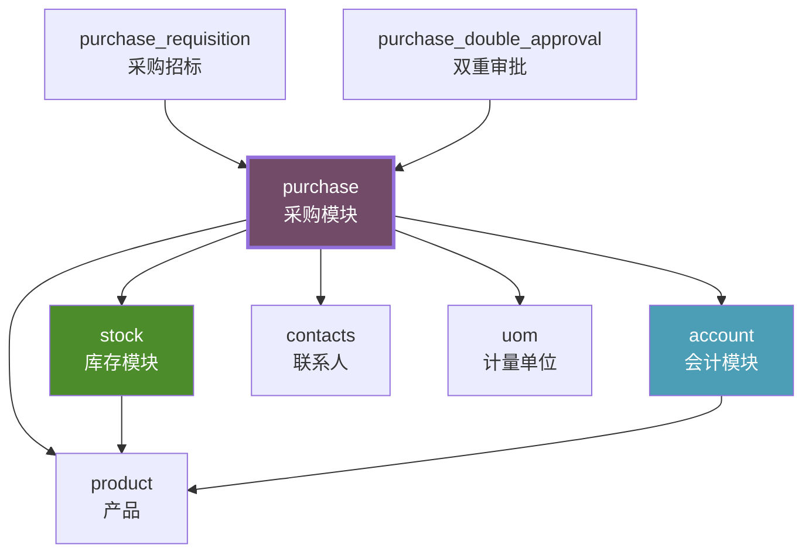
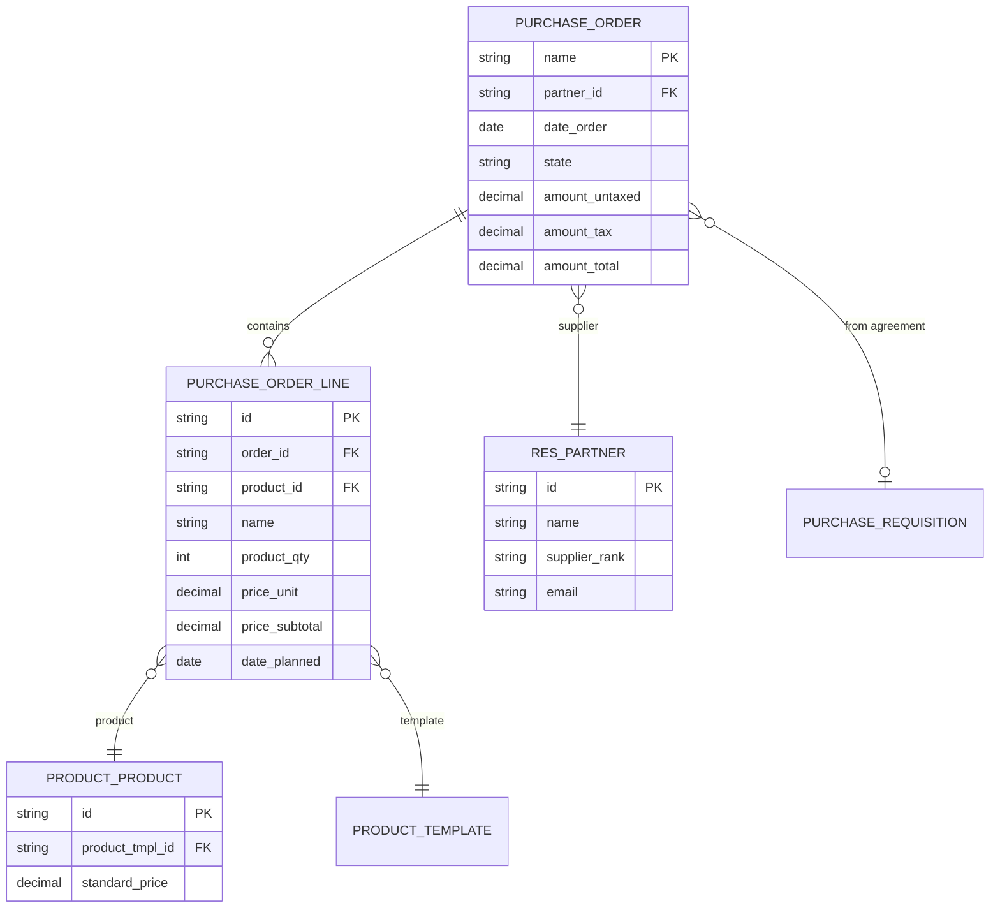
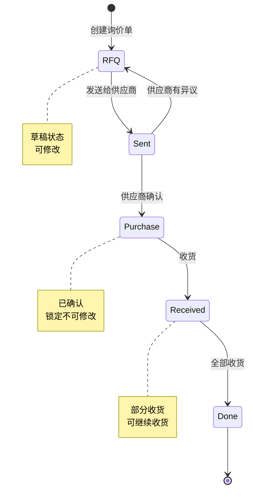
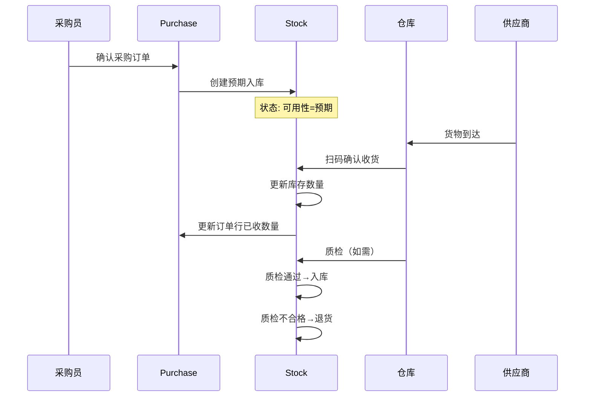
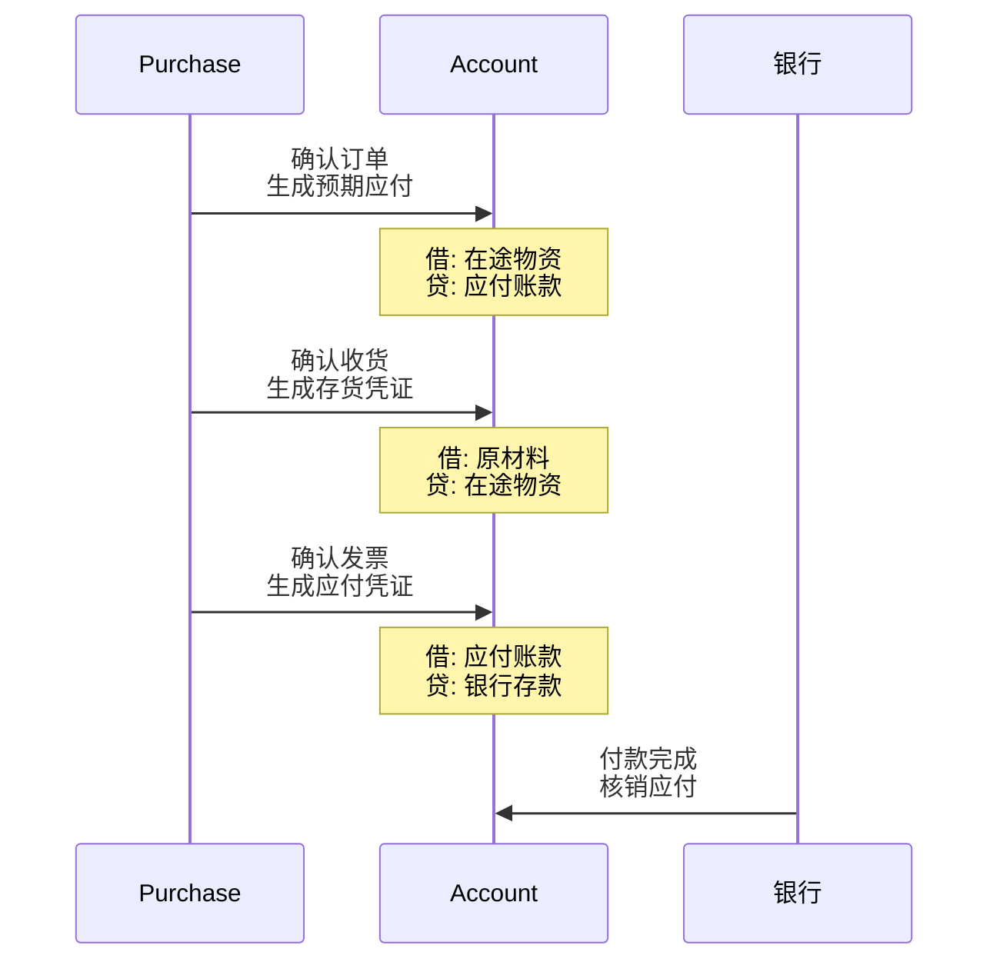
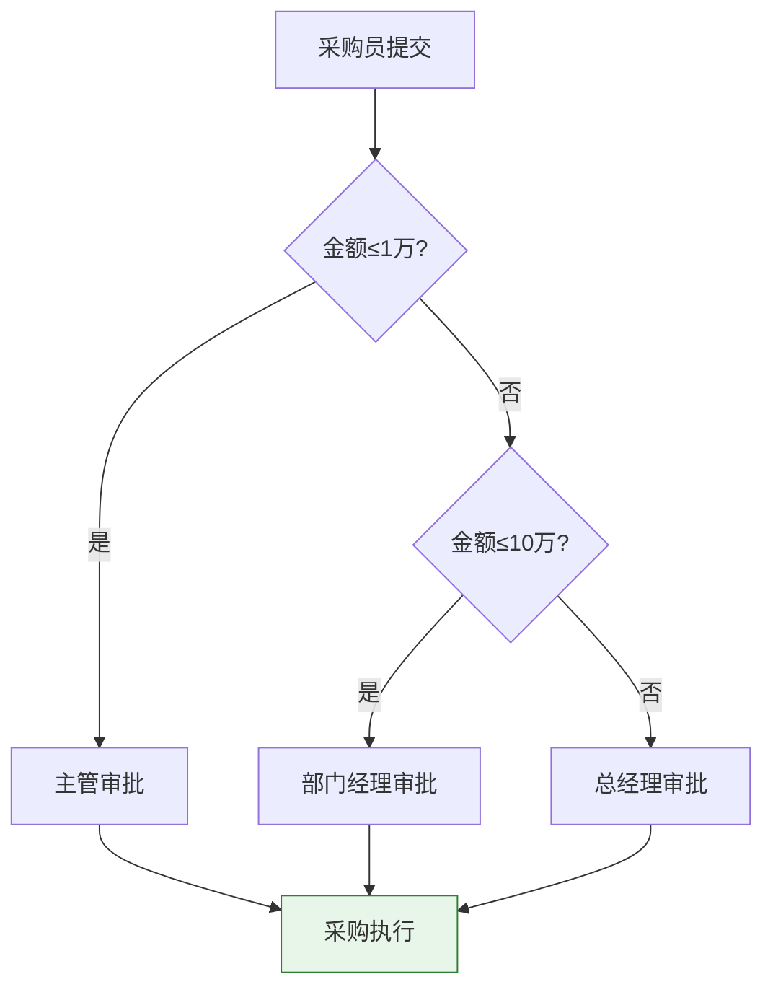

# Odoo采购模块深度解析

Odoo是全球最受欢迎的开源ERP系统，其Purchase（采购）模块提供了从采购申请到付款的完整采购流程管理。虽然Odoo Purchase不是专业的SRM系统，但它开源、免费、模块化的特点使其成为中小企业采购数字化的理想起点。本文深度解析Odoo Purchase的架构、功能、集成及二次开发。

## 1. Odoo Purchase模块架构

### 技术栈

| 层次 | 技术选型 | 说明 |
|------|---------|------|
| 前端 | OWL框架 + QWeb模板 | Odoo自研Web框架 |
| 后端 | Python + Odoo ORM | 基于ORM的业务逻辑 |
| 数据库 | PostgreSQL | 唯一支持的数据库 |
| 缓存 | Odoo内置ORM缓存 | 对象级缓存 |
| 任务队列 | Odoo Cron + 多Worker | 定时任务+异步处理 |

### 模块依赖关系



### 数据模型



## 2. 核心功能

### 采购全流程



### 采购申请（Purchase Requisition）

| 功能 | 说明 | 使用场景 |
|------|------|---------|
| 创建采购申请 | 部门提交采购需求 | 各部门统一提交需求 |
| 审批流程 | 按金额分级审批 | 控制采购权限 |
| 合并采购 | 多个申请合并为一张订单 | 集中采购降低成本 |
| 招标模式 | 向多个供应商询价比价 | 获取最优价格 |

### 询价单（RFQ）与订单（PO）

| 功能 | RFQ阶段 | PO阶段 |
|------|---------|--------|
| 修改 | 自由修改 | 需变更单 |
| 发送 | 可发送给多个供应商 | 已确认给指定供应商 |
| 价格 | 可谈判 | 已锁定 |
| 交付 | 供应商承诺 | 跟踪执行 |

### 收货与入库

| 功能 | 说明 | 与Stock模块集成 |
|------|------|----------------|
| 部分收货 | 支持分批收货 | 每次收货创建一条库存移动 |
| 超额收货 | 可配置是否允许超收 | 库存自动增加 |
| 退回 | 支持退回供应商 | 库存减少+创建贷项凭单 |
| 质检 | 可触发质检流程 | 质检通过后入库 |

### 发票与付款

| 功能 | 说明 | 与Account模块集成 |
|------|------|------------------|
| 三单匹配 | 订单+收货+发票匹配 | 自动生成会计凭证 |
| 批量开票 | 按收货单批量生成发票 | 统一生成应付凭证 |
| 账单控制 | 可按订单或收货控制开票 | 灵活的应付管理 |
| 付款 | 手动/自动付款 | 银行对账核销 |

## 3. 与Inventory/Accounting集成

### 采购→库存数据流



### 采购→会计数据流



### 关键集成配置

| 配置项 | 说明 | 会计影响 |
|--------|------|---------|
| 进货方式 | 步骤：收货→入库→质检 | 控制中间科目 |
| 开票控制 | 按订单/按收货开票 | 控制开票时机 |
| 产品计价 | 标准成本/移动平均/FIFO | 影响成本计算 |
| 估价科目 | 在途/暂估科目 | 控制估价凭证 |

## 4. 供应商门户

Odoo的供应商门户提供了基础的供应商自助协同功能：

| 门户功能 | 说明 | 供应商操作 |
|---------|------|-----------|
| 订单查看 | 查看分配给自己的订单 | 浏览订单详情 |
| 订单确认 | 确认或拒绝订单 | 在线确认 |
| 交期更新 | 更新预计交期 | 修改交期 |
| ASN发货通知 | 创建发货通知 | 在线创建 |
| 发票提交 | 提交发票 | 在线开票 |
| 信息维护 | 维护公司信息 | 自助更新 |

### 门户权限模型

| 权限 | 采购员 | 供应商（门户用户） |
|------|--------|------------------|
| 创建订单 | 是 | 否 |
| 查看订单 | 全部 | 仅自己的 |
| 修改订单 | 是 | 否 |
| 确认订单 | 否 | 是（自己订单） |
| 创建发票 | 否 | 是 |
| 查看库存 | 否 | 否 |

## 5. 工作流自定义

Odoo支持通过以下方式自定义采购审批流程：

### 基于规则的审批

| 规则类型 | 说明 | 示例 |
|---------|------|------|
| 金额规则 | 按订单金额分级审批 | ≤1万：主管审批，>1万：经理审批 |
| 部门规则 | 按采购部门分配审批人 | IT采购：CTO审批 |
| 品类规则 | 按物料品类分配审批人 | 原材料：生产总监审批 |

### 审批流配置



## 6. 部署实践

### 部署方式

| 部署方式 | 说明 | 适用场景 |
|---------|------|---------|
| **Odoo.sh** | 官方云托管 | 推荐，自动CI/CD |
| **Docker** | Docker Compose部署 | 自建，灵活配置 |
| **源码安装** | pip install + 配置 | 开发/测试 |

### Docker Compose部署

```yaml
# docker-compose.yml 示例
services:
  web:
    image: odoo:17.0
    depends_on:
      - db
    ports:
      - "8069:8069"
    volumes:
      - odoo-data:/var/lib/odoo
      - ./addons:/mnt/extra-addons
    environment:
      - HOST=db
      - USER=odoo
      - PASSWORD=odoo

  db:
    image: postgres:15
    environment:
      - POSTGRES_DB=postgres
      - POSTGRES_USER=odoo
      - POSTGRES_PASSWORD=odoo
    volumes:
      - db-data:/var/lib/postgresql/data

volumes:
  odoo-data:
  db-data:
```

### 生产环境配置

| 组件 | 推荐配置 | 说明 |
|------|---------|------|
| 应用服务器 | 4核8G+ | 按用户数扩展 |
| PostgreSQL | 4核16G+ SSD | 数据库性能关键 |
| Worker数 | CPU核心数×2+1 | `workers = 9`（4核） |
| 内存限制 | 每Worker 512MB | `limit_memory_hard = 512M` |

## 7. 二次开发

### 扩展采购订单

```python
# 自定义模块：添加供应商评分到采购订单
from odoo import models, fields

class PurchaseOrder(models.Model):
    _inherit = 'purchase.order'

    # 添加自定义字段
    supplier_grade = fields.Selection(
        [('a', 'A级-战略'), ('b', 'B级-合格'), ('c', 'C级-限定')],
        string='供应商等级',
        related='partner_id.supplier_grade',
        store=True,
    )

    approval_notes = fields.Text(string='审批备注')

    def button_confirm(self):
        # 重写确认方法，添加审批逻辑
        if self.amount_total > 100000 and self.supplier_grade == 'c':
            raise ValidationError('C级供应商不可下10万以上订单')
        return super().button_confirm()
```

### 自定义报表

| 报表类型 | 开发方式 | 说明 |
|---------|---------|------|
| PDF报表 | QWeb模板 | 采购订单打印 |
| Excel导出 | Python xlsxwriter | 采购汇总导出 |
| 仪表盘 | Odoo Dashboard | 采购KPI看板 |

## 8. 与商业SRM对比

| 能力维度 | Odoo Purchase | 专业SRM（Ariba/甄云） | 差距评估 |
|---------|-------------|---------------------|---------|
| 供应商管理 | 基础档案管理 | 全生命周期+绩效+分级 | 大 |
| 寻源管理 | 简单询比价 | 招投标+竞价+AI匹配 | 很大 |
| 合同管理 | 基础框架协议 | 全生命周期+电子签章 | 大 |
| 供应商协同 | 基础门户 | 全面协同+看板+消息推送 | 大 |
| 绩效管理 | 无 | QDCST多维度+自动采集 | 很大 |
| 质量协同 | 无 | 8D/退货/质量问题跟踪 | 很大 |
| 成本 | 免费开源 | 数十万~百万/年 | 优势明显 |
| 定制性 | 极高 | 有限 | 优势明显 |
| 上手难度 | 中等 | 低（但实施复杂） | 各有优劣 |

## 小结

- Odoo Purchase提供从采购申请到付款的完整流程，适合中小企业快速上线
- 与Inventory和Accounting模块深度集成，实现采购→库存→财务的数据闭环
- 供应商门户提供基础的供应商自助协同功能
- 工作流支持基于金额/部门/品类的自定义审批
- 二次开发基于Python+ORM，开发效率高、灵活性极强
- 与专业SRM在寻源、绩效、质量协同等方面差距较大，适合预算有限或需要深度定制的场景
