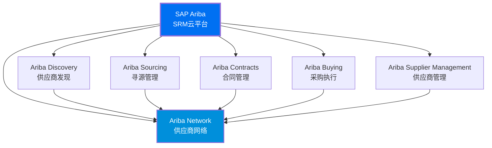
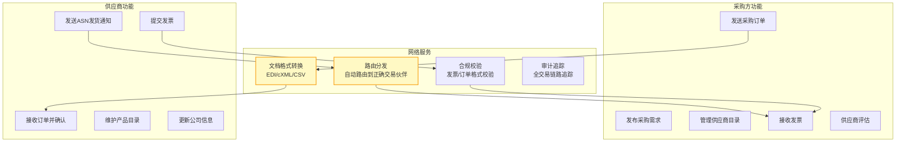
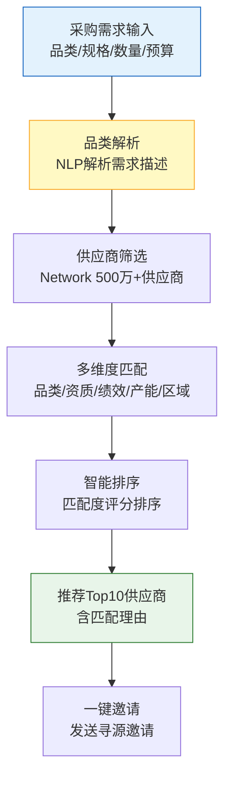
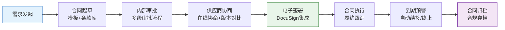
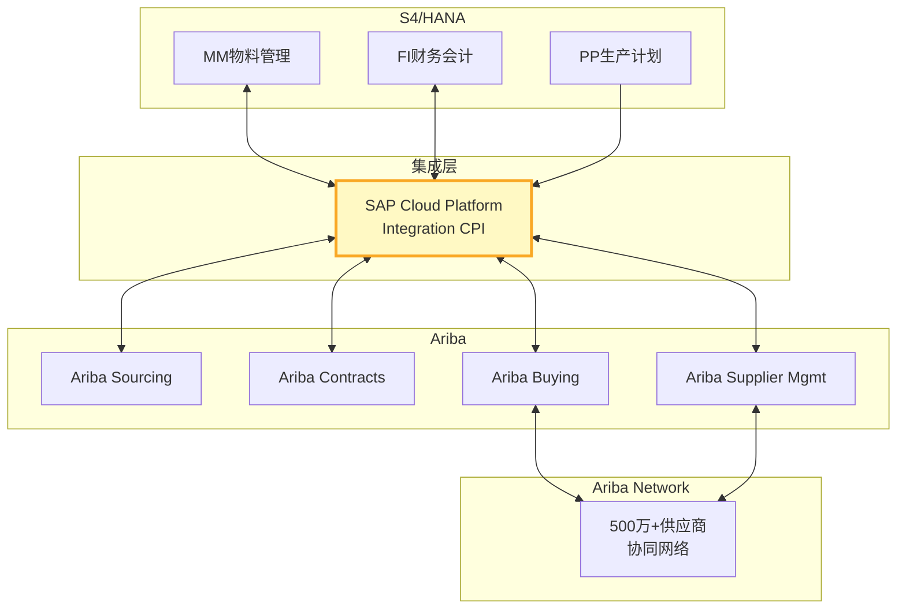

# SAP Ariba架构解析

SAP Ariba是全球市场占有率最高的SRM云平台，拥有超过500万家供应商的Ariba Network是全球最大的商业网络。本文深度解析Ariba的产品家族、技术架构、供应商网络、智能寻源及与S4/HANA的集成方案。

## 1. Ariba产品家族

SAP Ariba不是单一产品，而是一个由多个云应用组成的产品套件：



### 产品模块详解

| 模块 | 功能定位 | 核心能力 | 用户 |
|------|---------|---------|------|
| **Ariba Discovery** | 供应商发现与匹配 | 全球供应商搜索、AI智能推荐 | 采购方 |
| **Ariba Sourcing** | 寻源与招投标 | RFX管理、电子竞标、评标分析 | 采购方 |
| **Ariba Contracts** | 合同全生命周期管理 | 合同起草、审批、签署、执行 | 采购方+法务 |
| **Ariba Buying** | 采购执行 | 目录采购、订单管理、审批流程 | 采购方 |
| **Ariba Supplier Management** | 供应商信息与绩效管理 | 供应商档案、绩效评估、风险管理 | 采购方 |
| **Ariba Network** | 供应商网络与协同 | 订单协同、发票管理、目录维护 | 供应商+采购方 |

## 2. 技术架构

SAP Ariba运行在SAP BTP（Business Technology Platform）云平台上：

```mermaid
graph TB
    subgraph 用户接入
        WEB_UI[Web门户<br/>Ariba用户界面]
        MOBILE_UI[移动端<br/>SAP Ariba Mobile]
        API_INT[API集成<br/>S4/HANA集成]
    end

    subgraph SAP BTP云平台
        subgraph 应用服务
            SRC_S[寻源服务]
            CT_S[合同服务]
            BUY_S[采购服务]
            SM_S[供应商管理服务]
        end

        subgraph 平台服务
            ID_S[身份认证<br/>SAP IAS]
            WF_S[工作流引擎]
            AI_S[AI服务<br/>SAP AI Core]
            ANALY[分析服务<br/>SAP Analytics]
        end

        subgraph 数据服务
            HANA[(SAP HANA<br/>内存数据库)]
            OBJ[(对象存储)]
            SEARCH_S[搜索服务<br/>Elasticsearch]
        end
    end

    subgraph Ariba Network
        AN_SUP[500万+供应商<br/>全球商业网络]
        AN_DOC[文档交换<br/>订单/发票/ASN]
        AN_CAT[目录管理<br/>供应商目录]
    end

    WEB_UI --> SRC_S
    WEB_UI --> BUY_S
    MOBILE_UI --> BUY_S
    API_INT --> BUY_S

    SRC_S --> HANA
    CT_S --> HANA
    BUY_S --> HANA
    SM_S --> HANA

    BUY_S --> AN_SUP
    SRC_S --> AN_SUP
    BUY_S --> AN_DOC
    SM_S --> AN_CAT

    style SAP BTP云平台 fill:#0070F2,color:#fff
    style Ariba Network fill:#008FDB,color:#fff
```

### 技术架构特点

| 特点 | 说明 | 优势 |
|------|------|------|
| **云原生** | 基于SAP BTP云平台 | 弹性伸缩、自动升级 |
| **多租户** | SaaS多租户架构 | 共享基础设施、成本优化 |
| **微服务** | 各功能模块独立服务 | 独立部署、灵活扩展 |
| **AI集成** | 内置SAP AI能力 | 智能寻源、风险预测 |
| **全球部署** | 多区域数据中心 | 低延迟、数据合规 |

## 3. Ariba Network供应商网络

Ariba Network是全球最大的B2B商业网络，是Ariba的核心竞争力：

### 网络规模

| 指标 | 数量 | 说明 |
|------|------|------|
| 供应商数量 | 500万+ | 覆盖全球190+国家 |
| 采购方数量 | 50万+ | 全球各行业企业 |
| 年交易额 | 3万亿+美元 | 通过网络完成的交易 |
| 交易类型 | 订单/发票/ASN | 全流程电子化 |

### Ariba Network核心功能



### 文档交换协议

| 协议 | 说明 | 适用场景 |
|------|------|---------|
| **cXML** | 基于XML的B2B标准协议 | 与Ariba Network直接集成 |
| **EDI** | 电子数据交换标准 | 大型企业传统EDI系统 |
| **CSV** | 批量文件上传/下载 | 中小供应商简单操作 |
| **Web表单** | 浏览器在线填写 | 无系统的供应商 |

## 4. 智能寻源

SAP Ariba的智能寻源是其核心差异化能力：

### AI能力矩阵

| AI能力 | 说明 | 应用场景 |
|--------|------|---------|
| **供应商推荐** | 基于品类/区域/绩效推荐供应商 | 寻源阶段快速找到候选供应商 |
| **价格预测** | 基于历史数据预测合理价格 | 评标阶段判断报价合理性 |
| **风险预警** | 监控供应商经营/合规风险 | 持续监控供应商健康度 |
| **合同分析** | AI分析合同条款风险 | 合同评审阶段识别风险条款 |
| **支出分析** | 自动分类采购支出 | 采购策略制定 |

### 智能匹配流程



## 5. 合同生命周期管理

Ariba Contracts提供完整的合同全生命周期管理：



### 合同管理关键能力

| 能力 | 说明 | 价值 |
|------|------|------|
| **模板库** | 标准合同模板+条款库 | 起草效率提升80% |
| **条款库** | 标准条款+风险标记 | 降低法律风险 |
| **版本管理** | 合同版本对比+历史追溯 | 避免版本混乱 |
| **电子签署** | DocuSign/Adobe Sign集成 | 签署周期缩短90% |
| **履约跟踪** | 合同执行进度跟踪 | 确保合同落地 |
| **到期预警** | 合同到期自动提醒 | 避免合同过期风险 |

## 6. 与S4/HANA集成

SAP Ariba与SAP S4/HANA实现了业界最深度的SRM-ERP集成：

### 集成架构



### 关键集成场景

| 集成场景 | 数据流向 | 同步方式 | 说明 |
|---------|---------|---------|------|
| 供应商主数据 | S4→Ariba | 实时 | S4为主，Ariba同步 |
| 物料主数据 | S4→Ariba | 实时 | 物料编码统一 |
| 采购申请 | S4→Ariba | 实时 | S4创建申请，Ariba寻源 |
| 采购订单 | Ariba→S4 | 实时 | Ariba下单，S4执行 |
| 收货信息 | S4→Ariba | 实时 | S4收货，Ariba更新 |
| 发票校验 | Ariba→S4 | 实时 | Ariba提交发票，S4校验 |
| 付款信息 | S4→Ariba | 实时 | S4付款，Ariba通知供应商 |
| 合同信息 | 双向 | 实时 | Ariba创建合同，S4同步 |

### 预置集成包

SAP提供预置的集成包（Integration Package），开箱即用：

| 集成包 | 说明 | 配置复杂度 |
|--------|------|-----------|
| **Ariba-S4 Supplier** | 供应商主数据同步 | 低 |
| **Ariba-S4 Purchase** | 采购订单/收货同步 | 低 |
| **Ariba-S4 Invoice** | 发票同步 | 低 |
| **Ariba-S4 Contract** | 合同同步 | 中 |
| **Ariba-S4 Sourcing** | 寻源集成 | 中 |

## 7. 部署模式

| 模式 | 说明 | 适用场景 | 数据位置 |
|------|------|---------|---------|
| **标准SaaS** | Ariba公有云 | 大多数客户 | SAP数据中心 |
| **区域部署** | 选择数据中心区域 | 有数据驻留要求 | 指定区域 |
| **混合模式** | Ariba+S4混合 | 复杂IT架构 | 云+本地 |

### 数据中心分布

| 区域 | 数据中心位置 | 覆盖范围 |
|------|------------|---------|
| 北美 | 美国（弗吉尼亚/俄勒冈） | 美国、加拿大 |
| 欧洲 | 德国（法兰克福） | 欧盟国家 |
| 亚太 | 新加坡/日本/澳大利亚 | 亚太地区 |
| 中国 | 上海（通过SAP中国云） | 中国大陆 |

## 8. 适用场景分析

### 最适合Ariba的场景

| 场景 | 原因 | 预期价值 |
|------|------|---------|
| 跨国企业全球采购 | Ariba Network覆盖190+国家 | 全球供应商协同 |
| 大额采购寻源 | 智能寻源+电子竞标 | 降本5-15% |
| 供应商数量多 | 500万+供应商网络 | 快速发现和接入新供应商 |
| 已使用SAP ERP | 原生集成S4/HANA | 零成本集成 |
| 合规要求高 | 内置合规与审计 | 满足SOX/GDPR要求 |

### 不适合Ariba的场景

| 场景 | 原因 | 替代方案 |
|------|------|---------|
| 中小企业 | 成本过高 | Odoo Purchase / 企源SRM |
| 纯国内采购 | Ariba Network中国供应商占比低 | 甄云SRM |
| 高度定制需求 | SaaS定制性有限 | 自建SRM系统 |
| 非SAP ERP | 集成成本高 | 行业SRM或自建 |

## 小结

- SAP Ariba是全球最大的SRM云平台，产品套件覆盖发现→寻源→合同→采购→供应商管理全链路
- 技术架构基于SAP BTP云平台，采用微服务+多租户SaaS架构
- Ariba Network拥有500万+供应商，是全球最大的B2B商业网络，是Ariba的核心竞争壁垒
- 智能寻源通过AI实现供应商推荐、价格预测、风险预警等能力
- 与S4/HANA的预置集成包实现了业界最深的SRM-ERP集成
- Ariba适合大型跨国企业和SAP ERP客户，中小企业可考虑Odoo或本土SRM产品
