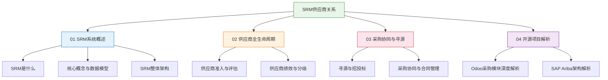

# SRM供应商关系

**SRM（Supplier Relationship Management）** 是企业与供应商之间从交易协同到战略合作的数字化管理平台。本教程系统讲解SRM的核心概念、数据模型、架构设计、供应商全生命周期管理、采购协同与寻源以及开源/商业产品深度解析。

## 学习路线

## 参考产品

| 产品 | 厂商 | 定位 | 核心优势 | 适用场景 |
|------|------|------|----------|---------|
| **SAP Ariba** | SAP | 全球化SRM云平台 | 500万+供应商网络、AI智能匹配 | 大型跨国企业 |
| **甄云SRM** | 甄云科技 | 本土化SRM | 深度适配中国采购场景、灵活配置 | 中国大型企业 |
| **企源SRM** | 企源科技 | 中型企业SRM | 轻量化、快速上线 | 中型制造企业 |
| **Odoo Purchase** | Odoo | 开源ERP采购模块 | 免费开源、模块化 | 中小企业 |

## 章节目录

- [01 SRM系统概述](01_SRM系统概述/) — SRM定义、核心概念、整体架构
- [02 供应商全生命周期](02_供应商全生命周期/) — 准入评估、绩效分级
- [03 采购协同与寻源](03_采购协同与寻源/) — 招投标、合同管理、采购协同
- [04 开源项目解析](04_开源项目解析/) — Odoo采购模块、SAP Ariba架构
