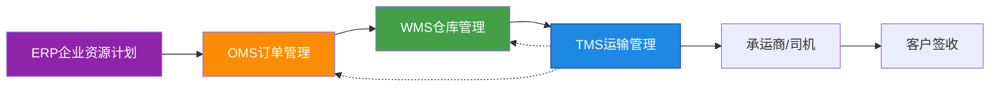
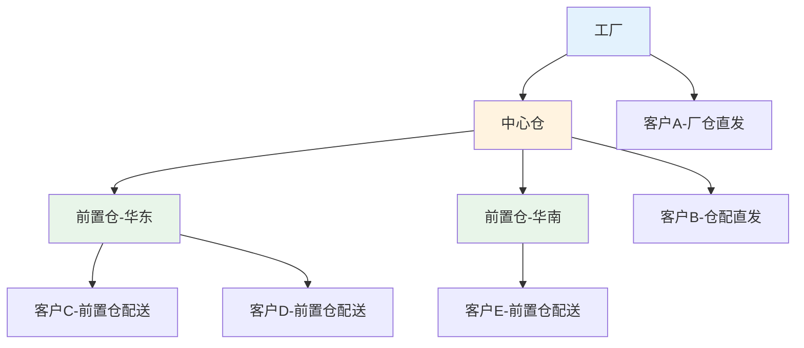
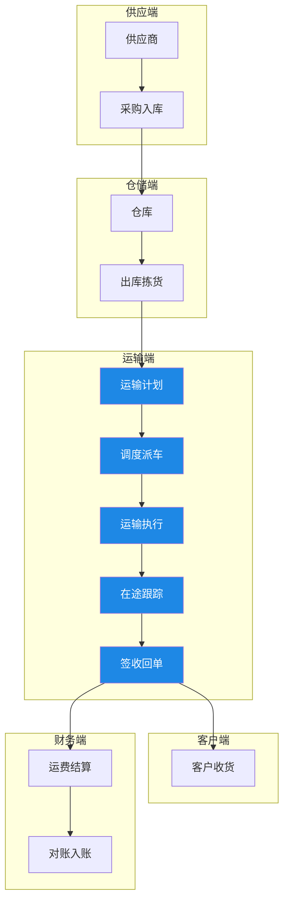

# TMS是什么

## 1. TMS的定义

运输管理系统（Transportation Management System，TMS）是一套用于规划、执行和优化货物物理移动的软件系统。TMS 的核心使命是在正确的时间、以最低的成本、将正确的货物送达正确的地点。它覆盖了从运输需求产生到最终签收回单的全生命周期管理。

TMS 的基本功能边界可以概括为三个关键词：

| 关键词 | 含义 | 典型功能 |
|--------|------|----------|
| 规划（Plan） | 如何最优地安排运输 | 路线优化、装载规划、承运商选择 |
| 执行（Execute） | 按计划完成运输任务 | 运单分发、在途跟踪、异常处理 |
| 结算（Settle） | 运输费用的计算与支付 | 费率计算、三单匹配、对账结算 |

## 2. TMS在供应链中的定位

TMS 在供应链执行层中处于承上启下的关键位置：

**上游连接**：TMS 接收来自 WMS 的出库通知和来自 OMS 的订单交付需求，将仓库内的待发货物转化为运输任务。

**下游连接**：TMS 将运输任务分配给承运商或自有车队，跟踪运输过程直至客户签收，并将签收信息回传 OMS 和 WMS。

**闭环反馈**：运输过程中的异常（延迟、破损等）实时反馈至 OMS，运费结算数据回传至 ERP 财务模块。

## 3. 从手工调度到TMS的演进

运输管理经历了从纯人工到全面数字化的演进过程：

| 阶段 | 时期 | 特征 | 痛点 |
|------|------|------|------|
| 手工调度 | 2000年前 | 电话派车、纸质运单、人工记账 | 效率低、易出错、信息滞后 |
| 电子化 | 2000-2010 | Excel排车、邮件通知、电子账单 | 数据孤岛、无法实时跟踪 |
| 系统化 | 2010-2018 | TMS软件上线、GPS跟踪、在线对账 | 系统割裂、缺乏优化算法 |
| 智能化 | 2018至今 | AI路线优化、IoT实时监控、供应链协同 | 数据治理、系统集成复杂度 |

从手工调度到TMS的核心驱动力是**运输成本的刚性压力**和**客户体验的持续提升**。在手工调度时代，运输成本占物流总成本的60%以上，而合理的路线优化和承运商管理可以降低15%-25%的运输成本。

## 4. TMS的四层价值

### 4.1 运输效率提升

通过路线优化和装载规划，TMS 能够显著提升车辆利用率和运输时效。典型场景：将原本需要10车次的配送任务优化为8车次，同时确保每个客户的时间窗约束得到满足。

### 4.2 运输成本控制

TMS 通过三大手段控制运输成本：

- **承运商竞价**：引入多家承运商竞价机制，降低运费单价
- **装载优化**：提高车辆装载率，减少空驶和半载
- **费率管理**：自动化费率计算，避免人工计费错误和超额支付

### 4.3 全程可视化

从发货到签收的全程可视化是 TMS 的核心价值之一：

### 4.4 合规与风控

TMS 帮助企业满足运输合规要求：危险品运输资质验证、驾驶员从业资格检查、车辆年检提醒、运输保险管理等，降低合规风险。

## 5. 运输管理模式

### 5.1 自营运输

企业自有车队，自行管理车辆和司机。优点是管控力强、响应快；缺点是固定成本高、弹性差。适用于：运输量大且稳定的核心线路。

### 5.2 外包运输

将运输任务外包给第三方承运商。优点是弹性灵活、轻资产运营；缺点是管控力弱、服务质量依赖承运商。适用于：运输量波动大、非核心线路。

### 5.3 混合模式

核心线路自营+非核心线路外包，是大多数中大型企业的选择。关键在于自营与外包的边界划分和协同机制。

| 模式 | 成本结构 | 管控力 | 弹性 | 适用场景 |
|------|----------|--------|------|----------|
| 自营 | 固定成本高 | 强 | 差 | 稳定核心线路 |
| 外包 | 变动成本高 | 弱 | 好 | 波动/非核心线路 |
| 混合 | 均衡 | 中 | 中 | 大多数中大型企业 |

## 6. 物流网络模型

### 6.1 厂仓直发

从工厂直接发往客户，跳过仓库中转环节。适用于大宗物资、项目物流。

### 6.2 仓配模式

工厂→仓库→客户的经典模式。仓库作为缓冲节点，平衡供需波动。适用于消费品、零售行业。

### 6.3 前置仓模式

在靠近客户的区域设置前置仓，缩短最后一公里配送距离。适用于生鲜、医药冷链、即时配送。

## 7. 供应链物流全景图

## 8. 商业产品对比

### 8.1 oTMS — 社区型TMS

oTMS 采用"社区"模式，货主与承运商在同一平台上协同。核心优势在于网络效应：使用 oTMS 的承运商越多，货主获得的运力选择和价格透明度越高。适合追求运输生态协同的中大型企业。

### 8.2 科箭CloudTMS — 本土化深度适配

科箭 CloudTMS 深度适配国内运输场景，支持国内特有的零担、专线运输模式，与国内主流ERP和WMS有成熟对接方案。适合国内制造业和零售业企业。

### 8.3 SAP TM — 全球化多模式运输

SAP TM 与 S/4HANA 深度集成，支持海陆空铁多模式运输管理，具备全球运输合规能力。适合有跨国运输需求的大型企业，但实施周期长、成本高。

| 维度 | oTMS | 科箭CloudTMS | SAP TM |
|------|------|-------------|--------|
| 部署模式 | SaaS | SaaS/私有化 | 本地/SaaS |
| 核心优势 | 社区网络效应 | 国内场景适配 | 全球化+深度集成 |
| 适用规模 | 中大型 | 中大型 | 大型/跨国 |
| 多模式支持 | 公路为主 | 公路+零担 | 海陆空铁 |
| 集成能力 | API开放 | 国内ERP适配 | SAP生态集成 |
| 实施周期 | 1-3月 | 2-6月 | 6-18月 |
| 典型客户 | 消费品/零售 | 制造业/零售 | 汽车化工/跨国 |

## 9. 小结

TMS 是供应链执行层不可或缺的核心系统。理解 TMS 的定义、定位和价值，是后续深入学习路线优化、承运商管理、在途跟踪和运费结算的基础。选择 TMS 产品时，需根据企业规模、运输模式、集成需求和预算综合评估。
