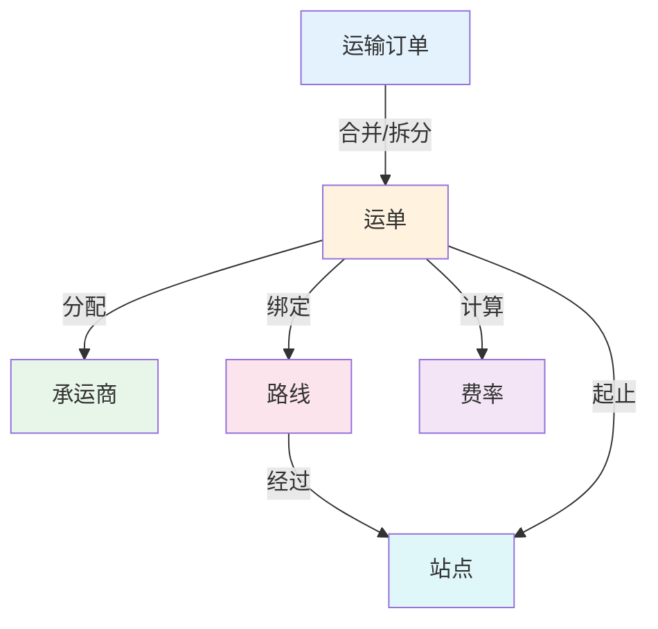
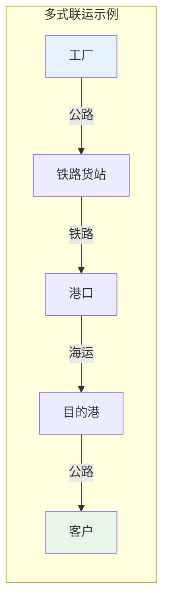
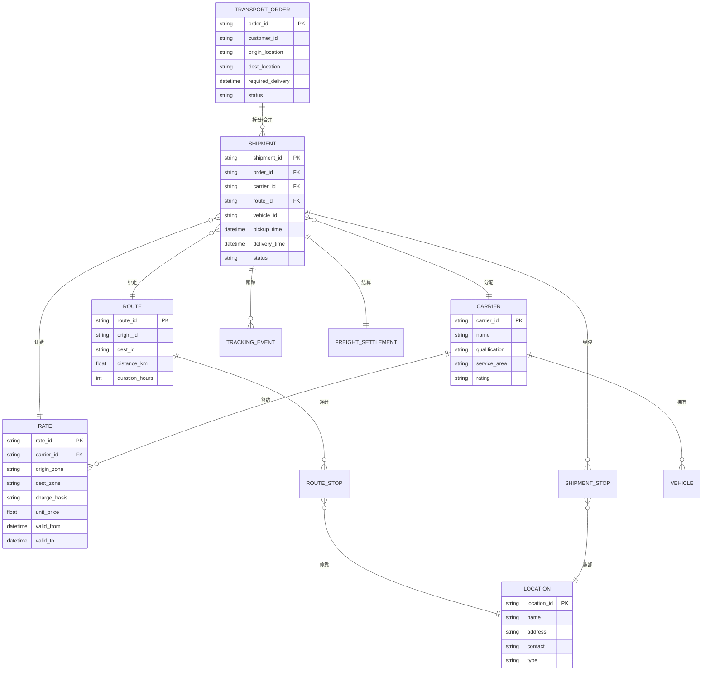

# 核心概念与数据模型

## 1. 核心对象

TMS 系统围绕以下核心对象展开，这些对象构成了运输管理的数据骨架：

| 对象 | 英文 | 说明 | 关键属性 |
|------|------|------|----------|
| 运输订单 | Transport Order | 运输需求的载体，由OMS或WMS下发 | 订单号、发货人、收货人、货物信息、要求到达时间 |
| 运单 | Shipment | 一次实际运输任务的执行单元 | 运单号、承运商、车辆、路线、状态 |
| 承运商 | Carrier | 提供运输服务的企业或个人 | 名称、资质、运力、费率、服务区域 |
| 路线 | Route | 运输路径的定义 | 起点站点、终点站点、途经站点、距离、预计时长 |
| 费率 | Rate | 运输费用的计算规则 | 计费基准、单价、附加费、有效期 |
| 站点 | Location | 运输网络中的节点 | 地址、联系人、时间窗、装卸能力 |

### 对象之间的关系



**运输订单与运单的关系**：一个运输订单可以拆分为多个运单（如货物分车运输），多个运输订单也可以合并为一个运单（如零担拼车）。这种多对多的关系是 TMS 调度的核心逻辑。

## 2. 运输模式

### 2.1 公路运输

公路运输是国内最主流的运输方式，占比超过70%。按运营模式分为：

| 类型 | 说明 | 适用场景 |
|------|------|----------|
| 整车（FTL） | 包用整车，独享运力 | 大宗货物、固定线路 |
| 零担（LTL） | 多家货主共享一辆车 | 小批量、多目的地 |
| 快递/快运 | 门到门小件快运 | 电商、小包裹 |
| 城配 | 城市内短驳配送 | 生鲜、零售门店 |

### 2.2 铁路运输

铁路运输适合中长距离大宗物资运输，成本低于公路，但灵活性差。典型场景：煤炭、矿石、粮食等大宗商品运输。

### 2.3 航空运输

航空运输时效最高但成本也最高，适合高价值、紧急货物。典型场景：医药、电子元器件、高端消费品。

### 2.4 海运运输

海运是国际贸易最主要的运输方式，成本低、运量大，但时效长。分为整箱（FCL）和拼箱（LCL）。

### 2.5 多式联运

多式联运组合多种运输方式，实现成本与时效的平衡。典型方案：海铁联运、公铁联运、江海联运。



## 3. 计费模型

运费计算是 TMS 最复杂的业务逻辑之一，涉及多种计费基准和规则组合。

### 3.1 按重量计费

最常见的计费方式。关键概念是**计费重量**：取实际重量与体积重量的较大值。

```
体积重量 = 长(cm) × 宽(cm) × 高(cm) / 抛重系数

计费重量 = MAX(实际重量, 体积重量)
```

抛重系数因行业而异：快递通常为6000，零担为3000-4000，国际空运为6000。

### 3.2 按体积计费

适用于轻泡货物（密度小的货物），如棉纺织品、泡沫制品等。

### 3.3 按件数计费

适用于标准化包装的货物，如托盘、集装箱。按件（托盘数/箱数）计费，简化计算。

### 3.4 按里程计费

适用于整车运输，按行驶里程×单价计算。通常加上起步价和附加费。

### 3.5 整车包车

按车型和线路一口价，不考虑实际装载量。适用于固定线路的整车运输。

| 计费方式 | 计算公式 | 适用场景 | 优缺点 |
|----------|----------|----------|--------|
| 按重量 | 计费重量×单价 | 快递/零担 | 精确但计算复杂 |
| 按体积 | 体积×单价 | 轻泡货 | 简单但不考虑重量 |
| 按件数 | 件数×单价 | 标准包装 | 最简单但粗放 |
| 按里程 | 里程×单价+起步价 | 整车 | 直观但不含装卸 |
| 包车 | 一口价 | 固定线路整车 | 简单但缺乏弹性 |

## 4. 费率表

### 4.1 合约价

与承运商签订的合同费率，通常有效期一年。合约价是 TMS 费率管理的核心，需要维护完整的费率表：

| 字段 | 说明 | 示例 |
|------|------|------|
| 承运商 | 签约承运商 | 顺丰速运 |
| 起始地 | 发货区域 | 华东-上海 |
| 目的地 | 收货区域 | 华北-北京 |
| 运输模式 | 整车/零担/快递 | 零担 |
| 计费基准 | 按重量/体积/里程 | 按重量 |
| 单价 | 每单位费率 | 0.8元/kg |
| 最低收费 | 一票最低运费 | 50元 |
| 有效期 | 费率有效期 | 2025-01-01至2025-12-31 |

### 4.2 市场价

市场实时运价，通常用于临时调车和招标参考。市场价波动大，需要实时采集和更新。

### 4.3 阶梯价

根据运输量设置不同价档，量越大单价越低：

| 月运输量 | 单价（元/kg） |
|----------|--------------|
| 0-5吨 | 0.80 |
| 5-20吨 | 0.75 |
| 20-50吨 | 0.70 |
| 50吨以上 | 0.65 |

## 5. 数据模型ER图



## 6. 主数据治理

TMS 的数据质量直接影响系统效能，以下三类主数据需要重点治理：

### 6.1 承运商主数据

- **唯一标识**：统一承运商编码体系，避免重复建档
- **资质管理**：运输许可证、危险品资质、保险信息等，设置过期预警
- **服务区域**：标准化承运商的服务区域定义，便于路线分配匹配
- **费率关联**：一个承运商可关联多套费率，按线路、车型、时效区分

### 6.2 路线主数据

- **站点标准化**：统一地址编码，避免同一地点多种名称
- **距离矩阵**：维护核心站点间的标准距离和行驶时间
- **路线模板**：对高频线路建立路线模板，简化调度操作
- **禁行规则**：维护限行区域、限高限重路段等约束数据

### 6.3 费率主数据

- **费率版本管理**：合约价变更需保留历史版本，支持追溯
- **费率有效期**：严格管控费率有效期，避免过期费率误用
- **费率冲突检测**：同一承运商同一线路不应存在多条有效费率
- **附加费规则**：等待费、装卸费、楼层费等附加费需独立维护

| 主数据类型 | 治理要点 | 更新频率 | 责任部门 |
|-----------|---------|---------|---------|
| 承运商 | 资质有效性、服务区域 | 月度 | 物流部 |
| 路线 | 站点准确性、距离时效 | 季度 | 运营部 |
| 费率 | 有效期管控、冲突检测 | 合同周期 | 采购部/物流部 |

## 7. 小结

核心对象、运输模式、计费模型和费率表构成了 TMS 的业务语言。理解这些概念及其关系，是后续学习路线优化、承运商管理和运费结算的基础。数据模型ER图展示了各对象之间的关联关系，主数据治理则保证了系统数据的准确性和一致性。
