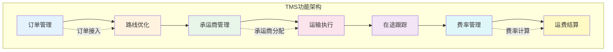
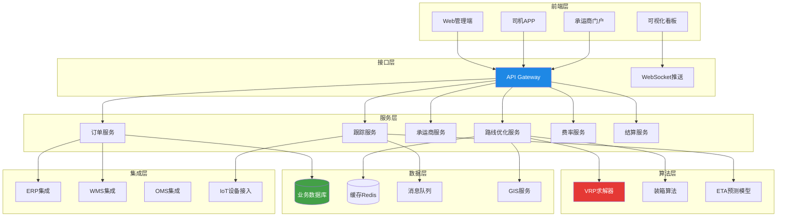
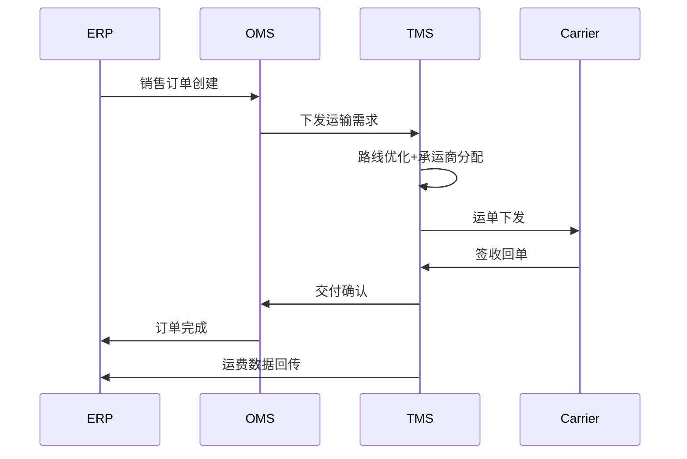
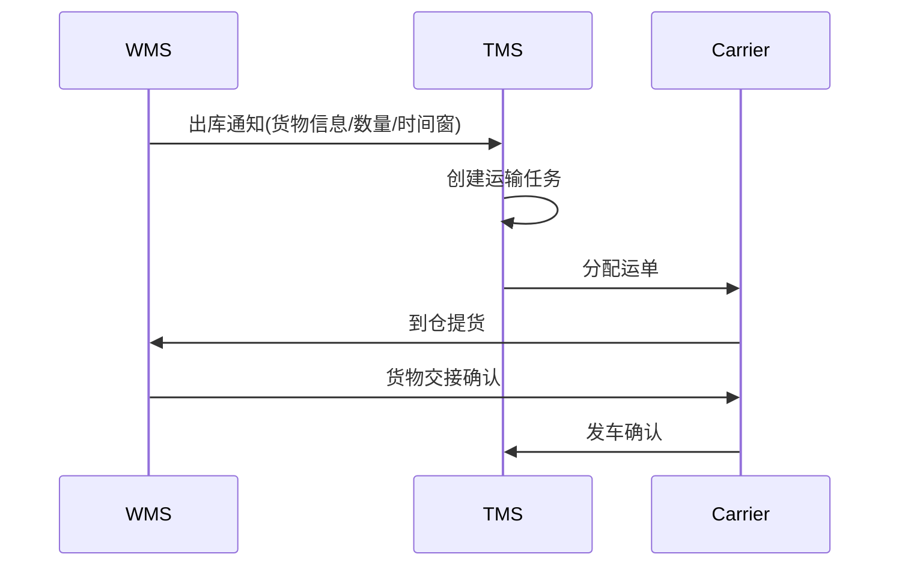
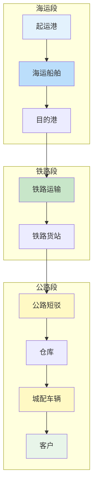

# TMS整体架构

## 1. 功能架构

TMS 的功能架构围绕运输全生命周期设计，包含六大核心模块：

### 1.1 订单管理

订单管理是 TMS 的入口模块，负责接收和转换运输需求：

- **订单接入**：从 OMS、WMS、ERP 等上游系统接收运输需求
- **订单合并/拆分**：根据车辆容量和客户要求，将多个订单合并为一个运单或拆分多个运单
- **订单验证**：校验收发货地址、货物属性、时间要求等
- **优先级管理**：根据客户等级、时效要求设置订单优先级

### 1.2 路线优化

路线优化是 TMS 的核心算法模块：

- **路线规划**：基于VRP算法计算最优配送路线
- **装载规划**：优化车辆装载，提高装载率
- **时间窗约束**：满足客户的收货时间要求
- **多目标优化**：平衡运输成本、时效、碳排放等目标

### 1.3 承运商管理

- **承运商选择**：根据运力、费率、服务质量自动推荐承运商
- **运力调度**：管理自有车队和外包承运商的运力池
- **招标管理**：发起运输招标，收集承运商报价

### 1.4 运输执行

- **运单分发**：将运单推送给承运商或司机
- **发车确认**：确认车辆出发时间和装载信息
- **中转管理**：多段运输的中转交接
- **签收确认**：收货人签收并上传POD回单

### 1.5 在途跟踪

- **实时定位**：GPS/北斗追踪车辆位置
- **ETA预测**：基于实时路况预测到达时间
- **里程碑更新**：自动记录发车、中转、到达等关键节点
- **异常预警**：延迟、偏航、温控异常等主动预警

### 1.6 费率管理与结算

- **费率计算**：根据合约费率自动计算运费
- **三单匹配**：订单、运单、发票三单核对
- **对账结算**：与承运商和客户进行运费对账
- **成本分析**：运输成本的趋势分析和异常检测

## 2. 技术架构

技术架构的关键设计原则：

| 原则 | 说明 | 实现方式 |
|------|------|----------|
| 微服务化 | 各模块独立部署和扩展 | Spring Cloud / K8s |
| 事件驱动 | 模块间通过事件异步通信 | Kafka / RabbitMQ |
| 算法隔离 | 优化算法独立部署，避免阻塞主流程 | Docker容器 + 异步任务 |
| 实时推送 | 在途位置和状态变更实时推送 | WebSocket + MQTT |
| GIS集成 | 路线优化依赖地图和路况数据 | 高德/百度地图API |

## 3. 与ERP集成

### 3.1 销售订单联动

ERP 中的销售订单触发 TMS 运输需求：

### 3.2 采购退货运输

采购退货的逆向物流也是 TMS 的重要场景：供应商发起退货→TMS 安排取件运输→退货入库。

### 3.3 财务集成

TMS 的运费结算数据回传 ERP 财务模块，实现：

- 应付账款自动入账（对承运商）
- 应收账款自动入账（对客户）
- 运输成本中心归集
- 差异报告和异常标记

| 集成场景 | 数据流向 | 频率 | 方式 |
|----------|---------|------|------|
| 销售订单 | ERP→TMS | 实时 | API |
| 交付确认 | TMS→ERP | 实时 | API |
| 运费数据 | TMS→ERP | 批量 | 接口/文件 |
| 采购退货 | ERP→TMS | 实时 | API |
| 成本归集 | TMS→ERP | 批量 | 接口 |

## 4. 与WMS集成

### 4.1 出库通知联动

WMS 完成出库拣货后，通知 TMS 安排提货：

### 4.2 回单确认

签收回单信息从 TMS 回传 WMS，完成出库闭环：

- 签收时间回传：更新WMS出库单状态
- 签收数量差异：触发WMS库存调整
- 破损记录回传：触发WMS报损流程

### 4.3 越库作业（Cross-docking）

越库作业是 WMS 与 TMS 深度协同的场景：到货不入库，直接在月台从入库车辆转到出库车辆。要求 TMS 精确协调到货和发货车辆的时间窗口。

## 5. 与OMS集成

### 5.1 订单分配

OMS 完成分仓决策后，将订单分配至具体仓库，并触发 TMS 运输需求：

- **拆单运输**：一个订单拆分多个包裹，不同承运商配送
- **合单运输**：多个订单合并发货，降低运输成本
- **时效匹配**：根据订单承诺时效选择运输方案

### 5.2 状态同步

| 状态事件 | 数据流向 | 业务意义 |
|----------|---------|---------|
| 订单下发 | OMS→TMS | 触发运输计划 |
| 发车确认 | TMS→OMS | 告知客户已发货 |
| 在途更新 | TMS→OMS | 客户查询物流轨迹 |
| 签收确认 | TMS→OMS | 订单完成 |
| 异常通知 | TMS→OMS | 触发客服跟进 |

## 6. 部署模式

### 6.1 SaaS模式

TMS 服务商提供云端服务，企业按需订阅：

- **优点**：快速上线、低初始投入、自动升级、弹性扩展
- **缺点**：数据安全顾虑、定制化受限、长期成本可能更高
- **适用**：中小企业、快速扩展期企业

### 6.2 私有化部署

TMS 部署在企业自有服务器或私有云：

- **优点**：数据自主可控、深度定制、与内部系统紧密集成
- **缺点**：初始投入大、运维成本高、升级周期长
- **适用**：大型企业、数据安全要求高的企业

### 6.3 混合模式

核心模块私有化部署+标准化功能使用SaaS，平衡安全与效率：

| 部署模式 | 初始投入 | 运维成本 | 定制化 | 数据安全 | 上线周期 |
|----------|---------|---------|--------|---------|---------|
| SaaS | 低 | 按年订阅 | 中 | 中 | 1-3月 |
| 私有化 | 高 | 高 | 高 | 高 | 6-12月 |
| 混合 | 中 | 中 | 高 | 高 | 3-6月 |

## 7. 多模式运输协同方案

多模式运输是TMS架构设计的难点，需要处理不同运输模式之间的交接和协同：

多模式协同的关键设计：

- **统一运单号**：贯穿全程的统一标识，各段使用子运单号
- **交接点管理**：定义清晰的交接点、交接标准和责任划分
- **时间窗衔接**：前一段的到达时间窗必须与后一段的出发时间窗匹配
- **异常传播**：前一段延迟自动触发后一段的预警和调整

## 8. 小结

TMS 的功能架构覆盖运输全生命周期，技术架构需要支撑高并发、实时性和算法计算密集型需求。与 ERP、WMS、OMS 的集成是 TMS 发挥价值的关键，部署模式的选择取决于企业规模和安全需求。多模式运输协同是大型TMS架构的核心挑战。
