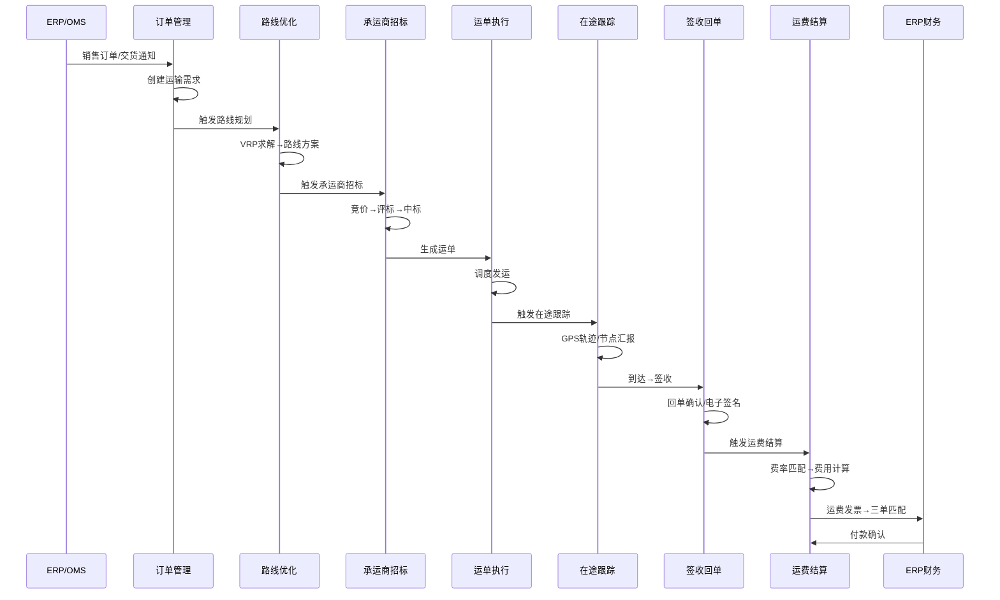
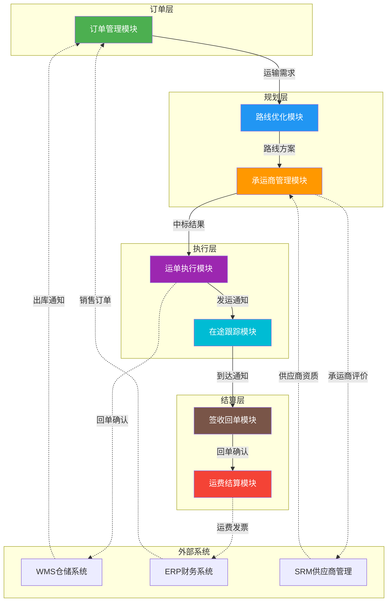
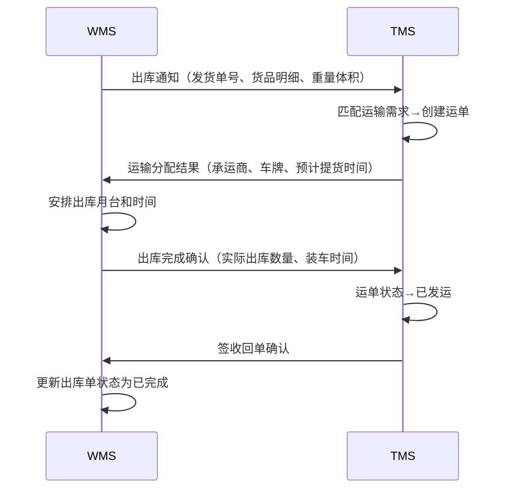
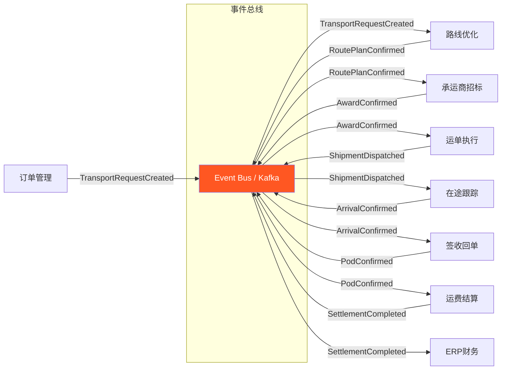

# TMS模块联动与数据流

## 1. 端到端运输链路全景

TMS的核心价值在于将分散的运输环节串联为完整的业务闭环。从订单接收到运费结算，数据在各模块间流转、转换、触发，形成端到端的运输链路。



## 2. 模块间接口表

每个模块间的数据流转依赖明确的接口定义，以下为各模块间的核心接口：

| 源模块 | 目标模块 | 接口名称 | 传递数据 | 触发条件 |
|--------|---------|----------|---------|----------|
| 订单管理 | 路线优化 | `transport_request` | 订单ID、收发货地址、货品/重量/体积、期望到达时间 | 运输需求创建且状态为"待规划" |
| 路线优化 | 承运商招标 | `route_plan` | 路线ID、停靠点序列、里程、预估运费、车辆要求 | 路线方案确认 |
| 承运商招标 | 运单执行 | `award_result` | 承运商ID、中标运费、合同ID、路线ID | 招标评标完成且已确认 |
| 运单执行 | 在途跟踪 | `shipment_dispatch` | 运单号、车牌号、司机、预计到达时间 | 运单状态变更为"已发运" |
| 在途跟踪 | 签收回单 | `arrival_notice` | 运单号、实际到达时间、到达站点 | 车辆到达最终目的地 |
| 签收回单 | 运费结算 | `pod_confirm` | 运单号、签收人、签收时间、回单图片URL | 回单确认完成 |
| 运费结算 | ERP财务 | `freight_invoice` | 运单号、承运商、运费明细、发票号 | 运费计算完成且发票开具 |

### 2.1 接口数据格式示例

以运输需求接口为例：

```json
{
  "requestId": "TR-2026-001258",
  "source": "ERP_SALES_ORDER",
  "orderId": "SO-20260606-0042",
  "priority": "HIGH",
  "shipFrom": {
    "locationId": "WH-SH-01",
    "address": "上海市嘉定区安亭镇曹安公路5388号",
    "contact": "张伟",
    "phone": "138****5678",
    "timeWindow": { "earliest": "2026-06-07T08:00:00", "latest": "2026-06-07T18:00:00" }
  },
  "shipTo": {
    "locationId": "CUST-NJ-15",
    "address": "南京市江宁区秣陵街道科学园路8号",
    "contact": "李明",
    "phone": "139****1234",
    "timeWindow": { "earliest": "2026-06-08T09:00:00", "latest": "2026-06-08T17:00:00" }
  },
  "lines": [
    {
      "sku": "PROD-A1001",
      "description": "电子元件-A型",
      "quantity": 200,
      "weight": 850.5,
      "volume": 1.2,
      "packingType": "托盘",
      "stackable": false
    }
  ],
  "totalWeight": 850.5,
  "totalVolume": 1.2,
  "specialRequirements": ["防潮", "轻拿轻放"],
  "expectedDeliveryDate": "2026-06-08"
}
```

## 3. 模块依赖关系图

从开发者视角，理解模块间的依赖关系对于系统拆分、微服务划分和部署策略至关重要。



## 4. 核心联动场景详解

### 4.1 运输订单→路线优化

运输订单创建后，系统根据订单属性自动触发路线规划：

```python
class TransportRequestHandler:
    """运输需求处理器 - 订单到路线优化的联动"""

    def on_request_created(self, event: TransportRequestEvent):
        # 1. 校验需求完整性
        self.validate_request(event.request_id)

        # 2. 判断是否需要拼车/集货
        if self.should_consolidate(event):
            # 加入集货池，等待合并优化
            self.consolidation_pool.add(event.request_id)
            # 达到集货窗口或数量阈值时触发批量优化
            if self.consolidation_pool.is_ready():
                self.trigger_batch_optimization()
        else:
            # 单独触发路线优化
            self.route_optimizer.submit(
                request_ids=[event.request_id],
                strategy="SINGLE_SHIPMENT"
            )

    def trigger_batch_optimization(self):
        """批量优化：从集货池取出需求，运行VRP求解"""
        request_ids = self.consolidation_pool.drain()
        self.route_optimizer.submit(
            request_ids=request_ids,
            strategy="CONSOLIDATION_VRP",
            constraints={
                "max_stops_per_route": 8,
                "time_window_hard": True,
                "vehicle_type_filter": "STANDARD"
            }
        )
```

### 4.2 路线方案→承运商招标

路线方案确认后，系统根据路线特征匹配可用承运商并发起招标：

```python
class RoutePlanHandler:
    """路线方案处理器 - 路线到承运商招标的联动"""

    def on_route_confirmed(self, event: RouteConfirmedEvent):
        route = self.route_repo.get(event.route_id)

        # 1. 匹配合格承运商
        eligible_carriers = self.carrier_matcher.match(
            origin=route.origin,
            destination=route.destination,
            vehicle_type=route.vehicle_requirement,
            service_level=route.service_level,
            exclude_blacklisted=True
        )

        if len(eligible_carriers) == 1:
            # 单一来源 → 直接分配
            self.direct_assign(route, eligible_carriers[0])
        else:
            # 多承运商 → 发起竞价招标
            self.start_bidding(route, eligible_carriers)

    def start_bidding(self, route, carriers):
        """发起承运商竞价"""
        bid = BiddingSession.create(
            route_id=route.id,
            carrier_ids=[c.id for c in carriers],
            base_rate=self.rate_engine.estimate(route),
            deadline=datetime.now() + timedelta(hours=4),
            bid_type="REVERSE_AUCTION"  # 反向拍卖（价低者得）
        )
        self.bidding_repo.save(bid)
        # 通知承运商
        for carrier in carriers:
            self.notification_service.send_bidding_invitation(carrier, bid)
```

### 4.3 中标结果→运单生成

中标确认后，系统自动生成运单并进入执行阶段：

```python
class AwardResultHandler:
    """中标结果处理器 - 招标到运单的联动"""

    def on_award_confirmed(self, event: AwardConfirmedEvent):
        award = self.award_repo.get(event.award_id)
        route = self.route_repo.get(award.route_id)

        # 创建运单
        shipment = ShipmentOrder.create(
            order_no=self.generate_shipment_no(),
            route_id=route.id,
            carrier_id=award.carrier_id,
            contract_id=award.contract_id,
            agreed_rate=award.winning_rate,
            stops=route.stops,
            planned_departure=route.planned_departure,
            planned_arrival=route.planned_arrival,
            status="CREATED"
        )
        self.shipment_repo.save(shipment)

        # 发布运单创建事件
        self.event_bus.publish(ShipmentCreatedEvent(shipment.id))
```

## 5. 跨系统联动

### 5.1 TMS ↔ WMS联动



WMS与TMS的联动接口定义：

| 接口 | 方向 | 数据 | 频率 |
|------|------|------|------|
| `outbound_notice` | WMS→TMS | 发货单号、SKU明细、重量体积、期望发货日 | 每日出库波次触发 |
| `transport_assignment` | TMS→WMS | 运单号、承运商、车牌号、预计提货时间 | 运单分配后实时 |
| `outbound_confirm` | WMS→TMS | 实际出库数量、装车完成时间、月台号 | 装车完成实时 |
| `pod_confirm` | TMS→WMS | 签收时间、签收人、回单图片 | 签收确认后实时 |

### 5.2 TMS ↔ ERP联动

TMS与ERP的联动主要集中在订单源头和财务结算两端：

- **订单侧**：ERP的销售订单（SO）或交货计划通过接口推送到TMS，TMS创建对应的运输需求
- **财务侧**：TMS的运费结算结果推送至ERP财务模块，进行三单匹配（PO+运单+发票）后触发付款

```json
{
  "interface": "freight_settlement_to_erp",
  "payload": {
    "settlementId": "FS-2026-0608-001",
    "shipmentNo": "SHP-202606060042",
    "carrierCode": "CARRIER-018",
    "contractNo": "CT-2026-SH-018",
    "invoiceNo": "INV-20260608-8842",
    "purchaseOrderNo": "PO-2026-0315",
    "totalAmount": 3250.00,
    "currency": "CNY",
    "costBreakdown": [
      { "item": "基础运费", "amount": 2800.00 },
      { "item": "装卸费", "amount": 200.00 },
      { "item": "等待费", "amount": 150.00 },
      { "item": "保险费", "amount": 100.00 }
    ],
    "paymentTerms": "NET_30",
    "bankAccount": {
      "bankName": "中国工商银行上海嘉定支行",
      "accountNo": "1001****5678",
      "accountName": "XX物流有限公司"
    }
  }
}
```

### 5.3 TMS ↔ SRM联动

承运商评价数据从TMS流向SRM，影响供应商评级和准入：

| 评价维度 | 数据来源 | 权重 | 计算方式 |
|----------|---------|------|---------|
| 准时率 | TMS在途跟踪 | 30% | 按时到达次数/总运单数 |
| 货损率 | TMS签收回单 | 25% | 破损运单数/总运单数 |
| 响应速度 | TMS招标响应 | 20% | 平均响应时长 |
| 服务评分 | TMS收货方评价 | 15% | 月均评分/5分 |
| 合规率 | TMS异常管理 | 10% | 合规运单数/总运单数 |

## 6. 事件驱动架构设计

模块间联动推荐采用事件驱动架构（EDA），通过事件总线解耦模块依赖：



### 6.1 事件定义规范

每个领域事件应包含以下要素：

```json
{
  "eventId": "evt-uuid-20260606-abc123",
  "eventType": "ShipmentDispatched",
  "aggregateId": "SHP-202606060042",
  "aggregateType": "ShipmentOrder",
  "timestamp": "2026-06-06T14:30:00.000Z",
  "source": "tms-shipment-service",
  "version": "1.2",
  "payload": {
    "shipmentNo": "SHP-202606060042",
    "carrierId": "CARRIER-018",
    "vehicleNo": "沪A·12345",
    "driverName": "王刚",
    "driverPhone": "137****9876",
    "plannedArrival": "2026-06-07T10:00:00.000Z"
  },
  "metadata": {
    "correlationId": "corr-20260606-so0042",
    "causationId": "evt-uuid-20260606-xyz789"
  }
}
```

### 6.2 开发者实战Tips

1. **幂等处理**：所有事件消费端必须实现幂等逻辑，使用`eventId`去重，避免重复消费导致数据不一致
2. **事件版本控制**：`version`字段用于兼容性管理，消费端应根据版本号选择对应的反序列化策略
3. **关联链路追踪**：`correlationId`贯穿整个运输链路，用于端到端问题排查；`causationId`记录触发因果关系
4. **死信队列**：事件消费失败应进入DLQ（Dead Letter Queue），避免阻塞正常事件流，运维可定期排查
5. **事件存储**：建议将事件持久化到事件表（Event Sourcing），支持业务回溯和状态重建
6. **分区策略**：Kafka Topic按`aggregateId`分区，保证同一运单的事件有序消费
7. **超时补偿**：关键联动环节设置超时定时器（如招标4小时未响应自动流标），通过Saga编排器管理补偿逻辑
