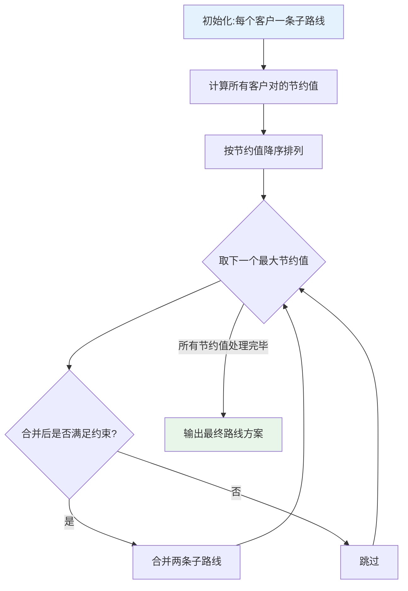
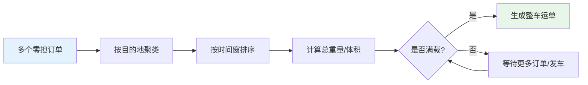
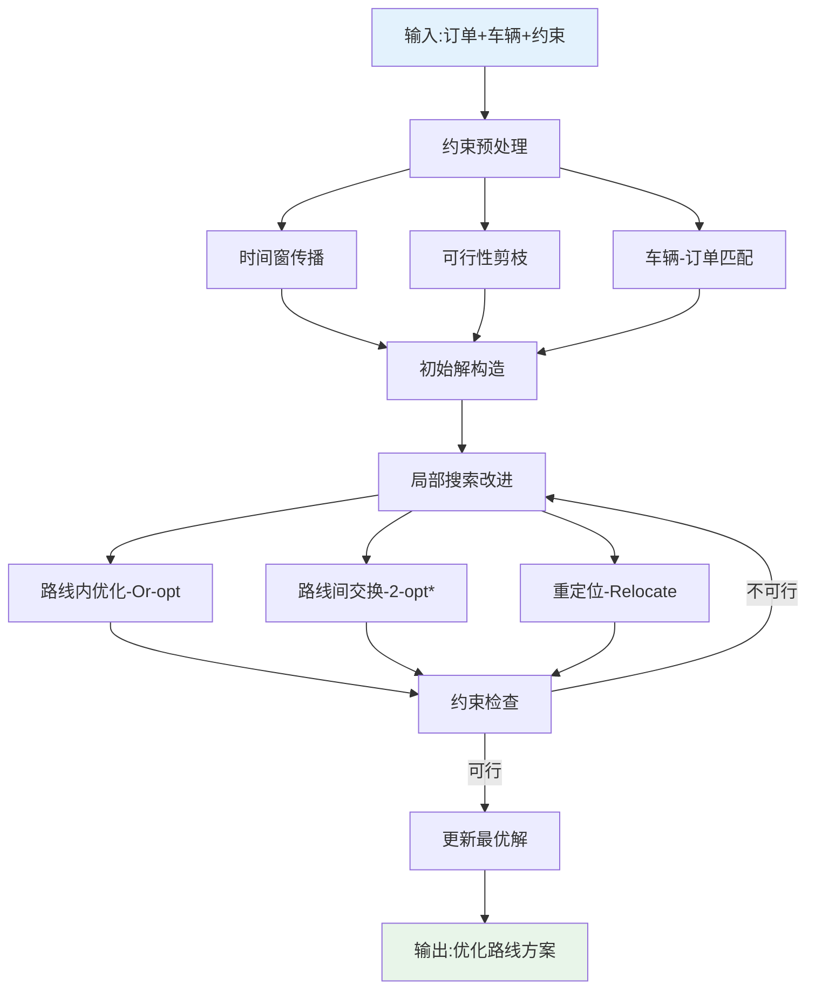
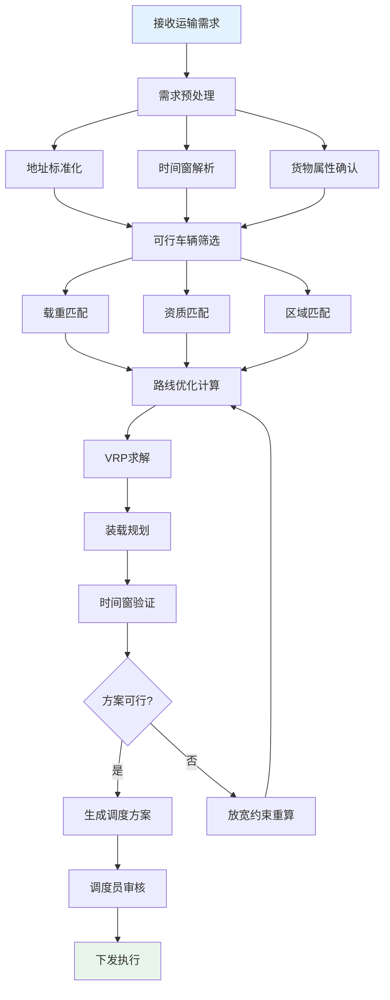

# 路线优化与装载规划

## 1. VRP车辆路径问题

车辆路径问题（Vehicle Routing Problem, VRP）是TMS路线优化的数学基础。VRP 的核心问题是：给定一组客户和一支车队，如何规划最优的配送路线，使得总成本最低且满足所有约束。

### 1.1 基本VRP

基本VRP（CVRP, Capacitated VRP）是最经典的变体，约束条件包括：

- 每辆车从车场出发，服务完分配的客户后返回车场
- 每个客户恰好被一辆车服务一次
- 每辆车的载重不超过最大容量
- 目标：最小化总行驶距离或车辆数

### 1.2 带时间窗的VRP（VRPTW）

VRPTW 在 CVRP 基础上增加时间窗约束：

- **硬时间窗**：必须在时间窗内到达，否则视为不可行解
- **软时间窗**：可以超出时间窗，但需支付惩罚费用

这在实际配送场景中极为常见：零售门店只允许特定时段收货，医院有严格的药品配送时间要求。

### 1.3 VRP变体分类

| 变体 | 约束特点 | 典型场景 |
|------|----------|----------|
| CVRP | 载重约束 | 标准配送 |
| VRPTW | 载重+时间窗 | 门店配送 |
| VRPPD | 取送货混合 | 电商逆向物流 |
| MDVRP | 多车场 | 区域配送中心 |
| DVRP | 动态需求 | 即时配送 |
| HFVRP | 异构车队 | 混合车型调度 |

## 2. 路线优化算法

### 2.1 精确算法

精确算法能保证找到全局最优解，但计算时间随问题规模指数增长，仅适用于小规模场景（<50个客户）：

- **分支定界法**：搜索解空间树，剪枝排除次优分支
- **割平面法**：逐步添加约束割平面，逼近最优解
- **列生成法**：将问题分解为主问题和子问题，迭代求解

### 2.2 启发式算法

启发式算法在可接受的时间内找到近似最优解，适合实际业务场景：

| 算法 | 类型 | 思路 | 适用规模 |
|------|------|------|----------|
| 最近邻 | 构造式 | 每次选择最近的未服务客户 | 中小规模 |
| Clarke-Wright | 构造式 | 合并子路线节约里程 | 中等规模 |
| 遗传算法 | 元启发式 | 模拟自然选择和交叉变异 | 大规模 |
| 模拟退火 | 元启发式 | 概率性接受劣解跳出局部最优 | 大规模 |
| 禁忌搜索 | 元启发式 | 记忆机制避免重复搜索 | 大规模 |

### 2.3 Clarke-Wright节约算法

Clarke-Wright节约算法（C-W算法）是最经典的VRP构造式启发式算法，因其简洁高效而广泛应用于实际TMS系统：

**核心思想**：初始时每个客户独立一条路线（n条路线），计算合并任意两条路线的"节约值"，按节约值从大到小依次合并。

**节约值计算**：

```
节约值 S(i,j) = d(0,i) + d(0,j) - d(i,j)

其中：
- d(0,i): 车场到客户i的距离
- d(0,j): 车场到客户j的距离
- d(i,j): 客户i到客户j的距离
```

**算法流程**：



C-W算法的优点是实现简单、计算速度快；缺点是不能保证最优，对大规模问题需要结合局部搜索改进。

## 3. 装载规划

装载规划解决"如何把货物最优地装入车辆"的问题，直接影响车辆利用率和运输成本。

### 3.1 3D装箱问题

3D装箱是NP-hard问题，目标是在有限车厢空间内装入尽可能多的货物。实际约束包括：

| 约束 | 说明 |
|------|------|
| 重量限制 | 车辆核定载重 |
| 体积限制 | 车厢长宽高 |
| 方向约束 | 易碎品/液体不可倒置 |
| 堆叠约束 | 重物在下、轻物在上 |
| 兼容性约束 | 食品与化学品不可混装 |

### 3.2 整车拼载

整车拼载是将多个小批量货物组合到一辆整车运输，降低单位运输成本：

- **同区域拼载**：目的地在同一区域的货物拼车
- **顺路拼载**：沿途依次卸货的线路设计
- **时效分级**：紧急货物优先装载，非紧急货物填隙

### 3.3 零担拼车

零担拼车是TMS零担运输的核心调度逻辑：



零担拼车的关键指标：

| 指标 | 计算方式 | 目标值 |
|------|---------|--------|
| 装载率 | 实际装载量/车辆容量 | >85% |
| 等待时间 | 首个订单到发车的时间 | <4小时 |
| 经停次数 | 单次运输的卸货点数 | <5 |
| 里程利用率 | 实际载货里程/总里程 | >70% |

## 4. 多约束路线优化

实际运输调度需要同时满足多种约束：

### 4.1 时间窗约束

- 客户收货时间窗（如09:00-12:00）
- 仓库作业时间窗（如08:00-18:00）
- 城市限行时段（如7:00-9:00货车禁行）

### 4.2 载重与体积约束

- 车辆核定载重（如4.2米车=2吨，9.6米车=10吨）
- 车厢容积（长×宽×高）
- 超限运输许可（超长、超宽、超重需审批）

### 4.3 司机工时约束

根据交通运输法规，司机驾驶时间受限：

- 连续驾驶不超过4小时，须休息20分钟以上
- 每日驾驶不超过8小时
- 每周驾驶不超过40小时

### 4.4 多约束优化策略



## 5. 碳排放计算与绿色物流

### 5.1 碳排放计算模型

运输碳排放是ESG报告的重要指标，TMS需要支持碳排放的计算和追踪：

```
碳排放量 = 行驶里程 × 载重系数 × 排放因子

排放因子示例（单位：kgCO2/km）：
- 轻型货车（<3.5吨）：0.18
- 中型货车（3.5-12吨）：0.28
- 重型货车（>12吨）：0.45
- 铁路运输：0.03
- 海运：0.01
```

### 5.2 绿色物流优化策略

| 策略 | 碳减排效果 | 实施难度 |
|------|-----------|---------|
| 路线优化减少空驶 | 10%-20% | 低 |
| 提高装载率 | 15%-25% | 中 |
| 新能源车辆替换 | 30%-50% | 高 |
| 多式联运（公转铁） | 40%-60% | 高 |
| 集货点优化 | 5%-15% | 中 |

### 5.3 碳排放看板

TMS 应提供碳排放可视化看板，支持：

- 按承运商/线路/车辆的碳排放统计
- 碳排放趋势分析（同比/环比）
- 碳排放与运输量的关联分析（单位碳排）
- 碳减排目标达成率追踪

## 6. 路线优化流程图



## 7. 真实案例：生鲜配送路线优化实践

### 7.1 业务背景

某生鲜电商拥有1个中心仓、50个前置仓，每日配送300+个社区团购点。面临挑战：

- 配送时间窗极窄（06:00-08:00早市配送）
- 冷链车辆装载率仅60%
- 单车配送点数少，车辆利用率低

### 7.2 优化方案

**第一阶段：数据基础建设**

- 标准化300+配送点地址和坐标
- 建立配送点间的距离/时间矩阵
- 采集历史配送数据校准时间预估模型

**第二阶段：算法优化**

- 采用VRPTW模型，约束：载重8吨、时间窗2小时
- 使用遗传算法+局部搜索混合策略
- 优化目标：最小化车辆数+总行驶距离加权

**第三阶段：装载优化**

- 引入3D装箱算法优化车厢空间利用
- 按配送顺序反向装载（后送先装）
- 考虑温区分区（冷冻/冷藏/常温）

### 7.3 优化效果

| 指标 | 优化前 | 优化后 | 提升 |
|------|--------|--------|------|
| 日车辆数 | 42车 | 33车 | -21.4% |
| 平均装载率 | 60% | 82% | +36.7% |
| 单车配送点数 | 7个 | 10个 | +42.9% |
| 总行驶里程 | 1,260km | 980km | -22.2% |
| 准时到达率 | 88% | 96% | +9.1% |
| 碳排放量 | 567kgCO2 | 441kgCO2 | -22.2% |

### 7.4 关键经验

1. **数据质量是基础**：地址标准化和距离矩阵的准确度直接决定优化效果
2. **渐进式优化**：先解决路线合理性，再追求装载最优，避免一步到位
3. **人机结合**：算法给出推荐方案，调度员根据实际情况微调
4. **持续迭代**：定期用实际配送数据校准模型参数

## 8. 小结

路线优化和装载规划是TMS最具技术含量的模块。VRP问题及其变体是路线优化的数学基础，Clarke-Wright节约算法是工程实践中的经典选择。实际应用中需要综合考虑时间窗、载重、司机工时等多约束，并结合碳排放等绿色物流指标。生鲜配送案例展示了路线优化从理论到实践的完整路径。
