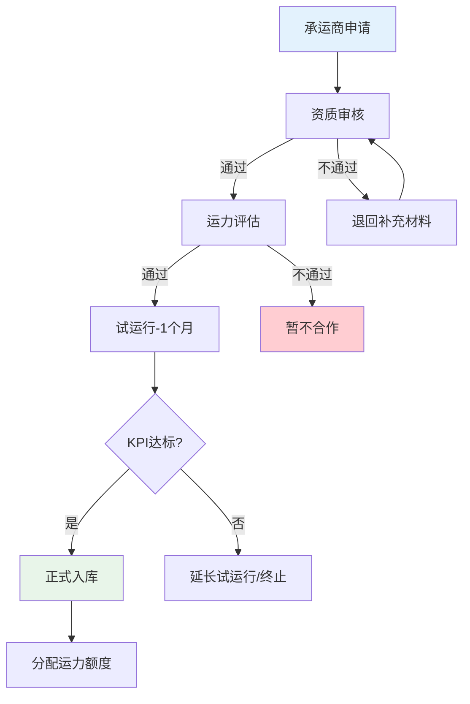
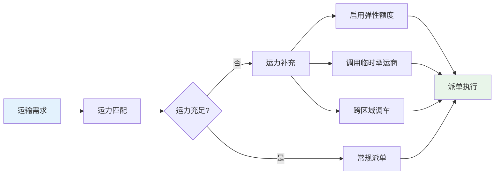
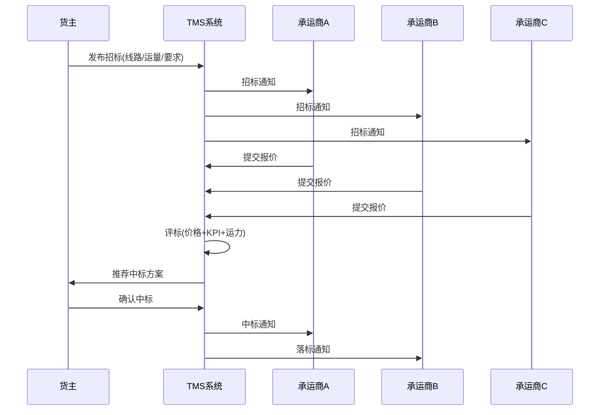
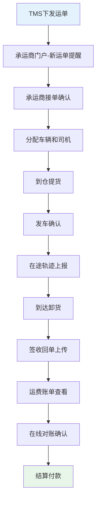
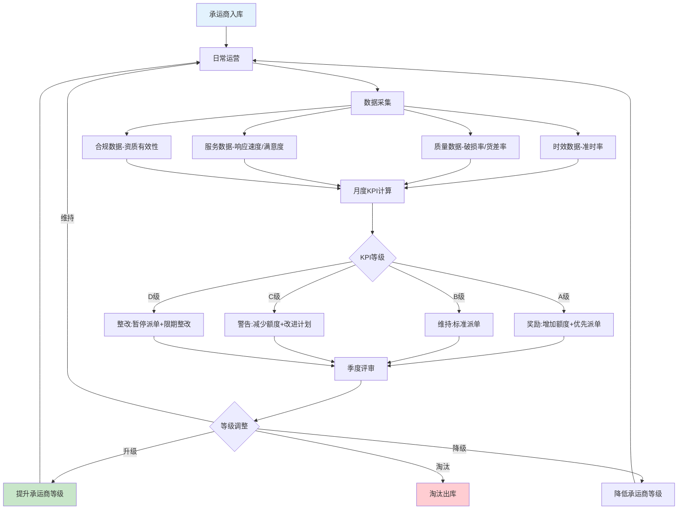

# 承运商管理与招标

## 1. 承运商准入

承运商准入是TMS承运商管理的第一道关口，确保入库承运商具备提供合格运输服务的基本能力。

### 1.1 资质审核

| 资质类型 | 审核内容 | 重要性 |
|----------|---------|--------|
| 营业执照 | 经营范围包含道路运输 | 必须 |
| 道路运输经营许可证 | 交通主管部门颁发 | 必须 |
| 危险品运输资质 | 如涉及危险品运输 | 条件必须 |
| 车辆行驶证 | 车辆合法上路证明 | 必须 |
| 驾驶员从业资格证 | 道路货物运输从业资格 | 必须 |
| 保险证明 | 货运险/第三者责任险 | 必须 |

### 1.2 运力评估

准入阶段需要评估承运商的实际运力是否满足业务需求：

- **车辆资源**：自有车辆数、车型分布、车龄情况
- **运力弹性**：高峰期能否调配额外运力
- **覆盖区域**：服务网点覆盖范围
- **特殊能力**：冷链、危险品、大件等特殊运输能力

### 1.3 服务质量评估

新承运商入库前，需要通过试运行验证其服务质量：

## 2. 承运商分级

根据承运商的综合能力和服务表现，将其分为不同等级，实行差异化管理：

### 2.1 战略承运商

- **定义**：长期合作的核心承运商，承担主要运量
- **占比**：承运商数量的10%-20%，承担60%-70%的运量
- **权益**：优先派单、更高运力额度、参与联合规划
- **义务**：提供运力保障承诺、接受KPI考核、参与系统对接

### 2.2 常规承运商

- **定义**：日常运营的常规合作承运商
- **占比**：承运商数量的50%-60%，承担25%-35%的运量
- **权益**：正常派单、标准运力额度
- **义务**：接受KPI考核、按约定时效履约

### 2.3 临时承运商

- **定义**：旺季或突发需求时临时调用的承运商
- **占比**：承运商数量的20%-30%，承担5%-10%的运量
- **权益**：临时运力补充
- **义务**：按单履约、接受基本质量要求

| 等级 | 占比 | 运量占比 | 派单优先级 | 合同周期 | KPI要求 |
|------|------|---------|-----------|---------|---------|
| 战略 | 10%-20% | 60%-70% | 最高 | 1-3年 | 严格 |
| 常规 | 50%-60% | 25%-35% | 标准 | 6-12月 | 标准 |
| 临时 | 20%-30% | 5%-10% | 最低 | 单次 | 基本 |

## 3. 运力池管理

运力池管理是TMS承运商管理的核心能力，确保运力供给与运输需求的动态平衡。

### 3.1 运力额度分配

为每个承运商分配运力额度（运力承诺量），确保运力供给的确定性：

- **固定额度**：战略承运商承诺的基础运力
- **弹性额度**：旺季可追加的弹性运力
- **区域额度**：按运输区域分配的运力额度

### 3.2 运力预警

| 预警类型 | 触发条件 | 处理方式 |
|----------|---------|---------|
| 运力不足 | 可用运力<需求的80% | 启用临时承运商 |
| 运力过剩 | 可用运力>需求的150% | 减少临时承运商派单 |
| 单一依赖 | 某承运商运量占比>40% | 分散运力分配 |
| 高峰预警 | 即将到来的旺季运力缺口 | 提前锁定运力 |

### 3.3 运力动态调度

## 4. 运输招标

运输招标是获取最优运力价格和服务的核心机制，TMS需要支持多种招标模式。

### 4.1 竞价招标

多家承运商对同一线路或运量进行竞价，价低者得：

竞价招标的关键要素：

| 要素 | 说明 |
|------|------|
| 招标范围 | 线路、区域或项目 |
| 报价方式 | 单价报价或总价报价 |
| 评标规则 | 综合评标（价格权重+KPI权重+运力权重） |
| 竞价轮次 | 单轮或多轮（反向拍卖） |
| 有效期 | 报价有效期和合同执行期 |

### 4.2 协议定价

与战略承运商通过协商确定价格，通常基于历史合作和市场行情：

- **成本加成法**：承运商成本+合理利润率
- **市场对标法**：参考同线路市场均价
- **阶梯协议**：按运量设置不同价档

### 4.3 招标策略选择

| 场景 | 推荐策略 | 原因 |
|------|---------|------|
| 新线路开拓 | 竞价招标 | 获取市场价格参考 |
| 核心线路续约 | 协议定价 | 稳定合作关系 |
| 旺季临时运力 | 竞价招标 | 快速获取最优价格 |
| 高频固定线路 | 协议定价 | 降低交易成本 |

## 5. 承运商KPI

### 5.1 KPI指标体系

| 维度 | 指标 | 计算方式 | 权重 | 目标值 |
|------|------|---------|------|--------|
| 时效 | 准时率 | 准时交付单数/总单数×100% | 30% | ≥95% |
| 质量 | 破损率 | 破损单数/总单数×100% | 25% | ≤0.5% |
| 质量 | 货差率 | 货差单数/总单数×100% | 15% | ≤0.3% |
| 服务 | 响应速度 | 接单平均响应时间 | 15% | ≤30分钟 |
| 服务 | 客户满意度 | 客户评分均值 | 10% | ≥4.5/5 |
| 合规 | 资质有效性 | 资质到期未更新次数 | 5% | 0次 |

### 5.2 KPI考核周期

- **月度考核**：每月统计KPI得分，触发预警和改进要求
- **季度评审**：季度综合评审，调整承运商等级和运力额度
- **年度评估**：年度综合评估，决定续约或淘汰

### 5.3 KPI奖惩机制

| KPI等级 | 得分范围 | 措施 |
|---------|---------|------|
| A级 | 90-100 | 增加运力额度、优先派单、缩短账期 |
| B级 | 80-89 | 维持现状 |
| C级 | 70-79 | 减少运力额度、改进计划 |
| D级 | <70 | 暂停派单、限期整改 |
| 连续D级 | 连续3月D | 淘汰出库 |

## 6. 承运商协同门户

承运商协同门户是TMS与承运商之间的交互界面，实现运输任务的在线协同：

### 6.1 核心功能

| 功能 | 说明 | 价值 |
|------|------|------|
| 接单 | 在线接收和确认运单 | 替代电话/邮件派单 |
| 回单 | 上传签收回单（拍照/签字） | 替代纸质回单 |
| 对账 | 在线查看和确认运费账单 | 替代线下对账 |
| 轨迹上报 | 主动上报车辆位置和状态 | 补充GPS跟踪 |
| 异常申报 | 在线上报运输异常 | 加快异常处理 |
| 资质维护 | 自助更新资质证件 | 减少手工维护 |

### 6.2 门户交互流程

## 7. 承运商评价流程图

## 8. 真实案例：电商物流承运商管理实践

### 8.1 业务背景

某大型电商企业日均发货量50万单，合作承运商120家，面临以下挑战：

- 承运商质量参差不齐，客诉率居高不下
- 旺季运力不足，临时调车成本高
- 对账效率低，运费差异率8%
- 缺乏有效的承运商激励机制

### 8.2 解决方案

**承运商分级体系重建**

将120家承运商按KPI重新分级：战略级12家、常规级60家、临时级48家。战略级承运商承担70%运量，获得优先派单和缩短账期（30天→15天）的权益。

**竞价招标平台建设**

- 核心线路采用协议定价+年度招标
- 非核心线路采用在线竞价招标
- 旺季临时运力采用快速竞价模式
- 招标周期从2周缩短至3天

**承运商协同门户上线**

- 实现在线接单、回单上传、在线对账
- 对账周期从15天缩短至3天
- 运费差异率从8%降至2%

**KPI考核与奖惩**

| KPI等级 | 承运商占比 | 权益 |
|---------|-----------|------|
| A级 | 15% | 账期15天+运力额度上浮20% |
| B级 | 55% | 标准账期30天 |
| C级 | 20% | 账期45天+运力额度下调20% |
| D级 | 10% | 暂停派单+限期整改 |

### 8.3 实施效果

| 指标 | 改善前 | 改善后 | 提升 |
|------|--------|--------|------|
| 准时交付率 | 89% | 96% | +7.9% |
| 破损率 | 1.2% | 0.4% | -66.7% |
| 运费差异率 | 8% | 2% | -75% |
| 对账周期 | 15天 | 3天 | -80% |
| 旺季运力保障率 | 75% | 95% | +26.7% |
| 承运商淘汰率 | 0 | 8%/年 | 优胜劣汰 |

### 8.4 关键经验

1. **分级管理是基础**：不是所有承运商都需要同等投入，战略级承运商值得更多资源和关注
2. **数据驱动考核**：KPI考核必须基于客观数据，避免主观评价带来的争议
3. **协同门户是关键**：让承运商自助完成日常操作，大幅降低人工协调成本
4. **奖惩要兑现**：承诺的权益和惩罚必须严格执行，否则分级体系形同虚设

## 9. 小结

承运商管理是TMS实现运输成本控制和服务质量保障的关键模块。从准入审核、分级管理、运力池管理到招标竞价，构建了一个完整的承运商全生命周期管理体系。KPI考核与奖惩机制确保承运商持续提供优质服务，承运商协同门户则提升了协同效率。电商物流案例展示了承运商管理从粗放到精细的转型路径。
