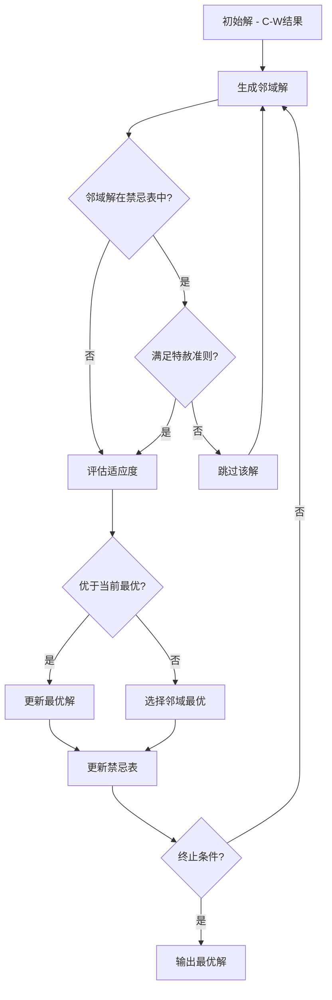

# 路线优化算法实现

## 1. 问题定义与数据结构

车辆路径问题（Vehicle Routing Problem, VRP）是TMS路线优化的核心算法基础。本节从数据结构设计出发，逐步实现带容量约束的VRP（CVRP）求解器。

### 1.1 核心数据结构

```python
from dataclasses import dataclass, field
from typing import List, Optional
from datetime import datetime, timedelta

@dataclass
class Order:
    """运输订单/需求点"""
    order_id: str
    lat: float                    # 纬度
    lng: float                    # 经度
    demand_weight: float          # 需求重量(kg)
    demand_volume: float          # 需求体积(m³)
    service_time: int             # 服务时长(分钟)
    time_window_start: datetime   # 时间窗最早到达
    time_window_end: datetime     # 时间窗最晚到达
    priority: int = 0             # 优先级(0=普通, 1=紧急)

@dataclass
class Depot:
    """仓库/车场"""
    depot_id: str
    lat: float
    lng: float
    time_window_start: datetime
    time_window_end: datetime

@dataclass
class Vehicle:
    """车辆"""
    vehicle_id: str
    capacity_weight: float        # 载重上限(kg)
    capacity_volume: float        # 容积上限(m³)
    cost_per_km: float            # 每公里成本
    fixed_cost: float             # 固定出车成本
    max_duration: int             # 最大行驶时长(分钟)
    driver_rest_required: int     # 连续驾驶后休息时长(分钟)
    driver_max_continuous: int    # 最大连续驾驶时长(分钟)

@dataclass
class Stop:
    """停靠点"""
    stop_id: str
    order: Optional[Order] = None  # None表示Depot
    stop_type: str = "DELIVERY"    # DELIVERY / PICKUP / DEPOT
    arrival_time: Optional[datetime] = None
    departure_time: Optional[datetime] = None
    wait_time: int = 0             # 等待时间(分钟)
    load_weight: float = 0.0       # 离开该点时的载重
    load_volume: float = 0.0       # 离开该点时的容积

@dataclass
class Route:
    """路线：一辆车的完整行驶路径"""
    route_id: str
    vehicle: Vehicle
    stops: List[Stop] = field(default_factory=list)
    total_distance: float = 0.0    # 总距离(km)
    total_duration: int = 0        # 总时长(分钟)
    total_cost: float = 0.0        # 总成本

    @property
    def total_demand_weight(self) -> float:
        return sum(s.order.demand_weight for s in self.stops if s.order)

    @property
    def is_feasible(self) -> bool:
        """检查容量约束"""
        return (self.total_demand_weight <= self.vehicle.capacity_weight and
                self.total_demand_volume <= self.vehicle.capacity_volume)
```

### 1.2 VRP数学模型

带容量约束的VRP（CVRP）标准数学表述：

**决策变量**：
- $x_{ij} \in \{0,1\}$：车辆是否从点i行驶到点j
- $u_i$：点i的累计载重（用于消除子回路）

**目标函数**（最小化总成本）：

$$\min \sum_{i \in V} \sum_{j \in V} c_{ij} \cdot x_{ij} + \sum_{k \in K} f_k \cdot y_k$$

其中 $c_{ij}$ 为点i到点j的行驶成本，$f_k$ 为车辆k的固定出车成本，$y_k$ 为是否使用车辆k。

**约束条件**：

$$\sum_{j \in V} x_{ij} = 1, \quad \forall i \in C$$ （每个客户点恰好被访问一次）

$$\sum_{j \in V} x_{ij} - \sum_{j \in V} x_{ji} = 0, \quad \forall i \in V$$ （流量守恒）

$$u_i - u_j + Q \cdot x_{ij} \leq Q - d_j, \quad \forall i,j \in C, i \neq j$$ （容量约束+子回路消除）

$$d_i \leq u_i \leq Q, \quad \forall i \in C$$ （载重边界）

## 2. Clarke-Wright节约算法实现

Clark-Wright节约算法（C-W）是VRP的经典启发式算法，思路简单、效率高，适合作为基准方案或快速求解。

### 2.1 算法原理

1. **初始化**：每个客户点分配一辆车，形成n条独立路线（Depot→客户→Depot）
2. **计算节约值**：合并点i和点j到同一路线可节约的距离 $s_{ij} = c_{i0} + c_{0j} - c_{ij}$
3. **降序排列节约值**，依次尝试合并
4. **合并条件**：两点在不同路线上、合并后不违反容量约束

### 2.2 Python实现

```python
import numpy as np
from typing import Dict, Tuple, List

class ClarkeWrightSolver:
    """Clarke-Wright节约算法求解CVRP"""

    def __init__(self, depot: Depot, orders: List[Order],
                 vehicles: List[Vehicle], dist_matrix: np.ndarray):
        self.depot = depot
        self.orders = orders
        self.vehicles = vehicles
        self.dist_matrix = dist_matrix  # (n+1) x (n+1), index 0 = depot
        self.n = len(orders)

    def solve(self) -> List[Route]:
        # Step 1: 初始化 - 每个订单一条路线
        routes: Dict[int, Route] = {}
        order_to_route: Dict[int, int] = {}
        vehicle_idx = 0

        for i, order in enumerate(self.orders):
            route = Route(
                route_id=f"R-{i:03d}",
                vehicle=self.vehicles[min(vehicle_idx, len(self.vehicles)-1)],
                stops=[
                    Stop(stop_id=f"S-{i}-0", stop_type="DEPOT"),
                    Stop(stop_id=f"S-{i}-1", order=order, stop_type="DELIVERY"),
                    Stop(stop_id=f"S-{i}-2", stop_type="DEPOT"),
                ]
            )
            routes[i] = route
            order_to_route[i] = i
            vehicle_idx += 1

        # Step 2: 计算节约值
        savings: List[Tuple[float, int, int]] = []
        for i in range(self.n):
            for j in range(i + 1, self.n):
                # s_ij = dist(depot,i) + dist(j,depot) - dist(i,j)
                s = (self.dist_matrix[0][i+1] +
                     self.dist_matrix[j+1][0] -
                     self.dist_matrix[i+1][j+1])
                savings.append((s, i, j))

        # Step 3: 降序排列
        savings.sort(key=lambda x: x[0], reverse=True)

        # Step 4: 贪心合并
        for saving_val, i, j in savings:
            ri = order_to_route.get(i)
            rj = order_to_route.get(j)

            if ri is None or rj is None or ri == rj:
                continue  # 同一路线或已合并

            route_i = routes.get(ri)
            route_j = routes.get(rj)

            if route_i is None or route_j is None:
                continue

            # 检查i是否为路线的最后一个客户, j是否为路线的第一个客户
            if (self._is_last_customer(route_i, i) and
                self._is_first_customer(route_j, j)):

                # 检查容量约束
                combined_weight = (route_i.total_demand_weight +
                                   route_j.total_demand_weight)
                combined_volume = (route_i.total_demand_volume +
                                   route_j.total_demand_volume)

                if (combined_weight <= route_i.vehicle.capacity_weight and
                    combined_volume <= route_i.vehicle.capacity_volume):
                    # 合并路线
                    self._merge_routes(route_i, route_j)
                    # 更新映射
                    for k in self._get_order_indices(route_j):
                        order_to_route[k] = ri
                    del routes[rj]

        return list(routes.values())

    def _is_last_customer(self, route: Route, order_idx: int) -> bool:
        """检查order_idx对应的订单是否在路线的最后一个客户位置"""
        delivery_stops = [s for s in route.stops if s.stop_type == "DELIVERY"]
        return len(delivery_stops) > 0 and delivery_stops[-1].order == self.orders[order_idx]

    def _is_first_customer(self, route: Route, order_idx: int) -> bool:
        """检查order_idx对应的订单是否在路线的第一个客户位置"""
        delivery_stops = [s for s in route.stops if s.stop_type == "DELIVERY"]
        return len(delivery_stops) > 0 and delivery_stops[0].order == self.orders[order_idx]

    def _merge_routes(self, route_i: Route, route_j: Route):
        """合并两条路线：去掉route_i的末尾Depot和route_j的开头Depot"""
        # 去掉route_i最后一个DEPOT stop
        merged_stops = route_i.stops[:-1]
        # 去掉route_j第一个DEPOT stop
        merged_stops.extend(route_j.stops[1:])
        route_i.stops = merged_stops

    def _get_order_indices(self, route: Route) -> List[int]:
        """获取路线中所有订单在self.orders中的索引"""
        indices = []
        for stop in route.stops:
            if stop.order:
                for idx, order in enumerate(self.orders):
                    if order.order_id == stop.order.order_id:
                        indices.append(idx)
                        break
        return indices
```

### 2.3 Java伪代码

```java
public class ClarkeWrightSolver {

    private final Depot depot;
    private final List<Order> orders;
    private final double[][] distMatrix;

    public List<Route> solve() {
        // 1. 初始化：每订单一条路线
        Map<Integer, Route> routes = new HashMap<>();
        for (int i = 0; i < orders.size(); i++) {
            routes.put(i, createSingleRoute(i));
        }

        // 2. 计算节约值并降序排列
        List<Saving> savings = new ArrayList<>();
        for (int i = 0; i < orders.size(); i++) {
            for (int j = i + 1; j < orders.size(); j++) {
                double s = distMatrix[0][i+1] + distMatrix[j+1][0] - distMatrix[i+1][j+1];
                savings.add(new Saving(s, i, j));
            }
        }
        savings.sort(Comparator.comparingDouble(Saving::getValue).reversed());

        // 3. 贪心合并
        for (Saving saving : savings) {
            int i = saving.i, j = saving.j;
            Route ri = findRouteContaining(routes, i);
            Route rj = findRouteContaining(routes, j);
            if (ri == rj || ri == null || rj == null) continue;

            if (isLastCustomer(ri, i) && isFirstCustomer(rj, j)) {
                if (checkCapacity(ri, rj)) {
                    mergeRoutes(ri, rj);
                    routes.remove(rj.getId());
                }
            }
        }
        return new ArrayList<>(routes.values());
    }
}
```

## 3. 禁忌搜索优化

C-W算法速度快但解质量一般，禁忌搜索（Tabu Search）可以在其基础上进一步优化。

### 3.1 算法流程



### 3.2 Python实现

```python
import random
from copy import deepcopy

class TabuSearchOptimizer:
    """禁忌搜索优化VRP解"""

    def __init__(self, initial_routes: List[Route], dist_matrix: np.ndarray,
                 max_iter: int = 500, tabu_tenure: int = 15):
        self.current_routes = deepcopy(initial_routes)
        self.dist_matrix = dist_matrix
        self.max_iter = max_iter
        self.tabu_tenure = tabu_tenure
        self.tabu_list: Dict[str, int] = {}  # move_hash -> remaining_tenure

    def optimize(self) -> List[Route]:
        best_routes = deepcopy(self.current_routes)
        best_cost = self._total_cost(best_routes)

        for iteration in range(self.max_iter):
            # 生成邻域解
            neighbors = self._generate_neighbors()

            best_neighbor = None
            best_neighbor_cost = float('inf')
            best_move_key = None

            for move_key, neighbor_routes in neighbors:
                cost = self._total_cost(neighbor_routes)

                # 禁忌准则：在禁忌表中且不满足特赦条件则跳过
                if move_key in self.tabu_list:
                    if cost >= best_cost:  # 特赦条件：优于历史最优
                        continue

                if cost < best_neighbor_cost:
                    best_neighbor = neighbor_routes
                    best_neighbor_cost = cost
                    best_move_key = move_key

            if best_neighbor is not None:
                self.current_routes = best_neighbor

                # 更新禁忌表
                self.tabu_list[best_move_key] = self.tabu_tenure

                # 更新全局最优
                if best_neighbor_cost < best_cost:
                    best_routes = deepcopy(best_neighbor)
                    best_cost = best_neighbor_cost

            # 衰减禁忌表
            expired = [k for k, v in self.tabu_list.items() if v <= 1]
            for k in expired:
                del self.tabu_list[k]
            for k in self.tabu_list:
                self.tabu_list[k] -= 1

        return best_routes

    def _generate_neighbors(self) -> List[Tuple[str, List[Route]]]:
        """生成邻域解：使用三种邻域算子"""
        neighbors = []

        # 算子1: 路线内Or-Opt（移除连续1~3个客户插入其他位置）
        for ri, route in enumerate(self.current_routes):
            delivery_stops = [(i, s) for i, s in enumerate(route.stops)
                             if s.stop_type == "DELIVERY"]
            if len(delivery_stops) < 3:
                continue
            # 随机选一段
            start = random.randint(0, len(delivery_stops) - 2)
            segment_len = random.choice([1, 2, 3])
            end = min(start + segment_len, len(delivery_stops))

            # 提取段并在路线内重新插入
            new_routes = deepcopy(self.current_routes)
            segment = new_routes[ri].stops[start:end]
            remaining = new_routes[ri].stops[:start] + new_routes[ri].stops[end:]

            insert_pos = random.randint(0, len(remaining))
            remaining[insert_pos:insert_pos] = segment
            new_routes[ri].stops = remaining

            move_key = f"or_opt_{ri}_{start}_{end}_{insert_pos}"
            neighbors.append((move_key, new_routes))

        # 算子2: 路线间Relocate（将一个客户移到另一路线）
        if len(self.current_routes) >= 2:
            ri = random.randint(0, len(self.current_routes) - 1)
            rj = random.randint(0, len(self.current_routes) - 1)
            if ri != rj:
                new_routes = deepcopy(self.current_routes)
                delivery_i = [(i, s) for i, s in enumerate(new_routes[ri].stops)
                             if s.stop_type == "DELIVERY"]
                if delivery_i:
                    pos, stop = random.choice(delivery_i)
                    new_routes[ri].stops.pop(pos)
                    # 插入路线j的随机位置
                    delivery_j_pos = random.randint(
                        1, max(1, len(new_routes[rj].stops) - 1))
                    new_routes[rj].stops.insert(delivery_j_pos, stop)

                    move_key = f"relocate_{ri}_{pos}_{rj}"
                    neighbors.append((move_key, new_routes))

        # 算子3: 路线间Exchange（交换两条路线各一个客户）
        if len(self.current_routes) >= 2:
            ri = random.randint(0, len(self.current_routes) - 1)
            rj = random.randint(0, len(self.current_routes) - 1)
            if ri != rj:
                new_routes = deepcopy(self.current_routes)
                d_i = [(i, s) for i, s in enumerate(new_routes[ri].stops)
                       if s.stop_type == "DELIVERY"]
                d_j = [(i, s) for i, s in enumerate(new_routes[rj].stops)
                       if s.stop_type == "DELIVERY"]
                if d_i and d_j:
                    pi, si = random.choice(d_i)
                    pj, sj = random.choice(d_j)
                    new_routes[ri].stops[pi] = sj
                    new_routes[rj].stops[pj] = si

                    move_key = f"exchange_{ri}_{pi}_{rj}_{pj}"
                    neighbors.append((move_key, new_routes))

        return neighbors

    def _total_cost(self, routes: List[Route]) -> float:
        """计算总成本 = 行驶成本 + 固定出车成本"""
        total = 0.0
        for route in routes:
            total += route.vehicle.fixed_cost
            for i in range(len(route.stops) - 1):
                from_idx = self._stop_to_matrix_idx(route.stops[i])
                to_idx = self._stop_to_matrix_idx(route.stops[i + 1])
                total += self.dist_matrix[from_idx][to_idx] * route.vehicle.cost_per_km
        return total

    def _stop_to_matrix_idx(self, stop: Stop) -> int:
        """将停靠点映射到距离矩阵的索引"""
        if stop.stop_type == "DEPOT":
            return 0
        for idx, order in enumerate(self.orders):
            if stop.order and order.order_id == stop.order.order_id:
                return idx + 1
        return 0
```

## 4. 约束处理

### 4.1 时间窗约束

```python
class TimeWindowChecker:
    """时间窗约束检查器"""

    @staticmethod
    def check_route(route: Route, dist_matrix: np.ndarray,
                    service_time_map: Dict[str, int]) -> Tuple[bool, List[Stop]]:
        """检查路线是否满足时间窗约束，返回(是否可行, 更新后的停靠点列表)"""
        current_time = route.stops[0].departure_time or datetime.now()
        feasible = True

        for i in range(1, len(route.stops)):
            prev = route.stops[i - 1]
            curr = route.stops[i]

            # 计算行驶时间
            travel_minutes = dist_matrix[prev.stop_id][curr.stop_id] / 60  # 假设以秒计
            arrival = current_time + timedelta(minutes=travel_minutes)

            # 检查时间窗
            if curr.order:
                tw_start = curr.order.time_window_start
                tw_end = curr.order.time_window_end

                if arrival < tw_start:
                    # 提前到达，需要等待
                    curr.wait_time = (tw_start - arrival).seconds // 60
                    arrival = tw_start
                elif arrival > tw_end:
                    # 迟到，违反约束
                    feasible = False

            curr.arrival_time = arrival
            service = service_time_map.get(curr.stop_id, 0)
            curr.departure_time = arrival + timedelta(minutes=service)
            current_time = curr.departure_time

        return feasible, route.stops
```

### 4.2 司机工时约束

```python
class DriverHoursChecker:
    """司机工时与休息约束检查器"""

    MAX_CONTINUOUS_DRIVE = 240  # 最大连续驾驶4小时(分钟)
    REST_DURATION = 45          # 强制休息45分钟

    @staticmethod
    def check_and_insert_rest(route: Route) -> Route:
        """检查连续驾驶时长，必要时插入休息点"""
        continuous_drive = 0
        new_stops = []

        for i, stop in enumerate(route.stops):
            new_stops.append(stop)

            if i < len(route.stops) - 1:
                # 计算到下一站的行驶时间
                next_stop = route.stops[i + 1]
                drive_time = stop.departure_time and next_stop.arrival_time and \
                    (next_stop.arrival_time - stop.departure_time).seconds // 60 or 0

                continuous_drive += drive_time

                if continuous_drive >= DriverHoursChecker.MAX_CONTINUOUS_DRIVE:
                    # 插入休息点
                    rest_stop = Stop(
                        stop_id=f"REST-{i}",
                        stop_type="REST",
                        arrival_time=stop.departure_time,
                        departure_time=stop.departure_time + timedelta(
                            minutes=DriverHoursChecker.REST_DURATION),
                        service_time=DriverHoursChecker.REST_DURATION
                    )
                    new_stops.append(rest_stop)
                    continuous_drive = 0

        route.stops = new_stops
        return route
```

## 5. 距离矩阵预处理

### 5.1 地图API调用与缓存

```python
import hashlib
import json
import requests
from typing import Optional

class DistanceMatrixService:
    """距离矩阵服务 - 基于高德地图API"""

    def __init__(self, api_key: str, cache_client: Optional[Redis] = None):
        self.api_key = api_key
        self.cache = cache_client  # Redis缓存
        self.base_url = "https://restapi.amap.com/v3/distance"

    def get_distance_matrix(self, locations: List[Tuple[float, float]]) -> np.ndarray:
        """
        获取N个位置之间的距离矩阵
        locations: [(lat1, lng1), (lat2, lng2), ...]
        返回: NxN距离矩阵(单位: km)
        """
        n = len(locations)
        matrix = np.zeros((n, n))

        # 批量查询（高德API支持最多100个origins×100个destinations）
        origins = "|".join(f"{lat},{lng}" for lat, lng in locations)
        destinations = origins

        cache_key = f"dist_matrix:{hashlib.md5(origins.encode()).hexdigest()}"

        # 1. 尝试缓存
        if self.cache:
            cached = self.cache.get(cache_key)
            if cached:
                return np.array(json.loads(cached))

        # 2. 调用API
        params = {
            "key": self.api_key,
            "origins": origins,
            "destination": destinations,
            "type": 1  # 1=驾车距离
        }

        # 分批查询避免API限制
        batch_size = 20
        for i in range(0, n, batch_size):
            batch_origins = "|".join(
                f"{lat},{lng}" for lat, lng in locations[i:i+batch_size])
            for j in range(0, n, batch_size):
                batch_dests = "|".join(
                    f"{lat},{lng}" for lat, lng in locations[j:j+batch_size])

                response = requests.get(self.base_url, params={
                    "key": self.api_key,
                    "origins": batch_origins,
                    "destination": batch_dests,
                    "type": 1
                })

                if response.status_code == 200:
                    data = response.json()
                    for idx, row in enumerate(data.get("results", [])):
                        actual_i = i + idx // (j + 1 if j > 0 else 1)
                        actual_j = j + idx % batch_size
                        if actual_i < n and actual_j < n:
                            dist_m = int(row.get("distance", 0))
                            matrix[actual_i][actual_j] = dist_m / 1000.0  # m→km

        # 3. 缓存结果（TTL 7天，道路信息变化不频繁）
        if self.cache:
            self.cache.setex(cache_key, 604800, json.dumps(matrix.tolist()))

        return matrix
```

### 5.2 降采样策略

对于大规模问题（100+点），距离矩阵的精度可以适当降低：

```python
class DistanceMatrixOptimizer:
    """距离矩阵降采样与优化"""

    @staticmethod
    def cluster_and_approximate(locations: List[Tuple[float, float]],
                                 cluster_radius_km: float = 2.0) -> Tuple[np.ndarray, Dict]:
        """
        对地理坐标聚类，用聚类中心代表一组相近点
        适用于100+点的大规模场景
        """
        from sklearn.cluster import DBSCAN

        coords = np.array(locations)
        # DBSCAN聚类（eps单位为度，约111km/度）
        eps_degrees = cluster_radius_km / 111.0
        clustering = DBSCAN(eps=eps_degrees, min_samples=1).fit(coords)

        cluster_map = {}  # original_idx -> cluster_id
        cluster_centers = {}

        for idx, label in enumerate(clustering.labels_):
            cluster_map[idx] = label
            if label not in cluster_centers:
                cluster_centers[label] = []
            cluster_centers[label].append(locations[idx])

        # 聚类中心取均值
        center_locations = {
            label: (
                sum(loc[0] for loc in locs) / len(locs),
                sum(loc[1] for loc in locs) / len(locs)
            )
            for label, locs in cluster_centers.items()
        }

        return cluster_map, center_locations
```

## 6. 路线可视化数据结构

路线优化结果需要在前端地图上展示，使用GeoJSON格式：

```json
{
  "type": "FeatureCollection",
  "features": [
    {
      "type": "Feature",
      "properties": {
        "routeId": "R-001",
        "vehicleNo": "沪A·12345",
        "carrierName": "顺达物流",
        "totalDistance": 156.8,
        "totalDuration": 185,
        "stopCount": 5,
        "color": "#2196F3"
      },
      "geometry": {
        "type": "LineString",
        "coordinates": [
          [121.2663, 31.3888],
          [121.4321, 31.2156],
          [118.7969, 32.0603],
          [118.8950, 32.1200]
        ]
      }
    },
    {
      "type": "Feature",
      "properties": {
        "stopId": "S-001-1",
        "stopType": "DEPOT",
        "name": "上海嘉定仓",
        "plannedArrival": "2026-06-07T08:00:00"
      },
      "geometry": {
        "type": "Point",
        "coordinates": [121.2663, 31.3888]
      }
    }
  ]
}
```

## 7. API设计

### 7.1 提交路线优化任务

```http
POST /api/v1/route-optimization/tasks
Content-Type: application/json
```

请求体：

```json
{
  "taskName": "华东区6月7日配送优化",
  "orderIds": ["ORD-001", "ORD-002", "ORD-003", "ORD-004", "ORD-005"],
  "depotId": "DEPOT-SH-01",
  "vehicleTypeIds": ["VT-4T", "VT-8T"],
  "constraints": {
    "maxStopsPerRoute": 8,
    "timeWindowHard": true,
    "driverRestEnabled": true,
    "consolidationEnabled": true
  },
  "algorithmConfig": {
    "solver": "CLARKE_WRIGHT_TABU",
    "maxIter": 500,
    "tabuTenure": 15,
    "timeLimitSeconds": 120,
    "objective": "MIN_COST"
  },
  "callbackUrl": "https://tms.example.com/api/callbacks/optimization"
}
```

响应：

```json
{
  "taskId": "OPT-20260606-001",
  "status": "PROCESSING",
  "estimatedCompletionSeconds": 90,
  "createdAt": "2026-06-06T15:00:00Z"
}
```

### 7.2 获取优化结果

```http
GET /api/v1/route-optimization/tasks/OPT-20260606-001/result
```

响应：

```json
{
  "taskId": "OPT-20260606-001",
  "status": "COMPLETED",
  "solver": "CLARKE_WRIGHT_TABU",
  "statistics": {
    "totalOrders": 5,
    "totalRoutes": 2,
    "totalDistance": 312.5,
    "totalCost": 4680.00,
    "computationTimeMs": 4230,
    "improvementOverInitial": 18.3
  },
  "routes": [
    {
      "routeId": "R-001",
      "vehicleTypeId": "VT-8T",
      "stops": [
        { "stopType": "DEPOT", "locationId": "DEPOT-SH-01", "departure": "06:30" },
        { "stopType": "DELIVERY", "orderId": "ORD-001", "arrival": "08:15", "departure": "08:45" },
        { "stopType": "DELIVERY", "orderId": "ORD-003", "arrival": "09:30", "departure": "10:00" },
        { "stopType": "DELIVERY", "orderId": "ORD-005", "arrival": "11:20", "departure": "11:50" },
        { "stopType": "DEPOT", "locationId": "DEPOT-SH-01", "arrival": "13:00" }
      ],
      "distance": 186.2,
      "cost": 2793.00,
      "loadUtilization": 0.82
    },
    {
      "routeId": "R-002",
      "vehicleTypeId": "VT-4T",
      "stops": [
        { "stopType": "DEPOT", "locationId": "DEPOT-SH-01", "departure": "07:00" },
        { "stopType": "DELIVERY", "orderId": "ORD-002", "arrival": "08:30", "departure": "09:00" },
        { "stopType": "DELIVERY", "orderId": "ORD-004", "arrival": "10:15", "departure": "10:45" },
        { "stopType": "DEPOT", "locationId": "DEPOT-SH-01", "arrival": "12:10" }
      ],
      "distance": 126.3,
      "cost": 1887.00,
      "loadUtilization": 0.71
    }
  ],
  "geojson": "{ ... GeoJSON数据 ... }",
  "unassignedOrders": []
}
```

### 7.3 手动调整路线

```http
PATCH /api/v1/route-optimization/tasks/OPT-20260606-001/routes/R-001
Content-Type: application/json
```

请求体：

```json
{
  "action": "MOVE_STOP",
  "stopIndex": 2,
  "targetRouteId": "R-002",
  "targetPosition": 1,
  "reason": "客户要求调整配送时间"
}
```

响应：

```json
{
  "status": "ADJUSTED",
  "validation": {
    "feasible": true,
    "warnings": ["R-002载重利用率将升至92%，接近上限"]
  },
  "affectedRoutes": ["R-001", "R-002"],
  "costDelta": +125.00
}
```

## 8. 开发者实战Tips

1. **算法选型**：100点以下用C-W+禁忌搜索，100~500点考虑ALNS（自适应大邻域搜索），500点以上建议分区分批优化后合并
2. **距离矩阵缓存**：相同区域的距离矩阵有效期7天，使用Redis缓存可减少90%的API调用
3. **异步执行**：路线优化是计算密集型任务，必须异步执行，通过回调或轮询获取结果
4. **约束松弛**：硬约束（载重）不可违反，软约束（时间窗）可设置违反惩罚系数，允许算法找到近似可行解
5. **预热策略**：历史优化结果可作为下次优化的初始解，大幅提升收敛速度
6. **并行评估**：禁忌搜索的邻域解评估相互独立，可用线程池并行计算适应度
7. **GeoJSON编码**：路线坐标使用GPS轨迹压缩算法（Douglas-Peucker）减少数据量，前端渲染更流畅
