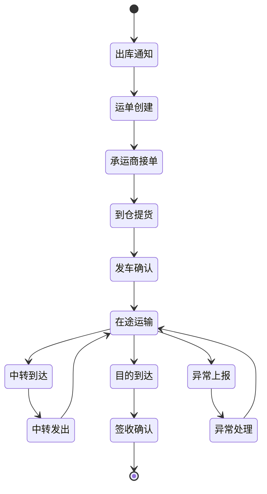
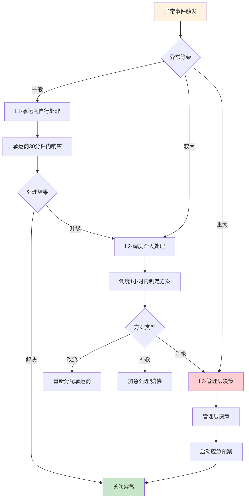
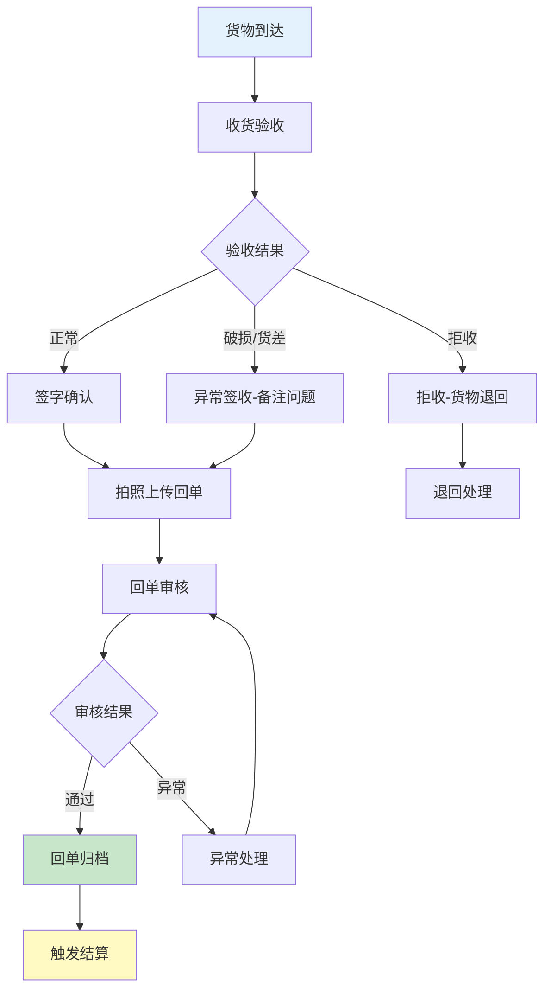
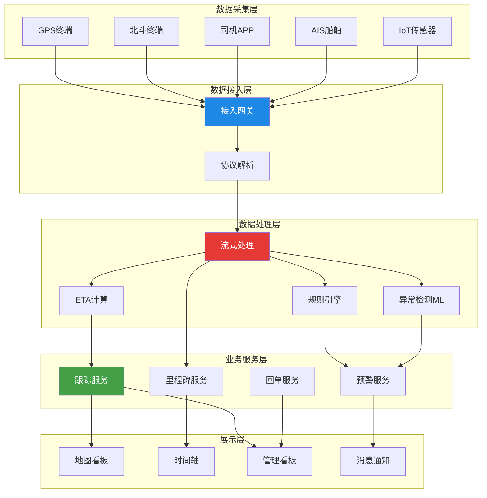
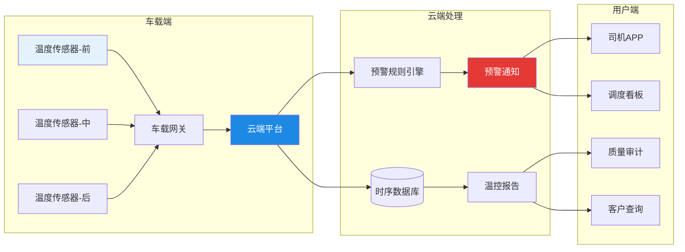

# 在途跟踪与异常管理

## 1. 在途跟踪方式

在途跟踪是TMS运输执行阶段的核心能力，通过多种技术手段实现货物位置的实时感知和状态监控。

### 1.1 GPS跟踪

GPS（Global Positioning System）是最广泛使用的车辆定位技术：

- **精度**：5-10米（开阔环境）
- **更新频率**：通常30秒-5分钟上报一次
- **适用场景**：自有车队、安装GPS设备的承运商车辆
- **局限**：室内/地下信号弱、设备安装成本

### 1.2 北斗定位

北斗卫星导航系统是国内运输行业的首选定位方案：

- **精度**：5-10米（与GPS相当），支持北斗地基增强可达亚米级
- **法规要求**：营运车辆强制安装北斗终端（"两客一危"）
- **短报文通信**：北斗独有的短报文功能，在无移动信号区域仍可通信
- **适用场景**：国内营运车辆、危险品运输、跨境运输

### 1.3 LBS定位

LBS（Location Based Service）基于移动基站定位：

- **精度**：50-500米（取决于基站密度）
- **实现方式**：通过司机手机APP获取位置
- **优点**：无需额外硬件、成本低
- **适用场景**：未安装GPS的承运商车辆、临时调车

### 1.4 AIS船舶跟踪

AIS（Automatic Identification System）用于海运船舶跟踪：

- **精度**：高（结合GPS）
- **覆盖**：近海AIS基站+卫星AIS
- **信息**：船舶位置、航速、航向、船舶信息
- **适用场景**：海运集装箱跟踪

### 1.5 手动打卡

在无法实现自动跟踪的场景下，采用手动打卡方式：

- **司机APP打卡**：司机在关键节点手动确认状态
- **承运商门户更新**：承运商客服手动更新运单状态
- **适用场景**：小型承运商、临时调车、海外运输

| 跟踪方式 | 精度 | 成本 | 覆盖 | 实时性 | 适用场景 |
|----------|------|------|------|--------|----------|
| GPS | 高 | 中 | 全球 | 高 | 自有车队 |
| 北斗 | 高 | 中 | 国内+一带一路 | 高 | 国内营运车辆 |
| LBS | 低 | 低 | 移动网络覆盖 | 中 | 承运商车辆 |
| AIS | 高 | 高 | 海域 | 高 | 海运船舶 |
| 手动打卡 | 低 | 低 | 无限制 | 低 | 临时/海外 |

## 2. 可视化看板

### 2.1 地图看板

地图看板是在途跟踪最直观的展示形式：

- **车辆分布**：在途车辆在地图上的实时位置
- **路线轨迹**：车辆的历史行驶轨迹和当前路线
- **异常标记**：延迟、偏航、温控异常等异常标记
- **热力图**：订单密度和运力分布热力图

### 2.2 时间轴看板

时间轴看板展示运单的关键里程碑时间线：

### 2.3 ETA预测

ETA（Estimated Time of Arrival）预测是基于实时数据的到达时间预估：

- **基础ETA**：基于历史平均行驶时间
- **实时ETA**：结合实时路况、天气、交通事件动态调整
- **机器学习ETA**：利用历史数据训练模型，考虑更多特征（车型、时段、季节等）

ETA预测精度指标：

| 方法 | 平均误差 | 适用场景 |
|------|---------|---------|
| 历史均值 | ±2小时 | 粗略预估 |
| 实时路况修正 | ±1小时 | 日常运营 |
| ML模型 | ±30分钟 | 精细化管理 |

## 3. 里程碑管理

里程碑是运单生命周期中的关键状态节点，TMS 通过里程碑管理实现运输状态的标准化追踪：

### 3.1 标准里程碑

| 里程碑 | 英文 | 触发条件 | 时效基准 |
|--------|------|---------|---------|
| 出库通知 | Pick Notice | WMS出库完成 | - |
| 运单创建 | Order Created | TMS生成运单 | - |
| 承运商接单 | Carrier Accepted | 承运商确认接单 | 接单时效 |
| 到仓提货 | Pickup Arrived | 车辆到达仓库 | 提货时效 |
| 发车确认 | Departed | 货物装车出发 | 发车时效 |
| 中转到达 | Transit Arrived | 到达中转站 | 中转时效 |
| 中转发出 | Transit Departed | 从中转站发出 | 中转时效 |
| 目的到达 | Destination Arrived | 到达目的地 | 在途时效 |
| 签收确认 | POD Confirmed | 收货人签收 | 交付时效 |

### 3.2 里程碑流转图

### 3.3 里程碑时效管控

每个里程碑之间的时间差构成时效指标，TMS 需要对每个时效设定标准值并监控：

| 时效段 | 标准时效 | 预警阈值 | 超时处理 |
|--------|---------|---------|---------|
| 接单时效 | ≤2小时 | 1.5小时 | 催促接单/更换承运商 |
| 提货时效 | ≤4小时 | 3小时 | 催促到仓 |
| 发车时效 | ≤1小时 | 0.5小时 | 催促发车 |
| 在途时效 | 按线路标准 | 80%标准值 | 预警客户 |
| 交付时效 | ≤2小时 | 1小时 | 催促签收 |

## 4. 异常管理

### 4.1 异常类型

| 异常类型 | 说明 | 触发条件 | 影响等级 |
|----------|------|---------|---------|
| 延迟 | 未在承诺时间内到达 | ETA超时>2小时 | 中-高 |
| 破损 | 运输过程中货物损坏 | 签收时发现破损 | 中 |
| 货差 | 实际交付数量与运单不符 | 签收数量差异 | 中 |
| 拒收 | 收货人拒绝签收 | 客户拒收 | 高 |
| 偏航 | 车辆偏离预设路线 | 偏离距离>5km | 中 |
| 温控异常 | 冷链温度超出范围 | 温度超限持续>15分钟 | 高 |
| 事故 | 运输途中发生交通事故 | 承运商上报 | 极高 |

### 4.2 异常升级机制

### 4.3 异常预警规则

TMS 应支持灵活配置的异常预警规则：

| 预警规则 | 条件 | 通知方式 | 通知对象 |
|----------|------|---------|---------|
| 接单超时 | 运单下发2小时未接单 | APP推送+短信 | 调度员+承运商 |
| 发车延迟 | 预定发车时间后1小时未发车 | APP推送 | 调度员 |
| 在途延迟 | ETA超时2小时 | APP推送+邮件 | 调度员+客户经理 |
| 偏航预警 | 偏离路线5km | APP推送 | 调度员 |
| 温控预警 | 温度超限15分钟 | 电话+短信 | 调度员+质量经理 |
| 签收超时 | 到达后2小时未签收 | APP推送 | 调度员 |

## 5. POD回单管理

POD（Proof of Delivery）回单是运输交付的法律凭证，TMS 需要对回单进行全生命周期管理。

### 5.1 回单类型

| 类型 | 采集方式 | 优点 | 缺点 |
|------|---------|------|------|
| 纸质回单 | 打印回单→签字→寄回 | 法律效力强 | 回收周期长、易丢失 |
| 电子签字 | PAD/手机签字 | 即时回收 | 需设备支持 |
| 拍照回单 | 拍摄货物交付照片 | 直观 | 仅能证明已交付 |
| 电子签章 | 数字签名 | 法律效力+即时 | 需CA认证 |

### 5.2 回单管理流程

### 5.3 回单关键指标

| 指标 | 计算方式 | 目标值 |
|------|---------|--------|
| 回单回收率 | 已回收回单数/应回收回单数×100% | ≥98% |
| 回单时效 | 签收到回单归档的平均时间 | ≤24小时 |
| 回单异常率 | 异常回单数/总回单数×100% | ≤2% |
| 电子回单占比 | 电子回单数/总回单数×100% | ≥80% |

## 6. 在途跟踪架构图

## 7. 真实案例：冷链运输温控在途监控

### 7.1 业务背景

某医药流通企业承运生物制品和疫苗，要求全程2-8°C冷链运输。面临挑战：

- 疫苗运输温度偏差容忍度极低（超温15分钟即报废）
- 人工温度监控间隔大，无法及时发现异常
- 温度异常发现滞后，导致药品损失
- 监管审计要求完整的温度记录

### 7.2 解决方案

**IoT温控设备部署**

- 车厢安装多点温度传感器（前/中/后3个探头）
- 每5分钟采集一次温度数据
- 支持2G/4G/NB-IoT多种通信方式
- 设备续航≥30天

**温控预警规则**

| 规则 | 条件 | 响应 |
|------|------|------|
| 一级预警 | 温度偏离0.5°C | 通知司机检查 |
| 二级预警 | 温度偏离1°C持续5分钟 | 通知调度+司机 |
| 三级预警 | 温度偏离2°C持续10分钟 | 通知管理层+启动应急预案 |
| 超温报警 | 温度超出2-8°C范围 | 全员通知+紧急处理 |

**温控看板功能**

- 实时温度曲线图（车厢前/中/后三线）
- 温度异常事件时间线
- 冷链完整性报告（温度记录无断点）
- 运单温度证明（可导出PDF用于审计）

### 7.3 架构设计

### 7.4 实施效果

| 指标 | 改善前 | 改善后 | 提升 |
|------|--------|--------|------|
| 温度异常发现时间 | 2-4小时 | 5分钟 | -97% |
| 药品超温损失率 | 1.5% | 0.1% | -93% |
| 冷链合规审计通过率 | 85% | 99% | +16.5% |
| 温度记录完整性 | 70% | 99.5% | +42.1% |
| 异常处理响应时间 | 4小时 | 15分钟 | -93.8% |

### 7.5 关键经验

1. **监测频率是关键**：5分钟采集间隔是平衡精度和成本的合理选择，比1小时人工记录精度提升12倍
2. **多点监测**：车厢内温度分布不均匀，前后温差可达2-3°C，必须多点监测
3. **预警分级**：不同级别的异常需要不同的响应机制，避免"狼来了"效应
4. **审计闭环**：温度数据不可篡改，形成完整的审计链

## 8. 小结

在途跟踪与异常管理是TMS运输执行阶段的核心能力。多种跟踪方式（GPS/北斗/LBS/AIS）的组合使用确保了不同场景下的位置感知能力。里程碑管理标准化了运输状态跟踪，异常管理机制确保了异常的及时发现和处理。POD回单管理完成了运输交付的法律闭环。冷链温控案例展示了IoT技术在运输监控中的深度应用。
