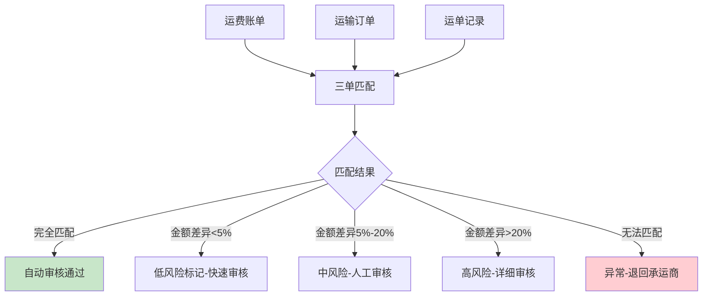
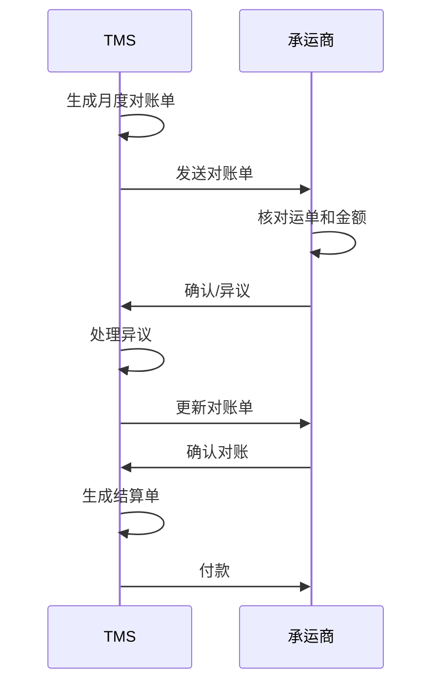
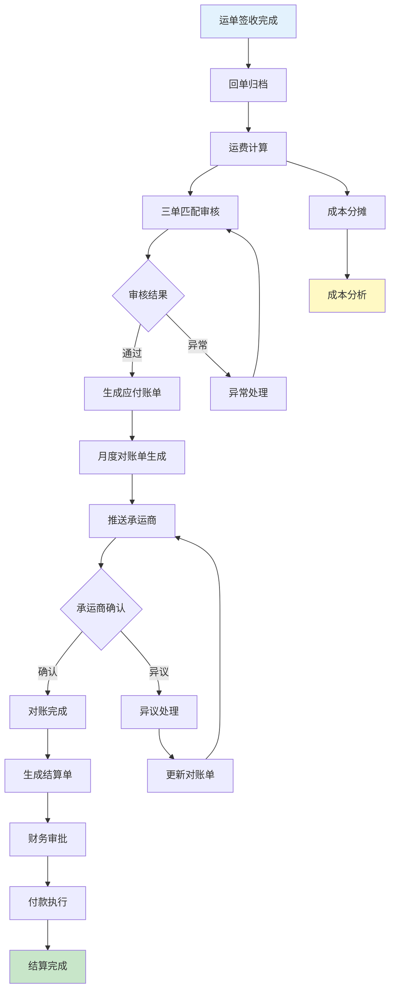

# 运费结算与成本分析

## 1. 运费计算模型

运费计算是TMS结算模块的核心，涉及基础运费和附加费用的组合计算。

### 1.1 基础运费

基础运费根据计费基准和费率表计算：

```
基础运费 = 计费量 × 单价

其中计费量的确定规则：
- 按重量计费：计费重量 = MAX(实际重量, 体积重量)
- 按体积计费：计费体积 = 长×宽×高
- 按里程计费：计费里程 = 起点到终点距离
- 按件数计费：计费件数 = 实际件数
- 包车计费：固定一口价
```

### 1.2 附加费

附加费是基础运费之外的额外费用，通常与特定条件相关：

| 附加费类型 | 触发条件 | 计算方式 | 示例 |
|-----------|---------|---------|------|
| 装卸费 | 需要装卸服务 | 按次/按吨 | 50元/次 |
| 楼层费 | 无电梯楼层搬运 | 按层×件数 | 5元/层/件 |
| 等待费 | 超出免费等待时间 | 按小时 | 30元/小时 |
| 夜间附加费 | 22:00-06:00作业 | 基础费×系数 | 基础费×1.2 |
| 偏远附加费 | 偏远地区配送 | 固定附加 | 100元 |
| 危险品附加费 | 危险品运输 | 基础费×系数 | 基础费×1.5 |
| 超限附加费 | 超长/超宽/超重 | 固定附加 | 200元 |
| 返空费 | 单程运输空返 | 按里程×系数 | 里程×0.4 |

### 1.3 运费计算公式

```
总运费 = 基础运费 + Σ附加费

= 计费量 × 单价 + 装卸费 + 等待费 + ... + 偏远附加费

约束条件：
- 总运费 ≥ 最低收费（一票起价）
- 总运费 ≤ 最高限价（封顶价）
```

## 2. 计费规则

### 2.1 按重量阶梯计费

零担和快递最常用的计费方式，重量越大单价越低：

| 重量区间 | 单价（元/kg） | 最低收费 |
|----------|--------------|---------|
| 0-5kg | 3.00 | 15元 |
| 5-20kg | 2.50 | - |
| 20-100kg | 2.00 | - |
| 100-500kg | 1.50 | - |
| 500kg以上 | 1.20 | - |

### 2.2 按里程计费

整车运输常用的计费方式：

```
运费 = 里程 × 单价 + 起步价 + 附加费

示例：
- 起步价：300元（含20km）
- 超出里程单价：5元/km
- 总里程150km
- 运费 = 300 + (150-20) × 5 = 300 + 650 = 950元
```

### 2.3 包车计费

固定线路整车运输的一口价模式：

| 线路 | 车型 | 包车价 | 备注 |
|------|------|--------|------|
| 上海→南京 | 4.2米 | 800元 | 含装卸 |
| 上海→杭州 | 4.2米 | 600元 | 含装卸 |
| 上海→北京 | 9.6米 | 3,500元 | 不含装卸 |
| 上海→广州 | 9.6米 | 5,000元 | 不含装卸 |

## 3. 运费审核

运费审核是确保运费计算准确、防止超额支付的关键环节。

### 3.1 三单匹配

三单匹配是运费审核的核心方法，将订单、运单和发票三份数据进行比对：



### 3.2 三单匹配校验项

| 校验项 | 订单 | 运单 | 发票 | 校验规则 |
|--------|------|------|------|----------|
| 运单号 | - | 运单号 | 运单号 | 三单一致 |
| 发货人 | 发货人 | 发货人 | 发货人 | 三单一致 |
| 收货人 | 收货人 | 收货人 | 收货人 | 三单一致 |
| 货物重量 | 订单重量 | 实发重量 | 计费重量 | 实发≤订单，计费≤实发×1.1 |
| 货物体积 | 订单体积 | 实发体积 | 计费体积 | 同上 |
| 运费金额 | - | 应付运费 | 发票金额 | 差异≤5% |
| 签收状态 | - | 已签收 | - | 运单已签收方可结算 |

### 3.3 审核规则引擎

TMS 应配置灵活的审核规则引擎，支持自定义审核条件：

| 规则类型 | 规则示例 | 动作 |
|----------|---------|------|
| 金额阈值 | 单笔运费>5,000元 | 必须人工审核 |
| 差异阈值 | 计费重量>订单重量×1.1 | 标记异常 |
| 合规检查 | 危险品运输无资质记录 | 阻止结算 |
| 重复检查 | 同一运单重复提交 | 阻止重复支付 |
| 时效检查 | 超过签收90天未结算 | 提醒处理 |

## 4. 对账流程

### 4.1 承运商对账

与承运商的对账是TMS运费结算的关键流程：



承运商对账的关键步骤：

| 步骤 | 说明 | 时限 |
|------|------|------|
| 对账单生成 | TMS按月汇总应付运费 | 月末5日内 |
| 对账单发送 | 推送至承运商门户 | 生成后1日内 |
| 承运商确认 | 承运商核对并确认 | 收到后7日内 |
| 异议处理 | 处理承运商提出的差异 | 收到异议后5日内 |
| 对账确认 | 双方确认最终金额 | 异议处理完3日内 |
| 付款结算 | 按合同账期付款 | 对账确认后按账期 |

### 4.2 客户对账

向客户收取运费的对账流程：

- **应收账单生成**：按客户按月汇总应收运费
- **客户确认**：客户核对后确认或提出异议
- **开票**：根据确认金额开具发票
- **收款**：跟踪客户付款，管理应收账款

### 4.3 对账差异处理

| 差异类型 | 常见原因 | 处理方式 |
|----------|---------|---------|
| 重量差异 | 订单重量与实际重量不同 | 以实际过磅重量为准 |
| 费率差异 | 费率表版本不一致 | 以合同费率为准 |
| 附加费差异 | 附加费记录不完整 | 补充凭证后确认 |
| 重复计费 | 同一运单多次计费 | 删除重复项 |
| 遗漏运单 | 部分运单未纳入对账 | 补入下期对账 |

## 5. 成本分摊

运输成本需要合理分摊到各业务单元，支持精细化的成本管理。

### 5.1 分摊方法

| 方法 | 计算方式 | 适用场景 | 优缺点 |
|------|---------|---------|--------|
| 按订单分摊 | 总运费/订单数 | 统一规格订单 | 简单但不精确 |
| 按重量分摊 | 各订单重量占比×总运费 | 重量差异大 | 相对公平 |
| 按体积分摊 | 各订单体积占比×总运费 | 体积差异大 | 适合轻泡货 |
| 按重量体积加权 | (重量占比×W+体积占比×V)×总运费 | 混合货物 | 最精确但复杂 |

### 5.2 拼车成本分摊示例

```
一车运输3个客户的货物：
- 客户A：500kg，2m³
- 客户B：800kg，3m³
- 客户C：700kg，1.5m³
- 总运费：2,000元

按重量分摊：
- 总重量 = 500+800+700 = 2,000kg
- 客户A = 500/2,000 × 2,000 = 500元
- 客户B = 800/2,000 × 2,000 = 800元
- 客户C = 700/2,000 × 2,000 = 700元

按体积分摊：
- 总体积 = 2+3+1.5 = 6.5m³
- 客户A = 2/6.5 × 2,000 = 615元
- 客户B = 3/6.5 × 2,000 = 923元
- 客户C = 1.5/6.5 × 2,000 = 462元
```

## 6. 运输成本分析

### 6.1 趋势分析

运输成本的趋势分析帮助识别成本变化规律：

| 分析维度 | 指标 | 用途 |
|----------|------|------|
| 月度趋势 | 月度总运费、单公斤运费 | 识别季节性波动 |
| 同比/环比 | 运费增长率 | 判断成本变化方向 |
| 结构占比 | 各承运商/线路/车型运费占比 | 发现成本集中点 |
| 单位成本 | 吨公里运费、单票运费 | 衡量成本效率 |

### 6.2 对比分析

| 对比维度 | 方法 | 发现 |
|----------|------|------|
| 承运商对比 | 同线路不同承运商单价 | 识别高成本承运商 |
| 线路对比 | 同区域不同线路成本 | 优化线路选择 |
| 车型对比 | 不同车型的单位运输成本 | 优化车型配置 |
| 模式对比 | 整车vs零担vs快递成本 | 优化运输模式选择 |

### 6.3 异常检测

运费异常检测帮助发现潜在的问题和风险：

| 异常类型 | 检测规则 | 可能原因 |
|----------|---------|---------|
| 单价异常 | 单价超出历史均值±2σ | 费率错误/承运商涨价 |
| 附加费异常 | 附加费占比>30% | 虚报附加费 |
| 重量异常 | 计费重量>订单重量×1.2 | 过磅误差/虚报重量 |
| 重复支付 | 同一运单多次结算 | 系统错误/人工失误 |
| 空驶异常 | 空驶率>20% | 调度不合理 |

## 7. 结算流程图



## 8. 真实案例：SAP TM运费结算功能解析

### 8.1 SAP TM结算概述

SAP TM的运费结算功能（Settlement Management）是其核心模块之一，与S/4HANA财务模块深度集成，实现从运费计算到财务入账的全自动化流程。

### 8.2 核心功能

**费率管理（Rate Management）**

SAP TM的费率管理支持复杂的费率结构定义：

| 功能 | 说明 |
|------|------|
| Calculation Sheet | 定义费率计算的完整公式和步骤 |
| Rate Table | 维护不同维度的费率表（承运商×线路×车型） |
| Surcharge | 灵活定义附加费规则 |
| Rate Determination | 自动匹配最优费率 |

**结算单据（Settlement Document）**

SAP TM的结算单据是连接运输执行和财务入账的桥梁：


**与FI集成**

SAP TM结算自动过账到S/4HANA财务会计（FI）模块：

- 自动生成应付账款凭证
- 按成本中心归集运输成本
- 支持多币种结算
- 税务处理（增值税进项抵扣）

### 8.3 关键配置

| 配置项 | 说明 | 影响 |
|--------|------|------|
| Settlement Profile | 定义结算规则和流程 | 决定结算方式和审批流 |
| Calculation Profile | 定义费率计算规则 | 决定运费计算逻辑 |
| Determination Rule | 费率自动匹配规则 | 决定使用哪套费率 |
| Tolerance Group | 差异容忍度配置 | 决定自动通过或人工审核 |
| Posting Profile | 过账规则配置 | 决定FI科目映射 |

### 8.4 优势与局限

| 维度 | 优势 | 局限 |
|------|------|------|
| 集成性 | 与S/4HANA无缝集成 | 依赖SAP生态 |
| 灵活性 | Calculation Sheet高度灵活 | 配置复杂，学习曲线陡 |
| 合规性 | 支持全球税务和合规要求 | 本土化需额外适配 |
| 审计性 | 完整的审计追踪 | 数据量大时性能挑战 |
| 多模式 | 支持海陆空铁多模式结算 | 国内零担模式支持弱 |

### 8.5 实施建议

1. **费率先行**：先完成费率表的梳理和清理，再配置系统
2. **分批上线**：先上线核心线路结算，再逐步扩展
3. **自动化优先**：高频率标准线路优先实现自动结算
4. **异常处理流程**：提前设计差异处理和异常升级流程
5. **培训投入**：结算模块复杂度高，需充分培训财务和运营人员

## 9. 小结

运费结算与成本分析是TMS的"最后一公里"，直接关系到运输成本的透明度和控制力。运费计算模型涵盖基础运费和多种附加费，三单匹配确保了运费审核的准确性，对账流程规范了与承运商和客户的费用确认，成本分摊和分析则为企业提供了运输成本的全面洞察。SAP TM结算案例展示了大型TMS系统的结算功能深度和实施复杂度。
