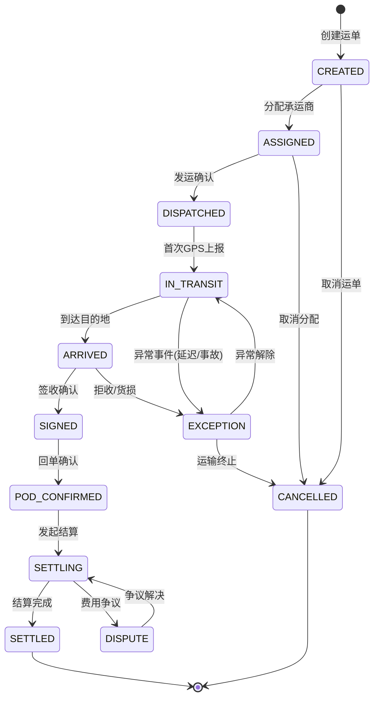
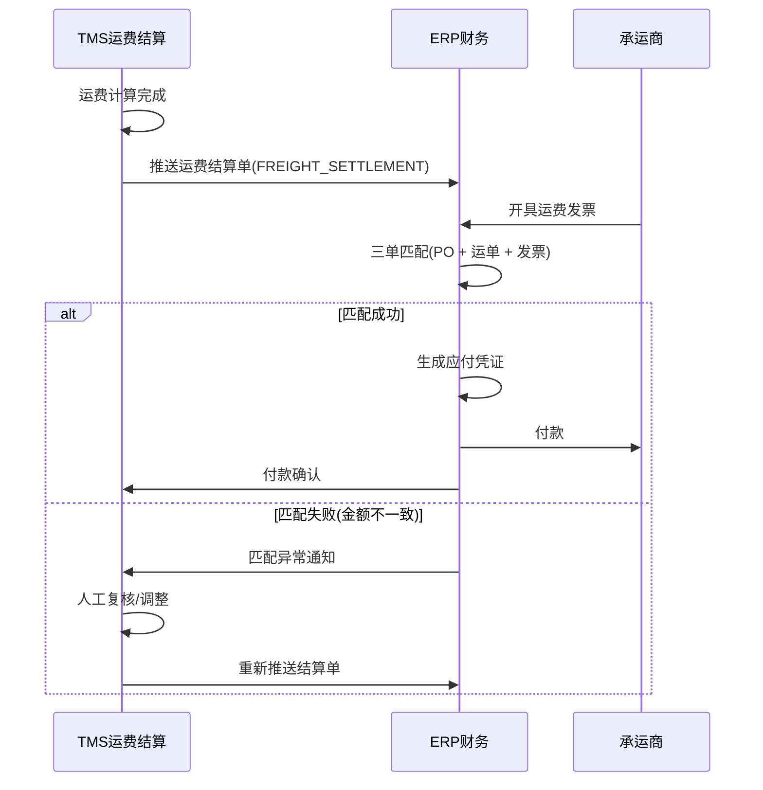

# TMS数据库设计与接口

## 1. 核心表设计

### 1.1 ER关系图


### 1.2 运单主表 SHIPMENT_ORDER

| 字段名 | 类型 | 必填 | 说明 |
|--------|------|------|------|
| order_id | VARCHAR(36) | PK | 运单主键，UUID |
| order_no | VARCHAR(20) | UK | 运单编号，格式SHP-yyyyMMddNNNN |
| status | VARCHAR(20) | Y | 运单状态，见状态机定义 |
| source_order_no | VARCHAR(30) | | 来源订单号（ERP销售订单号） |
| source_system | VARCHAR(20) | | 来源系统标识（ERP/OMS/WMS） |
| carrier_id | VARCHAR(36) | FK | 承运商ID |
| route_id | VARCHAR(36) | FK | 路线ID |
| contract_id | VARCHAR(36) | FK | 合同ID |
| vehicle_no | VARCHAR(15) | | 车牌号 |
| driver_name | VARCHAR(20) | | 司机姓名 |
| driver_phone | VARCHAR(15) | | 司机电话 |
| ship_from_location_id | VARCHAR(20) | | 发货地位置编码 |
| ship_from_address | VARCHAR(200) | | 发货地详细地址 |
| ship_to_location_id | VARCHAR(20) | | 收货地位置编码 |
| ship_to_address | VARCHAR(200) | | 收货地详细地址 |
| total_weight | DECIMAL(10,2) | | 总重量(kg) |
| total_volume | DECIMAL(10,2) | | 总体积(m³) |
| total_quantity | INT | | 总件数 |
| planned_departure | DATETIME | | 计划发运时间 |
| planned_arrival | DATETIME | | 计划到达时间 |
| actual_departure | DATETIME | | 实际发运时间 |
| actual_arrival | DATETIME | | 实际到达时间 |
| priority | TINYINT | | 优先级(0=普通,1=紧急,2=特急) |
| special_requirements | JSON | | 特殊要求（温控、危险品等） |
| created_by | VARCHAR(36) | | 创建人 |
| created_at | DATETIME | | 创建时间 |
| updated_at | DATETIME | | 更新时间 |
| version | INT | Y | 乐观锁版本号 |

### 1.3 承运商合同表 CARRIER_CONTRACT

| 字段名 | 类型 | 必填 | 说明 |
|--------|------|------|------|
| contract_id | VARCHAR(36) | PK | 合同主键 |
| contract_no | VARCHAR(20) | UK | 合同编号 |
| carrier_id | VARCHAR(36) | FK | 承运商ID |
| service_type | VARCHAR(20) | Y | 服务类型（LTL/FTL/EXPRESS/COLD_CHAIN） |
| coverage_region | JSON | | 覆盖区域（省份编码列表） |
| vehicle_types | JSON | | 支持车型列表 |
| effective_from | DATE | Y | 生效日期 |
| effective_to | DATE | Y | 失效日期 |
| payment_terms | VARCHAR(20) | | 付款条件（NET_30/NET_60/IMMEDIATE） |
| status | VARCHAR(10) | Y | 状态（ACTIVE/SUSPENDED/EXPIRED） |
| credit_limit | DECIMAL(12,2) | | 信用额度 |
| remark | TEXT | | 备注 |

### 1.4 费率表 FREIGHT_RATE

| 字段名 | 类型 | 必填 | 说明 |
|--------|------|------|------|
| rate_id | VARCHAR(36) | PK | 费率主键 |
| contract_id | VARCHAR(36) | FK | 关联合同ID |
| rate_type | VARCHAR(15) | Y | 计费类型（BY_WEIGHT/BY_VOLUME/BY_TRIP/BY_CONTAINER） |
| origin_region | VARCHAR(10) | | 始发区域编码 |
| dest_region | VARCHAR(10) | | 目的区域编码 |
| vehicle_type | VARCHAR(10) | | 车型编码 |
| min_weight | DECIMAL(10,2) | | 重量下限(kg) |
| max_weight | DECIMAL(10,2) | | 重量上限(kg) |
| unit_price | DECIMAL(10,4) | Y | 单价 |
| unit | VARCHAR(10) | Y | 计费单位（KG/M3/TRIP/TEU） |
| min_charge | DECIMAL(10,2) | | 最低收费 |
| surcharge_rules | JSON | | 附加费规则（燃油附加费、等待费等） |

## 2. 运单状态机

运单状态流转是TMS最核心的业务逻辑之一，必须严格定义状态转换规则。



### 2.1 状态转换规则表

| 当前状态 | 目标状态 | 触发动作 | 前置条件 | 自动/手动 |
|----------|---------|----------|---------|----------|
| CREATED | ASSIGNED | assignCarrier | 承运商ID非空，合同在有效期 | 手动 |
| CREATED | CANCELLED | cancel | 无下游关联数据 | 手动 |
| ASSIGNED | DISPATCHED | confirmDispatch | 车牌号、司机信息已填 | 手动 |
| ASSIGNED | CANCELLED | cancelAssignment | 无发运记录 | 手动 |
| DISPATCHED | IN_TRANSIT | onFirstGpsReport | GPS数据有效 | 自动 |
| IN_TRANSIT | ARRIVED | confirmArrival | 到达最终目的地或签收节点 | 自动/手动 |
| IN_TRANSIT | EXCEPTION | reportException | 异常类型+描述 | 自动/手动 |
| EXCEPTION | IN_TRANSIT | resolveException | 异常已处理 | 手动 |
| ARRIVED | SIGNED | confirmSignoff | 签收人+签收时间 | 手动 |
| ARRIVED | EXCEPTION | reportException | 拒收/货损原因 | 手动 |
| SIGNED | POD_CONFIRMED | confirmPod | 回单图片/电子签名已上传 | 手动 |
| POD_CONFIRMED | SETTLING | initiateSettlement | 运单有有效合同和费率 | 自动 |
| SETTLING | SETTLED | completeSettlement | 三单匹配通过 | 自动/手动 |

### 2.2 状态机实现

```python
from enum import Enum
from typing import Dict, Callable, Optional

class ShipmentStatus(str, Enum):
    CREATED = "CREATED"
    ASSIGNED = "ASSIGNED"
    DISPATCHED = "DISPATCHED"
    IN_TRANSIT = "IN_TRANSIT"
    ARRIVED = "ARRIVED"
    SIGNED = "SIGNED"
    POD_CONFIRMED = "POD_CONFIRMED"
    SETTLING = "SETTLING"
    SETTLED = "SETTLED"
    EXCEPTION = "EXCEPTION"
    DISPUTE = "DISPUTE"
    CANCELLED = "CANCELLED"

class ShipmentStateMachine:
    """运单状态机"""

    TRANSITIONS: Dict[tuple, dict] = {
        (ShipmentStatus.CREATED, ShipmentStatus.ASSIGNED): {
            "action": "assignCarrier",
            "guard": lambda order: order.carrier_id is not None and order.contract_is_valid()
        },
        (ShipmentStatus.ASSIGNED, ShipmentStatus.DISPATCHED): {
            "action": "confirmDispatch",
            "guard": lambda order: order.vehicle_no and order.driver_name
        },
        (ShipmentStatus.DISPATCHED, ShipmentStatus.IN_TRANSIT): {
            "action": "onFirstGpsReport",
            "guard": lambda order: order.latest_gps is not None
        },
        (ShipmentStatus.IN_TRANSIT, ShipmentStatus.ARRIVED): {
            "action": "confirmArrival",
            "guard": lambda order: True
        },
        (ShipmentStatus.ARRIVED, ShipmentStatus.SIGNED): {
            "action": "confirmSignoff",
            "guard": lambda order: order.signer_name is not None
        },
        (ShipmentStatus.SIGNED, ShipmentStatus.POD_CONFIRMED): {
            "action": "confirmPod",
            "guard": lambda order: order.pod_image_url is not None
        },
        (ShipmentStatus.POD_CONFIRMED, ShipmentStatus.SETTLING): {
            "action": "initiateSettlement",
            "guard": lambda order: order.has_valid_contract_and_rate()
        },
        (ShipmentStatus.SETTLING, ShipmentStatus.SETTLED): {
            "action": "completeSettlement",
            "guard": lambda order: order.three_way_match_passed()
        },
    }

    EXCEPTION_TRANSITIONS = {
        ShipmentStatus.IN_TRANSIT: ShipmentStatus.EXCEPTION,
        ShipmentStatus.ARRIVED: ShipmentStatus.EXCEPTION,
    }

    @classmethod
    def can_transition(cls, current: ShipmentStatus, target: ShipmentStatus,
                       order) -> bool:
        key = (current, target)
        if key in cls.TRANSITIONS:
            guard = cls.TRANSITIONS[key]["guard"]
            return guard(order)
        if current in cls.EXCEPTION_TRANSITIONS and target == ShipmentStatus.EXCEPTION:
            return True
        return False

    @classmethod
    def transition(cls, order, target: ShipmentStatus):
        current = ShipmentStatus(order.status)
        if not cls.can_transition(current, target, order):
            raise InvalidTransitionError(
                f"Cannot transition from {current} to {target}")
        order.status = target.value
        order.version += 1
        order.updated_at = datetime.now()
```

## 3. API设计

### 3.1 创建运单

```http
POST /api/v1/shipments
Content-Type: application/json
Authorization: Bearer <token>
```

请求体：

```json
{
  "sourceOrderNo": "SO-20260606-0042",
  "sourceSystem": "ERP",
  "shipFrom": {
    "locationId": "WH-SH-01",
    "address": "上海市嘉定区安亭镇曹安公路5388号",
    "contactName": "张伟",
    "contactPhone": "138****5678"
  },
  "shipTo": {
    "locationId": "CUST-NJ-15",
    "address": "南京市江宁区秣陵街道科学园路8号",
    "contactName": "李明",
    "contactPhone": "139****1234"
  },
  "lines": [
    {
      "sku": "PROD-A1001",
      "description": "电子元件-A型",
      "quantity": 200,
      "weight": 850.5,
      "volume": 1.2,
      "packingType": "托盘"
    },
    {
      "sku": "PROD-B2003",
      "description": "包装材料-B型",
      "quantity": 500,
      "weight": 320.0,
      "volume": 2.5,
      "packingType": "纸箱"
    }
  ],
  "plannedDeparture": "2026-06-07T08:00:00",
  "plannedArrival": "2026-06-07T18:00:00",
  "priority": 0,
  "specialRequirements": ["防潮"]
}
```

响应：

```json
{
  "orderId": "uuid-abc-123",
  "orderNo": "SHP-202606060042",
  "status": "CREATED",
  "createdAt": "2026-06-06T15:30:00Z"
}
```

### 3.2 分配承运商

```http
POST /api/v1/shipments/SHP-202606060042/assign
Content-Type: application/json
```

请求体：

```json
{
  "carrierId": "CARRIER-018",
  "contractId": "CT-2026-SH-018",
  "vehicleNo": "沪A·12345",
  "driverName": "王刚",
  "driverPhone": "137****9876",
  "estimatedDeparture": "2026-06-07T07:30:00",
  "estimatedArrival": "2026-06-07T17:00:00"
}
```

响应：

```json
{
  "orderNo": "SHP-202606060042",
  "status": "ASSIGNED",
  "carrierName": "顺达物流有限公司",
  "contractNo": "CT-2026-SH-018",
  "assignedAt": "2026-06-06T16:00:00Z"
}
```

### 3.3 发运确认

```http
POST /api/v1/shipments/SHP-202606060042/dispatch
Content-Type: application/json
```

请求体：

```json
{
  "actualDeparture": "2026-06-07T07:45:00",
  "vehicleNo": "沪A·12345",
  "driverName": "王刚",
  "loadedWeight": 1170.5,
  "loadedVolume": 3.7,
  "loadedQuantity": 700,
  "remark": "装车完成，准时发运"
}
```

### 3.4 GPS轨迹上报

```http
POST /api/v1/shipments/SHP-202606060042/tracks
Content-Type: application/json
```

请求体：

```json
{
  "tracks": [
    {
      "lat": 31.2856,
      "lng": 121.1523,
      "speed": 85.2,
      "heading": 315,
      "timestamp": "2026-06-07T08:15:00Z",
      "dataSource": "GPS_DEVICE"
    },
    {
      "lat": 31.4521,
      "lng": 120.8934,
      "speed": 92.1,
      "heading": 330,
      "timestamp": "2026-06-07T08:45:00Z",
      "dataSource": "GPS_DEVICE"
    }
  ]
}
```

响应：

```json
{
  "accepted": 2,
  "rejected": 0,
  "shipmentStatus": "IN_TRANSIT",
  "latestPosition": {
    "lat": 31.4521,
    "lng": 120.8934,
    "timestamp": "2026-06-07T08:45:00Z"
  },
  "estimatedArrival": "2026-06-07T16:30:00Z"
}
```

### 3.5 签收确认

```http
POST /api/v1/shipments/SHP-202606060042/signoff
Content-Type: application/json
```

请求体：

```json
{
  "signType": "ELECTRONIC",
  "receiverName": "李明",
  "receiverPhone": "139****1234",
  "signTime": "2026-06-07T16:45:00",
  "signImageUrl": "https://oss.tms.example.com/pod/SHP-202606060042-sign.png",
  "receivedQuantity": 700,
  "damagedQuantity": 0,
  "remark": "正常签收"
}
```

### 3.6 运费计算

```http
POST /api/v1/shipments/SHP-202606060042/freight/calculate
Content-Type: application/json
```

响应：

```json
{
  "settlementId": "FS-20260607-001",
  "orderNo": "SHP-202606060042",
  "carrierId": "CARRIER-018",
  "contractNo": "CT-2026-SH-018",
  "freightDetails": {
    "baseFreight": {
      "rateType": "BY_WEIGHT",
      "chargeableWeight": 1170.5,
      "unitPrice": 2.40,
      "amount": 2809.20,
      "minChargeApplied": false
    },
    "surcharges": [
      {
        "type": "FUEL_SURCHARGE",
        "description": "燃油附加费(6月)",
        "rate": 0.05,
        "amount": 140.46
      },
      {
        "type": "LOADING_FEE",
        "description": "装卸费",
        "rate": 0,
        "amount": 200.00
      }
    ],
    "deductions": [
      {
        "type": "LATE_DELIVERY_PENALTY",
        "description": "延迟送达扣款(延迟45分钟)",
        "rate": 0,
        "amount": -150.00
      }
    ],
    "totalAmount": 2999.66,
    "currency": "CNY"
  }
}
```

## 4. 在途轨迹存储

### 4.1 时序数据方案

GPS轨迹是典型的高频时序数据，推荐使用时序数据库（如TDengine、InfluxDB）或分区优化的关系数据库存储。

**TDengine建表**：

```sql
-- 超级表定义
CREATE STABLE gps_track (
    speed FLOAT,           -- 速度(km/h)
    heading FLOAT,         -- 方向角(0-360)
    altitude FLOAT,        -- 海拔(m)
    accuracy FLOAT,        -- 定位精度(m)
    data_source NCHAR(20)  -- 数据来源(GPS_DEVICE/MOBILE/REPORT)
) TAGS (
    order_id NCHAR(36),    -- 运单ID
    carrier_id NCHAR(36),  -- 承运商ID
    vehicle_no NCHAR(15)   -- 车牌号
);

-- 自动建子表并写入
INSERT INTO track_SHP202606060042 USING gps_track
TAGS ('uuid-abc-123', 'CARRIER-018', '沪A12345')
VALUES (85.2, 315, 12.5, 5.0, 'GPS_DEVICE')
TIMESTAMP 1717746900000;
```

### 4.2 降采样策略

长期轨迹数据需要降采样以节省存储空间：

```python
class TrackDownsampler:
    """GPS轨迹降采样器"""

    # 保留策略：按时间距离定义采样频率
    RETENTION_POLICIES = {
        "raw": {"ttl_days": 7, "interval": "0s"},        # 原始数据保留7天
        "1min": {"ttl_days": 30, "interval": "60s"},     # 1分钟聚合保留30天
        "10min": {"ttl_days": 90, "interval": "600s"},   # 10分钟聚合保留90天
        "1hour": {"ttl_days": 365, "interval": "3600s"}, # 1小时聚合保留1年
    }

    @staticmethod
    def douglas_peucker(points: List[dict], epsilon: float = 0.0001) -> List[dict]:
        """Douglas-Peucker轨迹压缩算法
        epsilon: 经纬度容差(度), 0.0001约等于11米
        """
        if len(points) <= 2:
            return points

        # 找到距首尾连线最远的点
        max_dist = 0
        max_idx = 0
        start, end = points[0], points[-1]

        for i in range(1, len(points) - 1):
            dist = TrackDownsampler._point_line_distance(
                points[i], start, end)
            if dist > max_dist:
                max_dist = dist
                max_idx = i

        if max_dist > epsilon:
            # 递归压缩
            left = TrackDownsampler.douglas_peucker(
                points[:max_idx + 1], epsilon)
            right = TrackDownsampler.douglas_peucker(
                points[max_idx:], epsilon)
            return left[:-1] + right
        else:
            return [start, end]

    @staticmethod
    def _point_line_distance(point: dict, line_start: dict,
                              line_end: dict) -> float:
        """点到线段的垂直距离(近似)"""
        px, py = point["lng"], point["lat"]
        x1, y1 = line_start["lng"], line_start["lat"]
        x2, y2 = line_end["lng"], line_end["lat"]

        dx, dy = x2 - x1, y2 - y1
        if dx == 0 and dy == 0:
            return ((px - x1) ** 2 + (py - y1) ** 2) ** 0.5

        t = max(0, min(1, ((px - x1) * dx + (py - y1) * dy) / (dx * dx + dy * dy)))
        proj_x = x1 + t * dx
        proj_y = y1 + t * dy
        return ((px - proj_x) ** 2 + (py - proj_y) ** 2) ** 0.5
```

## 5. 运费计算引擎

### 5.1 费率匹配逻辑

```python
class FreightCalculationEngine:
    """运费计算引擎"""

    def calculate(self, order) -> FreightResult:
        """计算运费：费率匹配 → 费用明细 → 汇总"""
        # Step 1: 匹配费率
        rate = self._match_rate(order)
        if not rate:
            raise NoMatchingRateError(
                f"No rate found for order {order.order_no}")

        # Step 2: 计算基础运费
        base_freight = self._calc_base_freight(order, rate)

        # Step 3: 计算附加费
        surcharges = self._calc_surcharges(order, rate, base_freight)

        # Step 4: 计算扣款
        deductions = self._calc_deductions(order)

        # Step 5: 汇总
        total = base_freight["amount"]
        for s in surcharges:
            total += s["amount"]
        for d in deductions:
            total += d["amount"]  # 扣款amount为负数

        total = max(total, 0)  # 总额不为负

        return FreightResult(
            base_freight=base_freight,
            surcharges=surcharges,
            deductions=deductions,
            total_amount=round(total, 2)
        )

    def _match_rate(self, order) -> Optional[FreightRate]:
        """费率匹配：按优先级从高到低匹配"""
        candidates = self.rate_repo.find_by_contract(order.contract_id)

        # 匹配条件：始发区域、目的区域、车型、重量区间
        matched = [
            r for r in candidates
            if self._region_match(r.origin_region, order.ship_from_location_id)
            and self._region_match(r.dest_region, order.ship_to_location_id)
            and (r.vehicle_type is None or r.vehicle_type == order.vehicle_type)
            and r.min_weight <= order.total_weight <= r.max_weight
        ]

        if not matched:
            # 降级匹配：忽略区域，只匹配重量区间
            matched = [
                r for r in candidates
                if r.vehicle_type is None or r.vehicle_type == order.vehicle_type
                and r.min_weight <= order.total_weight <= r.max_weight
            ]

        if not matched:
            return None

        # 多条匹配时选择最精确的（匹配条件最多的）
        return max(matched, key=lambda r: self._match_score(r, order))

    def _calc_base_freight(self, order, rate) -> dict:
        """计算基础运费"""
        if rate.rate_type == "BY_WEIGHT":
            chargeable = max(order.total_weight,
                             order.total_volume * 250)  # 体积重量换算
            amount = chargeable * rate.unit_price
        elif rate.rate_type == "BY_VOLUME":
            amount = order.total_volume * rate.unit_price
        elif rate.rate_type == "BY_TRIP":
            amount = rate.unit_price  # 按趟计费
        elif rate.rate_type == "BY_CONTAINER":
            amount = order.container_count * rate.unit_price
        else:
            amount = rate.unit_price

        # 最低收费
        if amount < rate.min_charge:
            amount = rate.min_charge

        return {
            "rateType": rate.rate_type,
            "chargeableWeight": order.total_weight,
            "unitPrice": rate.unit_price,
            "amount": round(amount, 2),
            "minChargeApplied": amount == rate.min_charge
        }

    def _calc_surcharges(self, order, rate, base) -> List[dict]:
        """计算附加费"""
        surcharges = []
        rules = rate.surcharge_rules or []

        for rule in rules:
            if rule["type"] == "FUEL_SURCHARGE":
                # 燃油附加费 = 基础运费 × 百分比
                amount = base["amount"] * rule["rate"]
                surcharges.append({
                    "type": "FUEL_SURCHARGE",
                    "description": f"燃油附加费({rule.get('month', '')})",
                    "rate": rule["rate"],
                    "amount": round(amount, 2)
                })

            elif rule["type"] == "LOADING_FEE":
                surcharges.append({
                    "type": "LOADING_FEE",
                    "description": "装卸费",
                    "rate": 0,
                    "amount": rule["fixed_amount"]
                })

            elif rule["type"] == "WAITING_FEE":
                # 等待费 = 超时分钟数 × 每分钟单价
                wait_minutes = self._calc_wait_time(order)
                free_minutes = rule.get("free_minutes", 60)
                if wait_minutes > free_minutes:
                    chargeable = wait_minutes - free_minutes
                    surcharges.append({
                        "type": "WAITING_FEE",
                        "description": f"等待费(超时{chargeable}分钟)",
                        "rate": rule["per_minute"],
                        "amount": round(chargeable * rule["per_minute"], 2)
                    })

        return surcharges

    def _calc_deductions(self, order) -> List[dict]:
        """计算扣款（延迟、货损等）"""
        deductions = []

        # 延迟送达扣款
        if order.actual_arrival and order.planned_arrival:
            delay = (order.actual_arrival - order.planned_arrival).total_seconds() / 60
            if delay > 30:  # 超过30分钟开始计罚
                penalty_rate = min(delay / 60 * 50, 500)  # 每小时50元，上限500
                deductions.append({
                    "type": "LATE_DELIVERY_PENALTY",
                    "description": f"延迟送达扣款(延迟{int(delay)}分钟)",
                    "rate": 0,
                    "amount": -round(penalty_rate, 2)
                })

        # 货损扣款
        if order.damaged_quantity and order.damaged_quantity > 0:
            damage_rate = order.damaged_quantity / order.total_quantity
            deductions.append({
                "type": "DAMAGE_PENALTY",
                "description": f"货损扣款(破损率{damage_rate:.1%})",
                "rate": 0,
                "amount": -round(base_amount * damage_rate * 2, 2)  # 按货值2倍扣
            })

        return deductions
```

## 6. 与ERP财务接口

### 6.1 三单匹配流程



### 6.2 三单匹配接口

```http
POST /api/v1/finance/three-way-match
Content-Type: application/json
```

请求体：

```json
{
  "purchaseOrderNo": "PO-2026-0315",
  "shipmentNo": "SHP-202606060042",
  "invoiceNo": "INV-20260608-8842",
  "matchFields": {
    "carrierCode": "CARRIER-018",
    "contractNo": "CT-2026-SH-018",
    "amount": 2999.66,
    "currency": "CNY"
  },
  "tolerance": {
    "amountTolerance": 0.01,
    "dateToleranceDays": 30
  }
}
```

响应：

```json
{
  "matchResult": "MATCHED",
  "matchId": "3WM-20260608-001",
  "details": {
    "poAmount": 2999.66,
    "shipmentAmount": 2999.66,
    "invoiceAmount": 2999.66,
    "amountVariance": 0.00,
    "carrierMatch": true,
    "contractMatch": true,
    "dateRangeMatch": true
  },
  "nextAction": "CREATE_AP_VOUCHER",
  "apVoucherId": "AP-20260608-0042"
}
```

## 7. 开发者实战Tips

1. **运单编号生成**：使用数据库序列+日期格式，避免UUID在业务沟通中的可读性问题。格式：`SHP-yyyyMMddNNNN`，NNNN为当日流水号
2. **乐观锁控制**：运单的`version`字段用于并发控制，更新时`WHERE version = ?`，避免状态覆盖
3. **轨迹写入优化**：GPS轨迹写入使用批量INSERT（每批500条），避免逐条写入的性能瓶颈
4. **费率缓存**：费率表数据量小但查询频繁，使用Redis缓存，合同变更时主动失效
5. **状态变更审计**：所有状态变更记录到`SHIPMENT_STATUS_LOG`表，包含变更前/后状态、操作人、操作时间
6. **金额精度**：所有金额字段使用`DECIMAL(12,2)`，Java中使用`BigDecimal`，Python中使用`Decimal`，禁止浮点运算
7. **接口幂等**：所有写接口通过`Idempotency-Key`请求头实现幂等，客户端生成唯一键，服务端去重
8. **分库分表**：运单表按月分表（如`t_shipment_order_202606`），GPS轨迹表使用时序数据库，结算表按年分表
