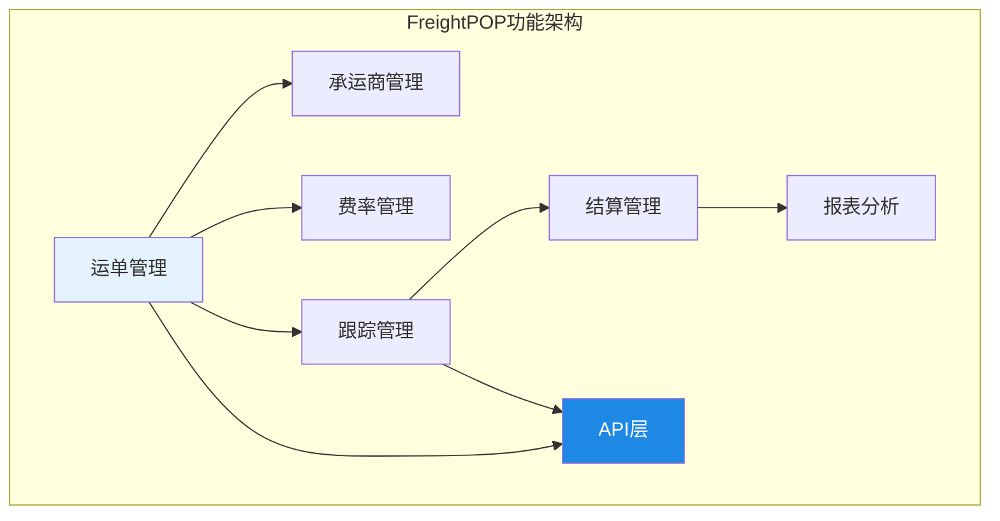
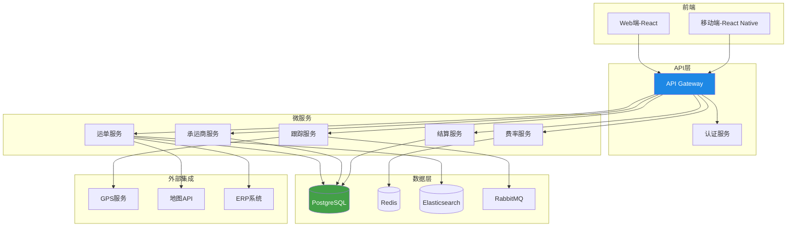
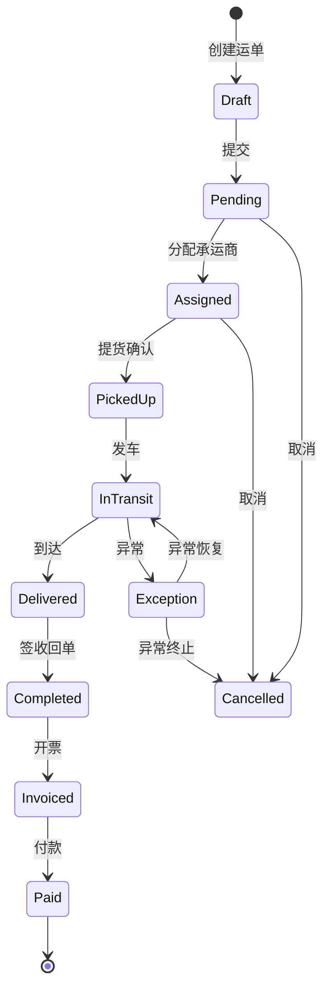
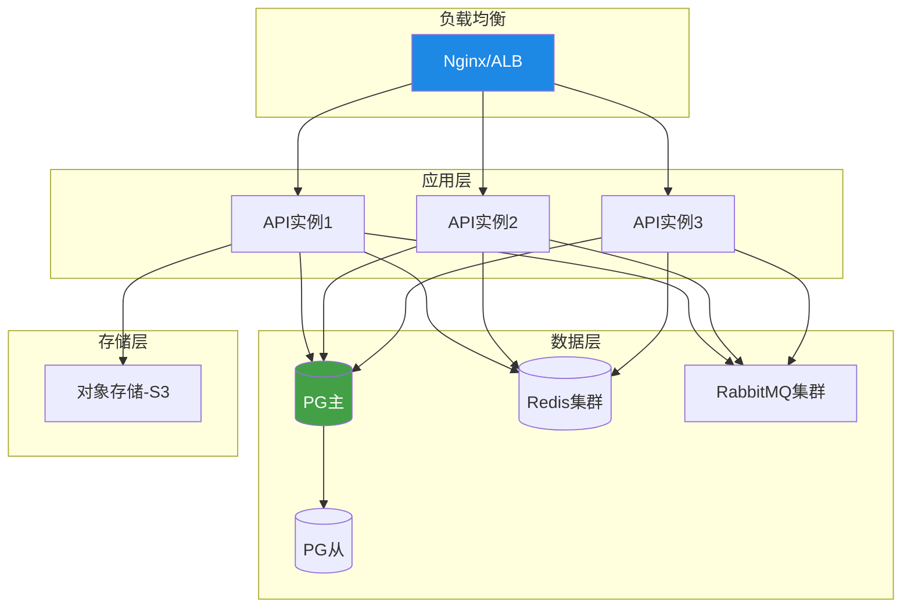

# 开源TMS项目解析

## 1. 开源TMS项目现状

运输管理系统因其业务复杂度和行业特性，开源生态相比ERP、CRM等领域更为薄弱。目前市面上真正可用的开源TMS项目数量有限，且多数处于早期阶段或特定场景下的轻量级实现。

### 1.1 开源TMS项目概览

| 项目 | 许可证 | 语言 | Stars | 活跃度 | 定位 |
|------|--------|------|-------|--------|------|
| FreightPOP | 商业+免费层 | .NET | - | 高 | 轻量级SaaS TMS |
| OpenTMS | MIT | Java | 低 | 低 | 学术研究原型 |
| ShipIt | Apache 2.0 | Python | 中 | 中 | 电商配送管理 |
| OTM (Open Transportation Management) | GPL | Java | 低 | 低 | 社区驱动 |
| TMS-Open | MIT | Node.js | 低 | 低 | 实验性项目 |

### 1.2 开源TMS的困境

| 困境 | 说明 |
|------|------|
| 业务复杂度高 | 运输行业规则繁多，通用化困难 |
| 费率模型差异大 | 不同行业、地区费率结构差异巨大 |
| 集成需求强 | 需要对接GPS、ERP、WMS等多系统 |
| 地域性强 | 各国运输法规和习惯差异大 |
| 商业价值高 | 成熟TMS是商业公司的核心资产，不愿开源 |

## 2. FreightPOP功能解析

FreightPOP是目前最具代表性的轻量级TMS解决方案，提供免费层和付费层，适合中小物流企业入门使用。

### 2.1 核心功能

| 功能模块 | 免费层 | 付费层 | 说明 |
|----------|--------|--------|------|
| 运单管理 | ✓ | ✓ | 创建、跟踪、管理运单 |
| 承运商管理 | 基础 | 完整 | 承运商信息和费率管理 |
| 费率比较 | ✓ | ✓ | 多承运商费率对比 |
| 路线优化 | - | ✓ | 基础路线规划 |
| 在途跟踪 | 基础 | 完整 | GPS跟踪和状态更新 |
| 运费计算 | ✓ | ✓ | 自动费率计算 |
| 对账结算 | - | ✓ | 对账和发票管理 |
| API集成 | 有限 | 完整 | RESTful API |
| 报表分析 | 基础 | 完整 | 运输报表和看板 |
| 多用户 | 3用户 | 无限 | 用户权限管理 |

### 2.2 功能架构



### 2.3 费率比较功能

FreightPOP的费率比较是其核心卖点，允许用户在多个承运商之间快速比较运费：

- **多承运商报价**：一次查询获取多家承运商报价
- **时效对比**：不同承运商的预计到达时间
- **服务等级**：标准/加急/经济等不同服务等级
- **历史价格**：同线路历史运价参考

## 3. 技术栈

### 3.1 FreightPOP技术架构

| 层次 | 技术 | 说明 |
|------|------|------|
| 前端 | React + TypeScript | SPA应用，响应式设计 |
| 后端 | .NET Core / C# | 微服务架构 |
| 数据库 | PostgreSQL | 主数据库 |
| 缓存 | Redis | 费率缓存、会话管理 |
| 消息队列 | RabbitMQ | 异步任务处理 |
| 搜索 | Elasticsearch | 运单搜索、日志分析 |
| 部署 | Docker + K8s | 容器化部署 |
| API | RESTful + GraphQL | 对外接口 |

### 3.2 系统架构图



### 3.3 关键技术选型分析

| 技术选择 | 优势 | 劣势 | 适用场景 |
|----------|------|------|----------|
| .NET Core | 性能优秀、企业级支持 | 非主流开源生态 | 企业级应用 |
| PostgreSQL | 功能丰富、扩展性好 | 配置复杂 | 复杂查询场景 |
| GraphQL | 灵活查询、减少冗余 | 学习曲线、缓存复杂 | 多端查询 |
| RabbitMQ | 可靠消息投递 | 吞吐量低于Kafka | 异步任务 |
| Docker+K8s | 标准化部署、弹性扩展 | 运维复杂度高 | 云原生部署 |

## 4. 核心功能深度解析

### 4.1 运单生命周期

FreightPOP的运单生命周期管理：



### 4.2 费率引擎

FreightPOP的费率引擎支持多维度费率计算：

```
运费计算流程：
1. 输入：发货地、收货地、货物信息、服务等级
2. 费率查询：按承运商×线路×服务等级查询费率表
3. 计费基准确定：根据货物属性确定按重量/体积/件数计费
4. 附加费计算：根据特殊条件计算附加费
5. 总运费 = 基础运费 + 附加费
6. 排序：按价格/时效/综合评分排序展示
```

### 4.3 多承运商集成

FreightPOP通过API集成多家承运商：

| 集成方式 | 说明 | 适用承运商 |
|----------|------|-----------|
| EDI | 标准电子数据交换 | 大型承运商 |
| API | RESTful接口 | 有API能力的承运商 |
| 邮件 | 自动化邮件对接 | 中小型承运商 |
| 手动 | 人工录入 | 无系统能力的承运商 |

## 5. 部署实践

### 5.1 SaaS部署（推荐）

FreightPOP优先推荐SaaS部署，开箱即用：

| 步骤 | 操作 | 时间 |
|------|------|------|
| 1. 注册账号 | 在线注册企业账号 | 10分钟 |
| 2. 基础配置 | 配置企业信息、承运商、费率 | 1-3天 |
| 3. 数据导入 | 导入客户、路线、费率数据 | 1-5天 |
| 4. 系统集成 | 对接ERP/WMS/GPS | 1-2周 |
| 5. 试运行 | 小范围试运行验证 | 2-4周 |
| 6. 全面上线 | 全量切换 | 1天 |

### 5.2 私有化部署

对于有数据安全要求的企业，可考虑私有化部署：

```yaml
# docker-compose.yml 示例
version: '3.8'
services:
  api:
    image: freightpop/api:latest
    ports:
      - "8080:8080"
    environment:
      - DB_HOST=postgres
      - REDIS_HOST=redis
      - MQ_HOST=rabbitmq
    depends_on:
      - postgres
      - redis
      - rabbitmq

  web:
    image: freightpop/web:latest
    ports:
      - "3000:80"
    depends_on:
      - api

  postgres:
    image: postgres:15
    volumes:
      - pg_data:/var/lib/postgresql/data
    environment:
      - POSTGRES_DB=freightpop
      - POSTGRES_PASSWORD=secret

  redis:
    image: redis:7-alpine
    volumes:
      - redis_data:/data

  rabbitmq:
    image: rabbitmq:3-management
    volumes:
      - mq_data:/var/lib/rabbitmq

volumes:
  pg_data:
  redis_data:
  mq_data:
```

### 5.3 部署架构



## 6. 与商业TMS对比

| 维度 | 开源/免费TMS | 商业TMS（oTMS/科箭） | SAP TM |
|------|-------------|---------------------|--------|
| 功能完整度 | 60%-70% | 85%-95% | 95%-100% |
| 路线优化 | 基础 | 中-高级 | 高级+AI |
| 费率管理 | 基础 | 完善 | 高度灵活 |
| 在途跟踪 | 基础GPS | 多方式+看板 | 全面+IoT |
| 承运商管理 | 基础 | 完整+门户 | 完整+协同 |
| 结算功能 | 基础 | 完善 | 高度自动化 |
| 多模式运输 | 仅公路 | 公路+零担 | 海陆空铁 |
| 集成能力 | REST API | API+预置连接器 | SAP生态 |
| 定制化 | 高（源码级） | 中（配置级） | 低-中（开发级） |
| 初始成本 | 低 | 中 | 高 |
| 年度费用 | 服务器成本 | 订阅费 | 许可+维护 |
| 实施周期 | 1-3月 | 2-6月 | 6-18月 |
| 技术支持 | 社区 | 厂商支持 | SAP+伙伴 |

## 7. 适用场景

### 7.1 中小物流企业

对于运输量不大（月均<1万单）的中小物流企业：

- **推荐**：使用FreightPOP免费层或低价SaaS
- **理由**：功能够用、成本低、快速上线
- **注意**：评估免费层的功能限制是否满足业务需求

### 7.2 内部运输管理

对于有内部运输管理需求的生产企业：

- **推荐**：开源TMS+定制开发
- **理由**：可深度定制、数据自主、无许可费
- **注意**：需评估团队的技术能力和运维能力

### 7.3 特定场景验证

对于TMS选型前的概念验证（POC）：

- **推荐**：使用开源TMS搭建原型
- **理由**：快速验证业务流程、低成本试错
- **注意**：POC结论需要考虑商业TMS的额外能力

| 场景 | 推荐方案 | 关键考量 |
|------|---------|---------|
| 小型物流企业 | FreightPOP免费层 | 功能够用、零成本 |
| 中型物流企业 | FreightPOP付费层/科箭 | 功能平衡、性价比 |
| 大型生产企业 | 开源+定制/SAP TM | 集成深度、定制化 |
| POC验证 | 开源TMS原型 | 快速验证、低成本 |
| 跨国企业 | SAP TM | 全球化、多模式 |

## 8. 小结

开源TMS项目整体成熟度有限，FreightPOP是目前最具实用价值的选择。对于中小物流企业和内部运输管理场景，开源/免费TMS是可行的入门方案。但需正视其在路线优化、费率管理、多模式运输等方面与商业TMS的差距。选择时应根据企业规模、业务复杂度、技术能力和预算综合评估，在功能需求和成本之间找到平衡点。
