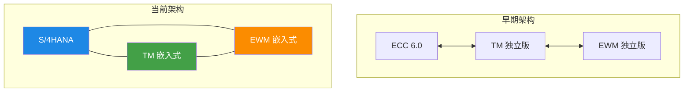
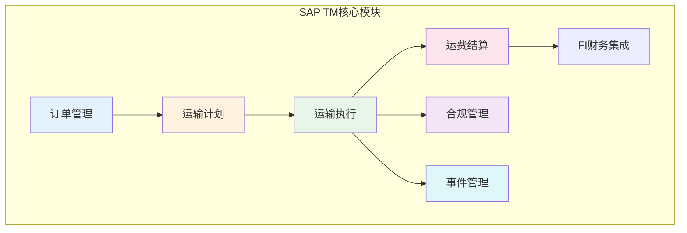
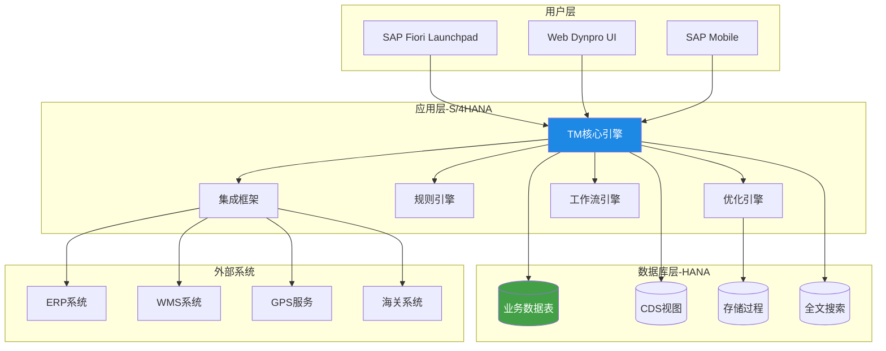
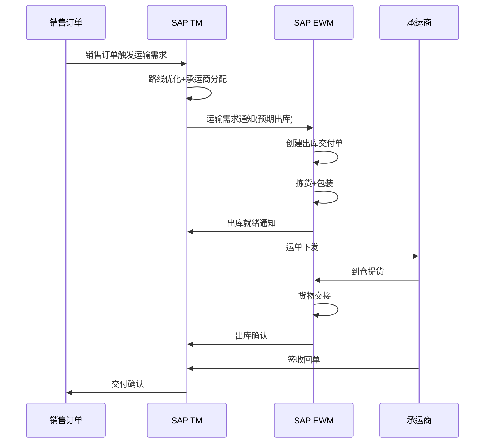
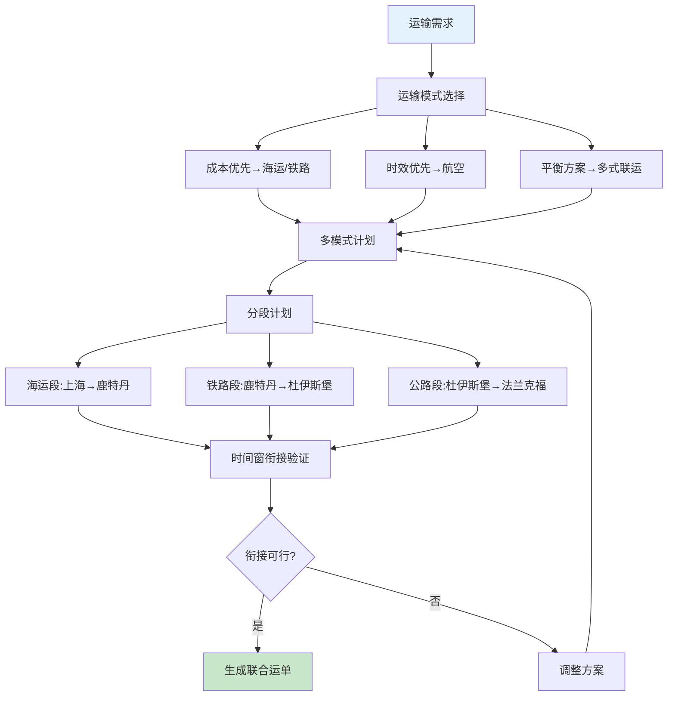
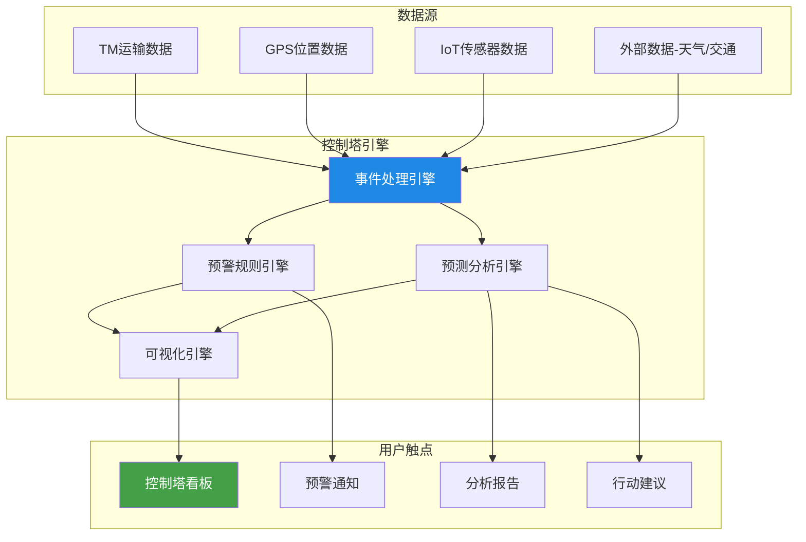
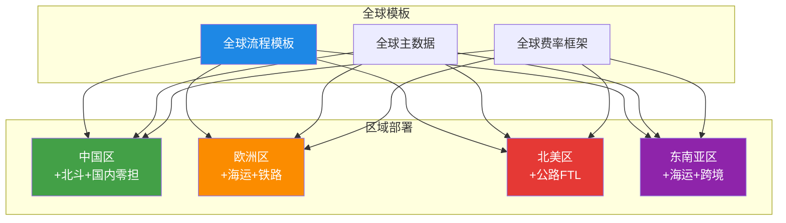

# SAP-TM架构解析

## 1. SAP TM产品定位

SAP Transportation Management（SAP TM）是SAP供应链管理套件中的运输管理解决方案，定位为面向大型跨国企业的全球化运输管理平台。

### 1.1 核心定位

| 维度 | 定位 |
|------|------|
| 市场定位 | 大型/跨国企业运输管理 |
| 技术定位 | S/4HANA嵌入式组件 |
| 功能定位 | 多模式端到端运输管理 |
| 集成定位 | SAP ERP生态深度集成 |

### 1.2 与S/4HANA的关系

SAP TM 从独立产品（standalone）逐步演变为 S/4HANA 的嵌入式组件：

**嵌入式优势**：

- 统一数据库（SAP HANA），无需数据同步
- 共享主数据（客户、物料、供应商）
- 实时业务流程集成
- 降低总拥有成本（TCO）

**嵌入式局限**：

- 必须使用S/4HANA
- 升级需与S/4HANA版本同步
- 定制开发受SAP框架约束

## 2. 核心模块

SAP TM 的功能围绕运输全生命周期组织为六大核心模块：

### 2.1 订单管理（Order Management）

| 功能 | 说明 |
|------|------|
| 运输需求创建 | 从销售订单/采购订单自动生成运输需求 |
| 订单整合 | 多订单合并为一个运输单元 |
| 订单拆分 | 按交付规则拆分运输 |
| 订单类型 | 支持内向/外向/第三方/退货运输 |

### 2.2 运输计划（Planning）

| 功能 | 说明 |
|------|------|
| 优化计划 | 基于约束的路线和装载优化 |
| 手工计划 | 调度员手动调整方案 |
| 计划版本 | 多版本方案对比选择 |
| 多模式计划 | 海陆空铁多模式联合规划 |
| 计划模拟 | What-if场景模拟 |

### 2.3 运输执行（Execution）

| 功能 | 说明 |
|------|------|
| 运单管理 | 运输执行单元的创建和管理 |
| 承运商分配 | 自动或手动分配承运商 |
| 里程碑更新 | 运输状态和里程碑跟踪 |
| POD管理 | 签收证明的采集和管理 |

### 2.4 运费结算（Settlement）

| 功能 | 说明 |
|------|------|
| 费率计算 | 自动计算运费 |
| 结算单据 | 生成结算凭证 |
| FI集成 | 自动过账到财务模块 |
| 对账管理 | 承运商对账和差异处理 |

### 2.5 合规管理（Compliance）

| 功能 | 说明 |
|------|------|
| 海关管理 | 出口/进口海关申报 |
| 危险品合规 | 危险品运输法规检查 |
| 贸易合规 | 出口管制和制裁筛查 |
| 单证管理 | 运输单证的生成和管理 |

### 2.6 事件管理（Event Management）

| 功能 | 说明 |
|------|------|
| 事件跟踪 | 运输事件的记录和跟踪 |
| 预警规则 | 异常事件的自动预警 |
| 事件通知 | 事件触发的通知推送 |
| 事件分析 | 事件数据的统计分析 |

## 3. 技术架构

### 3.1 整体架构

SAP TM 基于 SAP S/4HANA 平台，采用 ABAP + HANA 的技术栈：

### 3.2 关键技术组件

| 组件 | 技术 | 用途 |
|------|------|------|
| UI层 | SAP Fiori / UI5 | 响应式Web界面 |
| 应用层 | ABAP OO | 业务逻辑实现 |
| 优化引擎 | SAP APO / 自研算法 | 路线和装载优化 |
| 数据库 | SAP HANA | 内存数据库，实时计算 |
| 集成 | SAP PI/PO | 系统间数据交换 |
| 工作流 | SAP Business Workflow | 审批和流程自动化 |
| 分析 | SAP Analytics Cloud | 报表和分析看板 |

### 3.3 HANA在TM中的关键作用

SAP HANA 内存数据库为 SAP TM 提供了关键性能优势：

| 能力 | 说明 | TM应用场景 |
|------|------|-----------|
| 实时计算 | 内存中实时聚合计算 | 运输成本实时汇总 |
| 全文搜索 | 内置全文搜索引擎 | 运单快速检索 |
| 地理空间 | 内置空间数据处理 | 距离计算、地理围栏 |
| 预测分析 | 内置预测算法库 | ETA预测、需求预测 |
| 列存储 | 高效列式存储 | 大数据量快速查询 |

## 4. 与EWM集成

SAP Extended Warehouse Management（EWM）与 TM 的集成实现了仓库与运输的紧密联动。

### 4.1 集成场景

### 4.2 关键集成点

| 集成点 | 数据流向 | 说明 |
|--------|---------|------|
| 运输需求 | TM→EWM | 告知仓库预期的出库需求 |
| 出库就绪 | EWM→TM | 仓库完成拣货，等待提货 |
| 装载确认 | EWM→TM | 货物装车完成，确认装载 |
| 到仓提货 | TM→EWM | 承运商到仓提货确认 |
| 出库确认 | EWM→TM | 出库完成，更新运输状态 |
| POD回传 | TM→EWM | 签收信息回传仓库 |

### 4.3 越库作业（Cross-Docking）联动

SAP TM 与 EWM 的越库作业联动是最具价值的集成场景：

- TM 规划到货和发货的时间衔接
- EWM 执行月台直拨操作（不入库上架）
- 到货车辆与发货车辆的时间窗精确匹配
- 异常情况（到货延迟）自动触发调整

## 5. 多模式运输

SAP TM 的核心优势之一是支持海陆空铁多模式运输管理。

### 5.1 多模式运输支持

| 运输模式 | TM支持 | 特殊处理 |
|----------|--------|----------|
| 公路运输 | 完整 | 整车/零担/城配 |
| 铁路运输 | 完整 | 整车/集装箱班列 |
| 海运运输 | 完整 | 整箱/拼箱/租船 |
| 航空运输 | 完整 | 散货/包机 |
| 多式联运 | 完整 | 海铁公联运/空公联运 |

### 5.2 多模式运输计划

### 5.3 海运特殊处理

SAP TM 对海运有专门的处理能力：

| 功能 | 说明 |
|------|------|
| 船期管理 | 船期表维护和查询 |
| 箱型管理 | 20GP/40GP/40HC等箱型 |
| 箱量计算 | 根据货物自动推荐箱型箱量 |
| 港口操作 | 装卸港、中转港管理 |
| 提单管理 | B/L提单的生成和管理 |
| 船公司对接 | 与主要船公司的EDI对接 |

## 6. 供应链控制塔

SAP TM 的供应链控制塔（Control Tower）提供端到端的运输可视化和管理能力。

### 6.1 控制塔功能

| 功能 | 说明 | 价值 |
|------|------|------|
| 全局可视化 | 跨模式、跨承运商的运输状态看板 | 统一视图 |
| 实时监控 | 运输异常的实时监控和预警 | 主动管理 |
| ETA预测 | 基于机器学习的到达时间预测 | 提前规划 |
| 里程碑追踪 | 关键节点的状态追踪 | 进度透明 |
| 异常管理 | 异常事件的分级处理和升级 | 快速响应 |
| 绩效看板 | 运输KPI的实时展示 | 持续改进 |

### 6.2 控制塔架构

### 6.3 关键看板指标

| 看板类型 | 核心指标 | 刷新频率 |
|----------|---------|---------|
| 运输概览 | 在途运单数、今日发车数、准时率 | 实时 |
| 异常看板 | 延迟运单数、未处理异常数、平均处理时间 | 实时 |
| 承运商绩效 | 各承运商准时率、破损率、响应速度 | 每日 |
| 成本看板 | 日运费支出、吨公里成本、成本趋势 | 每日 |
| 容量看板 | 车辆利用率、装载率趋势 | 每日 |

## 7. 大型企业部署最佳实践

### 7.1 部署架构

大型跨国企业的 SAP TM 部署通常采用全球模板+本地化适配的策略：

### 7.2 实施路线图

| 阶段 | 周期 | 内容 | 交付物 |
|------|------|------|--------|
| 蓝图设计 | 2-3月 | 业务流程梳理、差距分析、方案设计 | 蓝图文档 |
| 系统配置 | 3-4月 | TM配置、主数据迁移、接口开发 | 配置系统 |
| 集成开发 | 2-3月 | ERP/WMS/GPS集成、报表开发 | 集成系统 |
| 测试验证 | 2-3月 | 单元测试、集成测试、UAT | 测试报告 |
| 试运行 | 1-2月 | 试点区域/线路试运行 | 试运行报告 |
| 全面上线 | 1月 | 全量切换、运维交接 | 上线系统 |
| **总计** | **11-16月** | | |

### 7.3 关键成功因素

| 因素 | 说明 | 风险等级 |
|------|------|---------|
| 主数据质量 | 客户/承运商/费率数据的准确性和完整性 | 高 |
| 流程标准化 | 全球流程模板与本地化需求的平衡 | 高 |
| 集成复杂度 | 与ERP/WMS/GPS等多系统的集成 | 高 |
| 变革管理 | 用户从旧系统/手工操作向SAP TM的转变 | 中 |
| 团队能力 | ABAP开发团队和业务顾问的SAP TM经验 | 中 |
| 数据量级 | HANA数据库在大数据量下的性能优化 | 中 |

### 7.4 常见实施陷阱

| 陷阱 | 表现 | 应对 |
|------|------|------|
| 过度定制 | 大量Z开头的自定义开发 | 优先使用标准功能 |
| 主数据忽视 | 上线后数据质量问题频发 | 蓝图阶段即启动数据治理 |
| 集成低估 | 接口开发和测试延期 | 预留充足的集成开发时间 |
| 范围蔓延 | 不断增加新需求 | 严格变更管理 |
| 忽视培训 | 上线后用户不会用 | 分层培训+持续赋能 |

## 8. 小结

SAP TM 是目前功能最完整的运输管理解决方案，其与 S/4HANA 的深度集成、多模式运输支持、供应链控制塔和全球化部署能力，使其成为大型跨国企业的首选。但高实施成本、长实施周期和复杂的技术栈也是必须正视的挑战。企业在选型时需要权衡功能需求与实施投入，制定合理的实施路线图和变革管理策略。
