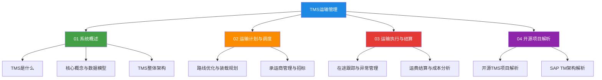

# TMS运输管理

运输管理系统（Transportation Management System, TMS）是供应链执行层的核心系统之一，负责管理货物从发货点到收货点的全过程运输活动。TMS 连接上游的订单管理系统（OMS）与仓库管理系统（WMS），下游对接承运商与物流服务商，实现运输计划、调度执行、在途跟踪、运费结算的全链路数字化管理。

## 学习路线图

## 参考产品

| 产品 | 类型 | 特点 | 适用场景 |
|------|------|------|----------|
| oTMS | SaaS | 社区型TMS，连接货主与承运商，开放网络效应 | 中大型企业运输协同 |
| 科箭CloudTMS | SaaS/私有化 | 本土化深度适配，支持国内运输场景 | 国内制造业、零售业 |
| SAP TM | 本地/SaaS | 与S/4HANA深度集成，全球化多模式运输 | 大型跨国企业 |
| FreightPOP | SaaS | 轻量级开源友好，API驱动 | 中小物流企业 |
| OpenTMS | 开源 | 开源运输管理，可定制化 | 内部运输管理定制 |

## 章节目录

- **01 TMS系统概述**：TMS定义、核心概念、整体架构，建立运输管理的全局认知
- **02 运输计划与调度**：路线优化算法、装载规划、承运商管理与招标策略
- **03 运输执行与结算**：在途跟踪、异常管理、运费结算与成本分析
- **04 开源项目解析**：开源TMS项目分析、SAP TM架构深度解读
