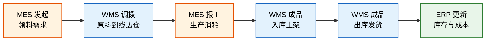
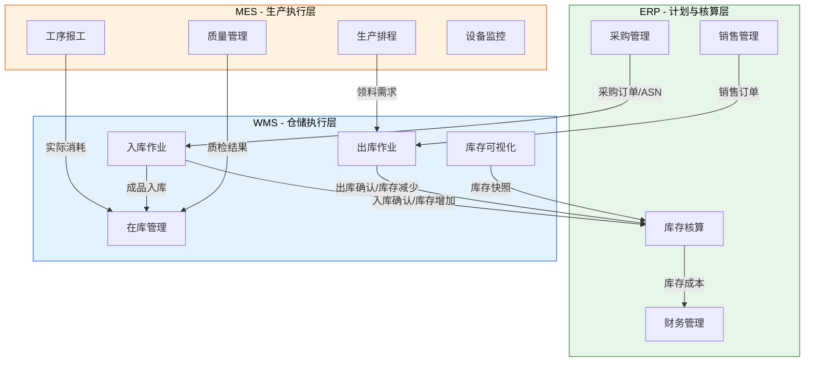

# WMS 是什么

## 1. WMS 的定义

WMS（Warehouse Management System，仓储管理系统）是对仓库内所有物料与作业流程进行精细化管理的软件系统。它回答三个核心问题：

| 问题 | 回答 | 举例 |
|------|------|------|
| 库里**有什么**？ | 物料种类、数量、状态 | SKU-001 可用库存 500 件 |
| 在**哪里**？ | 仓库→库区→库位的精确定位 | A仓-存储区-03-02-01 |
| **怎么动**？ | 入库、出库、移库的作业指令 | 订单 20240601 拣货→复核→发货 |

WMS 的本质是将仓库从"一笔糊涂账"变为"一张透明网"——每一件货物的位置、状态、流向都可以被实时感知与追溯。

## 2. 从手工记账到智能仓储

仓储管理经历了三个阶段的演进：

### 2.1 手工记账时代（2000 年以前）

仓库管理员用纸质台账记录物料的收发存，月末盘点时常常发现账实不符。核心痛点：

- **数据滞后**：入库后需要人工录入，信息传递慢
- **易出错**：手写单据字迹不清导致误读
- **无法追溯**：出了问题找不到责任人
- **效率低下**：找货靠记忆，新员工上手慢

### 2.2 WMS 时代（2000—2015）

引入条码扫描和 PDA 终端后，仓库作业实现了"扫码即录入"：

- **实时库存**：每笔操作即时更新库存数据
- **作业驱动**：系统下发拣货任务，员工按指令作业
- **全程追溯**：每个环节有操作人、时间戳记录
- **策略执行**：上架推荐、拣货路径、先进先出由系统控制

### 2.3 智能仓储时代（2015 至今）

IoT 设备、AI 算法和自动化硬件深度融合：

| 技术 | 应用场景 |
|------|---------|
| AGV/AMR | 无人搬运，货到人拣选 |
| RFID | 批量无感盘点，整箱出入库自动识别 |
| 机器视觉 | 自动质检、条码识别、异物检测 |
| AI 预测 | 库存需求预测、异常预警 |
| 数字孪生 | 仓库 3D 可视化仿真与优化 |

## 3. WMS 与 ERP 的关系

一句话概括：**ERP 管"有多少"，WMS 管"在哪里"**。

| 维度 | ERP | WMS |
|------|-----|-----|
| 管理粒度 | 库存金额与数量（仓库级） | 库存位置与状态（库位级） |
| 核心关注 | 财务核算、采购计划、销售订单 | 作业执行、空间利用、作业效率 |
| 库存视图 | A 仓 SKU-001 数量 500 | A 仓-存储区-03-02 可用 300，冻结 200 |
| 时间维度 | 日/月/年汇总 | 秒级实时 |
| 用户角色 | 采购、财务、销售 | 仓管员、质检员、拣货员 |

**典型数据流转**：

1. ERP 创建采购订单 → WMS 接收为预期到货通知（ASN）
2. WMS 执行收货上架 → 回写 ERP 库存增加
3. ERP 创建销售订单 → WMS 生成出库任务
4. WMS 执行拣货发货 → 回写 ERP 库存减少

## 4. WMS 与 MES 的关系

MES（Manufacturing Execution System，制造执行系统）管理生产车间的执行过程。WMS 与 MES 的协同形成了"物料到线→生产→成品入库"的闭环：

**协同场景详解**：

| 场景 | MES 侧 | WMS 侧 | 交互内容 |
|------|---------|---------|---------|
| 生产领料 | 创建工单，释放领料需求 | 生成拣货任务，调拨到线边仓 | 物料编码、需求数量、工单号 |
| 生产报工 | 工序完成，记录消耗 | 更新线边仓库存 | 实际消耗量、废品量 |
| 成品入库 | 工单完工 | 生成成品入库任务，推荐储位 | 成品编码、生产批次、数量 |
| 不良品退仓 | 记录不良品信息 | 不良品入待检区 | 不良品编码、原因码 |

## 5. ERP-WMS-MES 三者协同闭环

将三个系统放在同一张图上，可以看到信息如何在供应链中流转：

## 6. 典型行业应用场景

### 6.1 电商仓储

| 特征 | 说明 |
|------|------|
| SKU 数量 | 数万到数百万 |
| 订单特点 | 小批量、多频次、时效要求高 |
| 核心诉求 | 拣货效率、发货时效、退换货处理 |
| WMS 重点 | 波次策略、路径优化、快速复核 |

电商仓库单日订单量可达数十万单，对拣货效率和发货时效的要求极高。WMS 通过波次合并、路径优化、分区拣选等策略将单个订单的拣货时间压缩到秒级。

### 6.2 制造仓储

| 特征 | 说明 |
|------|------|
| 物料类型 | 原材料、半成品、成品、备品备件 |
| 流转特点 | 与 MES 协同，JIT/JIS 供料 |
| 核心诉求 | 物料追溯、批次管控、线边仓管理 |
| WMS 重点 | 批次管理、序列号追溯、领料配送 |

制造企业的仓库是生产线的"蓄水池"，WMS 需要精确管理每批物料的来源、去向，确保质量问题可追溯。

### 6.3 医药仓储

| 特征 | 说明 |
|------|------|
| 合规要求 | GSP/GMP 认证 |
| 核心管控 | 效期管理、冷链监控、批号追溯 |
| 核心诉求 | 合规审计、全程温控、先到期先出 |
| WMS 重点 | FEFO 策略、效期预警、电子监管码 |

医药行业受 GSP（药品经营质量管理规范）严格监管，WMS 必须支持效期管控、温湿度监控、电子监管码等合规要求。

### 6.4 3PL 第三方物流

| 特征 | 说明 |
|------|------|
| 多货主 | 同一仓库服务多个客户 |
| 计费模式 | 按件、按体积、按面积、按时长 |
| 核心诉求 | 多货主隔离、灵活计费、增值服务 |
| WMS 重点 | 货主管理、计费引擎、贴标/组装等增值服务 |

3PL 仓库的特点是"一仓多主"，WMS 需要在库存、作业、结算等维度实现货主间的数据隔离与独立计费。

## 7. 小结

| 概念 | 一句话理解 |
|------|-----------|
| WMS 定义 | 管好仓库里"有什么、在哪里、怎么动"的执行系统 |
| 与 ERP 的关系 | ERP 管"有多少"（金额），WMS 管"在哪里"（位置） |
| 与 MES 的关系 | MES 发起需求，WMS 执行配送，形成供料闭环 |
| 行业差异 | 电商重效率，制造重追溯，医药重合规，3PL 重多货主 |

理解了 WMS 的定位与边界，下一章我们将深入 WMS 的核心数据模型——仓库、库区、库位、物料、批次这些实体是如何组织起来的。
